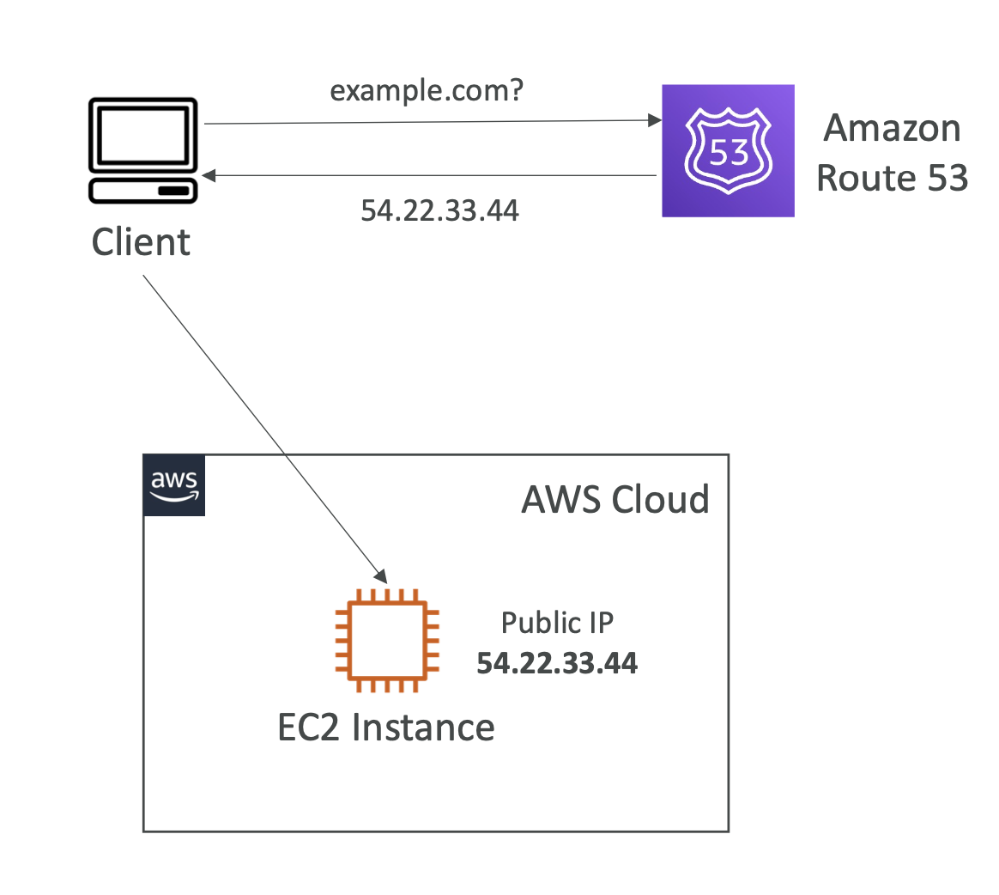
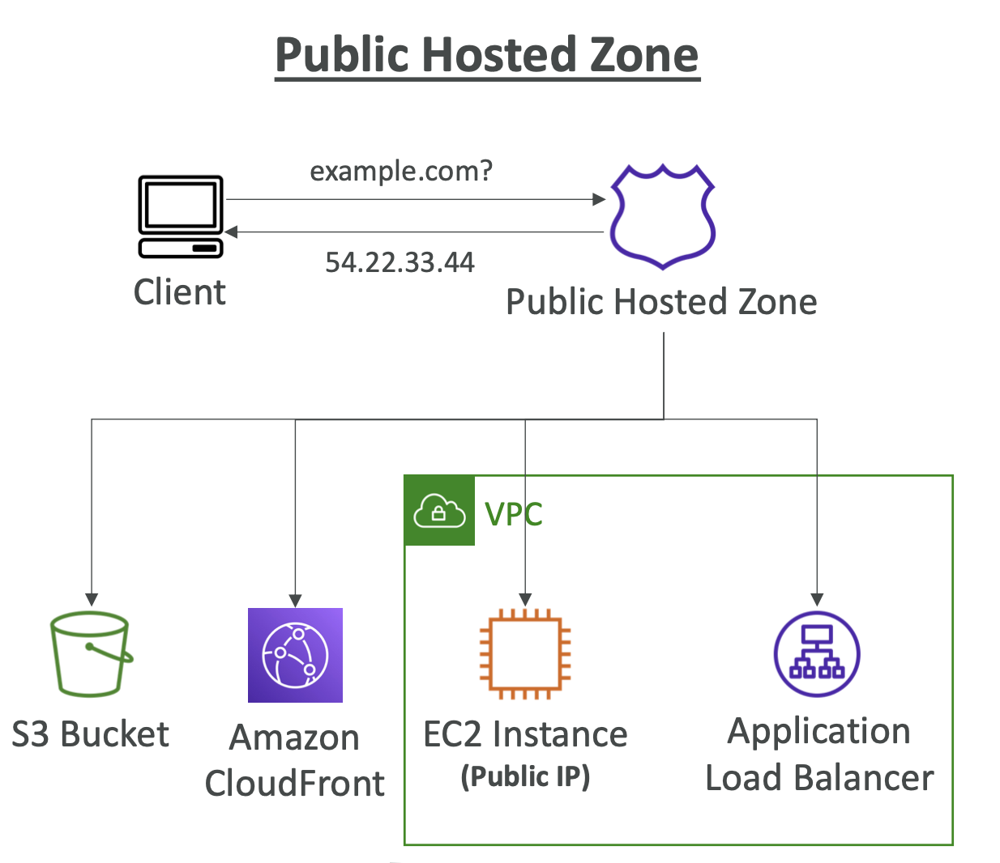
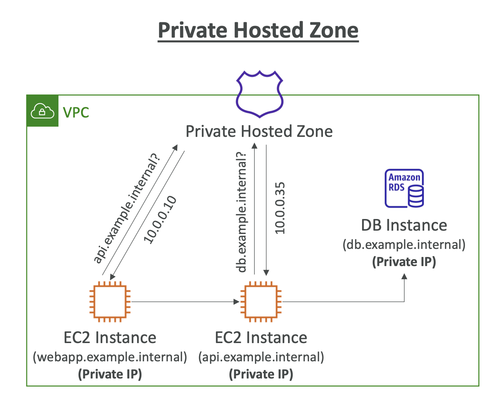

# Route 53 Overview

## Amazon Route 53

  

- 고가용성Highly available, 확장 가능Scalable, 완전 관리형Fully managed 및 권한이 있는Authoritative DNS
- Authoritative DNS = 고객(사용자)이 DNS 레코드를 업데이트할 수 있음
- Route 53은 도메인 등록 기관Domain Registrar이기도 함
- 리소스의 상태를 확인할 수 있는 기능
- 100% 가용성 SLA를 보장하는 유일한 AWS 서비스
- Route 53? 53은 전통적인 DNS 포트를 참조함

 

## Route 53 – Records

- 도메인에 대한 트래픽을 라우팅하는 방법
- 각 레코드는 다음을 포함
  - **Domain/subdomain Name** - 예: example.com
  - **Record Type** - 예: `A` 또는 `AAAA`
  - **Value** - 예: `123.456.789.123`
  - **Routing Policy** - Route 53이 쿼리에 응답하는 방법
  - **TTL** - DNS 확인자에서 레코드가 캐시되는 시간 (Time To Live)
- Route 53은 다음 DNS 레코드 유형을 지원
  - (must know) `A` / `AAAA` / `CNAME` / `NS`
  - (advanced) `CAA` / `DS` / `MX` / `NAPTR` / `PTR` / `SOA` / `TXT` / `SPF` / `SRV`

 

## Route 53 – Record Types

- **`A`**: IPv4 주소로 매핑
- **`AAAA`**: IPv6 주소로 매핑
- **`CNAME`**: 호스트 이름을 다른 호스트 이름으로 매핑
  - 타겟은 도메인 이름이며 반드시 `A` 또는 `AAAA` 레코드를 가져야 함
  - DNS 네임스페이스의 최상위 노드에 대한 CNAME 레코드를 생성할 수 없음 (Zone Apex)
  - **e.g.** `example.com`에 대한 CNAME 레코드를 생성할 수 없지만 **`www.example.com`에 대한 CNAME 레코드**는 **생성 가능**
- **`NS`**: 호스팅 영역의 이름 서버
  - 도메인에 대한 트래픽을 라우팅하는 방법을 제어함

 

## Route 53 – Hosted Zones

- 도메인과 서브 도메인에 대한 트래픽을 라우팅하는 방법을 정의하는 레코드의 컨테이너
- **Public Hosted Zones** – 인터넷에서 트래픽을 라우팅하는 방법을 지정하는 레코드 포함 (공용 도메인 이름)
  - `application1.mypublicdomain.com`
- Private Hosted Zones – 하나 이상의 VPC 내에서 트래픽을 라우팅하는 방법을 지정하는 레코드 포함 (사설 도메인 이름)
  - `application1.company.internal`
- 호스팅 영역당 월 **$0.50** 요금 부과

 

## Route 53 – Public vs. Private Hosted Zones

Public Hosted Zone과 Private Hosted Zone은 동일하게 작동하지만 공개 범위가 다름

<table>
<tr>
  <th>Public Hosted Zones</th>
  <th>Private Hosted Zones</th>
</tr>
<tr>
  <td>
  인터넷에서 누구나 레코드를 쿼리할 수 있도록 허용 ← 퍼블릭 레코드
   
    
  </td>
  <td>
  프라이빗 리소스에서만 쿼리 (e.g. VPC 내 프라이빗 리소스만 쿼리 가능)
   
   

Private Hosted Zone에 아래의 **프라이빗 레코드** 등록

- **Webapp 서버**: `webapp.example.internal`로 식별되는 하나의 EC2 인스턴스
- **API 서버**: `api.example.internal`로 식별되는 하나의 EC2 인스턴스
- **DB 서버**: `db.example.internal`로 식별되는 데이터베이스

1. Webapp 서버가 `api.example.internal`을 요청
2. Private Hosted Zone은 요청을 받아 Private IP인 `10.0.0.10`을 응답
3. EC2 인스턴스는 두 번째 EC2 인스턴스에 연결하는데, 두 번째 인스턴스는 데이터베이스 연결이 필요
4. API 서버가 `db.example.internal`을 요청
5. Private Hosted Zone은 요청을 받아 Private IP인 `10.0.0.35`을 응답
6. 이후, API 서버는 데이터베이스에 연결 가능

</td>
</table>

 

 

## CNAME vs Alias
- AWS Resources (Load Balancer, CloudFront...) expose an AWS hostname:
  - `lb1-1234.us-east-2.elb.amazonaws.com` and you want `myapp.mydomain.com`
- **CNAME**:
  - 다른 호스트 이름을 가리키는 호스트명 (e.g. `app.mydomain.com` => `blabla.anything.com`)
  - **오직 논-루트(루트 도메인이 아닌) 도메인에만 사용 가능** (e.g. `something.mydomain.com`)
- **Alias**:
  - AWS Resource를 가리키는 호스트명 (e.g. `app.mydomain.com` => `blabla.amazonaws.com`)
  - **루트와 논-루트 도메인 모두 사용 가능** (e.g. `mydomain.com`과 `app.mydomain.com` 모두 가능)
  - 무료
  - Native health check

 

## Route 53 – Alias Records
• Maps a hostname to an AWS resource
• An extension to DNS functionality
• Automatically recognizes changes in the
resource’s IP addresses
• Unlike CNAME, it can be used for the top node
of a DNS namespace (Zone Apex), e.g.:
example.com
• Alias Record is always of type A/AAAA for
AWS resources (IPv4 / IPv6)
• You can’t set the TTL

## Route 53 CNAME vs Alias
