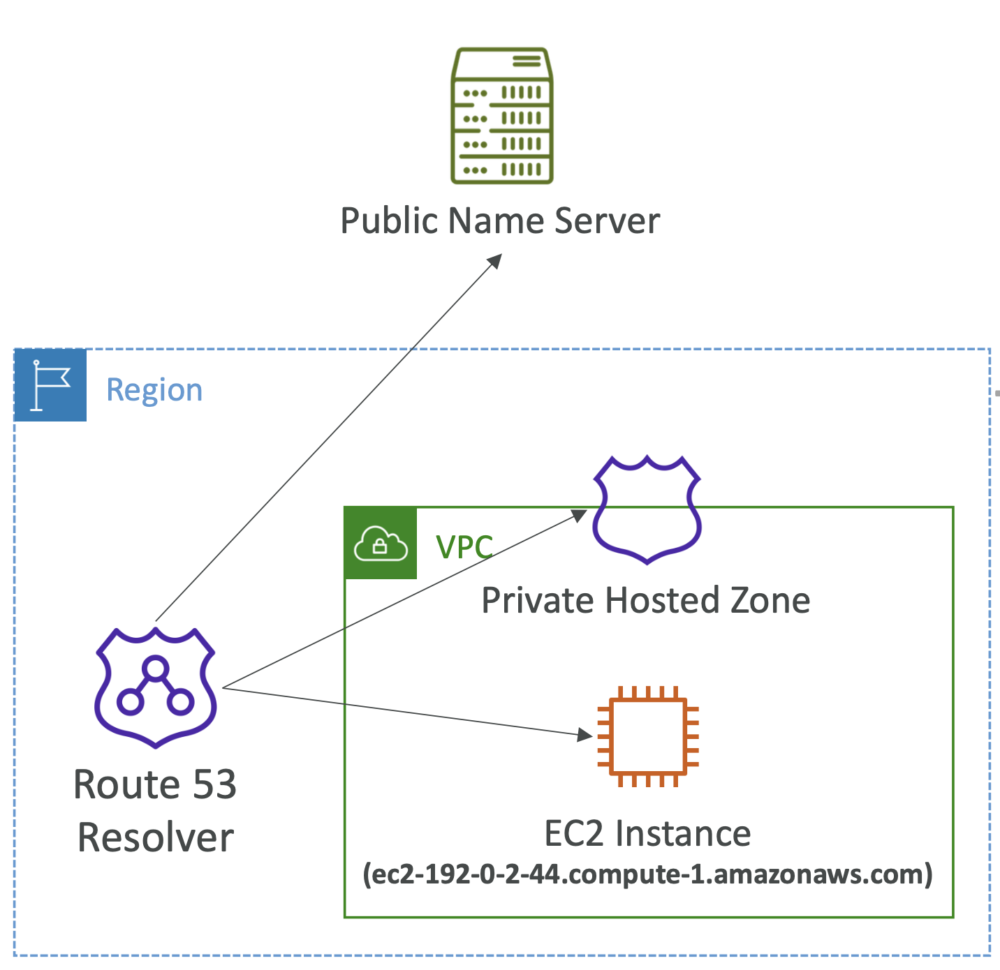
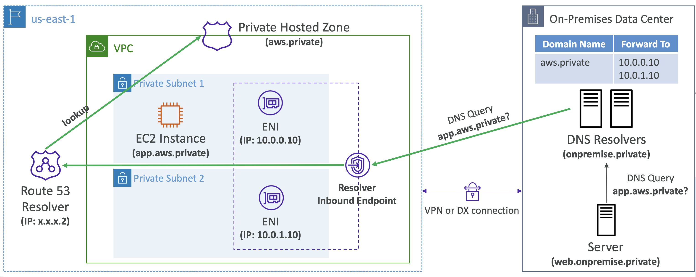
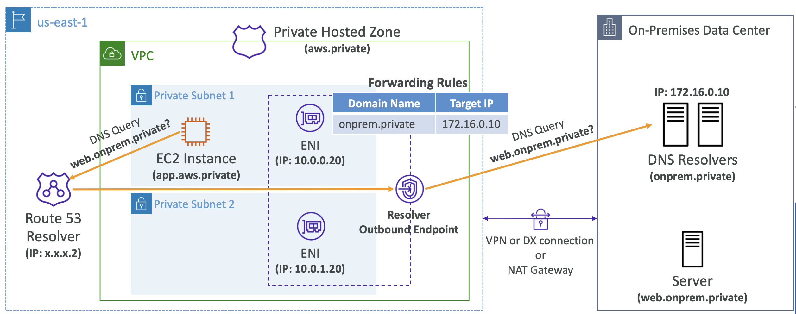
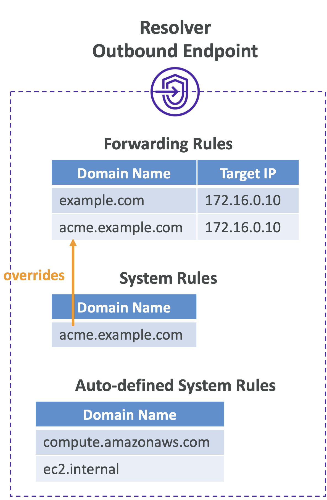

# Route 53 Resolvers & Hybrid DNS

## Route 53 – Hybrid DNS

- 기본적으로 Route 53 Resolver는 다음과 같은 DNS 쿼리에 자동으로 응답:
  - EC2 인스턴스를 위한 **로컬 도메인 이름**
  - **프라이빗 호스티드 존** Private Hosted Zones의 레코드
  - **퍼블릭 네임 서버**에 있는 레코드
- **하이브리드 DNS**란 VPC(Route 53 Resolver)와 사용자의 네트워크(다른 DNS Resolver) 간에 DNS 쿼리를 해석(resolving)하는 방식

- 연결 가능한 네트워크:
  - **VPC 자체 또는 피어링된 VPC**
  - AWS Direct Connect 또는 VPN을 통해 연결된 **온프레미스 네트워크**

  

 

## Route 53 – Resolver Endpoints
- **Inbound Endpoint**
  - 사용자의 네트워크에 있는 DNS Resolver가 **Route 53 Resolver로 DNS 쿼리를 전달**할 수 있도록 함
  - DNS Resolver가 Route 53 프라이빗 호스트존에 있는 AWS 리소스(e.g. EC2 인스턴스)의 도메인 명이나 레코드를 해석할 수 있음

- **Outbound Endpoint**
  - Route 53 Resolver가 조건에 따라 DNS 쿼리를 사용자의 DNS Resolver로 전달
  - **Resolver Rule**을 이용해 어떤 DNS 쿼리를 사용자 DNS로 전달할지 정의 가능

- 같은 AWS 리전에 있는 **하나 이상의 VPC와 연동 가능**
- **고가용성(High Availability)** 을 위해 두 개의 AZ(가용 영역)에 생성 권장
- 각 엔드포인트는 **IP 주소당 초당 10,000개의 쿼리**를 처리 가능

 

## Route 53 – Resolver Inbound Endpoints

아래와 같은 상황을 가정: 

**AWS Cloud**
- `aws.private`이라는 프라이빗 호스티드 존을 생성
- VPC 내에 Private Subnet에는 EC2 인스턴스가 존재
- EC2 인스턴스에 `app.aws.private`이라는 CNAME 할당 (or 프라이빗 IP에 연결된 A 레코드)
- Resolver Inbound Endpoint
  - 뒤에 두 개의 ENI가 있음 (for 고가용성)
  - 이 ENI는 프라이빗 IP 주소 (`10.0.0.10`, `10.0.1.10`)와 연결되어 있음

 

**온프레미스 데이터 센터**
- `web.onpremises.private` 서버가 위치
- EC2 인스턴스에 접근하고 싶어함
- `onpremise.private` 에 대한 **DNS Resolver**가 있음

**온프레미스 데이터 센터**와 **AWS 클라우드**는 VPN 연결 또는 Direct Connect로 연결

 

#### [인바운드 엔드포인트] 온프레미스 → AWS

  

 

1. 온프렘 서버가 `app.aws.private`에 대한 DNS 쿼리 요청
2. 온프렘 DNS Resolver는 해당 도메인을 모름
3. 온프렘 DNS Resolver는 `aws.private` 도메인에 대한 쿼리를 AWS의 Resolver Inbound Endpoint로 전달
4. Resolver Inbound Endpoint는 Route 53 리졸버에 연결되어 있음
5. 프라이빗 호스티드 존에서 `app.aws.private`를 조회
6. 해당 쿼리에 대한 최종 정보를 제공

 

## Route 53 – Resolver Outbound Endpoints

  

**[아웃바운드 엔드포인트] AWS → 온프레미스**
1. EC2 인스턴스가 `web.onpremises.private`에 대한 DNS 쿼리를 Route 53 Resolver에 요청
2. Route 53 Resolver에 연결된 Resolver Outbound Endpoint로 쿼리 전달
3. Forwarding Rule에 따라 `onpremises.private` 이 위치한 온프레미스 DNS Resolver로 쿼리 전달
4. 온프레미스 DNS Resolver는 `web.onpremises.private`에 대한 쿼리를 처리
5. 해당 쿼리에 대한 최종 정보를 제공

 

## Route 53 – Resolver Rules

- DNS 쿼리를 사용자의 네트워크에 있는 DNS Resolver로 전달할지 여부를 제어할 수 있음
- **조건부 전달 규칙Conditional Forwarding Rules / Forwarding Rules**
  - 특정 도메인 및 해당 서브도메인에 대한 DNS 쿼리를 **지정된 대상 IP 주소로 전달**

- **시스템 규칙System Rules**
  - Forwarding Rule에서 정의된 동작을 **선택적으로 재정의**할 수 있음
    - e.g. `acme.example.com` 서브도메인에 대한 쿼리는 전달하지 않도록 설정

- **자동 정의된 시스템 규칙Auto-defined System Rules**
  - 특정 도메인에 대한 DNS 쿼리가 어떻게 해석될지를 자동으로 정의
    - e.g. AWS 내부 도메인 이름, Private Hosted Zone 등

- 여러 규칙이 일치하는 경우, Route 53 Resolver는 가장 구체적인 규칙을 우선 적용
- **Resolver Rule은 AWS RAM(Resource Access Manager)을 사용하여 계정 간 공유**할 수 있음
  - 한 계정에서 **중앙 집중식으로 규칙 관리**
  - 여러 VPC에서 해당 규칙에 정의된 대상 IP로 **DNS 쿼리를 전달** 가능

  
 

## Route 53 – Resolver Rules

- DNS 쿼리를 네트워크의 DNS 리졸버로 전달하는 방식을 제어
- **Conditional Forwarding Rules (Forwarding Rules) 조건부 전달 규칙**
  - 지정된 도메인 및 모든 하위 도메인에 대한 DNS 쿼리를 **대상 IP 주소**로 전달
- **시스템 규칙**
  - 전달 규칙에서 정의된 동작을 선택적으로 재정의 (예: 하위 도메인 acme.example.com에 대한 DNS 쿼리를 전달하지 않음)
- **자동 정의된 시스템 규칙**
  - 선택된 도메인에 대한 DNS 쿼리가 어떻게 해결되는지 정의 (예: AWS 내부 도메인 이름, 프라이빗 호스티드 존)
- 여러 규칙이 일치하는 경우, Route 53 Resolver는 가장 구체적인 일치를 선택
- **Resolver Rules는 AWS RAM을 사용하여 계정 간에 공유 가능**
  - 하나의 계정에서 중앙 집중식으로 관리
  - 여러 VPC에서 규칙에 정의된 대상 IP로 DNS 쿼리 전송 가능

 

