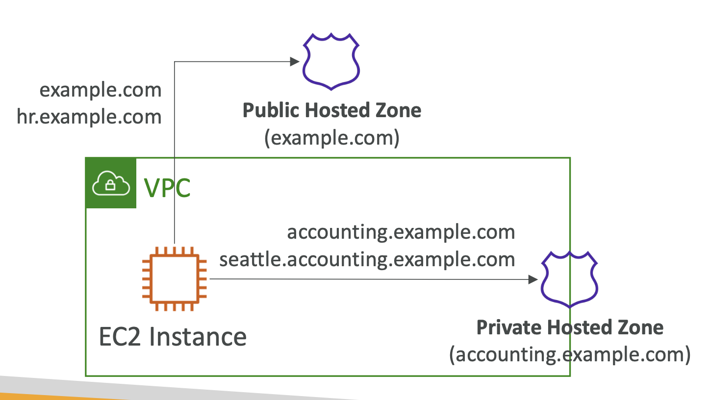
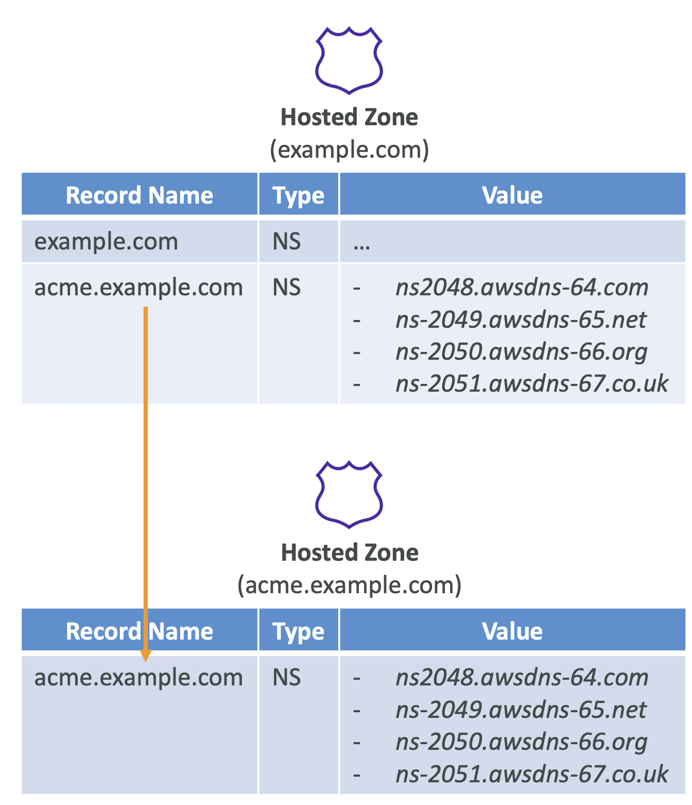
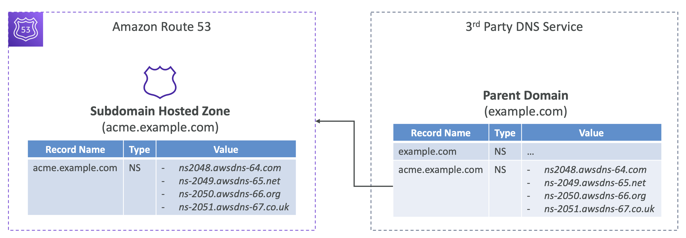

# Route 53 - Subdomain Zones

## Route 53 – Hosted Zones

- Route 53은 호스티드 존을 생성할 때 NS(네임 서버)와 SOA(Start of Authority) 레코드를 자동으로 생성함
- 퍼블릭/프라이빗 호스티드 존과 네임스페이스가 겹치는 프라이빗 호스티드 존에 대해 Route 53 리졸버는 **가장 구체적으로 일치 항목으로 트래픽을 라우팅**함

 
<table>
<tr>
  <th>Public + Private Hosted Zone</th>
  <th>Private + Private Hosted Zone</th>
</tr>
<tr>
  <td></td>
  <td></td>
</tr>
</table>

 

## Route 53 – Routing Traffic For Subdomains

- 서브도메인에 대한 호스티드 존을 생성
  - = *서브도메인에 대한 호스티드 존으로 책임 위임 Delegation Responsibility for a Subdomain to a Hosted Zone*
  - = *서브도메인을 다른 네임 서버로 위임 Delegating a Subdomain to Another Name Servers*
- 사용 사례:
    - 서로 다른 팀이 관리하는 서로 다른 서브도메인
    - IAM 권한을 사용하여 액세스 제한 (IAM을 사용하여 Route 53 레코드에 대한 액세스를 제어할 수 없음)

  

 

## Using Route 53 as the DNS Service for a Subdomain without Migrating the Parent Domain

도메인 이름 서비스를 분할하고 Route 53 에서 3rd Party DNS 서비스를 부분적으로 사용할 수 있음

  

- 만약 `acme.example.com` 에 대한 서브도메인 호스티드 존을 생성하고 이 네임 서버를 사용하면, 부모 도메인 `example.com` 에 대해 3rd Party DNS 서비스를 사용할 수 있으며, 서브도메인 NS 레코드를 Route 53 의 네임 서버로 지정할 수 있음
- 서브도메인 관리는 Route 53 에서만 이루어짐

