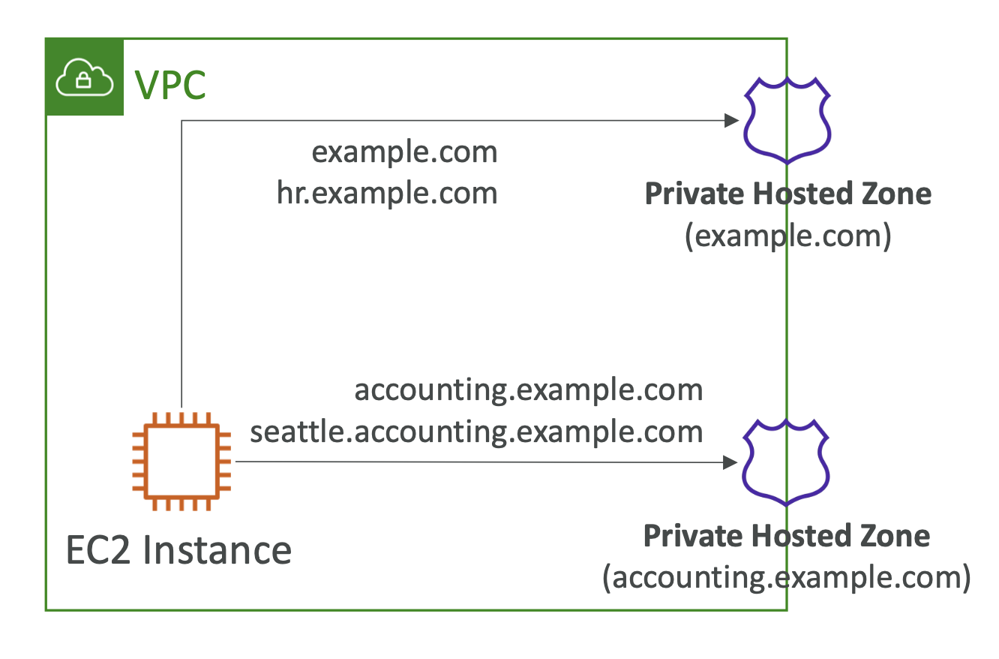

# Route 53 - Subdomain Zones

## Route 53 – Hosted Zones

- Route 53은 호스티드 존을 생성할 때 NS(네임 서버)와 SOA(Start of Authority) 레코드를 자동으로 생성함
- 퍼블릭/프라이빗 호스티드 존과 네임스페이스가 겹치는 프라이빗 호스티드 존에 대해 Route 53 리졸버는 가장 구체적인 일치 항목으로 트래픽을 라우팅함

  

## Route 53 – Routing Traffic For Subdomains

- 서브도메인에 대한 호스티드 존을 생성
- "서브도메인에 대한 호스티드 존으로 책임 위임" 또는 "서브도메인을 다른 네임 서버로 위임"이라고도 함
- 사용 사례:
    - 서로 다른 팀이 관리하는 서로 다른 서브도메인
    - IAM 권한을 사용하여 액세스 제한 (IAM을 사용하여 Route 53 레코드에 대한 액세스를 제어할 수 없음)

  

## Using Route 53 as the DNS Service for a Subdomain without Migrating the Parent Domain

  
