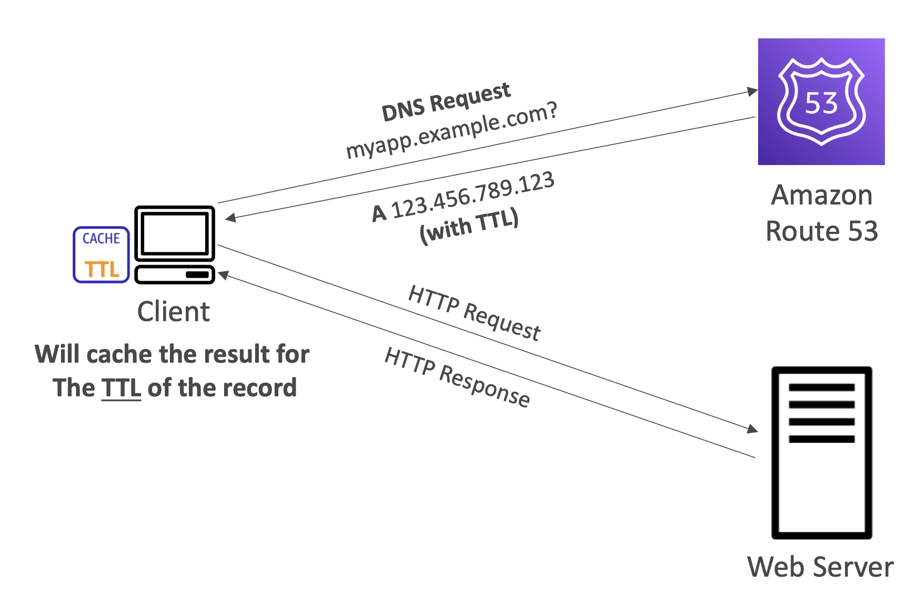

# Route 53 - TTL

## Route 53 – Records TTL (Time To Live)



- High TTL – e.g., 24 hr
    - 더 적은 트래픽이 Route 53으로 들어옴
    - 업데이트 이전 레코드가 더 오래 지속됨
- Low TTL – e.g., 60 sec.
    - 더 많은 트래픽이 Route 53으로 들어옴 ($$)
    - 업데이트 이전 레코드가 덜 지속됨
    - 레코드를 변경하기 쉬움
- Alias 레코드를 제외하고, 모든 DNS 레코드에 TTL이 필수

### Practice

dig command 명령 시,
```
:: ANSWER SECTION 에서
demo.stephantheteacher.com. 66 IN    A    3.70.14.253
```

<br/>
