# Routing Policy

## Route 53 – Routing Policies

- DNS 쿼리의 응답 정의
- DNS가 트래픽을 "Routing"하는게 아니라, **DNS 쿼리에 응답**함
    - 로드 밸런서 라우팅과 다름
    - "Routing"이라는 단어에 혼동하면 안됨

 

**Route 53의 라우팅 정책**

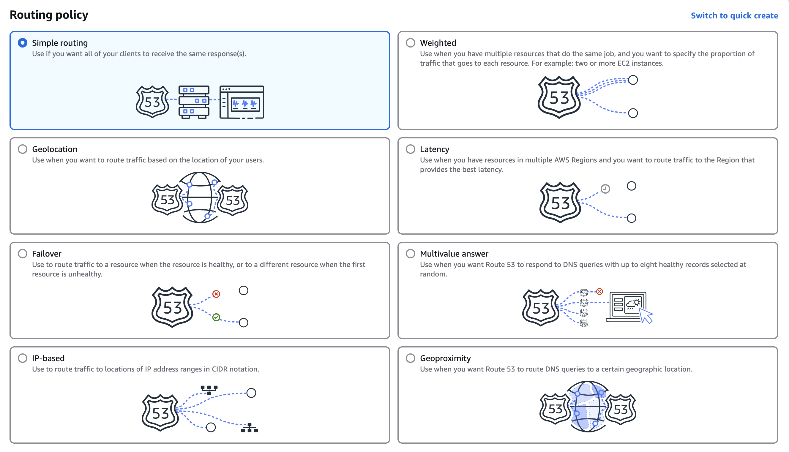

  - Simple (단순)
  - Weighted (가중치)
  - Failover (장애 조치)
  - Latency based (지연 시간 기반)
  - Geolocation (지리적 위치)
  - Multi-Value Answer (다중 값 응답)
  - Geoproximity (지리적 근접성) (Route 53 Traffic Flow 기능 사용)

 

## Routing Policies – Simple

- 전형적으로, 트래픽을 단일 리소스로 라우팅
- 헬스 체크와 연결할 수 없음
- 같은 레코드에 여러 값을 지정할 수 있음
    - **여러 값 반환 시, '클라이언트'가 무작위로 선택**
    - Alias 활성화 시, 단일 AWS 리소스만 지정 가능

 
<table>
  <tr>
    <th>Single Value</th>
    <th>Multiple Value</th>
  </tr>
  <tr>
    <td></td>
    <td></td>
  </tr>
</table>

 

# Routing Policy - Weighted

- 특정 리소스에 대한 요청 비율을 제어
- 각 레코드에 상대적 가중치를 할당
  - 트래픽 (%) = 특정 레코드의 가중치 / 모든 레코드의 가중치 합계
  - 가중치는 100%로 합칠 필요 없음
- DNS 레코드는 동일한 **이름**과 **유형**을 가져야 함
- **헬스 체크**와 연결할 수 있음
- 사용 사례: 지역 간 로드 밸런싱, 새로운 애플리케이션 버전 테스트 등
- 리소스에 대한 **트래픽을 중지**하려면 **해당 레코드에게 가중치 `0` 할당**
- **모든 레코드의 가중치가 `0` 이면, 모든 레코드가 동일하게 반환됨**

 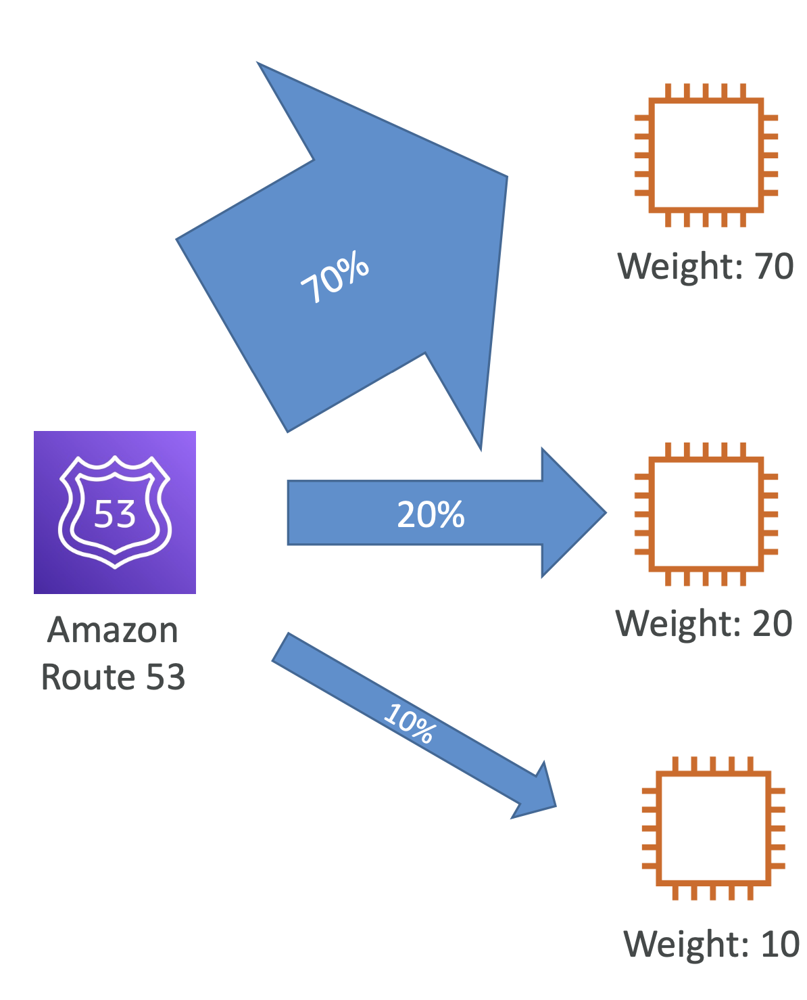 

가령, 위와 같이 가중치를 70%, 20%, 10%로 설정하면, 각각 70%, 20%, 10%의 비율로 요청이 분배됨

<table><tr><td>

#### Demo

 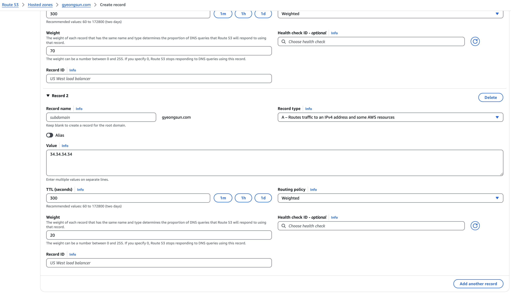 

- Subdomain `weighted.example.com` 라고 지정
- Routing Policy를 'Weighted' 선택
- Weight를 각각 70

'Add another record' 버튼 클릭 후, (2번 반복)
- Subdomain 를 모두 동일하게 입력 (e.g. `weighted.example.com`)
- Routing Policy를 'Weighted' 선택
- Weight를 각각 70, 20, 10으로 설정

</td></tr></table>

 

## Routing Policy - Latency-based

- 사용자에게 가장 낮은 지연 시간Latency으로 리소스에 요청을 라우팅
- 사용자의 지연 시간을 우선순위로 할 때 굉장히 유용
- 지연 시간은 사용자와 AWS 리전간의 트래픽을 기반으로 결정됨
- 단, 독일에서 발생한 요청이 미국으로 갈 수 있음 - 만약 지연 시간이 최소인 경우
- 헬스 체크 연동 가능 (장애 조치 기능failover capability를 가짐)

 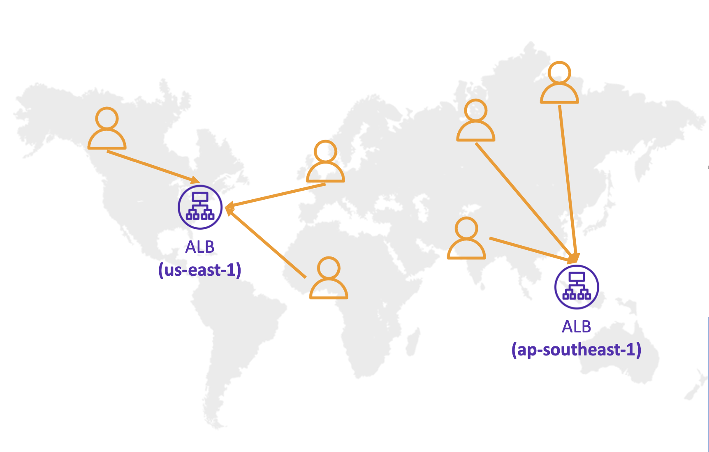 

가령, 위와 같이 ALB를 `us-east-1` 와 `ap-southeast-1`에 각각 배포하고,
여러 국가에서 요청을 보낼 때, Route53은 지연 시간이 가장 짧은 리전으로 요청을 보냄

#### Demo

 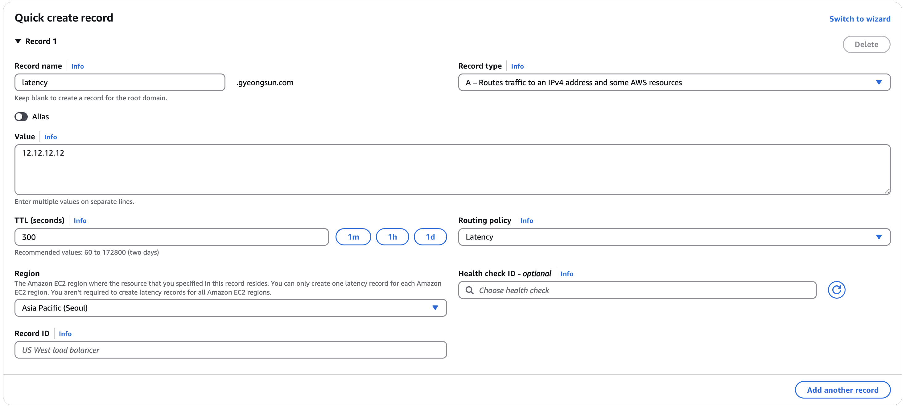 

- Subdomain 를 latency.example.com으로 입력
- Routing Policy를 'Latency' 선택
- Region을 각각Asia Pacific(Singapore)
- Record ID를`ap-southeast-1`로 설정

'Add another eecord' 버튼 클릭 후,
- Subdomain 를 latency.example.com으로 입력
- Routing Policy를 'Latency' 선택
- Region을 각각 US East(N. Virginia)
- Record ID를`us-east-1`로 설정

'Add another eecord' 버튼 클릭 후,
- Subdomain 를 latency.example.com으로 입력
- Routing Policy를 'Latency' 선택
- Region을 Europe(Frankfurt)
- Record ID를`eu-central-1`로 설정

VPN을 통해 각 리전으로 요청을 보내면, 가장 짧은 지연 시간(가장 가까운 지역)으로 응답을 받을 수 있음

 

## Route 53 - Health Checks

 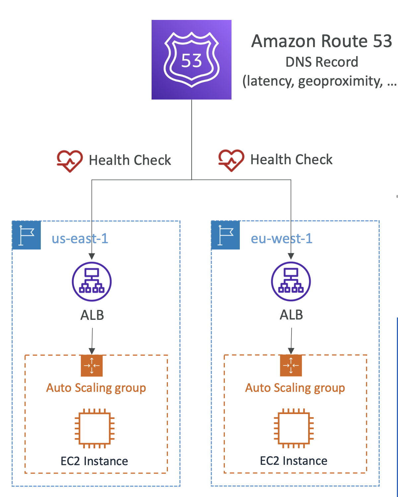 

- HTTP 헬스 체크는 오직 **퍼블릭 리소스에만** 사용 가능
- 헬스 체크 => 자동화된 DNS 장애 조치
  1. 엔드포인트(애플리케이션, 서버, 기타 AWS 리소스)를 모니터링하는 헬스 체크
  2. 다른 헬스 체크를 모니터링하는 헬스 체크 (Calculated Health Check 라고 불림)
  3. CloudWatch Alarms을 모니터링하는 헬스 체크 (**완전한 제어 가능 ✅**)
    - e.g. DynamoDB의 스로틀throttles, RDS의 알람, 사용자 정의 메트릭 등 (프라이빗 리소스에 유용)
- 헬스 체크는 CloudWatch 메트릭과 통합됨

 

## Health Checks – Monitor an Endpoint

 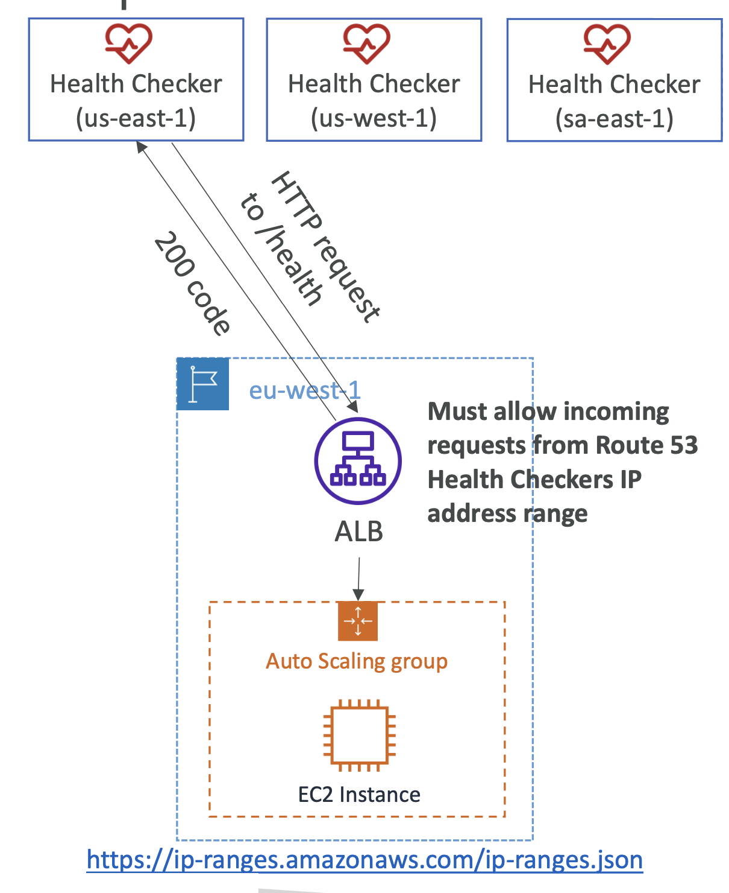 

- 약 15개의 글로벌 헬스 체크가 엔드포인트 상태를 체크
  - Healthy/Unhealthy Threshold – **3** (default)
    - 3번의 헬스 체크가 성공해야 엔드포인트가 Healthy로 간주됨
    - 3번의 헬스 체크가 실패해야 엔드포인트가 Unhealthy로 간주됨
  - 헬스 체크는 **30초**마다 수행됨 (10초로 설정 가능 - 비용 증가)
  - 헬스 체크는 HTTP, HTTPS, TCP 프로토콜을 지원
  - 만약 18%의 헬스 체크가 엔드포인트를 Healthy로 보고하면, Route 53은 해당 엔드포인트를 Healthy로 간주함
  - 어떤 위치에서 Route 53이 헬스 체크를 수행할지 선택 가능
- 헬스 체크는 엔드포인트가 `2xx` 또는 `3xx` 상태 코드로 응답할 때만 성공으로 간주됨
- 헬스 체크는 응답의 처음 `5120 bytes` 의 텍스트에 따라 성공/실패로 간주될 수 있음
- 헬스 체크를 위해 **Route 53 헬스 체크부터의 요청을 허용하는 라우터/방화벽을 설정** 필수

 

## Route 53 – Calculated Health Checks

 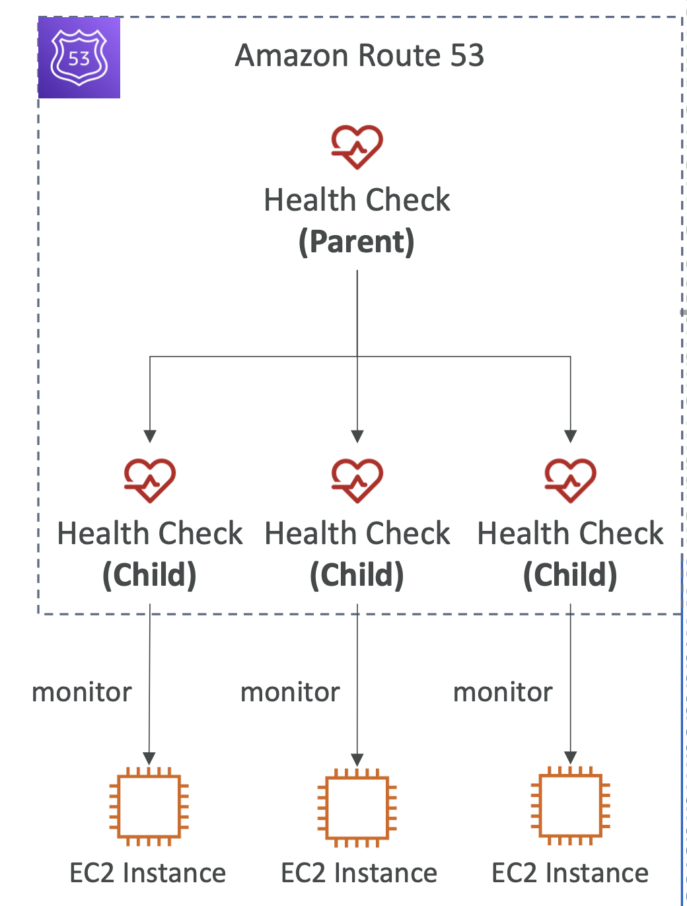 

- 여러 헬스 체크 결과를 조합하여 단일 헬스 체크로 결합
- `OR`, `AND`, `NOT` 연산자 사용 가능
- 최대 256개의 자식 헬스 체크 모니터링 가능
- 자식 헬스 체크가 몇 개 통과해야 부모 헬스 체크가 통과하는지 지정 가능
- 사용 예시: 웹사이트 유지보수 시 모든 헬스 체크가 실패하지 않도록 설정 가능

## Health Checks – Private Hosted Zones

 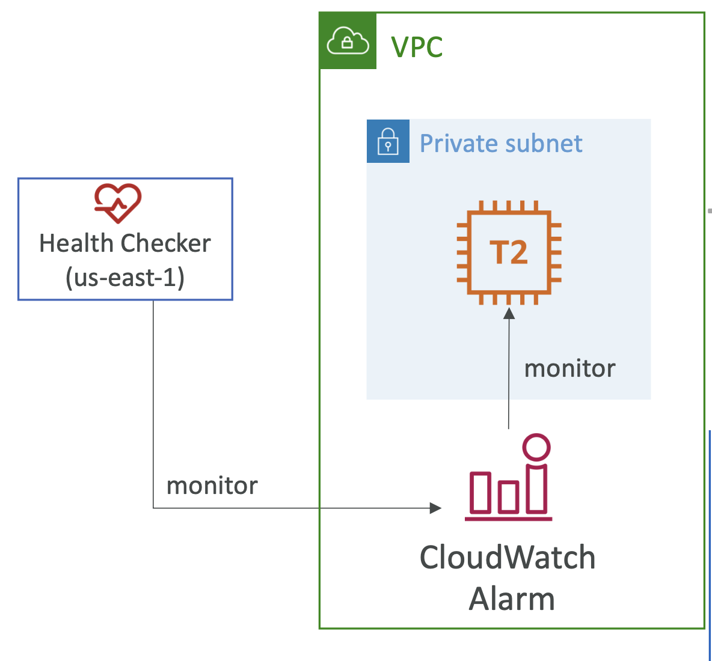 

- Route 53 헬스 체커는 VPC 밖에 위치
- 프라이빗 엔드포인트에 접근할 수 없음 (프라이빗 VPC 또는 온프레미스 리소스)
- **CloudWatch Metric**을 생성하고 **CloudWatch Alarm**과 연결한 후, 헬스 체크를 생성하여 알람 자체를 체크 가능

 

# Route 53 - Health Checks Hands On

➡️ Route 53 > Health Checks > 'Create Health Check'

 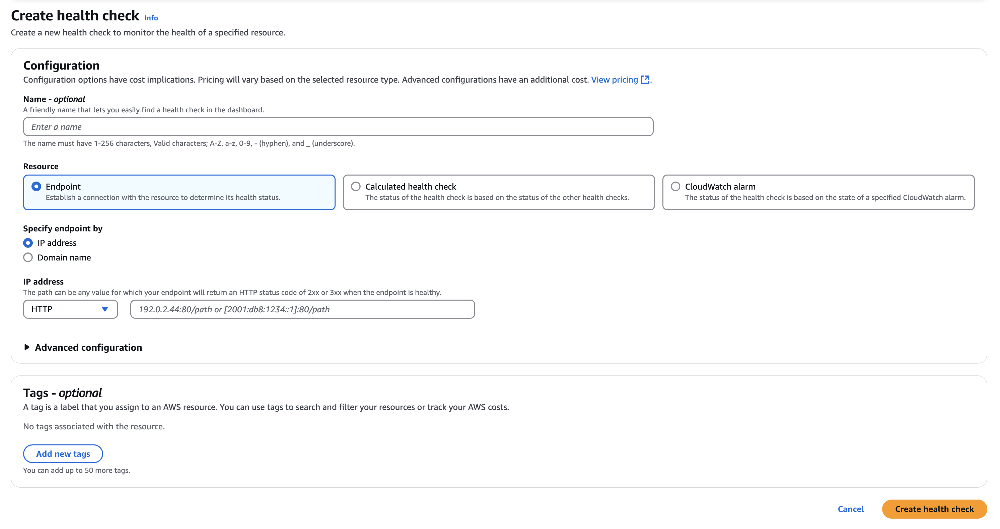 

**Configure Health Check**
- Name: `us-east-1`
- What to monitor: `Endpoint`

**Monitor an endpoint**
- Specify endpoint by: ✅ **IP address** / ◽️ domain name
- Protocol: `HTTP`
- IP address: `54.172.8.44`
- Hostname: _≪ blank ≫_
- Port: `80`
- Path: `/health`

 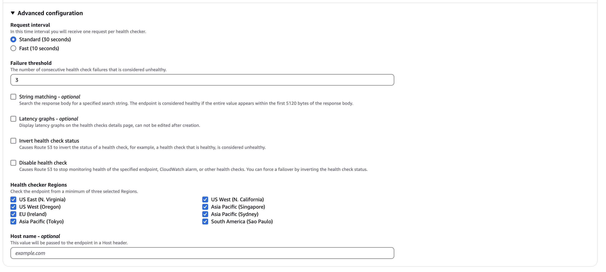 

**Advanced Configuration**
- Request interval: Standard (`30 seconds`) / ◽️ Fast (`10 seconds`)
- Failure threshold: `3` (Default)
- String matching: No (Default)
- **Latency Graph**: No (Default)
  - 지연 시간이 시간에 따라 어떻게 변하는지 보고싶을 때
- **Invert health check status**: No (Default)
- **Disable health check**: No (Default) (By default, disabled health check are considered healthy)
- **Health checker regions**: ◽️ Customize / ✅Use Recommended
  - US East (N. Virginia)
  - US West (Oregon)
  - Asia Pacific (Singapore)
  - Asia Pacific (Sydney)
  - Europe (Ireland)
  - South America (Sao Paulo)
  - ...

'Create' 버튼 클릭
이후, 추가 두 리전에 대해서도 헬스 체크를 생성

 

# Routing Policy - Failover

 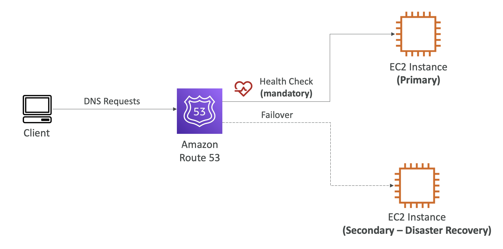 

Route 53를 중심으로 두 개의 EC2 인스턴스 존재
- 한 인스턴스는 프라이머리 EC2 인스턴스
  - 헬스 체크 연결 필수
- 두 번째 인스턴스는 세컨더리 혹은 재해 복구 EC2 인스턴스
  - 헬스 체크 선택적 연결 가능

프라이머리 레코드의 헬스 체크가 비정상으로 바뀌면, Route 53은 자동으로 두 번째 EC2 인스턴스 결과를 보내기 시작

→ 자동 장애 조치를 수행

**⚠️ 프라이머리와 세컨더리 인스턴스는 하나씩만 존재할 수 있음**

 

# Routing Policy - Geolocation

 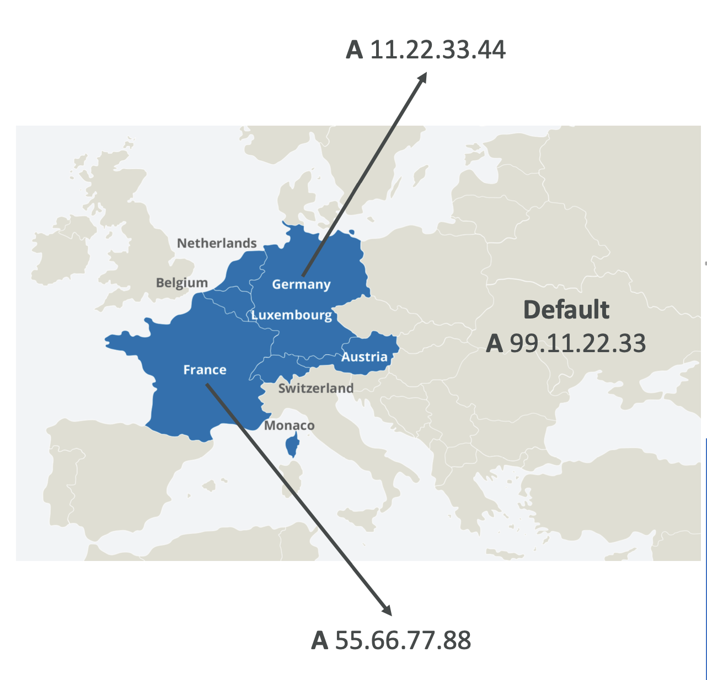 

- Latency-based와 다름
- 사용자의 위치에 따라 리소스에 요청을 라우팅
- 위치를 대륙, 국가 또는 미국 주로 지정 가능 (겹치는 경우, 가장 정밀한 위치 선택)
- "Default" 레코드를 생성해야 함 (위치에 대한 일치가 없을 경우)
- 사용 사례: 웹사이트 로컬라이제이션, 제한된 콘텐츠 배포, 로드 밸런싱 등
- 헬스 체크와 연결 가능

 

# Routing Policy - Geoproximity

- 사용자와 리소스의 지리적 위치에 따라 리소스에 요청을 라우팅
- 정의된 바이어스에 따라 리소스에 더 많은 트래픽을 전송할 수 있음
- geographic region의 사이즈를 변경할 수 있음
- 바이어스 값 지정:
  - 확장 (1 to 99) – 리소스로 더 많은 트래픽
  - 축소 (-1 to -99) – 리소스로 더 적은 트래픽
- 리소스는 다음과 같음:
  - AWS 리소스 (AWS 리전 지정)
  - 비 AWS 리소스 (위도 및 경도 지정)
- 이 기능을 사용하려면 Route 53 Traffic Flow를 사용해야 함

### Example. 

#### 1. 모든 지역이 바이어스 `0` 일 때

 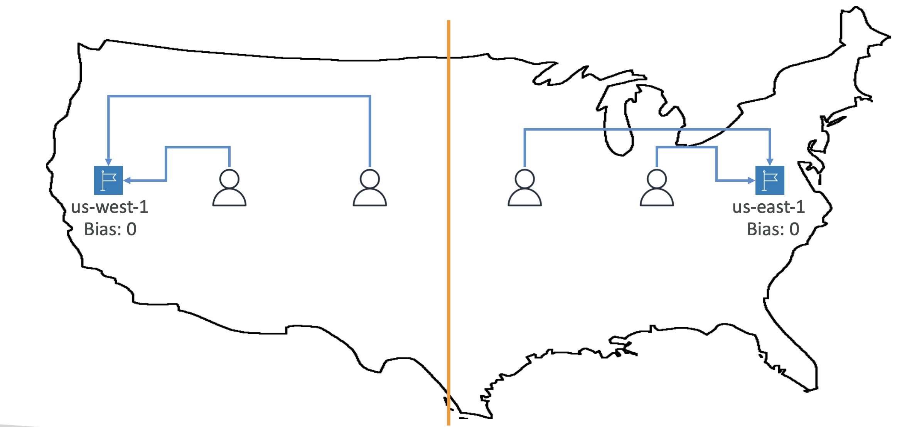 

- `us-west-1`와 `us-east-1`에 리소스가 하나씩 있다고 가정
- 두 지역 리소스 모두 바이어스 `0`으로 설정

- 즉, 미국 전역의 사용자가 리소스에 액세스하려고 하면, 미국을 가운데로 가르는 선이 생기고, 그 선의 왼쪽에 있는 사용자는 `us-west-1`로 라우팅되고, 오른쪽에 있는 사용자는 `us-east-1`로 라우팅됨
- 사용자의 위치를 기반으로 가장 가까운 리소스 지역으로 이동하는 것처럼 보임

#### 2. 모든 지역이 바이어스가 다를 때

위 예시는 바이어스가 없을 때임

바이어스를 활용하면, 동일한 리소스여도 설정한 비율만큼 특정 지역에 더 많은 트래픽을 라우팅할 수 있음

 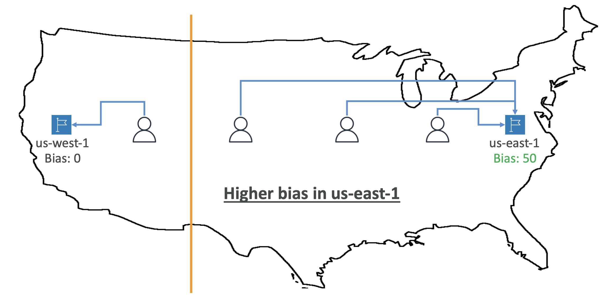 

- `us-west-1`는 `0`, `us-east-1`에는 `50`의 바이어스로 설정
- 바이어스 값을 반영해서, 두 리소스를 나누는 선을 바이어스 비율 만큼 리소스에 더 많은 사용자와 더 많은 트래픽을 라우팅
- 사용 사례: 예를 들어 전 세계에 리소스를 두고 특정 지역으로 더 많은 트래픽을 이동해야 할 때, Geoproximity Routing Policy를 사용해서 특정 지역의 바이어스를 높일 수 있음 → 더 많은 사용자가 그 지역으로 트래픽을 유도함

 

## Routing Policy - Traffic Flow & Geoproximity Hands On

 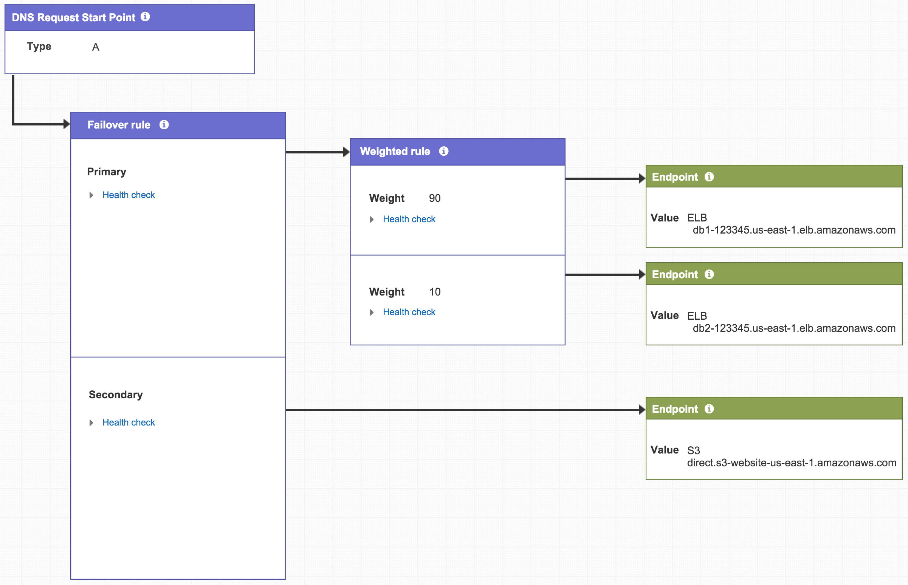 

- 크고 복잡한 트래픽 흐름을 생성하고 관리하는 프로세스를 단순화
- 복잡한 라우팅 결정 트리를 관리하기 위한 시각적 편집기
- 트래픽 흐름 정책Traffic Flow Policy으로 저장 가능
- 다른 Route 53 Hosted Zones (다른 도메인 이름)에 적용 가능
- 버전 관리 지원

 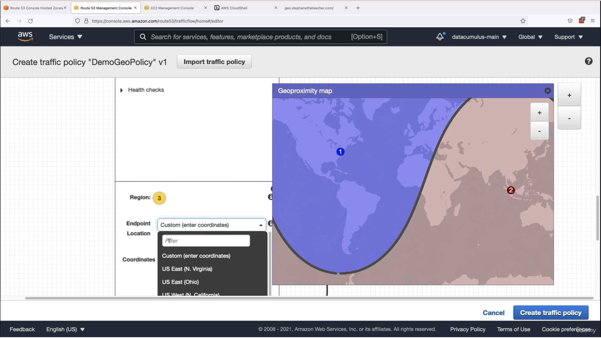 

Bias를 조정하면 AWS 에서 이에 해당하는 다이어그램을 보여줌

 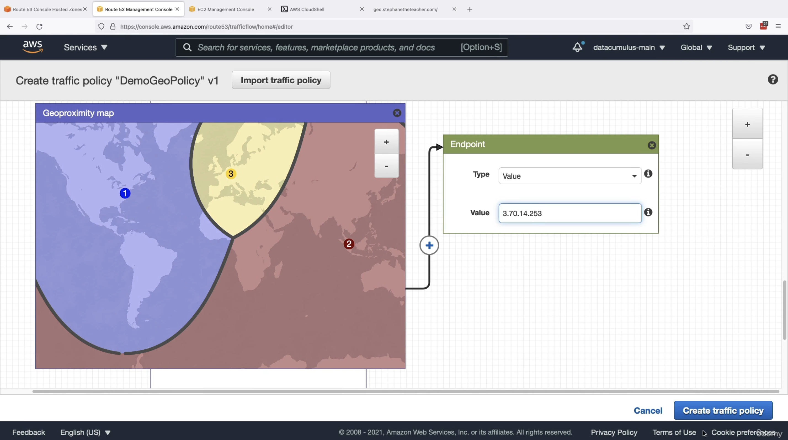 

`ap-southeast-1`, `us-east-1`, `eu-central-1` 을 각각 정의하고 Bias 를 다르게 준 상태

 

> **How Amazon Route 53 uses bias to route traffic**
> 
> Here's the formula that Amazon Route 53 uses to determine how to route traffic:
> 
> **Bias**
> Biased distance = actual distance * [1 - (bias/100)]
>
> - https://docs.aws.amazon.com/Route53/latest/DeveloperGuide/routing-policy-geoproximity.html

 

## Routing Policy - IP-based Routing

- 사용자의 IP 주소를 기반으로 리소스에 요청을 라우팅
- 운영자가 클라이언트와 엔드포인트/위치 (사용자 IP와 엔드포인트 매핑) 간의 CIDR 목록을 제공
- 사용 사례: 성능 최적화, 네트워크 비용 절감 등
- e.g. 특정 ISP의 최종 사용자를 특정 엔드포인트로 라우팅

 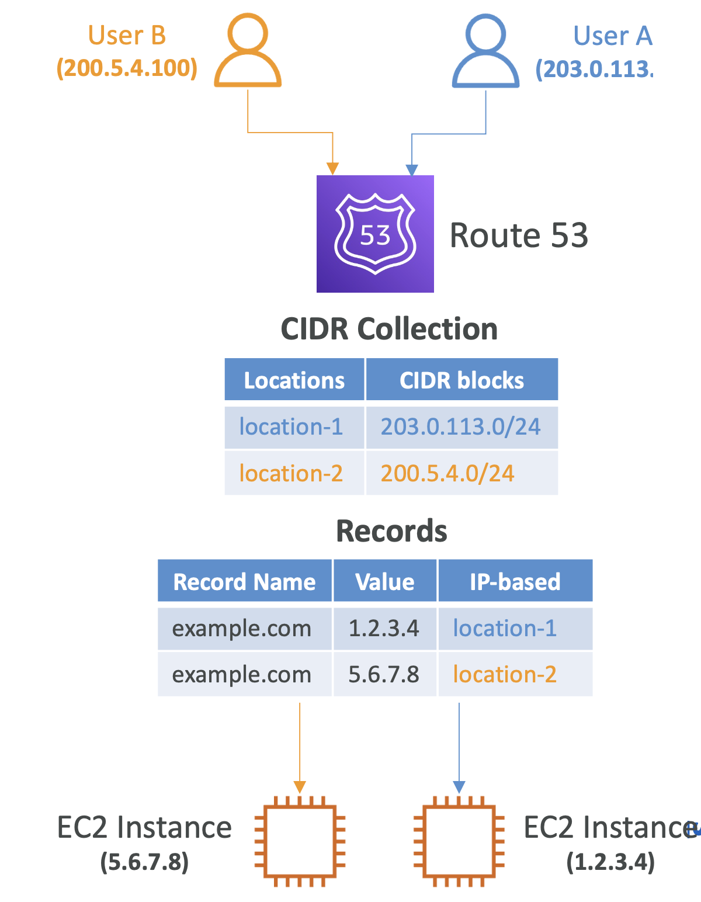 
 

## Routing Policies – Multi-Value

 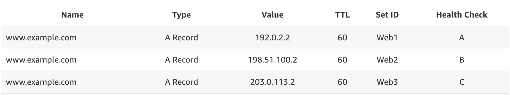 

- 여러 리소스에 트래픽을 라우팅해야할 때 사용
- Route 53는 여러 값/리소스를 반환
- Health Checks와 연동 가능 (healthy 상태의 리소스만을 반환)
- 각각 Multi-Value 쿼리에 대해 8개의 healthy 상태의 레코드까지 반환됨
- Multi-Value는 ELB의 대체 용도가 아님

<table>
<tr>
<th>US</th>
<th>Asia</th>
<th>EU</th>
</tr>
<tr>
<td>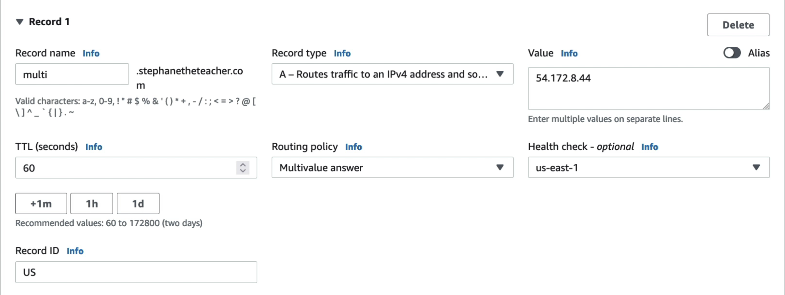</td>
<td>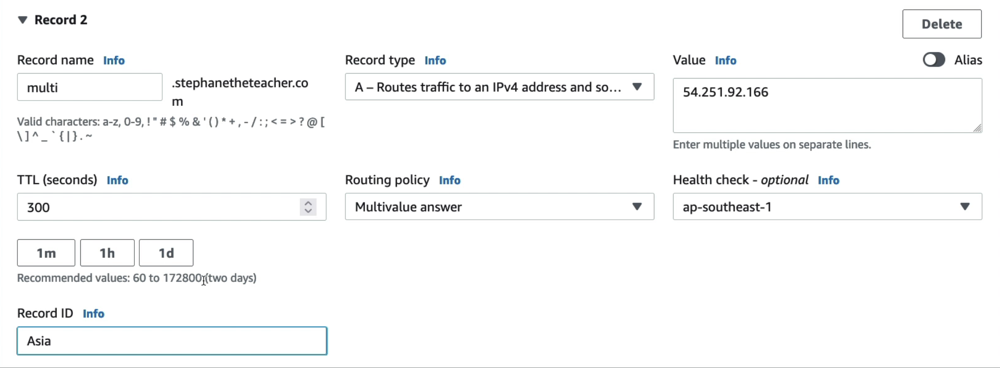</td>
<td>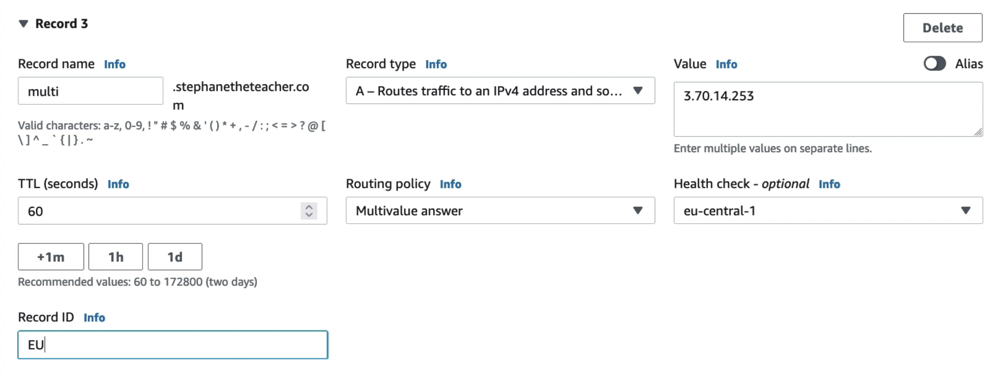</td>
</tr>
</table>

