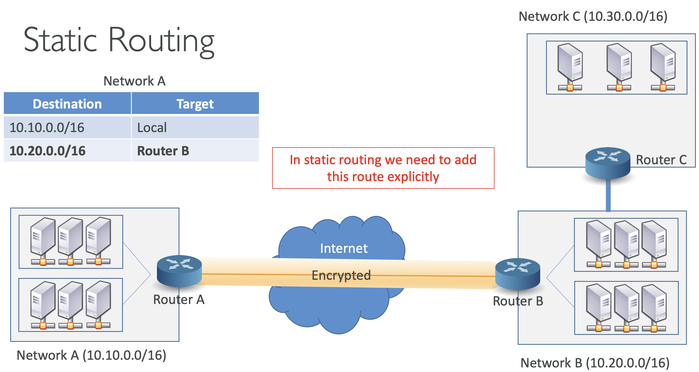

# Introduction to Hybrid networking

가장 중요한 개념은 **Site-to-Site VPN**와 **Direct Connect**.

- **Site-to-Site VPN**: IPSec 프로토콜을 사용하는 보안 인터넷 통신. Private IP로 서로 통신
- **Client VPN**: 사용자의 머신과 연결하기 위한 연결.

위의 경우, 대역폭이나 지연(latency)로 인한 이슈를 마주할 경우가 있는데,
이 때 Direct Connect 를 사용하면 됨

 

---

# VPC Routing - Static vs Dynamic

## AS – Autonomous Systems

- 네트워크의 한 엔터디에 의해 관리되는 라우터들
- Public ASN (1-64495)을 위한 IANA로 지정됨
  - IANA: Internet Assigned Numbers Authority. standards organization that oversees global IP address allocation, autonomous system number allocation, root zone management in the Domain Name System (DNS), media types, and other Internet Protocol–related symbols and Internet numbers.
  - 라우팅 정보를 해당 프로토콜을 통해 다른 네트워크와 공유할 수 있음 (e.g. Border Gateway Protocol)
- Private ASN (`64512-65534`)

 

## Static Routing

- Network A → Router A: (10.20.0.0/16, Router B)
- Network B → Router B: (10.10.0.0/16, Router A)

Network A 와 Network B는 각각의 Router로 연결되어 있음

  

이미 알다시피, 
Router A에는 Router B로 향하는 엔트리 `(10.20.0.0/16, Router B)` 를 갖고
Router B에는 Router A로 향하는 엔트리 `(10.10.0.0/16, Router A)` 를 갖고 있기 때문에 각 목적지로써 패킷을 전송할 수 있음

이 때, Network C → Router C 가 추가 된다고 해보자.

  

Router C는 Router B에 대한 엔트리를 설정하면 됨

Router A와 Router B에 Router C에 대한 라우트를 설정해야 함

=> 네트워크가 추가될 때마다 모든 네트워크에 **수동**으로 설정해야 함

  

만약 하나라도 설정되지 않으면 Router C로 가는 목적지를 알지 못하기 때문에 패킷이 드롭될 것임

 

## Dynamic Routing

동적 라우팅은 라우팅이 자동으로 전파(propagation)됨

  

Router B에 설정하면 Router A로 자동으로 전파됨

