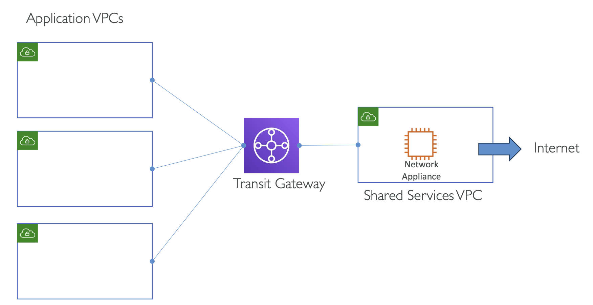
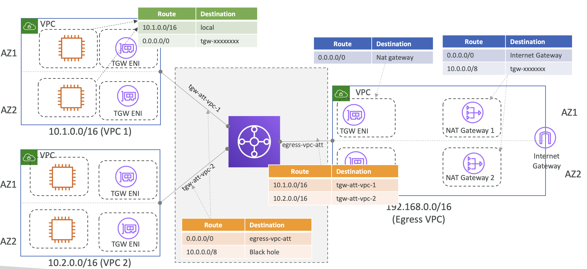

# Transit Gateway - Centralized egress to internet

**⭐️중요 아키텍처**

  

모든 요청이 인터넷에 통할 때마다 트래픽은 공유 VPC를 통하도록 되어있음

 

## Centralized egress to internet with NAT gateway

  

- **왼쪽**: Application VPC
- **오른쪽**: Egress VPC

**⭐어떻게 Route Table을 설정해야 할까**

1. Subnet Route Table

| Route        | Destination   |
|--------------|---------------|
| 10.1.0.0/16  | local         |
| 0.0.0.0/0    | tgw-xxxxxx    |

2. Application Subnets과 Transit Gateway - VPC Attachment 의 Route Table

- tgw-att-vpc-1
- tgw-att-vpc-2

| Route      | Destination               |
|------------|---------------------------|
| 0.0.0.0/0  | egress-vpc-att            |
| 10.0.0.0/8 | Black hole (VPC 간 통신 방지)  |

3. Shared Subnet과 Transit Gateway - Egress VPC Attachment 의 Route Table

- egress-vpc-att

| Route       | Destination   |
|-------------|---------------|
| 10.1.0.0/16 | tgw-att-vpc-1 |
| 10.2.0.0/16 | tgw-att-vpc-2 |

4. Shared Subnet의 Route Table

모든 트래픽이 NAT Gateway로 가면 됨 

| Route     | Destination |
|-----------|-------------|
| 0.0.0.0/0 | NAT Gateway |

4. NAT Gateway의 Route Table

| Route      | Destination      |
|------------|------------------|
| 0.0.0.0/0  | Internet Gateway |
| 10.0.0.0/8 | tgw-xxxxxx       |

요청/응답 흐름을 살펴보면 아래와 같음

  

AZ 간 데이터 송수신 비용도 절감할 수 있음 

 

## Centralized egress to internet with NAT gateway

**Important to know:**
- 각 AZ 내에 NAT gateway를 사용
  - 고가용성과 AZ간 데이터 전송 비용 절감을 위해
- 한 Availability Zone가 완전히 사용 불가해도, 모든 트래픽은 다른 AZ로 흐름
- NAT gateway는 서로 다른 도착지(unique dest.)에 동시에 55,000개 까지의 연결을 지원
- NAT gateway는 5 Gbps 부터 100 Gbps 까지 스케일링할 수 있음
- Transit Gateway route tables의 Blackhole 엔트리는 VPC간 트래픽을 제한하기 위함
- 위 아키텍처는 VPC NAT Gateway 당 요금이 부과되기 보다는, Transit Gateway attachment 와 데이터 전송 요금이 부과되는데, 반드시 비용 절감이 되는 건 아님
  - **비용 예시**:
    - VPC NAT Gateway: ~ $0.045/hr + ~$0.045/GB
    - Transit Gateway attachment & data processing: ~$0.05/hr per VPC attachment + ~$0.02/GB

