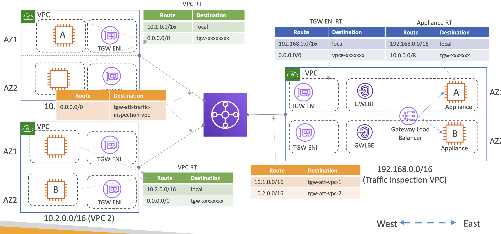
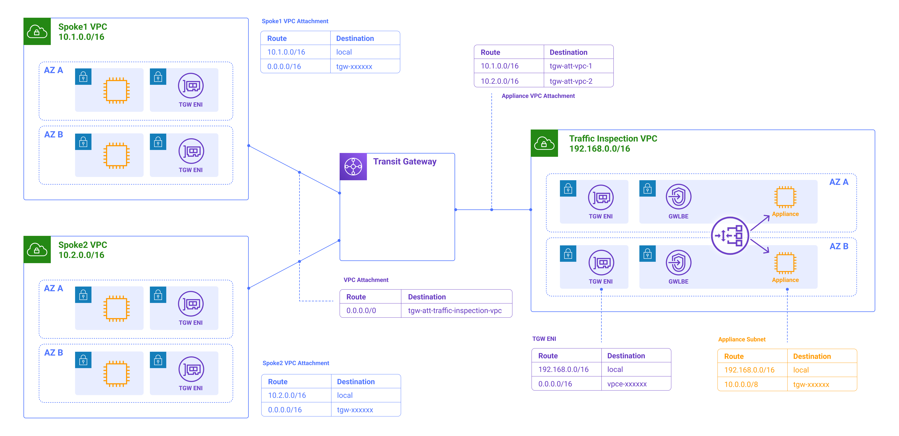
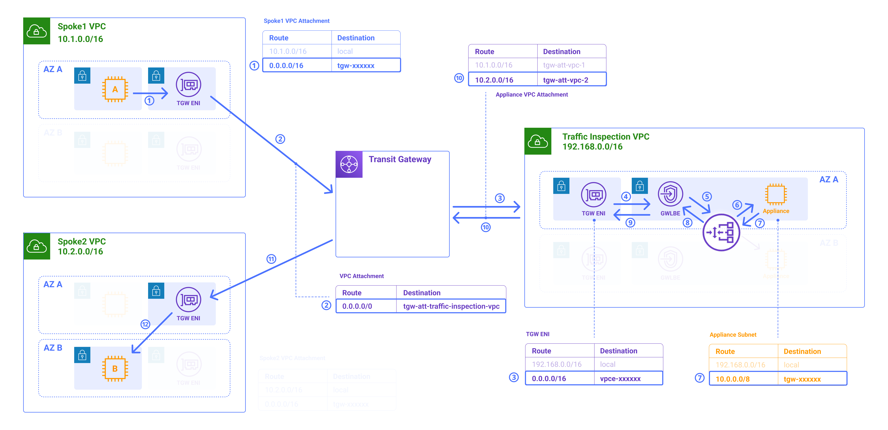
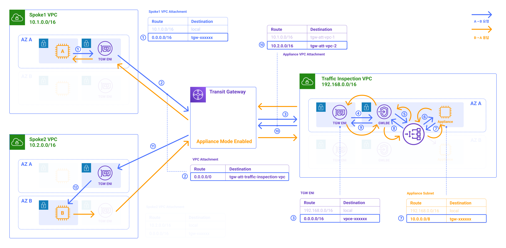
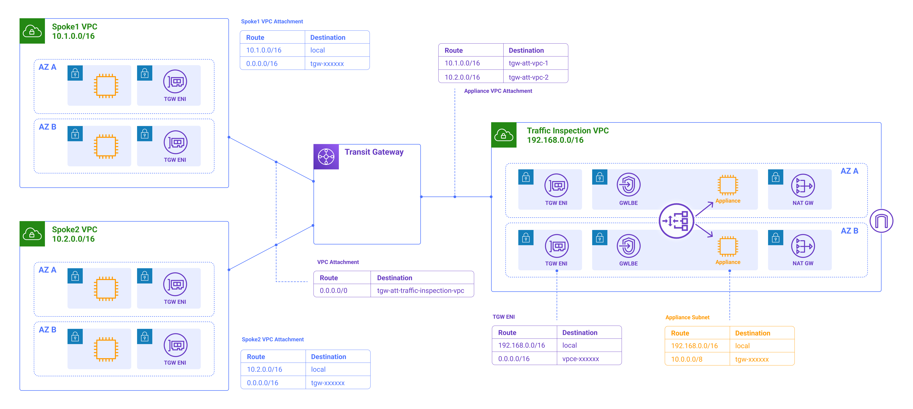
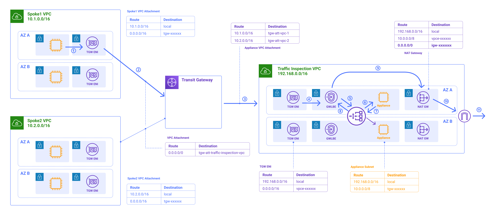
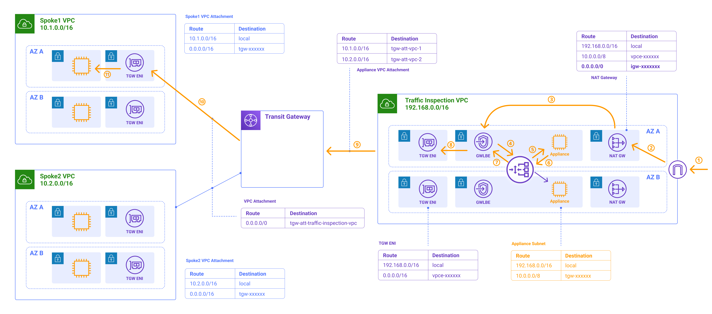

# TGW Architecture: Centralized traffic inspection with Gateway Load Balancer

Gateway LoadBalancer: 네트워크 어플라이언스에 모든 트래픽을 전달하기 위한 용도로 사용

  

위 구조에서 하나의 네트워크 검사(inspection)을 위한 레이어를 추가하고자 한다면, 
아래와 같은 아키텍처를 구현할 수 있음

  

### 설정 상세

#### 1. 내부 VPC 라우트 테이블 설정

- **왼쪽, 내부** VPC: VPC 1, VPC 2 
- **오른쪽, 트래픽 감사 VPC**: Traffic inspection VPC

**VPC 1, VPC 2의 라우트 테이블** 

| Route       | Destination |                               | 
|-------------|-------------|-------------------------------|
| 10.1.0.0/16 | local       |                               |
| 0.0.0.0/0   | tgw-xxxxxxx | ← 기본 라우팅을 Transit Gateway로 설정 | 

  

**`VPC 1, VPC 2 --🔗-- Transit Gateway`의 Attachment 라우트 테이블 설정**

모든 트래픽이 Traffic inspection VPC로 향하도록 아래와 같이 하나의 루트만 설정

| Route       | Destination                    |  
|-------------|--------------------------------|
| 0.0.0.0/0   | tgw-all-traffic-inspection-vpc |

  

**`Transit Gateway --🔗-- Traffic inspection VPC`의 Attachment 라우트 테이블 설정**

| Route       | Destination                    |  
|-------------|--------------------------------|
| 10.1.0.0/16 | tgw-att-vpc-1                  |
| 10.2.0.0/16 | tgw-att-vpc-2                  |

  

**TGW ENI의 라우트 테이블 설정 - 여기가 중요**

| Route          | Destination   |  
|----------------|---------------|
| 196.168.0.0/16 | local         |
| 0.0.0.0/0      | vpce-xxxxxxx  |

모든 트래픽(`0.0.0.0/0`)이 Gateway LoadBalancer로 향하도록 설정

그럼 이후 모든 트래픽이 Gateway LoadBalancer로 향하고, GLW가 어플라이언스를 통하도록 전송됨

  

**어플라이언스의 라우트 테이블 설정**

| Route          | Destination |  
|----------------|-------------|
| 196.168.0.0/16 | local       |
| 10.0.0.0/8     | tgw-xxxxxxx |

실제 트래픽의 흐름은 아래 그림과 같이 흐를 것임

  

#### Asymmetric flow

위와 같은 Symmetric flow에서 원천 요청(Origin Request)는 응답된 요청(Return Request)과 동일하지 않으면 처리를 거절(Reject)할 수 있음. 

위 구조는 Asymmetric flow를 발생시킬 수 있기 때문에 Transit Gateway에 **Appliance Mode를 활성화해야 함**

  

(for AZ affinity)

---

## Internet Traffic

서로 다른 AZ에 두 개의 서브넷을 더 추가하고 NAT Gateway를 생성하여 인터넷 트래픽을 라우팅

  

- IGW를 통하기 위해 NAT GW를 추가
- 기존 Appliance Application Route Table에 NAT Gateway로 향하는 경로 추가

아래와 같이 데이터가 흐르게 됨

  

반대로, 인터넷을 통해 들어오는 Inbound 데이터는 아래와 같은 흐름을 띔

  

- Using AWS PrivateLink, GWLB Endpoint routes traffic to GWLB. Traffic is routed securely over Amazon network without any additional configuration.
- GWLB encapsulates the original IP traffic with a GENEVE header and forwards it to the network appliance over UDP port 6081.
  - GENEVE (Generic Network Virtualization Encapsulation)
- GWLB uses 5-tuples or 3-tuples of an IP packet to pick an appliance for the life of that flow. This creates session stickiness to an appliance for the life of a flow required for stateful appliances like firewalls.
- This combined with Transit Gateway Appliance mode, provides session stickiness irrespective of source and destination AZ.
- Refer to this blog for further details: https://aws.amazon.com/blogs/networking-and-content-delivery/centralized-inspection-architecture-with-aws-gateway-load-balancer-and-aws-transit-gateway/

 

