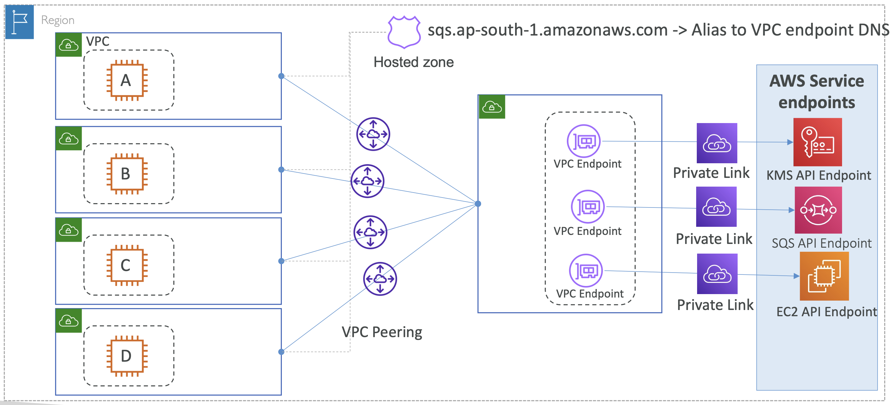

# TGW Architecture: Centralized VPC interface endpoints


#### 복습

**📌 Network Interface?**
VPC와 AWS 서비스 엔드포인트를 프라이빗하게 연결시킬 수 있게 해줌

<br><br>

- **가정**
  - VPC에는 인터넷 아웃바운딩이 필요 없음
  - KMS, SQS, EC2 서비스에 연결하고자 함
- 조건을 만족하기 위해 **Private Link**를 사용할 수 있음
- Private Link는 서브넷 ENI에 프로비저닝 됨. 
  - 즉, ENI를 통해 AWS 서비스에 연결 = Private Link를 통한 통신
- 참고로, 해당 ENI를 통해서 퍼블릭 엔드포인트에도 연결할 수 있음

<br />

#### 문제점

각각 서비스마다의 Private Link를 연결

만약, 더 많은 VPC를 연결하고자 한다면?

<br><br>

VPC B, VPC C, VPC D에 각자 서비스에 연결 시켜줘야 함 → 관리 X

<br />

#### 해결법

\: **Transit Gateway**

- 모든 Spoke VPC에 프라이빗하게 연결됨
- 모든 접근을 중앙 관리

<br><br>

<br />

#### 문제점

인스턴스 A가 SQS API 호출을 위해 `sqs.ap-south-1.amazonaws.com` 으로 연결 시도.

이 때, 아웃바운딩 연결성(Connectivity)가 전혀 없기 때문에 (NAT GW, Internet GW X) 요청 실패. 

때문에, DNS Resolution 시, 반드시 당신의 VPC 엔드포인트의 프라이빗 IP로 리졸브시켜서 중앙관리 VPC에서 유효하게끔 만들어야 함.

```Bash
sqs.ap-south-1.amazonaws.com   >>>  VPC endpoint private IP
```

<br />

#### 해결책

VPC Endpoint에 **Private DNS 설정 활성화**

- Private DNS 설정을 활성화하면, AWS가 SQS API 엔드포인트(`sqs.ap-south-1.amazonaws.com`)와 동일한 Private hosted zone을 생성
- 해당 Zone에 VPC Endpoint 연결(Attach)
  - `sqs.ap-south-1.amazonaws....   >>>  your.vpc.endpoint.private.ip`
- 그럼 Spoke VPCs 내의 EC2 인스턴스가 해당 SQS API Endpoint 를 요청할 때, 당신의 VPC ENI의 프라이빗 IP로 해석

<br />

#### 문제점

- 여전히 Spoke VPC들에서는 SQS API Endpoint 를 해석(resolve)하지 못함
  - 오직 Egress VPC (VPC Endpoint가 포함된)에서만 해석할 수 있음

<br><br>

<br />

#### 해결책

<br><br>

1. VPC endpoints의 private DNS를 비활성화
2. AWS Service API Endpoint 와 동일한 이름의 Private Hosted Zone(PHZ) 생성 (e.g. `sqs.ap-south-1.amazonaws.com`)
3. VPC endpoint DNS로 향하는 Alias record 생성 
4. 비슷하게,다른 API endpoint들을 위한 각각의 PHZ와 Alias record 생성 (e.g. KMS, EC2, ...) 
5. 모든 Spoke VPC 들과 PHZ 연결 (Associate) 

### Centralized VPC interface endpoints

#### 중요 내용:

- VPC interface endpoint는 Regional/AZ level DNS endpoint들을 지원
- Regional DNS endpoint는 모든 AZ endpoint들을 위한 IP addresses를 반환
- Spoke VPC에서 Hub VPC까지의 AZ 상호 간 데이터 전송 비용을 절약하기 위해, AZ 특정 DNS 엔드포인트를 사용할 수 있음. 반드시 클라이언트가 선택해야 함
  - \+ Regional specific DNS name 대신 AZ specific DNS name 

<br><br>

> Q. Regional DNS Resolution 인 걸 어떻게 알지???

<br />

### 개별 VPC ENI 연결 시 요금

<br><br>

VPC interface endpoint의 **시간 별 요금** + **데이터 전송 요금**: `$0.01/hr` + `$0.01/GB`

→ 많은 요금이 부과됨

여기서 Transit Gateway 를 사용한다고 해서 많은 요금이 절감된다는 것은 아님

<br />

### Transit Gateway 사용 시 요금

<br><br>

VPC 별 Attachment 요금 + 데이터 전송 요금: `$0.05/hr` + `$0.02/GB` + etc...

→ VPC interface endpoint 요금보다 훨씬 더 비쌈

<br />

### VPC peering 사용 시 요금

<br><br>

또 하나의 아키텍처를 보면, Transit gateway를 사용하는 대신, VPC peering connection을 사용해서 Spoke VPC 들과 중앙 VPC 사이를 연결할 수도 있음 

이 때, VPC peering는 요금이 따로 없음


<br />


## Interface endpoints


