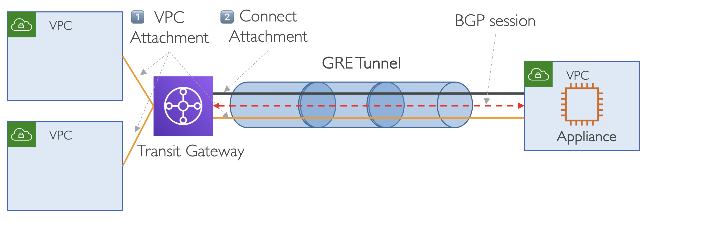
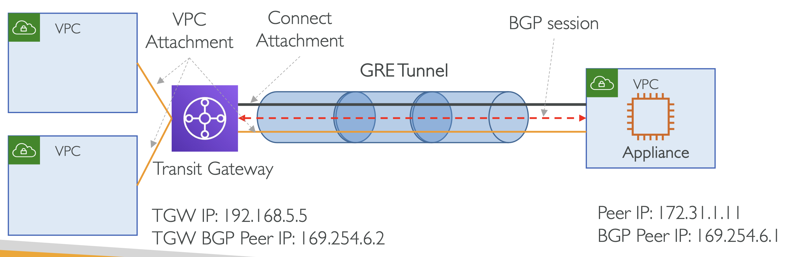
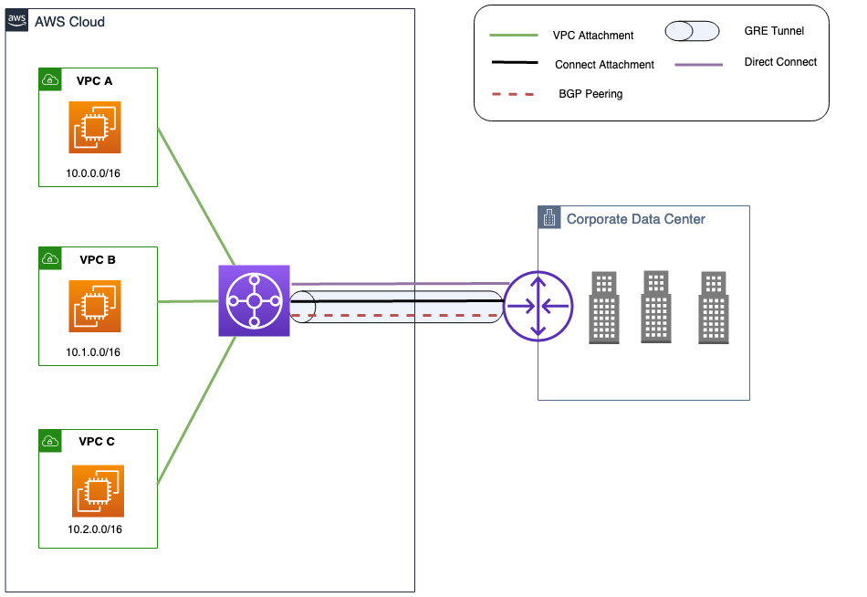

# Transit Gateway Connect Attachment

> _Before We Start..._
>
> **✔️ GRE(Generic Routing Encapsulation)**
> : 라우팅이 불가능한 패킷을 라우팅 가능한 패킷의 내부에 넣어서 전송할 때 사용하는 터널링 프로토콜.
> - 서로 다른 네트워크 간의 연결을 단순화하기 위해, 네트워크를 통해 직접 연결을 설정하는 한 방법
> - Tunneling: 패킷을 다른 패킷 내에 캡슐화하는 것.
> - Tunneling: 한 데이터 패킷을 다른 데이터 패킷 안에 래핑하는 것.
>
> 🔗 [What is GRE tunneling](https://www.cloudflare.com/learning/network-layer/what-is-gre-tunneling/)

VPC Attachment 뿐만 아니라, Direct Connect Gateway를 사용한 'Direct Connect ~ Transit Gateway' 연결을 위한 Direct Connect Attachment를 가질 수 있음

또, Transit Gateway 위에 IPsec VPN tunnels를 종료시킬 수 있는 VPN Attachment를 가질 수 있음

> **IPsec VPN tunnel**: IPsec (인터넷 프로토콜 보안) VPN 터널은 인터넷과 같은 보안되지 않은 네트워크를 통해 두 끝점 간의 데이터 트래픽을 암호화하는 연결

이 Attachment는 Transit Gateway를 가상 Appliances에 연결하는 데 사용됨 (ex. SD-WAN routers)

<small>FYI. 기존의 SD-WAN 네트워크를 AWS 연결로 확장하기 위해선 Transit Gateway를 사용하는 것은 **필수**임</small>

## Transit Gateway – Connect attachment

가령, 크게 둘러보면, 아래처럼 VPC 내에 가상의 어플라이언스를 가질 수 있음

  

왼쪽에 있는 Transit Gateway와 연결하고자 할 때, 둘 사이에 **GRE tunnel**을 생성해야 함

**Connect attachment**
- VPC 혹은 온프레미스에 실행되는 가상의 제 3자 어플라이언스(ex. SD-WAN appliances)를 연결하기 위해서 Transit Gateway Connect Attachment를 생성
- Connect Attachment는 기존의 VPC / AWS Direct Connect Attachment를 기반 전송 메커니즘로써 사용
- 높은 성능을 위해 Generic Routing Encapsulation (GRE) 터널 프로토콜을 지원하며, 동적 라우팅을 위해 Border Gateway Protocol (BGP)을 지원

먼저 VPC Attachment를 생성하고, 이후 Connect Attachment를 연결

이후 GRE tunnel이 생성(establish)되는데, 이 때 BGP Peering이 필요

궁극적으로, Transit Gateway와 Network Appliances 사이에 BGP 세션이 설정될 것.

  

→ Transit Gateway는 내부 IP 주소와 외부 IP 주소를 갖게 됨 (BGP Configuration)

Transit Gateway는 고유한 IP 주소를 가지는데, IP 주소는 생성 시 직접 할당하거나 수정할 수 있음

 

> **Inside CIDR blocks (BGP addresses)**
> 
> The inside IP addresses that are used for BGP peering. You must specify a /29 CIDR block from the 169.254.0.0/16 range for IPv4. You can optionally specify a /125 CIDR block from the fd00::/8 range for IPv6. The following CIDR blocks are reserved and cannot be used:
> 
> - 169.254.0.0/29
> - 169.254.1.0/29
> - 169.254.2.0/29
> - 169.254.3.0/29
> - 169.254.4.0/29
> - 169.254.5.0/29
> - 169.254.169.248/29
> 
> 🔗[Transit Gateway Connect attachments and Transit Gateway Connect peers in Amazon VPC Transit Gateways](https://docs.aws.amazon.com/vpc/latest/tgw/tgw-connect.html)

 

## Transit Gateway Connect attachment over the VPC transport attachment

  

**구성 컴포넌트**
1. 세 개의 VPC 내 각각 실행되는 인스턴스: VPC A, VPC B, VPC C
2. Transit Gateway
3. VPC 내에서 실행되는 가상 어플라이언스
4. 온프레미스 네트워크와 연결된 VPC가 있고, Connect Attachment를 Transit Gateway와 연결

 

## Transit Gateway Connect attachment over the DX transport attachment

만약 온프레미스 네트워크에서 실행되는 가상 어플라이언스가 있다면, 
Transit Gateway를 온프레미스 데이터 센터에 연결할 수 있음

  

Transit Gateway Connect는 온프레미스에서 실행되어 AWS Direct Connect로 연결된 써드파티 브랜치나 사용자 게이트웨이 어플라이언스로 사용할 수 있음

 

## Transit Gateway Connect attachment

- Connect attachment는 정적 라우트를 지원하지 않음. BGP는 Transit Gateway Connect의 최소 요구 사항임.
- Transit Gateway Connect는 GRE tunnel 당 최대 5 Gbps의 대역폭을 지원. 
- 5 Gbps 이상은 대역폭은 동일한 Connect attachment의 다중 Connect peer (GRE tunnel) 중 동일한 프리픽스를 노출해서 사용 가능. 
- 네 개의 Connect peer는 최대 총 20 Gbps 대역폭을 제공해서 서로의 커넥션을 보충

 

> **ECMP**: Equal-cost multi-path. 등가 다중 경로 라우팅
> - 여러 최적 경로를 통해 패킷을 전달하는 라우팅 전략
> - Site-to-Site VPN 연결을 많이 생성해서 AWS로의 연결 대역폭을 늘릴 때 사용

 
