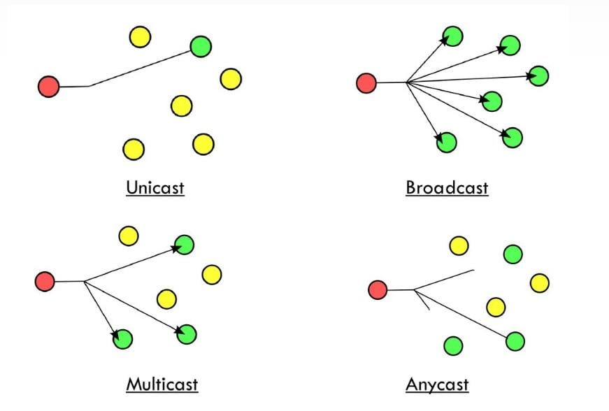
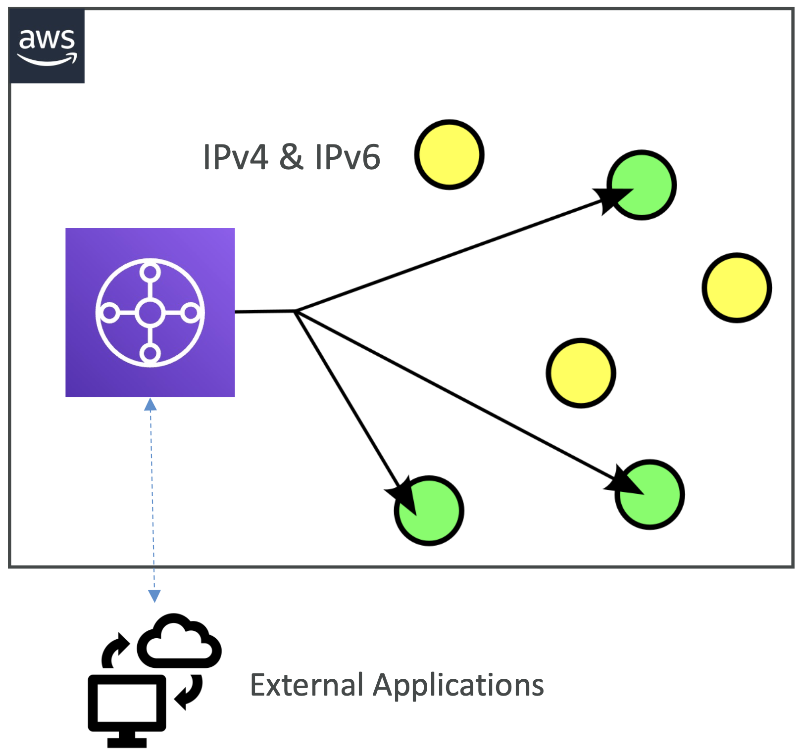
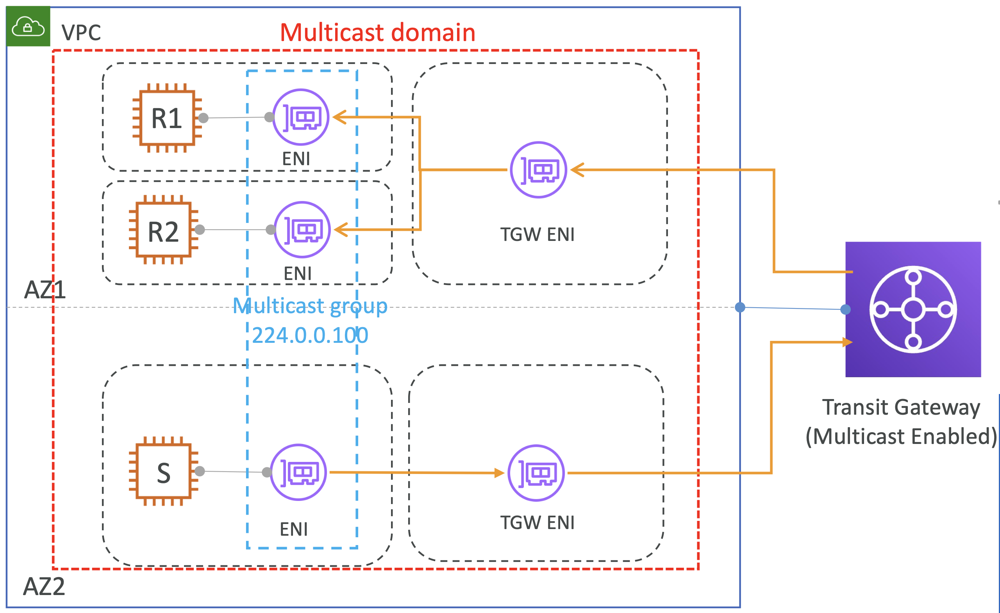
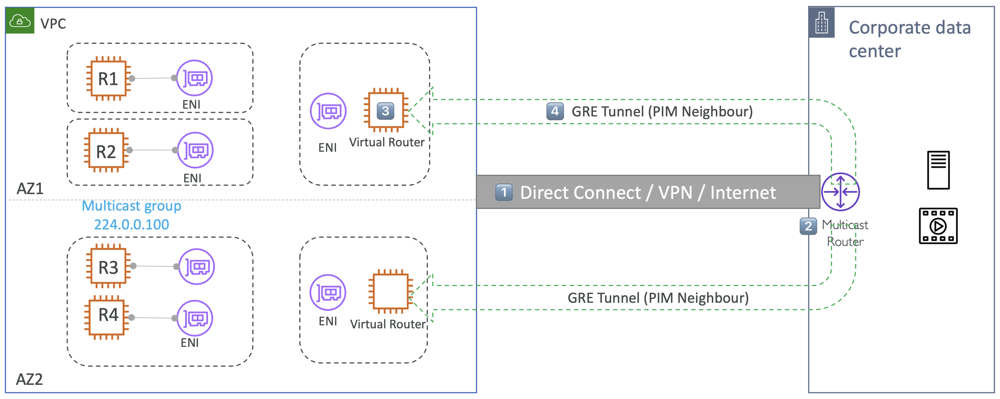
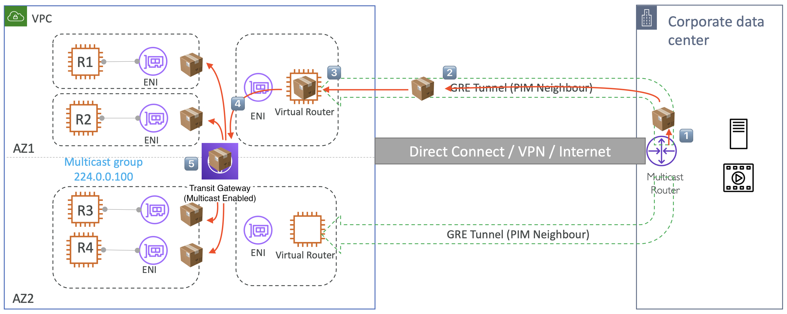

# Transit Gateway Multicast

## Multicast

멀티케스트는 여러 목적지에 동시에 패킷을 전송하는 것

  

- 단일 데이터 스트림을 여러 머신에 동시에 전달할 때 사용하는 프로토콜
- Single/multiple sources 와 destinations
- 목적지는 멀티케스트 그룹 주소:
  - 일반적으로 멀티케스트 그룹은 클래스 D 주소를 사용: `224.0.0.0` to `239.255.255.255`
- Connectionless UDP 기반 전송
- One way communication
- Examples: Sending email to the email-list, Conference call / Group chat, OTT platforms / TV Media, Stock exchange transaction updates
  - Multicast components
  - Multicast Domain
  - Multicast Group and member
  - Multicast source and receivers
  - Internet Group Management Protocol (IGMP)

 

## Multicast with Transit Gateway

  

- Transit Gateway 생성 시, Multicast services 사용 활성화
  - 생성 후 설정할 수 없음
- IPv4 & IPv6 IP addressing 지원
- AWS 외부 애플리케이션과의 하이브리드 통합 지원
- IGMP(IGMPv2 지원)를 통한 정적 멤버십 (Static, API based) / 동적 그룹 멤버십 (Dynamic) 모두 지원

 

## Multicast traffic in a VPC

  

- 멀티케스트 도메인과 Participating subnets 추가
- 멀티케스트 그룹 생성 후 그룹 멤버십 IP 연결(e.g. `224.0.0.100`)
  - 모든 ENI를 추가할 필요없이, 지정한 ENI만 연결되도록 그룹에 포함
- 그룹 멤버십 설정
  - Statical: CLI/SDK 사용 
  - Dynamical: IGMPv2 사용
- 소스로 부터 멀티케스트 그룹 IP으로 트래픽 전송
- 그룹 내 모든 멤버들은 멀티케스트 트래픽을 받음
- 다중 VPC과 다중 AWS 계정 사이에서 비슷한 네트워크 플로우로 동작함

 

## Integrating external multicast services

Transit gateway, Direct Connect, Connect Attachment는 멀티케스팅을 지원하지 않음

이미 연결되어 있는 상태에서는 어떻게 멀티케스팅을 추가할까?

일종의 온프레미스 데이터 센터에서 AWS로 향하는 SD-WAN 같은 개념.

  

- 1️⃣ 먼저 둘 사이에 DX(혹은 VPN/인터넷)와 같은 전송 매커니즘이 존재
- 2️⃣ **온프레미스**에 **멀티캐스팅을 위한 라우터**를 가질 수 있음
- 3️⃣ **VPC**에 **가상 라우터**를 가질 수 있고
- 4️⃣ VPC 내의 가상 라우터가 온프레미스 라우터를 위한 GRE tunnel 생성

  

**데이터 전송**

- 1️⃣ **Multicast Router** in On-premise -
- → 2️⃣ GRE tunnel
- → 3️⃣ **Virtual Router** in VPC
- → 4️⃣ **Transit Gateway** (Multicast Enabled) in VPC
- → 5️⃣ **ENIs** in Other Subnets 

 

## Multicast considerations for TGW

- VPC 내 여러 서브넷 간 멀티캐스트 지원
- **서브넷 제한**: 한 서브넷은 단 하나의 멀티캐스트 도메인에만 속할 수 있음
- ENI(Elastic Network Interface)의 멀티캐스트 그룹 가입:
- 서브넷 내 ENI는 하나 이상의 멀티캐스트 그룹에 속할 수 있음
- 멀티캐스트 그룹 멤버십 관리 방법:
  - Static: VPC 콘솔, AWS CLI. (IGMP를 지원하지 않는 멤버)
  - Dynamic: IGMP(Internet Group Management Protocol) (`JOIN`/`LEAVE` 메시지를 통해 자동 관리)
- **IGMPv2 동작 방식**
  - IGMPv2를 사용하면 호스트가 멀티캐스트 그룹에 동적으로 가입(JOIN)하거나 탈퇴(LEAVE) 가능
- Transit Gateway의 IGMPv2 쿼리 동작:
  - TGW는 2분마다 모든 멤버에게 IGMPv2 QUERY 메시지를 발송
  - 멤버들은 IGMPv2 JOIN 메시지로 응답하며, 이를 통해 멤버십을 갱신
- 동적 등록: IGMPv2 지원
- **멀티캐스트 관련 속성**
  - **`Igmpv2Support`**:
  - 그룹 멤버가 멀티캐스트 그룹에 추가/제거되는 방식 결정
  - 활성화 시 멤버들은 `JOIN` 및 `LEAVE` 메시지를 전송 가능
  - **`StaticSourcesSupport`**:
  - 정적 멀티캐스트 소스 여부를 결정하는 멀티캐스트 도메인 속성
  - 비활성화(`"StaticSourcesSupport": "disable"`) 시 모든 멤버가 메시지 전송 가능
  - 특정 송신자만 허용하려면 해당 옵션을 적용하고 원하는 대상을 지정해야 함
- **멀티캐스트 제한**:
- **전송 가능 인스턴스**: Nitro 기반 인스턴스에서만 멀티캐스트 전송 가능
- Non-Nitro 인스턴스는 수신자로는 사용할 수 있으며, 이 경우 Source/Destination을 비활성화해야 함
- **멀티캐스트 라우팅 미지원 서비스**:
  - AWS Direct Connect
  - Site-to-Site VPN
  - TGW Peering Attachments
  - Transit Gateway Connect Attachments
- **IGMP 쿼리 패킷의 IP 정보**
  - 소스 IP: `0.0.0.0/32`
  - 목적지 IP: `224.0.0.1/32`
  - 프로토콜: `IGMP(2)`
- **보안 그룹(Security Group) 및 ACL에 IGMP 설정 필요**
  - IGMP 프로토콜 메시지가 허용되도록 모든 IGMP 호스트 인스턴스의 Security Group 및 ACL 정책을 설정해야 함

 

## NACL and Security Group for Multicast

### NACL

<table>
<tr>
<th>NACL Inbound</th>
<th>NACL Outbound</th>
</tr>
<tr>
<td>

| Protocol | Source                                | Description                                              |
|----------|---------------------------------------|----------------------------------------------------------|
| IGMP(2)  | `0.0.0.0/32`                          | IGMP query sent to `224.0.0.1/32`                        |
| UDP      | Remote host sending multicast traffic | For inbound multicast traffic sent to multicast group IP |

</td>
<td>

| Protocol | Source                      | Description                     |
|----------|-----------------------------|---------------------------------|
| IGMP(2)  | `224.0.0.2/32`              | IGMP LEAVE                      |
| IGMP(2)  | Multicast group IP address  | IGMP JOIN                       |
| UDP      | Multicast group IP address  | For outbound multicast traffic  |

</td>
</tr>
</table>

 

### Security Group

<table>
<tr>
<th>Security Group Inbound</th>
<th>Security Group Outbound</th>
</tr>
<tr>
<td>

| Protocol | Source                                | Description                    |
|----------|---------------------------------------|--------------------------------|
| IGMP(2)  | `0.0.0.0/32`                          | IGMP query                     |
| UDP      | Remote host sending multicast traffic | For inbound multicast traffic  |

</td>
<td>

| Protocol | Source                      | Description                     |
|----------|-----------------------------|---------------------------------|
| IGMP(2)  | `224.0.0.2/32`              | IGMP LEAVE                      |
| IGMP(2)  | Multicast group IP address  | IGMP JOIN                       |
| UDP      | Multicast group IP address  | For outbound multicast traffic  |

</td>
</tr>
</table>

 
 
