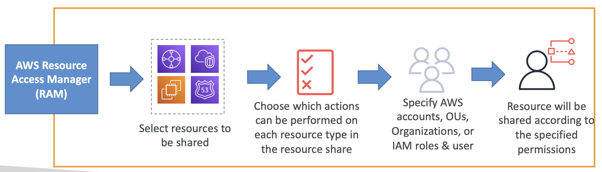

# Transit Gateway Sharing

Transit Gateway를 AWS Organizations 내의 다른 계정(account)이나 그룹(organization)에
VPC Attachment를 생성하려면,
AWS Resource Access Manager (RAM)을 사용하면 됨

  

## Important to know about shared transit gateway

- AWS Site-to-Site VPN attachment는 반드시 Transit Gateway를 소유하는, 동일한 AWS 계정에 생성되어야 함
- Direct Connect gateway의 경우에는, Direct Connect gateway에 붙는 Attachment는 Direct Connect gateway와 **동일한 / 다른 AWS 계정** 내에 위치할 수 있음
- 특정 AWS 계정로 Transit Gateway가 공유받아도, 해당 AWS 계정은 Transit Gateway Route Table, Route Table Propagation 과 Association을 생성, 수정, 혹은 삭제할 수 없음
    - 즉, Owner Account 만 수정 가능
- Transit Gateway와 Attachment 엔티티들이 서로 다른 계정에 있을 때,
- Availability Zone를 고유하고 지속적으로 식별하기 위해 Availability Zone ID를 사용해라
- 가령, `use1-az1`는 `us-east-1` 리전의 AZ ID이고, 모든 AWS 계정 내 동일한 위치로 매핑됨 

