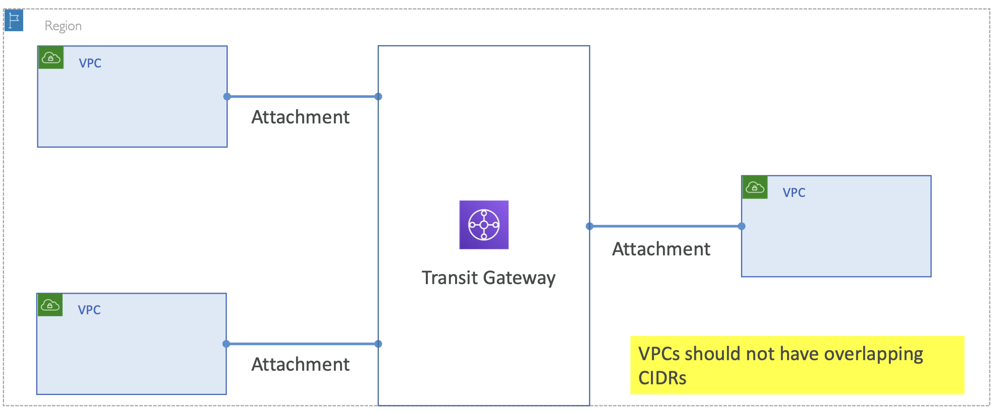
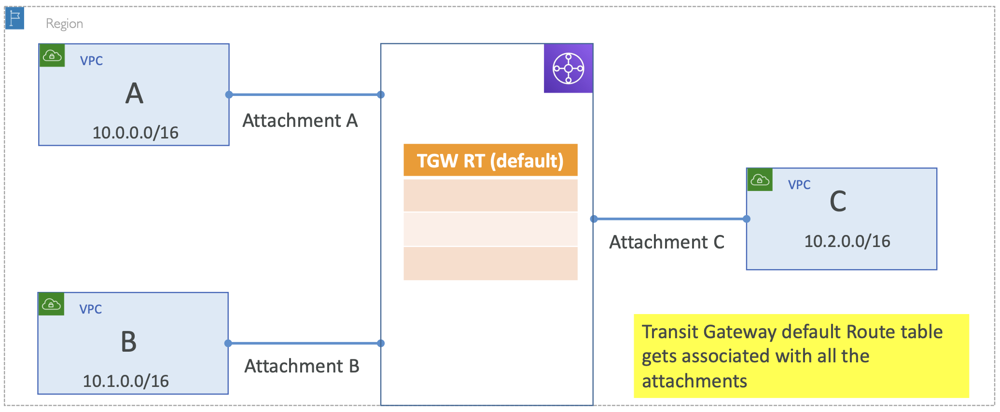
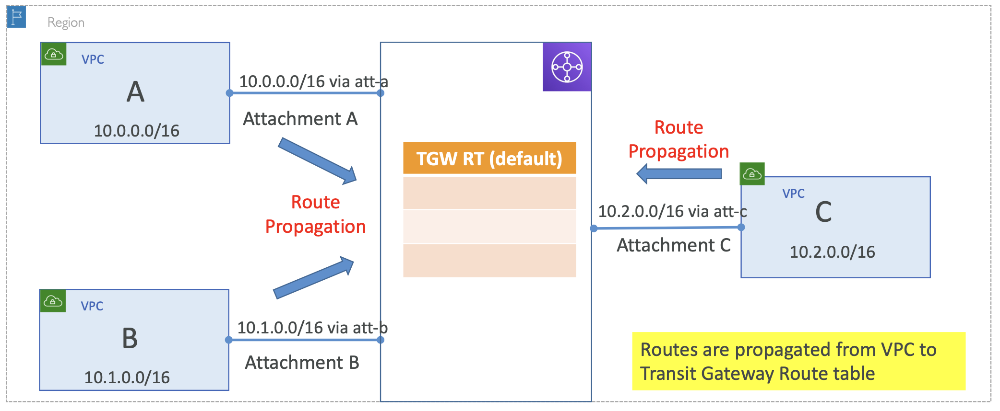
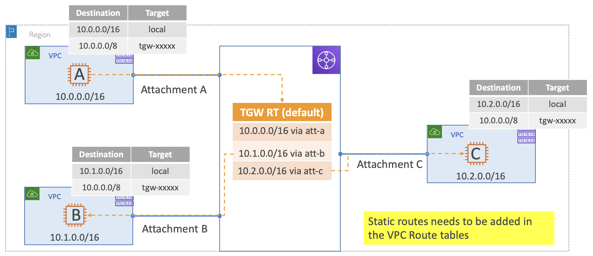
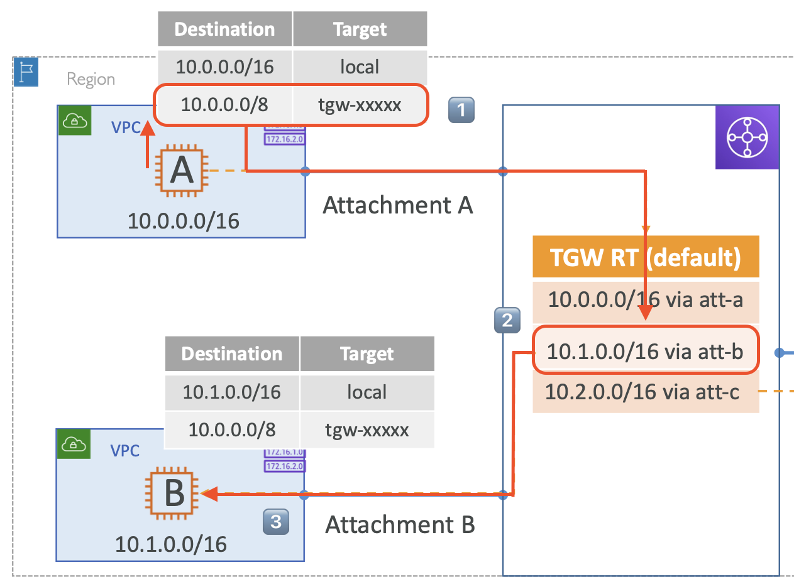
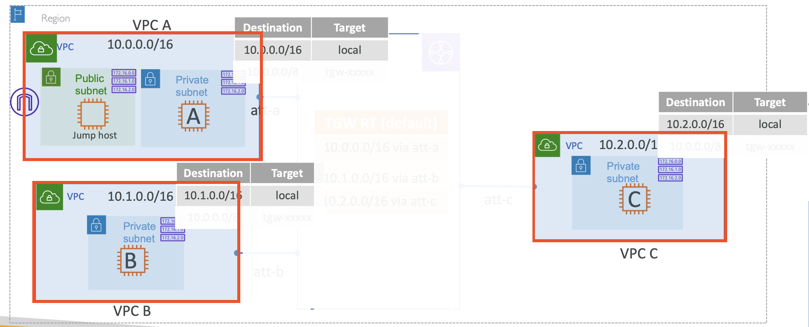
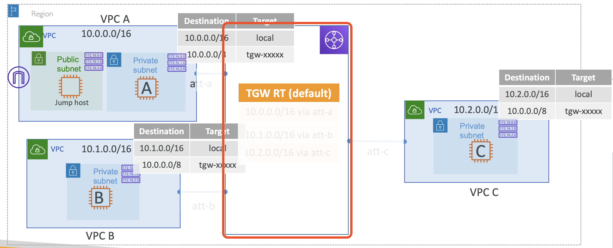
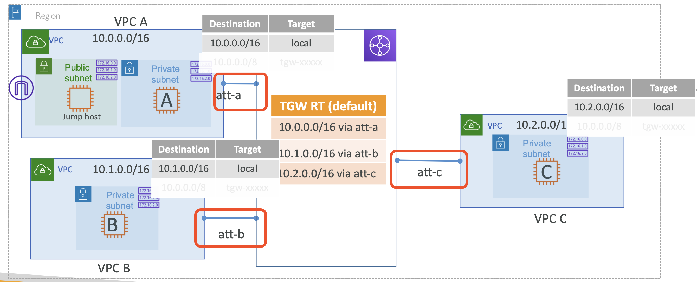
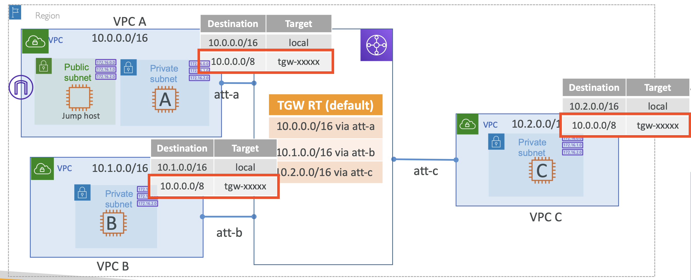

# Transit Gateway VPC attachments and Routing

## Transit Gateway attachments

- 주의 사항: CIDRs 범위가 겹치면 안됨
- Across region 지원

  

Attachment를 생성한 후에 이 Attachment에 연결할 특정 VPCs 혹은 VPN를 지정해야함 

 

_How does Transit Gateway - Full mesh connectivity - really work?_

### Transit Gateway Route tables

_: Transit Gateway default Route table gets associated with all the attachments_

  

- CIDR 범위가 겹치지 않는 VPC A, B, C
- 중간 집중된 transit gateway
  - Transit Gateway를 생성할 때 Default Route Table을 생성함
  - Default Route Table는 연결된 네트워크에서 트래픽이 어떻게 흘러야하는지 통괄함
- 세 개의 Attachment 생성

 

### Transit Gateway Route tables

_: Routes are propagated from VPC to Transit Gateway Route table_

VPC 를 생성하면, 이 Route Table에 연결되는 대상이 **자동으로** Rotue Table로 전파됨

  

<table>
<tr>
<th>Before Attached VPCs</th>
<th>After Attached VPCs</th>
</tr>
<tr>
<td>

<table>
<tr><th>TGW RT (default)</th></tr>
<tr><td></td></tr>
<tr><td></td></tr>
<tr><td></td></tr>
</table>

</td>
<td>

<table>
<tr><th>TGW RT (default)</th></tr>
<tr><td>10.0.0.0/16 via att-a</td></tr>
<tr><td>10.1.0.0/16 via att-a</td></tr>
<tr><td>10.2.0.0/16 via att-a</td></tr>
</table>

</td>
</tr>
</table>

 

- 이후, VPC A에서 흘러나온 트래픽이 Transit Gateway에 도착하면 다른 VPC로 이동

이때, VPC A 내부에서는 특정 트래픽이 Attachment A를 통해 Transit Gateway로 향한다는 것을 알까?

 
<pre>❗️여러 네트워크를 연결하고자 할 때, 반드시 Route를 설정해야하는데, 각 두 종단 모두 설정해야함</pre>

 

### VPC Route tables

_: Static routes needs to be added in the VPC Route tables_

각 VPC에서 Transit Gateway로 향하는 라우트를 VPC 내 Route Table에 설정해야함

→ **Static Route**

  

이를 위해, 반드시 각 VPC 내에 Route Entry를 설정해야함

For example, VPC A have to be set ...

<table>
<tr>
<th>Destination</th>
<th>Target</th>
</tr>
<tr>
<td>10.0.0.0/16</td>
<td>local</td>
</tr>
<tr>
<td>10.0.0.0/8</td>
<td>tgw-xxxxx</td>
</tr>
</table>

 
<pre>❗VPN / BGP를 연결하고자 한다면, VPN으로 부터 VPC Route table로 설정해야하는 Route가 전파됨(자동 설정됨)</pre>

모든 VPC 마다 위와 같은 Static Route 를 설정해야함

Static Route 설정이 끝났다면, 이제 Traffic이 외부 VPC로 흘러감

 

<pre><b>VPC A에서 IP <code>10.1.0.1</code> 으로 트래픽을 보내는 경우</b>를 살펴보면,

  

1️⃣ VPC A 내의 Route Table에서 지정된 규칙에 의해 <b><code>tgw-xxxxxx</code></b> 으로 향함
2️⃣ <code>tgw-xxxxxx</code> 로 도착하면 Transit gateway 의 Route Table에서 해당 트래픽이 향해야할 VPC B로 라우팅함
3️⃣ VPC B가 해당 트래픽을 받음
</pre>

---

# Hands On: Transit Gateway & VPCs with full routing

## Transit Gateway Lab – Three VPCs with full connectivity

  

### Lab setup

#### 1. Private Subnets 생성

3개의 VPCs 생성 후 각각 Private Subnets 생성. 

  

VPC A에는 Public Subnet 추가로 생성 (Host 넘기기 위함 - to jump host)

**VPC-A-Public Subnet - Route Table**

| Destination   | Target           |
|---------------|------------------|
| `10.0.0.0/16` | `local`          |
| `0.0.0.0/0`   | `igw-05412cd...` |

 

#### 2. Transit Gateway 생성

  

**Transit Gateway**
- Name: VPC-A-B-C-TGW
- Configure:
  - [x] DNS support: 인입되는 트래픽이 연결된 VPC connection에 대해 동일한 DNS로 Resolve 됨
  - [x] VPC ECMP support: 연결된 VPN를 사용하면서 중요한 워크로드를 수행중이라면 (dominating) 최대 50GB까지 대역폭을 차지(leverage)할 수 있음.
    - <pre>❗ECMP 없을 때 VPN 제한은 각 터널 당 1.25gbps 임</pre>
  - [x] Default route table association: Attachment 생성 시 Transit gateway의 Default Rotue Table에 연결됨
  - [x] Default route table propagation: Attachment 생성 시, Transit gateway의 Default Rotue Table에 전파
    - <pre><b>❗Association vs. Propagation</b>
      Transit Gateway(TGW) Association은 TGW가 별도의 라우트 테이블을 운영하는 것을 의미하고, Propagation은 라우트 테이블을 전파하는 것을 의미
      - Attachment: 단순한 연결(connection)일 뿐
      - Association: 각 Attachment는 하나의 TGW 라우트 테이블에 연결되어야 함. 하나의 TGW 라우트 테이블은 하나 또는 다수의 Attachment를 가질 수 있음
      - Propagation: 온프레미스는 BGP 및 Static Routing을 사용하고, VPC의 CIDR은 API를 통해 동적으로 전파. Propagation을 활성화하면 routes에 Propagation에 지정한 VPC의 CIDR이 자동으로 등록됨.
    </pre>
  - [x] Multicast support: 어떤 머신이든 트래픽을 multicast 그룹에 속한 다른 머신으로 보낼 수 있음

 

#### 3. VPC attachments 생성

_Transit Gateway을 위한 VPC attachments 생성_

  

**Attachment Type**:
- [x] VPC
- [ ] VPN
- [ ] Peering Connection
- [ ] Connect

VPC-A를 선택 후 Transit gateway 와 연결할 서브넷을 선택

(선택한 AZ에 대해서, 해당 서브넷 하위 모든 자원이 연결됨)

VPC-B, VPC-C에 대한 Attachment도 생성

그럼, Transit Gateway Route table에 각 Attachment의 Route Entry가 추가된 것을 확인할 수 있음

**Transit Gateway Route Table - Propagations**

| Attachment ID      | Resource type | Resource ID  | State      |
|--------------------|---------------|--------------|------------|
| tgw-attach-0a033.. | VPC           | vpc-0e0e1... | associated | 
| tgw-attach-0817b.. | VPC           | vpc-05064... | associated | 
| tgw-attach-0f964.. | VPC           | vpc-09033... | associated | 

**Transit Gateway Route Table - Routes**

| CIDR        | Attachment                          | Resource Type | Route Type | Route State |
|-------------|-------------------------------------|---------------|------------|-------------|
| 10.0.0.0/16 | tgw-attach-0a033.. \| vpc-0e0e1...  | VPC           | propagated | active      |
| 10.1.0.0/16 | tgw-attach-0817b.. \|  vpc-05064... | VPC           | propagated | active      |
| 10.2.0.0/16 | tgw-attach-0f964.. \| vpc-09033...  | VPC           | propagated | active      |

But, 하지만 아직 연결이 되지 않음 → Subnet의 route table 설정이 안되어 있음

 

#### 4. Subnet의 route table 수정

  

모든 Private subnet의 route table 수정

Transit gateway attachment 으로 향할 `10.0.0.0/8` 추가

 

#### 5. VPC A → VPC B,C using Private IP

VPC A에 연결 -> EC2-A에 SSH 접속 -> EC2-B나 EC2-C의 Private IP로 ping 시도 

EC2 생성 시, Security Group 설정 필요 

