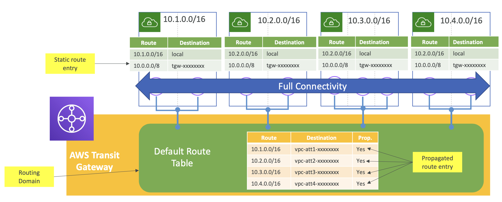
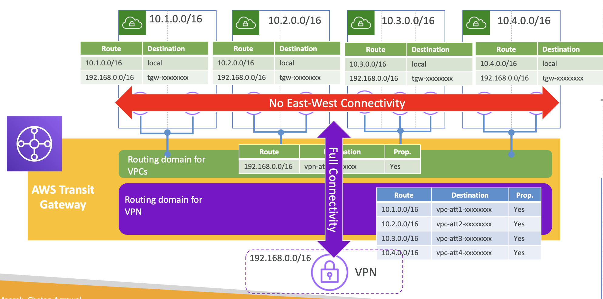
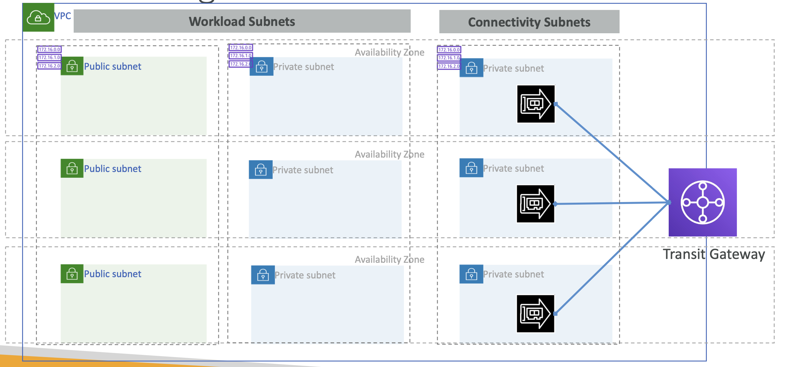
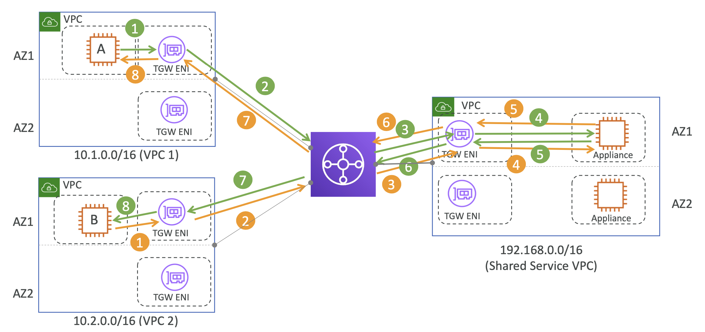
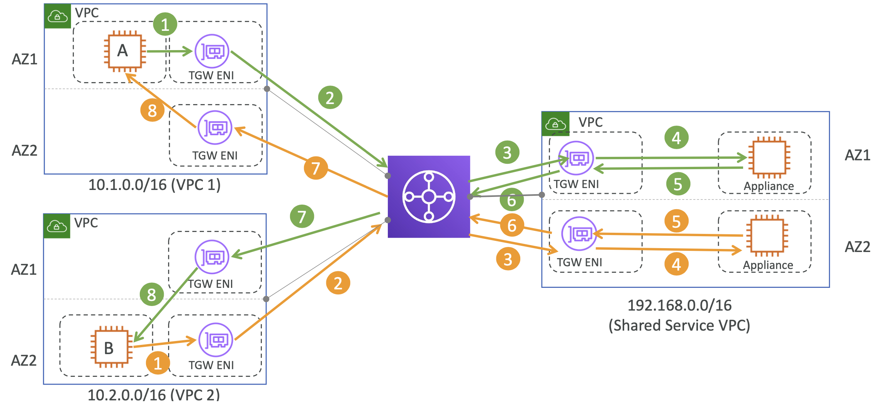
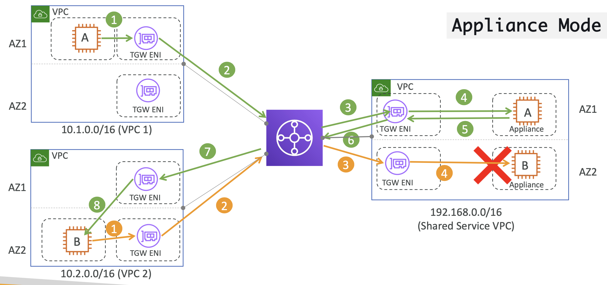
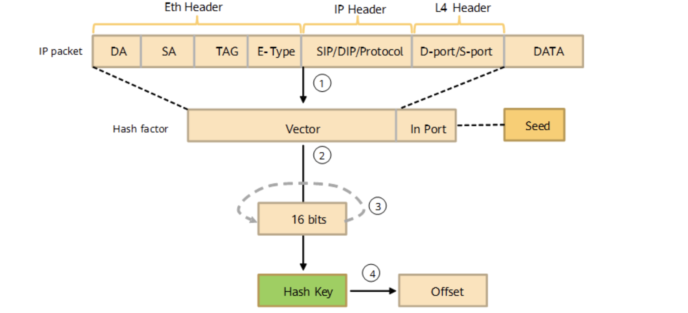
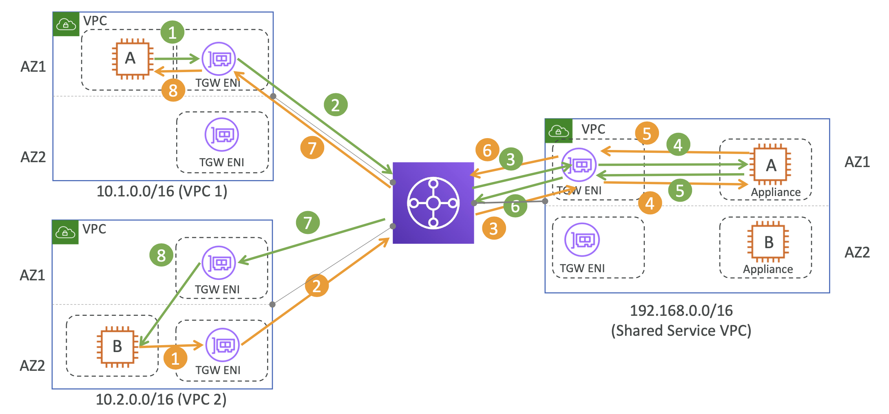

# Transit Gateway VPC Network Patterns

## Transit Gateway - VPC Network patterns

### Flat network

  

모든 VPCs 들이 Transit Gateway에 연결되어 각 VPC에 연결할 수 있는 상태 

### Segmented network

  

모든 VPCs 들이 특정 VPN에만 연결될 목적으로, 
각 VPC 하위의 Subnet Route Table에 다른 VPC로 이동할 수 있는 CIDR를 등록하지 않음

VPC A에서 192.168.0.0/16 하위 IP를 요청하면 VPN으로 이동할 수 있지만,
VPC B에 해당하는 10.2.0.0/16 으로 이동할 경로는 어디에도 정의되어 있지 않음

 

# Transit Gateway AZ considerations

## VPC & Subnets design for Transit Gateway

오직 하나의 AZ 하위 Subnet 만 Transit Gateway에 연결할 수 있음

  

> 보통 다른 서비스에서는 ENI를 생성하면, 해당 VPC에 있는 모든 서브넷이 해당 ENI를 통해 통신할 수 있었는데, Transit Gateway는 예외임

### Availability zone considerations

- VPC를 Transit Gateway에 연결할 때, Transit Gateway가 VPC 서브넷의 리소스로 트래픽을 라우팅할 수 있도록 하나 이상의 가용 영역(AZ)을 활성화해야 함
- 각 가용 영역을 활성화하려면 정확히 하나의 서브넷을 지정해야 함 (보통 **`/28`** 범위 사용 - 워크로드 서브넷을 위한 IP 절약을 위함)
- Transit Gateway는 지정된 서브넷에서 하나의 IP 주소를 사용하여 네트워크 인터페이스를 생성함
- 가용 영역이 활성화되면, 지정된 서브넷뿐만 아니라, 해당 가용 영역 내의 모든 서브넷으로 트래픽을 라우팅할 수 있음
- ⭐️**Transit Gateway Attachment가 없는 가용 영역에 위치한 리소스는 Transit Gateway에 접근할 수 없음**

Transit Gateway 는 주어진 AZ에 transit gateway Attachment를 생성하면,
해당 AZ에서는 오직 그 Attachment를 통해서만 통신할 수 있음

Transit Gateway Attachment를 특정 AZ(AZ-A)에서 생성하면,
**같은 AZ(AZ-A)**에 있는 서브넷만 해당 Attachment를 통해 Transit Gateway와 통신할 수 있음.

다른 AZ(AZ-B, AZ-C)에 있는 서브넷은 해당 Attachment를 사용할 수 없음.

Transit Gateway Attachment를 생성하면 특정 AZ의 특정 서브넷과 연결됨.

여러 AZ에 있는 서브넷이 Transit Gateway와 통신할 수 있도록 하려면,
각 AZ의 서브넷에 대해 별도의 Transit Gateway Attachment를 생성해야 함

 

# Transit Gateway AZ affinity & Appliance mode

## Transit Gateway – AZ Affinity

### CASE1. Source 와 Destination 이 동일한 AZ에 위치할 때

  

Transit Gateway attempts to keep the traffic in the originating Availability Zone until it reaches its destination

Transit Gateway는 도착지에 갈 때까지 출발 AZ 내에서 트래픽이 유지될 수 있도록 시도함.

**→ AZ Affinity**

 

### CASE2. Source 와 Destination 이 다른 AZ에 위치할 때

  

(🟢❽)8번 VPC 2 내 AZ1 서브넷/인스턴스가 없기 때문에 AZ2 서브넷에 위치한 인스턴스로 트래픽 전송

이후 인스턴스 B는 응답 트래픽을 같은 AZ의 ENI로 전송해서 Transit Gateway로 보냄

이 때, Transit Gateway는 'AZ Affinity' 특성을 갖고 있기 때문에 받은 트래픽을 Shared Service VPC 의 AZ2  서브넷으로 전송 (🟠❸)

→ This causes **Asymmetric Routing**

Stateless 한 서버를 가지고 있다면 문제가 안되지만, 실제론 Stateful 한 경우가 대부분임

 

### CASE3. Transit Gateway – Stateful Appliance

Source 와 Destination 이 다른 AZ에 위치할 때 + Stateful 한 Appliance Service를 가진 경우?

  

트래픽이 `CASE2`와 동일하게 흐름.

이 때, Appliance A 인스턴스로 가야할 트래픽이 Appliance B로 가면서, Stateful한 서버 특성 상 문제가 발생 (트래픽이 드롭되는 등 ...)

→ 해결법: **Appliance Mode Enabled**

 

### CASE4. Transit Gateway – Stateful Appliance + Appliance Mode Enabled

<b><small>⭐️ 중요한 시나리오</small></b>

Source 와 Destination 이 다른 AZ에 위치할 때,
Stateful 한 Appliance Service를 가진 경우 Appliance Mode를 활성화 시켜 상태 관리에 대한 문제를 해결할 수 있음

Appliance mode가 활성화되면,
해당 플로우를 연결시키기 위해 Transit Gateway가 **flow hash** 알고리즘을 사용해서 Appliance VPC 내의 단일 네트워크 인터페이스를 선택함.

<pre><b>Flow Hash Algorithm</b>
🔗 <a href="https://www.linkedin.com/pulse/hash-flow-algorithm-aws-network-load-balancer-nlb-in-depth-mishra/">Hash Flow Algorithm in AWS Network Load Balancer (NLB): An In-Depth Overview</a>

A hash algorithm converts fixed-length or variable-length input into fixed-length output. The output is a hash value. This conversion is a compression mapping. Generally, the hash value space is far less than the input space. Different inputs may be converted into the same output, and a hash value cannot be used to uniquely identify an input value. Simply put, the hash algorithm compresses a message of a certain length into a fixed-length message digest.
  
</pre>

  

그래서 Transit gateway가 다시 트래픽을 받으면 (🟠❷), 전달했던 해당 ENI로 반환함 

> AWS SDK, CLI: Use --options ApplianceModeSupport=enable to the [create-transit-gateway-vpc-attachment](https://docs.aws.amazon.com/cli/latest/reference/ec2/create-transit-gateway-vpc-attachment.html) or [modify-transit-gateway-vpc-attachment](https://docs.aws.amazon.com/cli/latest/reference/ec2/modify-transit-gateway-vpc-attachment.html) command.

