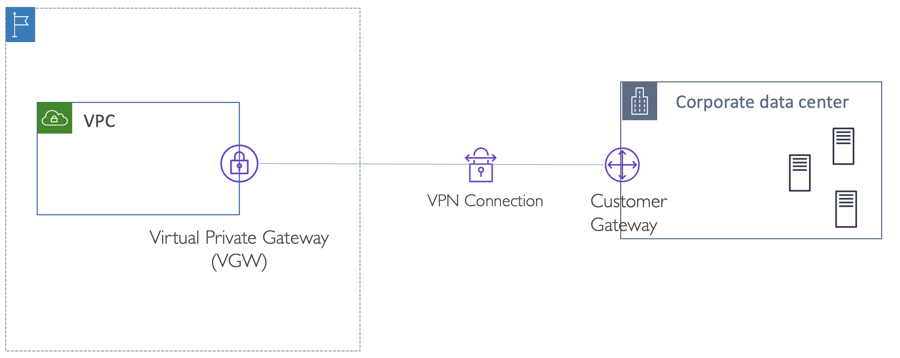

# Transit Gateway VPN Attachment

<table>
<tr>
<th>Single Site-to-Site VPN Connection over Virtual Private Gateway (VGW)</th>
<th>Connecting multiple branch offices over Site-to-Site VPN</th>
<th>Connecting multiple VPCs over Site-to-Site VPN connections</th>
</tr>
<tr>
<th>Simplify Site-to-Site VPN network with Transit Gateway 1</th>
<th>Simplify Site-to-Site VPN network with Transit Gateway 2</th>
<th>Accelerated Site-to-Site VPN network with Transit Gateway</th>
</tr>
<tr>
<td colspan="3">모든 지점마다 연결을 따로 하지 않고 Transit Gateway를 통해 단순화할 수 있음</td>
</tr>
<tr>
<td></td>
<td></td>
<td></td>
</tr>
<tr>
<td></td>
<td>

더 많은 데이터 센터가 있어도, 하나의 Transit Gateway에 연결해서 여러 연결을 만들 수도 있음
</td>
<td></td>
</tr>
</table>

> **AWS global accelerator**
>
> : AWS의 엣지 로케이션과 가장 가까운 사용자 게이트웨이로 부터 트래픽을 라우팅하기 위해 사용
>
> Transit Gateway VPN Attachment와 함께 사용해야함. VGW 지원 안함

 

## Limited n/w throughput with multiple VPN Connections over VGW

VPN과 Transit Gateway를 함께 사용했을 때의 장점은, 총 합산한 대역폭을 증가시킬 수 있음

  

위와 같이 연결하면 두 개의 VPN Connection 를 동시에 사용해서 대역폭을 늘릴 수 있을 것 같지만, 
실제로는 VGW의 최대치가 1.25 Gbps 이기 때문에 불가능 함

> - VPN 연결의 처리량(throughput): 1.25 Gbps
> - Virtual Private Gateway은 ECMP를 지원하지 않음

 

## ECMP over Transit Gateway & Site-to-Site VPN for higher aggregate throughput

여러 VPC 연결을 가지며, 그 끝에 Transit Gateway이 연결시킴

  

- TGW – VPN connection에 BGP 와 ECMP를 활성화할 수 있음.
  - Dynamic Routing 와 ECMP를 활성시킬 수 있고, ECMP와 함께 BGP를 챙겨야함
  - 설정을 하게되면, AWS <-> On-premises (양방향)으로 흐르는 트래픽이, 두 연결을 통틀어, 로드 밸런싱 되는 장점이 있음
- 위 네트워크 아키텍처의 효과적인 대역폭은 5 Gbps가 될 것임
  - 2 VPN connection x 2 Tunnels per connection x 1.25 Gbps/tunnel = ~5 Gbps
  - 모든 VPN connection은 두 개의 IPsec tunnels을 가지고 있는데, 모든 터널은 최대 대역폭인 1.25 Gbps를 가짐
- 플로우 당 대역폭은 여전히 1.25Gbps 
  - 가령 100GB 파일을 TCP 로 전송한다고 하면, 각 터널들에 1.25Gbps로 제한되어 전송될 것

 

> **MED (Multi Exit Discriminator)**
> : A metric used to influence the path selection when multiple entry points exist within an autonomous system (AS)
> - BGP MED(또는 MULTI_EXIT_DISC)는 비전이적 속성으로, 인터넷 전체에 전파되지 않고 인접한 AS(Autonomous System)에만 전파.
> - MED 속성에는 메트릭 - 출구점을 결정하는 다른 모든 요소가 동일한 경우, 메트릭이 가장 낮은 출구점이 선호됨
> 
> **AS** (Autonomous System)
> : A list of AS numbers a route has traversed, and ASN (Autonomous System Number) is a unique identifier assigned to each AS, essentially indicating which network a route belongs to
> - **AS Path**는 BGP 경로 속성 중 하나로, 해당 목적지 AS까지 갈 때 경유되는 AS 번호들을 나타냄
>
> **ASN** (Autonomous System Number)
> - 각 AS가 갖는 고유한 공식 번호. 
> - ASN는 1에서 65534 사이의 고유한 16비트 숫자 또는 131072와 4294967294 사이의 32비트 숫자
> 
> [Cloudflare - What is an autonomous system? | What are ASNs?](https://www.cloudflare.com/learning/network-layer/what-is-an-autonomous-system/)

 

## ECMP over Transit Gateway with dual VPN

  

두 연결에 ECMP를 활성화할 수 있음

데이터센터가 `192.158.0.0/24` 대역을 갖는다고 할 때,
절반인 `192.158.0.0/25` 는 첫 번째, 절반은 `192.158.0.0/24`는 두 번째 연결로 분산될 수 있음

만약, 한 VPN 연결에 장애가 생기거나 unhealthy 상태면 다른 쪽으로 라우팅 될 것임

**기억할 것**
- VPN 커넥션을 Transit Gateway와 함께 사용할 때 ECMP를 사용할 수 있고, 이 때 더 높은 대역폭을 가질 수 있음
- 단, 반드시 BGP 라우팅을 설정한 상태여야함

 