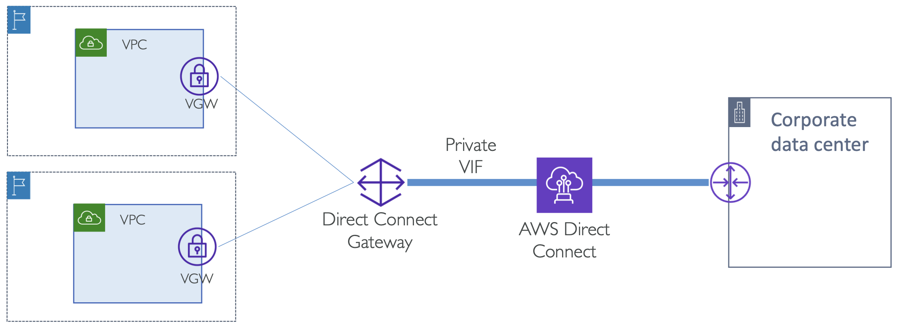
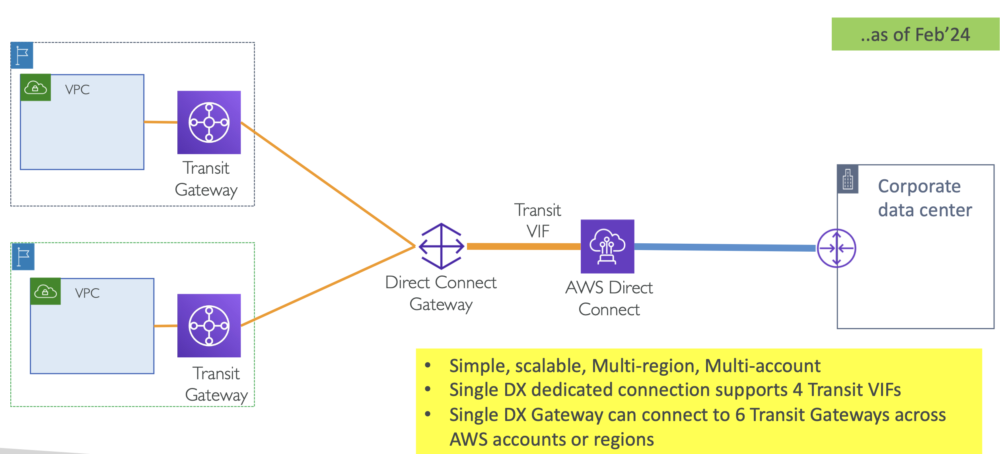
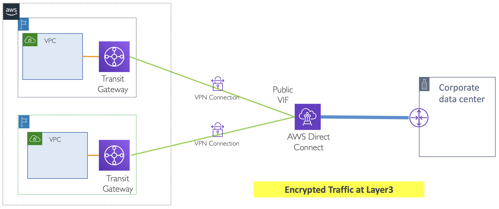

# Transit Gateway & Direct Connect

Transit Gateway를 사용하지 않았을 때 Direct Connect 연결

  

- Private VIF를 통한 Direct Connect Gateway 사용 
  - AWS Direct Connect는 Private VIF와 연결되고, 또 다른 리전에 위치한 여러 VPC들과 연결될 수도 있음
- 현재 최대 20개의 VPC까지 연결할 수 있음 (~25년 2월) 

 

> - **Component**: Virtual private gateways per AWS Direct Connect gateway
> - **Quota**: **20**
> 
> [🔗 AWS Direct Connect quotas](https://docs.aws.amazon.com/directconnect/latest/UserGuide/limits.html)

 

이 제한을 해결할 수 있는 방법이 바로 Transit Gateway

Private VIF 대신 **Transit VIF**를 사용해야 함

  

 

- Simple, scalable, Multi-region, Multi-account
  - Transit Gateway는 수 백, 수 천 개의 VPC와 연결될 수 있음
- Direct Connect Gateway는 AWS Direct Connection을 위한 Transit VIF를 최대 4개 까지 생성할 수 있음
- Direct Connect Gateway는 Transit Gateway와 최대 6개 까지 연결할 수 있음 (~2025년 2월)
  - 즉, 최대 24개의 Transit Gateway와 연결할 수 있음 

 

> - **Component**: Transit gateways per AWS Direct Connect gateway
> - **Quota**: **6**
>
> - **Component**: Transit virtual interfaces per AWS Direct Connect dedicated connection.
> - **Quota**: **4**
>
> [🔗 AWS Direct Connect quotas](https://docs.aws.amazon.com/directconnect/latest/UserGuide/limits.html)

 

## IPSec VPN to Transit Gateway over Direct Connect

Public VIF는 모든 AWS public IP들에 접근할 수 있도록 함

  

Direct Connect는 모든 Transit Gateway와 연결된 IPSec VPN 연결할 수 있음

 

