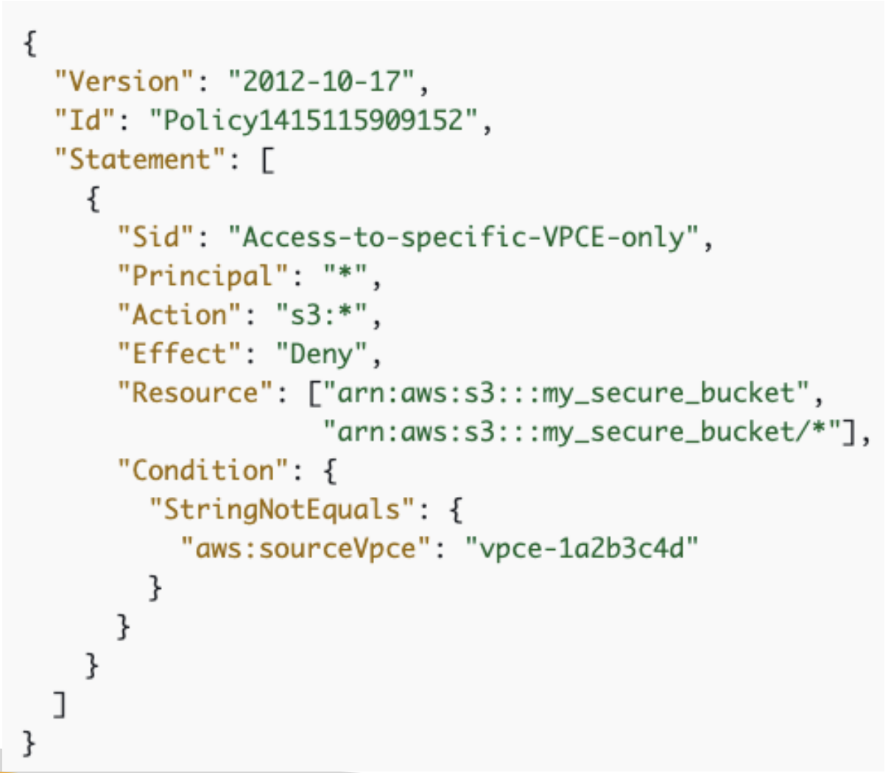
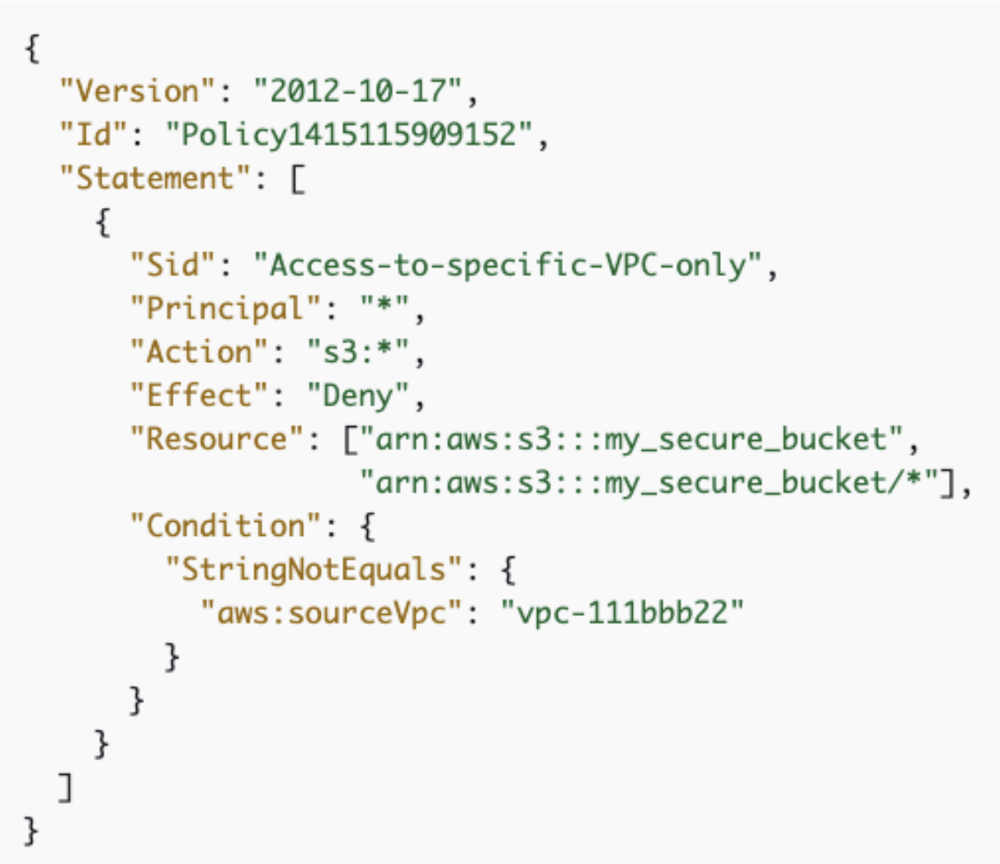
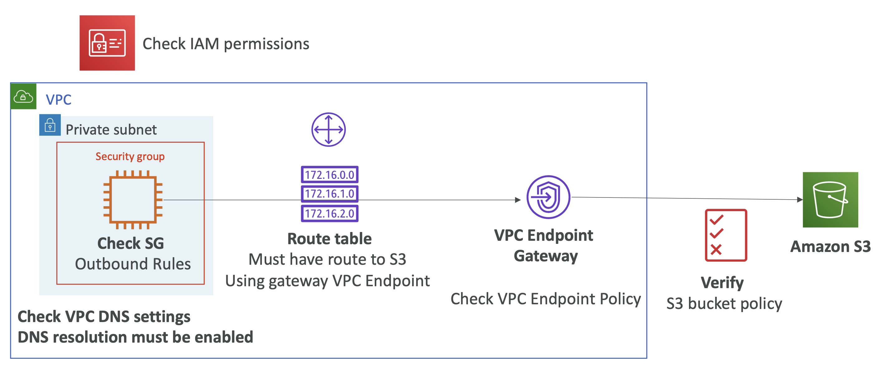

# VPC Gateway endpoint and S3 policies

Network Connectivity 와는 관련이 없지만, 시험에 출제되는 중요한 내용

```
+----------------- VPC ----------------+
|                                      |
|                                      |
|      +====== IAM =====+        2️⃣ VPCE Policy          3️⃣S3 Policy
|      ‖                ‖       +---------------+          +------+
|      ‖  EC2 Instance  ‖-------+ VPC Endpoints +--------->|  S3  |
|      ‖                ‖       +---------------+          +------+
|      +================+              |
|        1️⃣ IAM Policy                 |
|                                      |
+--------------------------------------+
```

- 1️⃣ **IAM Policy**: Grants permission to access S3.
- 2️⃣ **VPCE Policy**: Establishes a network connection to S3.
- 3️⃣ **S3 Policy**: Defines who can access the S3 bucket.
  - 오직 특정 VPC Endpoint 으로부터의 유입만 허용하도록 제어 가능


## VPC Endpoints Policy & S3 policy

- S3 버킷 정책은 아래와 같은 조건을 가질 수 있음
  - Condition: `"aws:sourceVpce": "vpce-1a2b3c4d"` 특정 VPC Endpoint에서의 유입만 허용 (more secure)
  - Condition: `"aws:sourceVpc": "vpc-111bbb22"` 특정 VPC 에서의 유입만 허용
  - `"aws:sourceVpce"`, `"aws:sourceVpc"` 조건에 특정 VPCE, VPC를 나열해서 화이트 리스트로 접근 제어
- ⭐️`"aws:sourceVpc"` 조건은 VPC Endpoint 에서만 사용 가능.
  - VPC Endpoint 가 여러개 있고 모든 Endpoint 에 대해 S3 버킷에 대한 접근을 제어하고 싶을 때 사용.
  - VPC에 VPC Endpoint가 없다면 적용되지 않음.
- S3 버킷 정책은 오직 특정 Public IP 주소나 Elastic IP 주소로부터의 유입만 허용할 수 있음. 
   - **Private IP 주소로부터의 유입은 제어 불가**. 
- `"aws:SourceIp"` 조건은 VPC Endpoint 에서는 사용 불가. 


## Example S3 bucket policies

<table>
<tr>
<th>Single VPC Endpoint</th>
<th>Multiple VPC Endpoints</th>
</tr>
<tr>
<td>

<br><br>

- S3 bucket policy to restrict to one specific VPC Endpoint

</td>
<td>

<br><br>

- S3 bucket policy to restrict to an entire VPC (multiple VPC Endpoints)

</td>
</tr>
</table>


## VPC Endpoint Policies for S3 Troubleshooting

<br><br>

1. **Check Security Group**: EC2 Security Group에 S3 prefix list를 위한 Outbound Rules에 있는지 확인
2. **Check VPC Endpoint Policy**: 특정 S3 버킷에 대한 VPCE 정책이 있고, 해당 정책이 S3에 대한 Action을 Allow 하는지 확인
3. **Check having Route Table of the private subnet**: private subnet의 Route Table에 prefix list를 반드시 갖고 있어야 함
4. **Check Other Options**
   1. **Check VPC DNS settings**: DNS resolution 가 반드시 enable 이어야 함.
   2. **S3 bucket policy**: S3 버킷 정책에 특정 VPC Endpoint 접근을 허용하고 있는지 확인

