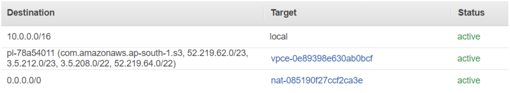
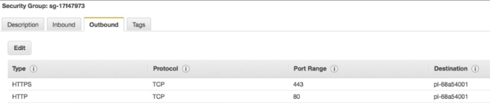
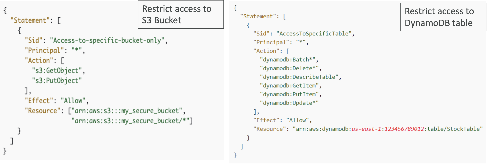

# VPC Gateway Endpoints

- **Gateway Endpoint**는 S3 및 DynamoDB와 같은 AWS 서비스에 대한 Private Network 연결을 제공
- Gateway VPC Endpoint를 통할 S3 및 DynamoDB 트래픽을 라우팅하기 위해 라우트 테이블을 수정해야 함
- Amazon S3 엔드포인트를 생성하면 VPC에 Prefix List가 생성됨
  - 가령, S3 prefix list에는 S3 서비스 엔드포인트를 위한 IP 주소들을 포함. S3 서비스는 굉장히 방대하기 때문에 수많은 IP 주소들이 존재할 것.
  - Prefix List: AWS가 관리하는 IP 주소의 컬렉션
- Prefix List는 Amazon S3에서 사용하는 IP 주소의 컬렉션
- Prefix List는 `pl-xxxxxxxx` 형식으로 표시됨, 서브넷 라우팅 테이블 및 보안 그룹에서 사용 가능한 옵션으로 사용됨

  

 

## VPC Gateway Endpoint

- Prefix 리스트는 Security Group Outbound Rule 에 추가되어 있어야 함 ⭐️
  (Security Group Outbound Rule에 디폴트 `Allow All` 규칙이 없을 경우)

  

 

## VPC Endpoint Security
- Endpoints는 VPC 리소스에 대한 더 세분화된 접근 방식을 허용 (VPC 피어링 연결을 통한 넓은 범위의 접근 방식)
- VPC 엔드포인트를 통한 S3 접근은 버킷 정책 및 엔드포인트 정책을 사용하여 보안 가능
  - 가령, IAM와 비슷한 방법으로 모든 S3이 아닌 특정 S3 버킷만 액세스 가능하도록 설정하여 접근 제어 가능
- **VPC Endpoint 정책**
  - VPC 엔드포인트에 할당된 IAM 정책
  - 디폴트 정책은 AWS 서비스에 대한 전체 제어 허용

 

## VPC Endpoint Policy

- VPC 엔드포인트 정책은 VPC 엔드포인트에 대한 액세스를 제어하는 IAM 정책

  

- 좌: Resource에 특정 버킷 리스트 나열 + 어떤 Action을 실행할지 리스트 
  - → 나열된 버킷의 특정 액션만을 허용(Effect=Allow)하는 정책
- 우: Resource에 특정 리소스 지정 + 어떤 Action을 실행할지 리스트 
  - → 특정 버킷의 특정 액션만 허용(Effect=Allow)하는 정책

<i><small>→ 시험 중요 ⭐️⭐️</small></i>

또 다른 방식으로는 S3 Policy를 사용하여 접근 대상을 제어할 수 있음

## Resource based policy - S3 bucket policy

- S3 버킷 정책을 사용하여 VPC 엔드포인트를 통한 액세스 제어 가능

  

트래픽이 특정 VPC 엔드포인트를 통해 오지 않는다면 모든 것을 거부하는 정책

하지만, DynamoDB는 Resource 기반 정책을 지원하지 않음.

