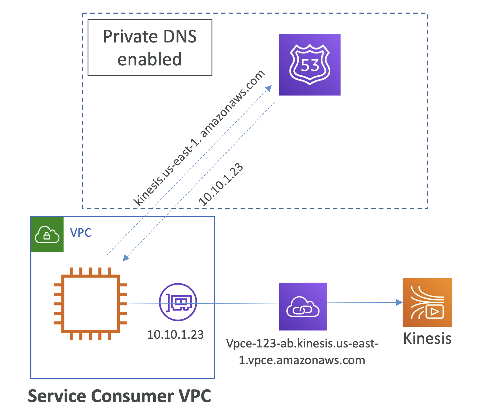
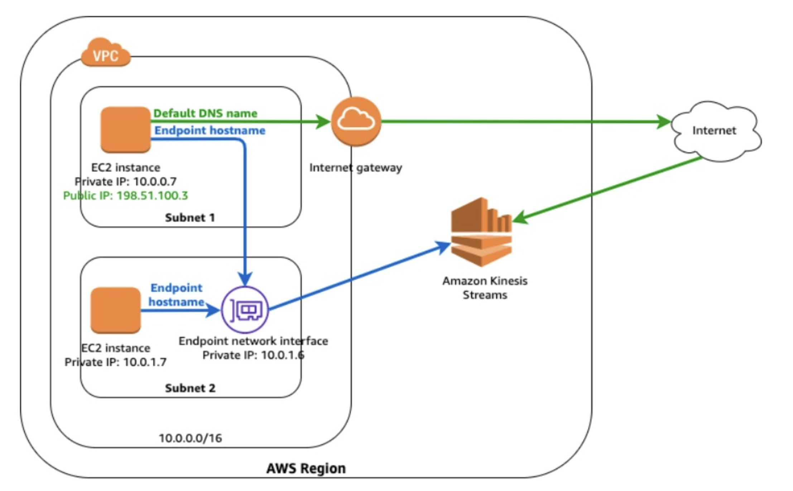
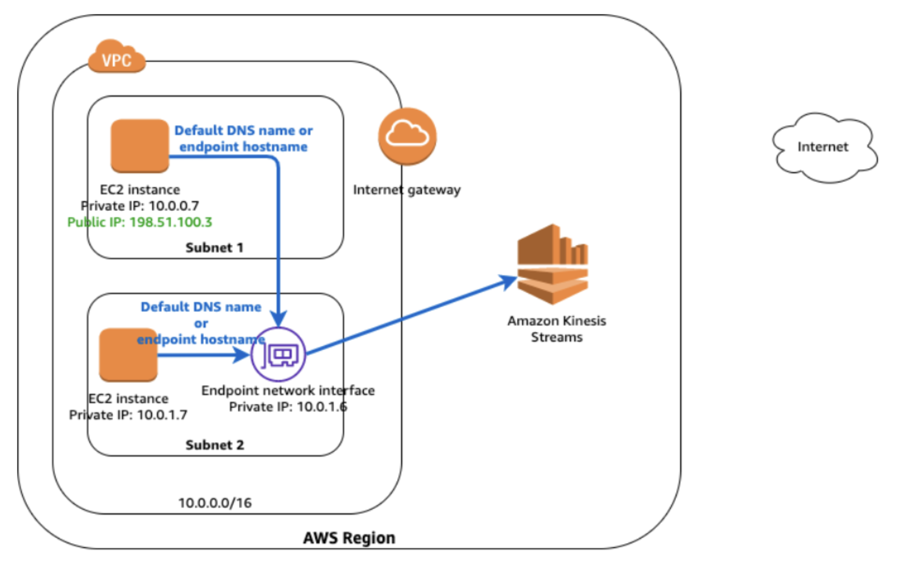

# VPC interface endpoint DNS

## VPC Interface Endpoint

- Private endpoint interface hostname을 가지는 **프로비저닝된 ENI**
- Interface endpoint의 private DNS 설정
    - 서비스의 public hostname은 private endpoint interface hostname으로 resolve됨
    - VPC 설정: **`Enable DNS hostnames`** 와 **`Enable DNS Support`** 옵션이 반드시 '**true**’ 로 설정되어 있어야 함

<pre><b>Athena 예시:</b>
- <b>Regional</b>: <code>vpce-0b7d2995e9dfe5418-mwrths3x.athena.us-east-1.vpce.amazonaws.com</code>
- <b>Zonal</b>: <code>vpce-0b7d2995e9dfe5418-mwrths3x-us-east-1a.athena.us-east-1.vpce.amazonaws.com</code>
- <b>Zonal</b>: <code>vpce-0b7d2995e9dfe5418-mwrths3x-us-east-1b.athena.us-east-1.vpce.amazonaws.com</code>
- <b>Service DNS</b>: <code>athena.us-east-1.amazonaws.com (private DNS name)</code>
  - Private DNS가 enabled 라면 Service DNS를 사용할 수 있고, VPC 내부에서 프로비저닝됨 ⭐️
</pre>

- Private DNS가 활성화되어 있으면, consumer VPC는 endpoint 서비스에 접근할 때 Service의 default DNS인 `e.g ec2.us-east-1.amazonaws.com`을 사용할
  수 있음.
  endpoint specific DNS인 e.g `vpce-12345-ab.ec2.us-east-1.vpce.amazonaws.com`을 사용할 필요가 없음

SQS 예시에서 Private DNS name 으로 `sqs.ap-south-1.amazonaws.com` 을 확인했음.
이는 Mumbai region의 SQS 서비스에 대한 **Public DNS name**임.
이 DNS name은 VPC endpoint service 내부의 **Private DNS**로 resolve 됨.
결국 VPC 내부의 ENI의 IP 주소로 resolve 됨.

nslookup 명령어로 확인해보면, VPC endpoint service의 private DNS name으로 resolve 됨.

```bash
[ec2-user@ip-10-10-1-49 ~]$ nslookup sqs.ap-south-1.amazonaws.com
Server:      10.10.0.2
Address:     10.10.0.2#53

Non-authoritative answer:
Name:        sqs.ap-south-1.amazonaws.com
Address:     10.10.1.26
```

<br>

## VPC Interface Endpoint DNS

### How Private DNS works?

<br><br>

AWS 는 Kinesis service endpoint에 대한 private hosted zone 을 생성.

Private DNS가 enabled 라면 해당 존은 VPC에 연결되어 있음.

이 때, Private DNS인 `kinesis.us-east-1.amazonaws.com`로 API 요청을 하면,
private hosted zone에서 **ENI의 private IP**로 resolve 됨.

그래서 Kinesis Service endpoint에서 이 ENI로 private하게 연결할 수 있게 됨.

<br>

### VPC Interface Endpoint - Private DNS disabled

<br><br>

- **Subnet 1** → `kinesis.us-east-1.amazon.com` -> Via **internet**
- **Subnet 1** → `vpce-123-ab.kinesis.us-east-1.vpce.amazonaws.com` -> Via **Interface endpoint**
- **Subnet 2 (No IGW)** → interface-endpoint의 DNS를 통한 접근만 가능

### VPC Interface Endpoint - Private DNS disabled

<br><br>

- **Subnet 1, 2** → `kinesis.us-east-1.amazon.com` -> Via **Interface endpoint**
- **Subnet 1, 2** → `vpce-123-ab.kinesis.us-east-1.vpce.amazonaws.com` -> Via **Interface** endpoint

항상 동일한 경로로 Kinesis에 접근

<br>

### VPC endpoints DNS Summary

- **Private DNS enabled**
    - 서비스의 public hostname은 private endpoint interface hostname으로 resolve됨
    - AWS 서비스 (e.g SQS, Kinesis 등)의 경우, AWS는 Private Hosted Zone을 생성하고 VPC에 연결함
    - Example: Private DNS가 enabled 라면, consumer VPC는 endpoint 서비스에 접근할 때 Service의 default
      DNS인 `e.g.) ec2.us-east-1.amazonaws.com`을 사용할 수 있음.
      endpoint specific DNS인 `e.g.) vpce-12345-ab.ec2.us-east-1.vpce.amazonaws.com`을 사용할 필요가 없음
- VPC 설정: **`Enable DNS hostnames`** 와 **`Enable DNS Support`** 옵션이 반드시 '**true**’ 로 설정되어 있어야 함

<br><hr><br>

# Accessing VPC interface endpoint from remote network

## VPC Interface Endpoint - Remote Network

An Interface endpoint can be accessed through

- Direct Connect
- AWS Managed VPN
- VPC peering connection

- 커스텀한 Route53 Private Hosted Zone에 interface endpoint를 연결되어 있으면,
  피어링된 VPCs는 interface endpoint의 private DNS를 resolve할 수 있음
- On-premise DNS resolution을 위해 DNS queries를 custom Route53 Resolver로 전달해야 함
- Reference: https://d1.awsstatic.com/whitepapers/building-a-scalable-and-secure-multi-vpc-aws-networkinfrastructure.pdf

<br><br>