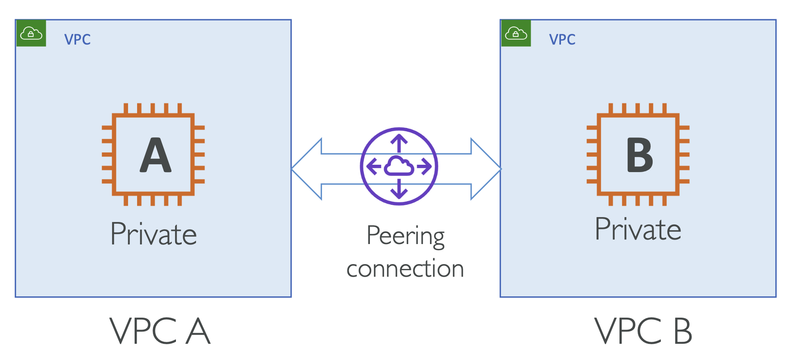

# VPC Peering

두 개의 서로 다른 VPC A 와 B가 존재하고, 각각 Private EC2 A와 B 인스턴스를 하나씩 가짐.

이 때 인스턴스 A와 B 만을 private 하게 연결하고자 함.

  

이 때 VPC Peering을 사용.

- 두 VPC를 AWS 네트워크를 통해 프라이빗하게 연결
- 마치 동일한 네트워크에 있는 것처럼 통신 가능
- 피어링된 VPC는 동일한 AWS 리전일 수도 있고, 다른 리전일 수도 있음
- 서로 다른 계정의 VPC도 피어링 가능

**Caveats:**

- VPC CIDRs 는 겹치면 안됨
- 각 VPC의 Subnet 라우팅 테이블에 피어링 연결 정보를 추가해야 함

