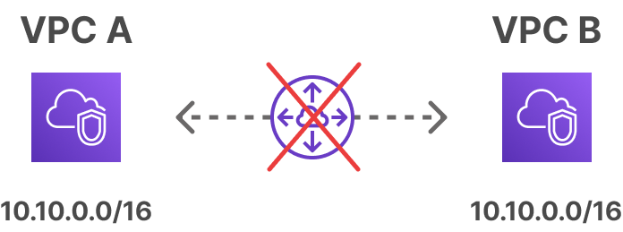
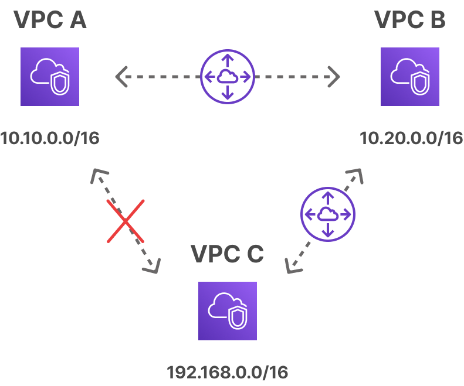
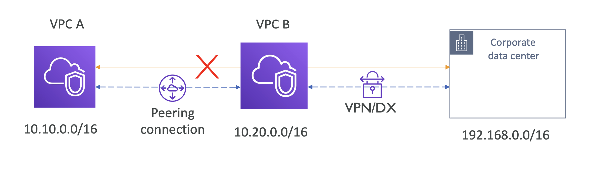
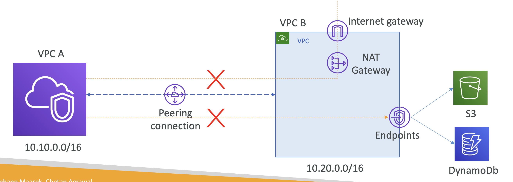

# VPC Peering Limitations

#### 1️⃣ CIDR 범위가 겹치면 안됨

  

#### 2️⃣ VPC 피어링은 전이되지 않음

  

- 각 VPC 간에 설정해야 함
- `VPC A ↔ VPC B`, `VPC B ↔ VPC C` 설정한다고 해서 `VPC A ↔ VPC C` 가 통신되지 않음

#### 3️⃣ 두 VPC 간 오직 1개의 VPC 피어링 연결만 설정 가능

#### 4️⃣ VPC 당 최대 125개의 VPC 피어링 연결 가능

 

### 1. VPC Peering invalid scenarios - VPN or DX

_**1.1. VPN 혹은 Direct Connect에서 on-premises 네트워크와 연결 불가능**_

중간에 Proxy를 두는게 아닌 이상, VPC 피어링 연결을 통해 VPN 혹은 Direct Connect를 통해 연결된 네트워크로 연결할 수 없음

  

 

### 2. VPC Peering invalid scenarios - IGW

_**1.2. 다른 VPC에서 Internet Gateway를 통해 인터넷에 연결되어 있는 경우**_

  

- VPC 와 피어링된 Internet Gateway 를 통해 인터넷에 접근하는 시나리오 X
- VPC 와 피어링된 NAT Gateway → Internet Gateway 를 통해 인터넷에 접근하는 시나리오 X
- VPC Endpoint을 통해 S3 / DynamoDB에 접근하는 시나리오 X

VPC Endpoint: VPC와 AWS 서비스 사이의 Private Connectivity 제공 - S3, DynamoDB 등에 접근 가능

