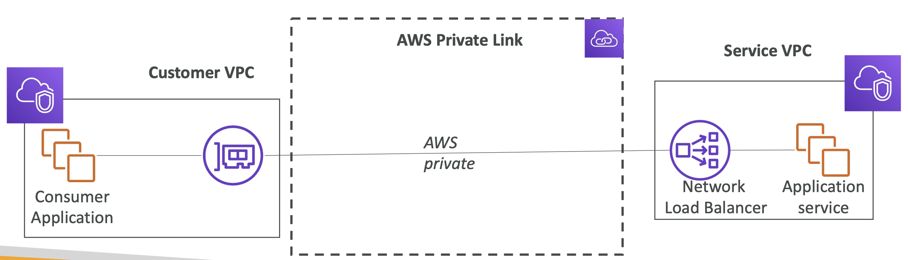
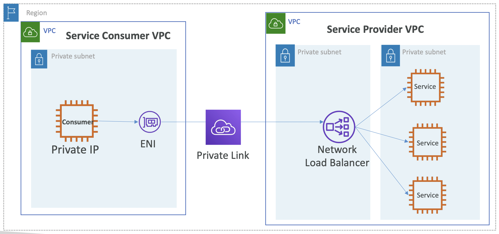
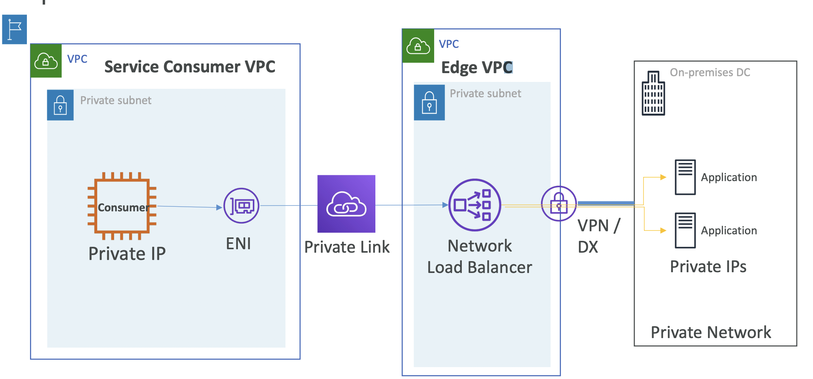
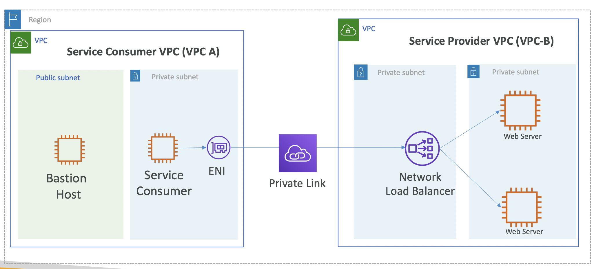

# VPC Interface endpoint – Accessing Customer service

## AWS PrivateLink (VPC Endpoint Services)

<br><br>

- 수천 개의 VPC(자신의 계정 또는 다른 계정)에 서비스를 노출하는 가장 안전하고 확장 가능한 방법
  - **vs. VPC Peering**: VPC Peering은 단 하나의 연결만을 지원
- VPC peering, internet gateway, NAT, route tables 등 설정 필요없음
- **네트워크 로드 밸런서(Service VPC) 혹은 ENI(Customer VPC)가 필요**
  - Network load balancer - Service VPC 사용 시
  - ENI - Customer VPC 사용 시
- **High Availability**
  - NLB / ENI가 여러 AZ에 있다면 → Fault Tolerant! (장애에 견딜 수 있음)

<br><hr><br>

# VPC PrivateLink architecture

<br><br>

- Network Load Balancer를 통해 Consumer VPCs에 노출(Expose) 됨
- Private link와 연결된 Network Load Balancer를 통해 수천 개 이상 여러 VPC에 노출할 수 있음.

<br><br>

- AWS 와 연결될 통로(VPN/DX)로 연결되어 있으면, 온프레미스 네트워크에 있는 애플리케이션이 있을 수도 있음 

<br><hr><br>

# Hands On: VPC PrivateLink to access customer or 3rd party services

<br><br>

### 📌 1. 사전 준비: 

`httpd` 웹 서버가 설치된 EC2 AMI 생성.

VPC-B에서 더미 서비스를 호스팅하기 위해 프라이빗 EC2 인스턴스를 시작하는 데 필요.

<pre><b>To Create AMI</b>

- EC2 인스턴스 생성 시, "<b>User Data</b>" 섹션에 아래 코드 입력
<code lang="bash">
#!/bin/bash
yum install -y httpd
systemctl start httpd
systemctl enable httpd
echo THIS IS A SERVICE HOSTED BEHIND AWS PRIVATELINK >
/var/www/html/index.html
</code>

- 인스턴스가 시작되면 퍼블릭 IP를 사용하여 웹 페이지에 접근할 수 있는지 확인
: <code>THIS IS A SERVICE HOSTED BEHIND AWS PRIVATELINK</code> 출력되는 페이지 확인

- 이 인스턴스에서 AMI를 생성
- 생성 완료 후, 실행된 EC2 삭제 
</pre>

### 📌 2. VPC-B 생성

VPC-B 에 2개의 프라이빗 서브넷 생성

**VPC-A IPv4 CIDR block**: 10.10.0.0/16
**VPC-B IPv4 CIDR block**: 10.20.0.0/16

**✅ VPC PrivateLink 사용 시에는 **CIDR이 겹쳐도 (Overlapping)** 상관 없음**

- Subnet 1: **VPC-B-NLB** (VPC-B)
  - **IPv4 CIDR block**: 10.20.0.0/24
- Subnet 2: **VPC-B-Services** (VPC-B)
  - **IPv4 CIDR block**: 10.20.1.0/24

- Route Table 1: **VPC-B-NLB**
  - Subnet **VPC-B-NLB** 에 연결
- Route Table 2: **VPC-B-Services**
  - Subnet **VPC-B-Services** 에 연결
  

### 📌 3. 프라이빗 서브넷에 EC2 인스턴스 실행

VPC-B-Services 하위에 인스턴스 실행

앞서 생성한 AMI를 사용하여 프라이빗 서브넷에 EC2 인스턴스를 실행

**Security Group 생성**

**Inbound**

| Type | Protocol | Port range | Source       |
|------|----------|------------|--------------|
| HTTP | TCP      | 80         | 10.10.0.0/16 |
| HTTP | TCP      | 80         | 10.20.0.0/16 |

→ EC2 생성 완료
- **Name**: VPC-B-Services
- **ID**: `i-06839...`

### 📌 4. NLB 생성

프라이빗 서브넷에 NLB(Network Load Balancer)를 생성하고 EC2 인스턴스를 NLB 뒤에 등록.

- **Target Group**: endpoint-services
  - **Protocol:Port** = TCP:80
  - **VPC**: VPC-B
  - **Targets**: VPC-B-Services

### 📌 5. VPC-B에서 VPC 엔드포인트 서비스를 생성하고 NLB를 연결

#### 5-1. **Endpoint Service**
  - VPC-B에서 VPC 엔드포인트 서비스를 생성하고 NLB를 연결.
  - **Require acceptance for endpoint**: ☑️ Acceptance required
    - 누군가 VPC Endpoint Service에 접근하려고 할 때, 해당 요청을 받음
    - 체크하지 않으면 연결 안됨 (Connection won't be established), 즉, 의도된 요청을 하나씩 설정해야 함

`com.amazonaws.apce.ap-south-q.vpce-svc-0b0a75....` 이름의 Endpoint Service 생성 됨

#### 5-2. **Endpoint**:

- **✔️ Name**: Customer Service Endpoint
- **✔️ Service category**
  - [ ] AWS services
  - [x] Find service by name
    - 방금 생성한 `com.amazonaws.apce.ap-south-q.vpce-svc-0b0a75....` 선택
  - [ ] Your AWS Marketplace services
- **✔️ Subnets**: endpoint-vpc-private
- **✔️ Security Group**: `sg-0f83cec9e...`
  - **Inbound rules**
  
    | Type | Protocol | Port range | Source       |
    |------|----------|------------|--------------|
    | HTTP | TCP      | 80         | 10.10.0.0/16 |
  
  - **Outbound rules**
  
    | Type        | Protocol | Port range | Source    |
    |-------------|----------|------------|-----------|
    | Any traffic | All      | All        | 0.0.0.0/0 |

  
### + VPC-A AWS 계정을 화이트리스트에 추가

(두 VPC가 서로 다른 AWS 계정에 있을 경우).

### 📌 7. Public Subnet 과 Private Subnet 을 가진 Service Customer VPC(VPC-A) 생성

- **VPC-A-BastionHost**: `i-000e0...`
- **VPC-A-Private-EC2**: `i-096ee...`


### 📌 8. VPC-A에서 VPC 엔드포인트를 생성하고 위에서 생성한 Endpoint Service 검색

### 📌 9. Customer VPC의 프라이빗 EC2 인스턴스에 로그인해서 VPC Endpoint DNS에 접근


Customer Service Endpoint의 DNS names 중 Private/Public 에서 접근 가능

```Bash
[ec2-user@ip-10-0-0-49 ~]$ curl vpce-0ac4....ap-south-q.vpce.amazonaws.com
THIS IS A SERVICE HOSTED BEHIND AWS PRIVATELINK
```
