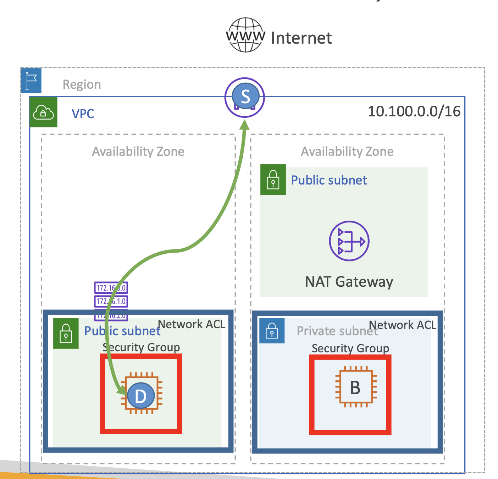
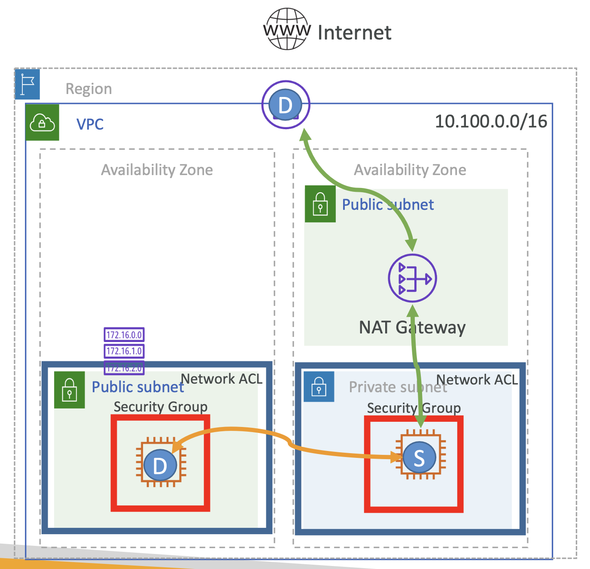
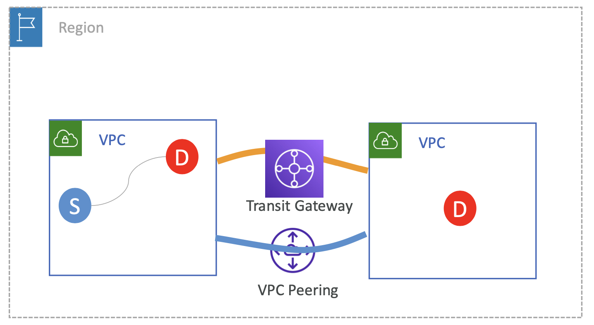
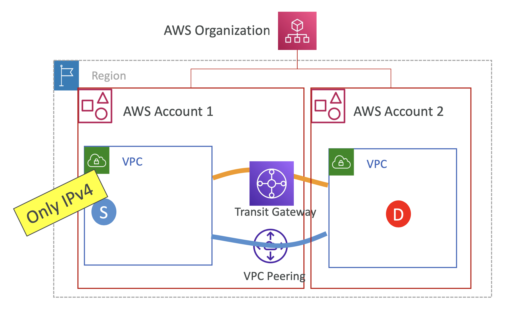
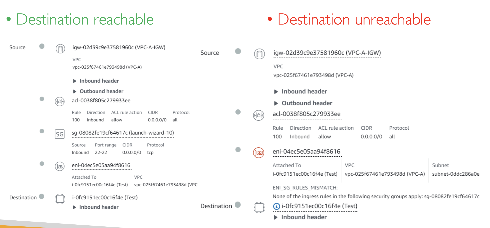

# VPC features for Network Analysis

## VPC Reachability Analyzer vs. Network Access Analyzer

  

 

### VPC Reachability Analyzer

reachability analyzer는 트래픽의 시작점(source)과 목적지(destination)를 제공하면,
해당 시작점에서 목적지까지 연결이 되는지를 구분해줌

중간에 여러 홉(Hop)이 있을 수 있는데, (가령, internet Gateway, transit gateway 등)

이 홉에 Network-Access-Control-List security groups, VPC peering connections 등을 확인해보아야 함

 

### Network Access Analyzer

VPC Reachability Analyzer 과 비슷한 방식이지만, 시작점에서 목적지로 가는 '모든 경로'를 분석.

Compliant network 를 가지는 지 분석 가능

모든 트래픽이 방화벽, 혹은 특정 EC2, NAT Gateway 을 통하는지 확인할 때 사용할 수 있음

만약, 인터넷에 연결되면 안되는 서버 컴포넌트가 네트워크에 닿았다면, Network Access Analyzer를 보고 수정할 수 있음

 

# VPC Reachability Analyzer

**✔️ 1. Source resource 와 Destination resource 사이의 연결성(Connectivity) 테스트**

가령, Internet Gateway를 Source 로 지정하고, 특정 EC2를 Destination 으로 지정하고 VPC Reachability Analyzer 를 실행할 수 있음

  

위 이미지에는 Internet Gateway 에서 Instance A로 가는 경로에는 🟥 Security Group 과 🟦 Network ACL 이 있음

추가로, Instance A에서 Internet Gateway 로 가는 경로도 생각해보아야 함

 

**✔️ 2. 가상 네트워크 경로의 각 홉마다 상세 정보 생성**

Source는 어떤 것이든 될 수 있음:

- Internet Gateway → Dest
- Internet Gateway 으로 향하는 NAT Gateway → Dest
- 동일 VPC에 위치한 다른 EC2 인스턴스 → Dest
- 다른 VPC에 위치한 다른 EC2 인스턴스 → Dest
- 등등

  

 

**✔️ 3. 트래픽이 닿지 않을 때, 문제가 되는 컴포넌트를 정확히 짚어줌**

 

**✔️ 4. 테스트 시 실제 패킷을 전송하지 않음**

온전히 네트워크 설정을 사용해서 네트워크가 닿는지를 확인함

### Use cases

1. 네트워크를 잘못 설정해서 발생하는 연결성(Connectivity) 문제 트러블 슈팅
2. 네트워크 설정 변경 이후 연결성(Connectivity) 검증 자동화

 

### Supported Source & Destination

  

<table>
<tr>
<th>Components</th>
<th>Intermediate components</th>
</tr>
<tr>
<td>

- Instance
- Internet Gateway
- Network Interfaces
- Transit Gateway
- Transit Gateway Attachments
- VPC endpoints
- VPC peering connections
- VPN gateways

</td>
<td>

- ALB and NLB
- NAT gateways
- TGW,TGW attachment, VPC peering

</td>
</tr>
</table>

<pre><b>Source 와 destination resources 위치:</b>
- 반드시 동일한 Region 내 위치
- 반드시 동일한 VPC 내 위치하거나, VPC Peering 혹은 Transit Gateway를 통해 연결되는 VPCs 내 위치
- 동일한 AWS Organization 내의 AWS account 사이에서 접근 가능
</pre>

  

⚠️ IPv4 트래픽만을 지원함 (IPv6 지원 X)

 

### VPC Reachability Analyzer output

  

