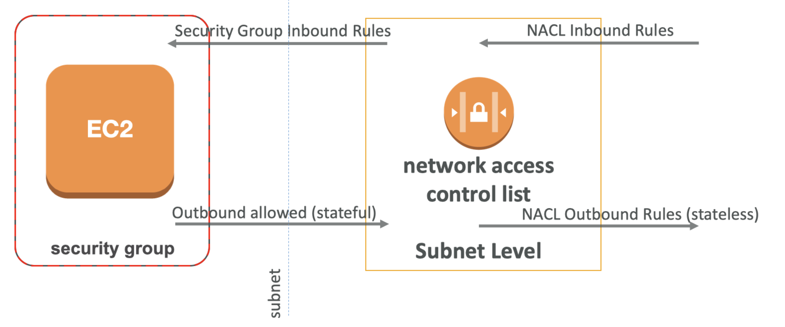
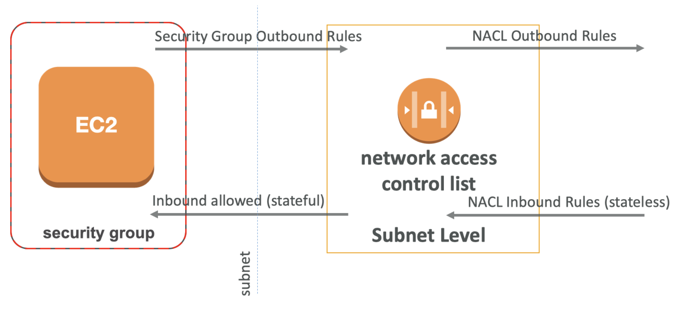
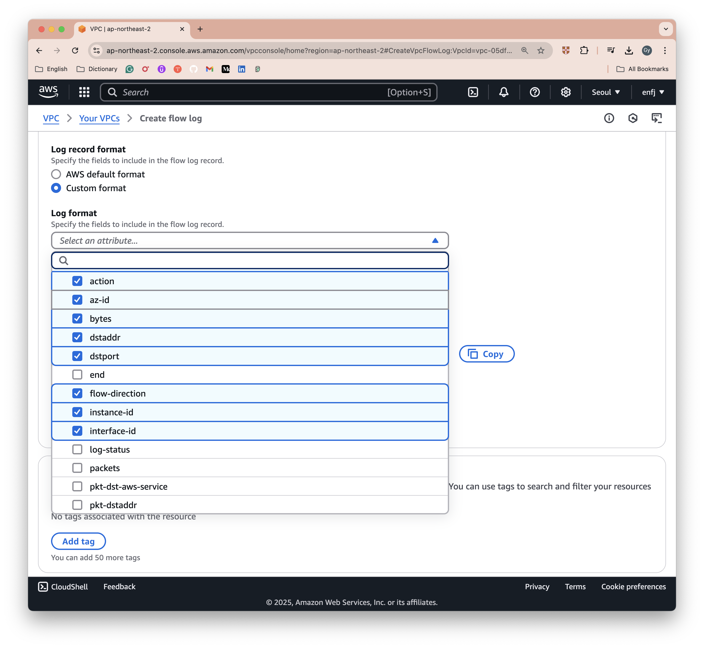
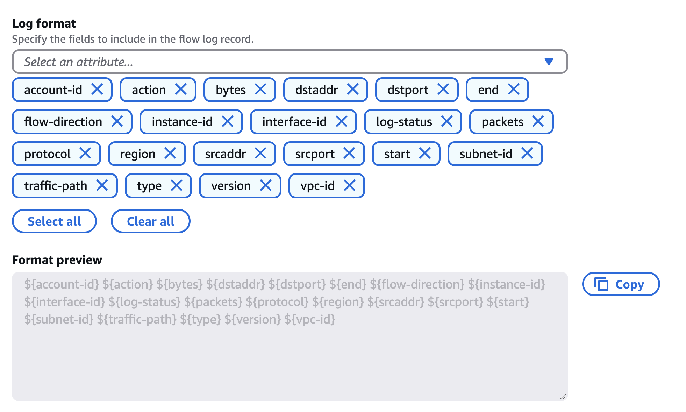

# VPC Traffic Monitoring with VPC Flow logs

## VPC Flow logs

- 인터페이스로 인/아웃 IP 트래픽 정보 캡처:
  - VPC Flow Logs
  - Subnet Flow Logs
  - Elastic Network Interface Flow Logs
- Monitor & Troubleshoot connectivity 문제 해결에 도움
  - 가령, EC2 인스턴스 연결에 실패할 때, Flow logs 를 통해 어떤 ENI가 해당 트래픽을 거부했는지 확인 가능. 이후 Security Group 이나 NACL Role 을 확인해가면서 Connectivity 이슈 처리.
  - 악의적인 IPs가 당신의 IP 주소에 접근하려고 하는 지 확인할 수 있음. e.g., ENI 혹은 IP 주소에 얼마나 많은 요청이 받았는지 확인. 이후 해당 IP를 필터링 할 수 있음
- Flow Logs 데이터는 S3 / CloudWatch Logs / Kinesis Data Firehose 로 전송 가능
- AWS에서 관리되는 인터페이스의 네트워크 정보도 캡처 가능: ELB, RDS, ElastiCache, Redshift, Amazon WorkSpaces
- VPC Flow Logs를 활성화해도 네트워크 성능에는 영향 없음

<br>

## Publishing VPC flow logs

<br><br>

EC2 인스턴스에는 ENI를 가지고,
Load Balancers나 NAT gateways와 같이 VPC 내에서 ENI를 가지는
다른 네트워크 컴포넌트들이 존재할 수 있음

#### 1. Flow logs Level

Flow logs는 각 범위마다 설정할 수 있음

<br><br>

- ENI 레벨
- Subnet 레벨
- VPC 레벨

#### 2. Sending data to other services

그 다음 해당 로그를 다른 서비스로 전송할 수 있음 

<br><br>

#### 3. Sending data to analyze

이후, 분석을 위해 다른 서비스들로 전송할 수 있음 

<br><br>

<br>

## VPC Flow Logs default format

Flow Logs 설정을 활성화하면, 특정한 포맷의 로그 형식을 갖게 되는데, 
이를 VPC flow logs를 위한 디폴트 포맷이라고 부름

**디폴트 버전**은  `2`이며, 지원되는 Flow Logs 버전: `2`, `3`, `4`, `5`가 있음

```
<version> <account-id> <interface-id> <srcaddr> <dstaddr> <srcport> <dstport> <protocol> <packets> <bytes> <start> <end> <action> <log-status>
```

실제 예시를 살펴보면 다음과 같음 

<br><br>

<br>

## VPC Flow Logs custom format

기존에 정의된 디폴트 필드 뿐만 아니라, 아래의 데이터를 명시하여 커스텀할 수도 있음

- vpc-id
- subnet-id
- instance-id
- type: IPv4, IPv6
- pkt-srcaddr
- pkt-dstaddr
- pkt-src-aws-service
- pkt-dst-aws-service
- region
- az-id
- flow-direction
- and so on ...

자세한 사항은 [AWS Docs; Flow log records - Available fields](https://docs.aws.amazon.com/vpc/latest/userguide/flow-log-records.html#flow-logs-fields) 공식 문서 참조

- `srcaddr`, `dstaddr`: Source Address, Destination Address. 문제가 있는 IP 식별에 도움.
- `srcport`, `dstport`: Source Port, Destination Port. 문제가 있는 포트 식별에 도움.
- `Action`: 요청의 성공 또는 실패를 나타내며, Security Group / NACL로 인해 결정됨.
- 사용 패턴 분석 또는 악의적인 행동 탐지에 활용 가능.

```
5 52.95.128.179 10.0.0.71 80 34210 6 1616729292 1616729349 IPv4 14 15044 
123456789012 vpc-abcdefab012345678 subnet-aaaaaaaa012345678
i-0c50d5961bcb2d47b eni-1235b8ca123456789 ap-southeast-2 apse2-az3 - - ACCEPT 19 
52.95.128.179 10.0.0.71 S3 - - ingress OK
```

순서대로

```
<version> <srcaddr> <dstaddr> <srcport> <dstport> <protocol> <start-time> <end-time> <type> <packets> <bytes>
<account-id> <vpc-id> <subnet-id>
<instance-id> <interface-id> <region> <az-id> <sublocation-type> <sublocation-id> <action> <tcp-flags>
<pkt-srcaddr> <pkt-dstaddr> <pkt-src-aws-service> <pkt-dst-aws-service> <traffic-path> <traffic-flow-direction> <log-status>
```

flow direction 중요 - Ingress, Egress 인지 명시

<br>

## Lab - Analyze VPC Flows logs with CloudWatch Insights

### Prerequisites

- CloudWatch Logs group 생성
- VPC flow logs service (vpc-fow-logs.amazonaws.com) 을 위한 IAM role 생성

```
{
  "Statement": [
    {
      "Action": [
        "logs:CreateLogGroup",
        "logs:CreateLogStream",
        "logs:DescribeLogGroups",
        "logs:DescribeLogStreams",
        "logs:PutLogEvents"
      ],
      "Effect": "Allow",
      "Resource": "*"
    }
  ]
}
```

### Examples 

```
fields @timestamp, @message
| sort @timestamp desc
| limit 10
 
stats sum(packets) as packetsTransferred by srcAddr, dstAddr
| sort packetsTransferred  desc
| limit 15

fields @timestamp, interfaceId, srcAddr, dstAddr, action
| filter (interfaceId = 'eni-xxxxxxxxx' and action = 'REJECT')
| sort @timestamp desc
| limit 5

fields @timestamp, srcAddr, dstAddr
| sort @timestamp desc
| limit 5
| filter srcAddr like "172.31."
 
 
fields @timestamp, @message
| stats count(*) as records by dstPort, srcAddr, dstAddr as Destination
| filter dstPort="80" or dstPort="443" or dstPort="22" or dstPort="25"
| sort HitCount desc
| limit 10
 
fields @timestamp, @message
| stats count(*) as records by dstPort, srcAddr, dstAddr as Destination
| filter dstPort="80" or dstPort="443" or dstPort="22" or dstPort="25"
| sort HitCount desc
| limit 10
```

<br>

## How to troubleshoot SG vs NACL issue?


“ACTION” Field

<table>
<tr>
<th>For incoming requests</th>
<th>For outgoing requests</th>
</tr>

<tr>
<td></td>
<td></td>
</tr>

<tr>
<td>

- Inbound REJECT → `NACL` or `SG`
- Inbound ACCEPT, Outbound REJECT → `NACL`

</td>
<td>

- Outbound REJECT → `NACL` or `SG`
- Outbound ACCEPT, Inbound REJECT → `NACL`

</td>
</tr>
</table>

**Security Group 은 Stateful 하지만 NACL은 Stateless 하기 때문** - [VPC Firewall - Security Group - security-groups-are-stateful](https://github.com/gngsn/deepdive/blob/main/aws/ANS/vpc_firewall_security_group.md#%ED%8A%B9%EC%A7%952-security-groups-are-stateful-%EC%83%81%ED%83%9C%EB%A5%BC-%EA%B0%80%EC%A7%90-%EF%B8%8F%EF%B8%8F%EF%B8%8F) 참고

<br>

## Lab – Custom flow logs

- 인터넷을 통해 EC2 instance에 접근하는 Custom flow logs
  - NACL outbound rule 제거
  - Security group inbound rule 제거


```
fields @timestamp, srcAddr, dstAddr, srcPort, dstPort, action
| filter srcAddr="x.x.x.x" or dstAddr="x.x.x.x"
| sort @timestamp desc
| limit 10
```

<br><br>
<br><br>

<br>

### Flow Logs limitation

Amazon VPC Flow Logs 가 기록하지 않는 트래픽:
- To and from VPC-native DNS services
- Amazon EC2 metadata service (169.254.169.254) 와 Time sync service (169.254.169.123)
- Dynamic Host Configuration Protocol (DHCP) services
- Windows license activation server
- Mirrored Traffic

<br>

### Other Traditional Tools for Network Monitoring

- Packet Capture (for deep packet inspection)
  - **Wireshark** (Windows/Linux) and **tcpdump** (Linux) which can be run on EC2 instance
- `traceroute`
- `telnet`
- `nslookup` - Used to resolve the hostnames into IP addresses
- `ping`
  - Internet Control Message Protocol(ICMP)을 사용하여 네트워크 라운드 트립 시간을 기록.
  - ICMP 트래픽은 보안 그룹(Security Groups)과 네트워크 ACL(NACL)을 통해 허용
    - 보안 그룹(Security Groups) 규칙에 명시적으로 Open 필수 


