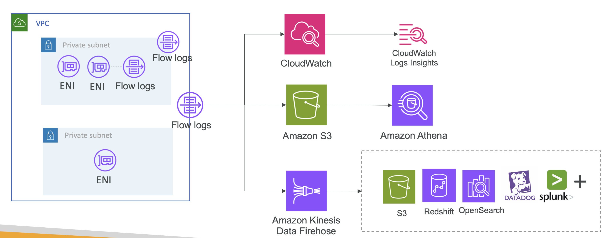
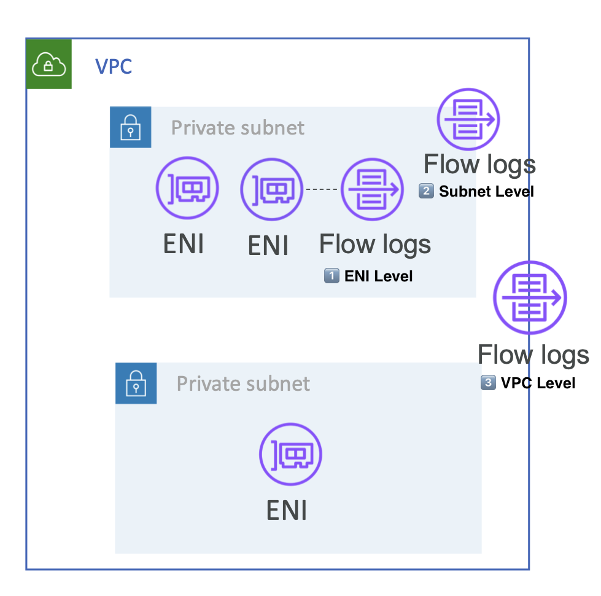
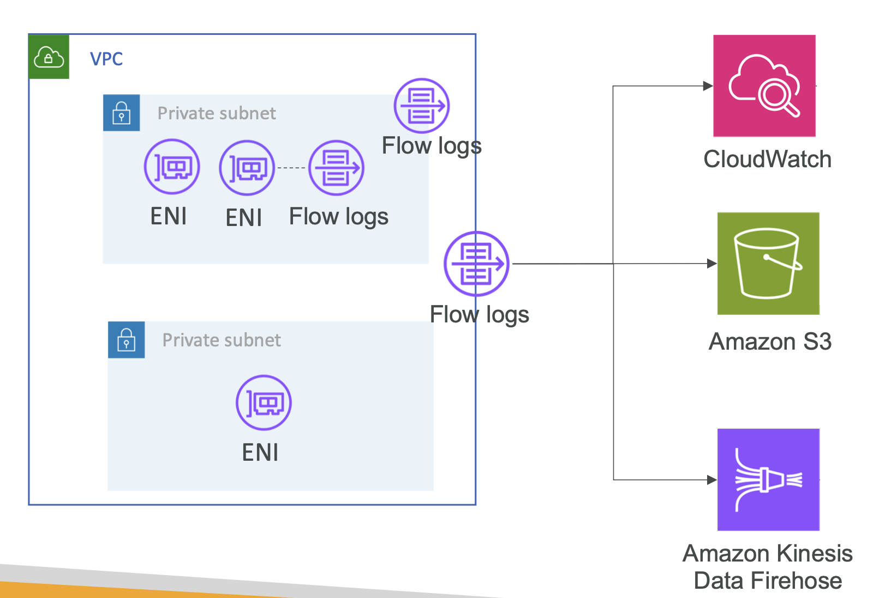
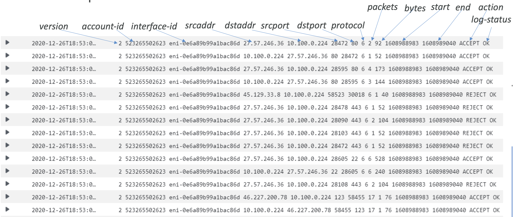

# VPC Traffic Monitoring with VPC Flow logs

## VPC Flow logs

- 인터페이스로 인/아웃 IP 트래픽 정보 캡처:
  - VPC Flow Logs
  - Subnet Flow Logs
  - Elastic Network Interface Flow Logs
- Monitor & Troubleshoot connectivity 문제 해결에 도움
  - 가령, EC2 인스턴스 연결에 실패할 때, Flow logs 를 통해 어떤 ENI가 해당 트래픽을 거부했는지 확인 가능. 이후 Security Group 이나 NACL Role 을 확인해가면서 Connectivity 이슈 처리.
  - 악의적인 IPs가 당신의 IP 주소에 접근하려고 하는 지 확인할 수 있음. e.g., ENI 혹은 IP 주소에 얼마나 많은 요청이 받았는지 확인. 이후 해당 IP를 필터링 할 수 있음
- Flow Logs 데이터는 S3 / CloudWatch Logs / Kinesis Data Firehose 로 전송 가능
- AWS에서 관리되는 인터페이스의 네트워크 정보도 캡처 가능: ELB, RDS, ElastiCache, Redshift, Amazon WorkSpaces
- VPC Flow Logs를 활성화해도 네트워크 성능에는 영향 없음

<br>

## Publishing VPC flow logs

<br><br>

EC2 인스턴스에는 ENI를 가지고,
Load Balancers나 NAT gateways와 같이 VPC 내에서 ENI를 가지는
다른 네트워크 컴포넌트들이 존재할 수 있음

#### 1. Flow logs Level

Flow logs는 각 범위마다 설정할 수 있음

<br><br>

- ENI 레벨
- Subnet 레벨
- VPC 레벨

#### 2. Sending data to other services

그 다음 해당 로그를 다른 서비스로 전송할 수 있음 

<br><br>

#### 3. Sending data to analyze

이후, 분석을 위해 다른 서비스들로 전송할 수 있음 

<br><br>

<br>

## VPC Flow Logs default format

Flow Logs 설정을 활성화하면, 특정한 포맷의 로그 형식을 갖게 되는데, 
이를 VPC flow logs를 위한 디폴트 포맷이라고 부름

**디폴트 버전**은  `2`이며, 지원되는 Flow Logs 버전: `2`, `3`, `4`, `5`가 있음

```
<version> <account-id> <interface-id> <srcaddr> <dstaddr> <srcport> <dstport> <protocol> <packets> <bytes> <start> <end> <action> <log-status>
```

실제 예시를 살펴보면 다음과 같음 

<br><br>

 
- `Srcaddr`, `Dstaddr`: 문제가 있는 IP 식별에 도움.
- `Srcport`, `Dstport`: 문제가 있는 포트 식별에 도움.
- `Action`: 요청의 성공 또는 실패를 나타내며, Security Group / NACL로 인해 결정됨.
- 사용 패턴 분석 또는 악의적인 행동 탐지에 활용 가능.