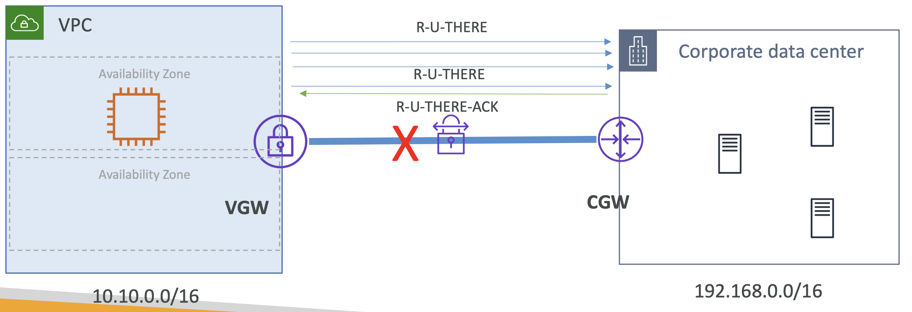

# VPN Dead Peer Detection (DPD)

## Dead peer detection

DPD는 VPN 연결의 문제를 감지하여 반대편이 작동 중인지 확인하는 메커니즘.

다른 채널이나 네트워크로의 장애 조치 또는 보안상의 이유로 연결을 종료해야 할 때 도움을 줌.

- Dead Peer Detection (DPD)은 IPSec VPN 연결의 활성 상태(Liveness)를 감지하는 방법
- VPN 피어는 **IKE Phase 1** 동안 DPD를 사용할지 결정할 수 있음
- DPD가 활성화되면, AWS는 **10초마다** 고객 게이트웨이에 **DPD(R-U-THERE)** 메시지를 보내고 **R-U-THERE-ACK** 응답을 기다림.
  연속된 3개의 요청에 응답이 없으면 DPD가 타임아웃됨

  

 

# Dead Peer Detection 동작 방식

- 기본적으로 **DPD가 발생하면**, 게이트웨이는 **Security Associations을 삭제**. 이 과정에서 **대체 IPsec 터널**이 가능하면 사용됨.
- 기본 DPD **타임아웃 값은 30초**. 30초 이상으로 설정할 수 있음.
- DPD는 **UDP `500`** 또는 **UDP `4500`** 를 사용하여 메시지 전송.

- **DPD 타임아웃 발생 시:**
  - **Clear (기본값)** - IPSec IKE 세션을 종료하고, 터널을 중지하며, 라우트를 삭제
  - **Restart** - AWS가 IKE Phase 1을 다시 시작
  - **None** - 아무 작업도 수행하지 않음
- **동적 라우팅(BGP)을 사용할 경우, 고객 라우터는 DPD를 지원해야 함**
- VPN 터널은 **비활성(inactivity) 상태** 또는 **유휴(dile) 연결**로 인해 종료될 수 있음
    - 이를 방지하려면 **적절한 유휴 타임아웃을 설정**하거나
    - **5~10초마다 ICMP(ping) 요청을 보내는 호스트**를 구성할 수 있음.  
