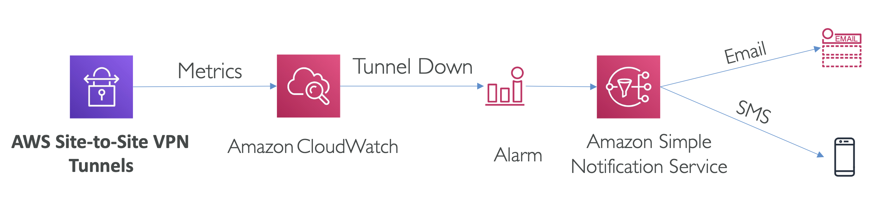
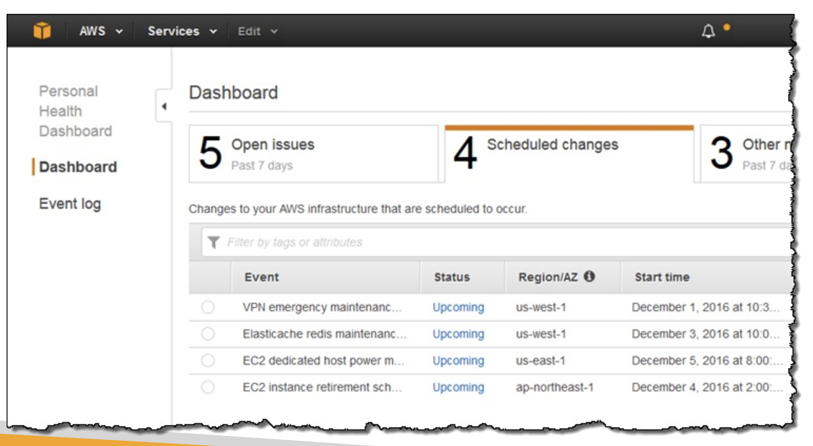

# VPN Monitoring

AWS Site-to-Site VPN을 사용할 때 어떤 CloudWatch 메트릭이 있는지 아는 것이 중요.

## VPN Monitoring with CloudWatch

- **TunnelState**: 터널의 상태를 나타내는 메트릭.
  - `0`: **DOWN**
  - `1`: **UP**
  - `0`과 `1` 사이의 값: 하나의 터널이 다운된 상태.
- **TunnelDataIn**:  VPN 터널을 통해 들어오는 바이트 수
- **TunnelDataOut**: VPN 터널을 통해 나가는 바이트 수

  

메트릭들은 기본적으로 CloudWatch에서 자동으로 수집되므로 추가 설정이 필요하지 않음.

위 메트릭을 통해 CloudWatch 알람을 생성할 수 있음.

가령, **TunnelState**가 다운될 때(즉, 값이 0으로 바뀔 때) 알람을 설정하여 AWS 알림 서비스(SNS)를 통해 이메일이나 SMS로 관리자에게 알림을 보낼 수 있음.

 

## VPN Monitoring with Health Dashboard

- AWS Site-to-Site VPN 은 자동으로 **AWS Personal Health Dashboard(PHD)** 로 알림을 보냄 
- **터널 유지 보수 알림**: 터널이 유지보수로 다운되면 알림을 보냄
- **단일 터널 운영 알림**: 두 개의 터널 중 하나만 작동 중이고, 하루 동안 하나의 터널이 한 시간 이상 다운되면, 
  AWS는 이를 단일 터널 운영으로 간주하고 알림을 보냄

  

**가장 중요한 건 CloudWatch 메트릭**: **TunnelState, TunnelDataIn**, **TunnelDataOut**.
