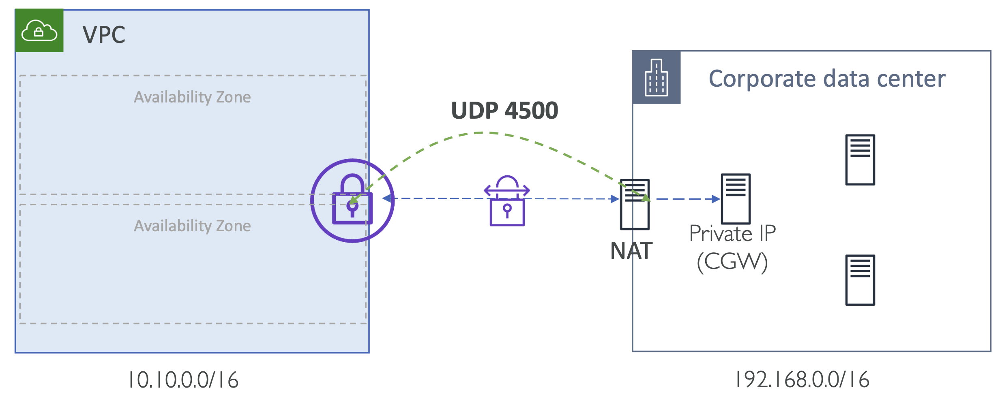

# VPN NAT Traversal (NAT-T)

## VPN support for NAT-Traversal (NAT -T)

> **NAT-T**
> : a method for getting around IP address translation issues encountered when data protected by IPsec passes through a NAT device for address translation
> 
> 네트워크 주소 변환 (NAT)은 특정 IP 주소 범위를 다른 IP 주소 범위로 변환하는 변환맵(Map)을 가집니다. VPC를 만들고 원하는 IP 대역대를 설정했을 때 여러 서브넷으로 만들어지고, 여러분의 EC2 인스턴스는 VPC내에 서브넷 중 하나에 연결됩니다.
> 
> 이를 VGW에 연결하려면 NAT 탐색 혹은 NAT-T를 사용해야합니다. NAT-T는 사내 네트워크를 NAT 장치 뒤에 숨기면서, VPC에 연결할 수 있도록 합니다.
> 이러한 매핑은 VPN 연결이 만들어 질 때 자동으로 이루어집니다. AWS 관리 콘솔로 설정할 필요가 없으며, NAT 장치 탐색 기능을 사용하고 UDP 포트 4500 번을 사용할 수 있도록 방화벽(Firewall)을 설정하면 됩니다.
> 
> NAT-T는 NAT(Network Address Translation) 환경에서 P2P(Peer-to-Peer) 통신을 가능하게 함.
> 
> [🔗 EC2 VPC VPN 신규 기능 – NAT 탐색, 암호화 옵션 추가 등](https://aws.amazon.com/ko/blogs/korea/ec2-vpc-vpn-update-nat-traversal-additional-encryption-options-and-more/)

- AWS VPN supports the VPN termination behind NAT on customer side
- You must open UDP port 4500 on customer side of firewall for NAT -T
- AWS VPN은 사용자의 NAT 뒤의 VPN termination를 지원
- NAT-T를 위해서는 사용자 측 방화벽에 UDP port 4500를 열어야함

AH: Authentication Header
ESP: Encrypt your IP Header

- IP Address 를 확인 및 변경할 수 없음

#### Well-known ports

[🔗 link](https://en.wikipedia.org/wiki/List_of_TCP_and_UDP_port_numbers)

| Port | TCP      | UDP | Description                                                                                      |
|------|----------|-----|--------------------------------------------------------------------------------------------------|
| 500  | Assigned | Yes | Internet Security Association and Key Management Protocol (ISAKMP) / Internet Key Exchange (IKE) |
| 4500 | Assigned | Yes | IPSec NAT Traversal (RFC 3947, RFC 4306)                                                         |

