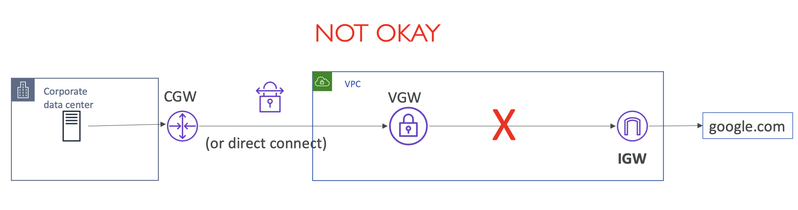
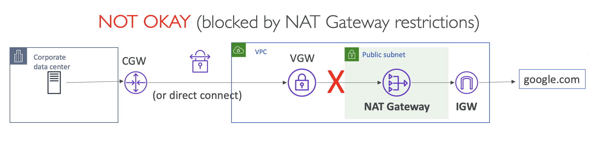
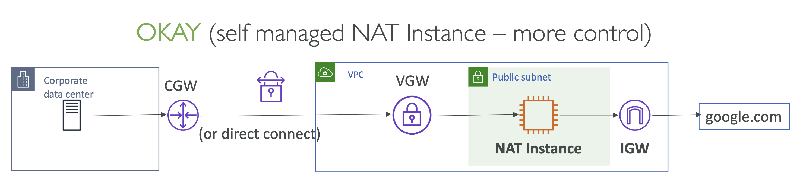
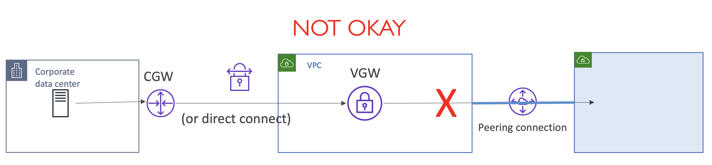
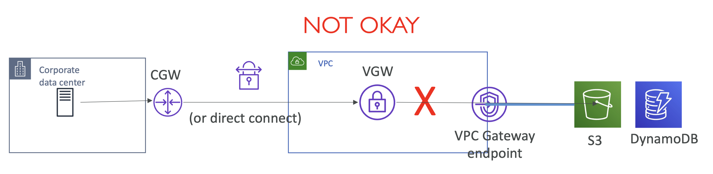
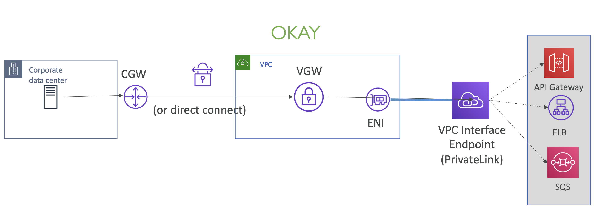
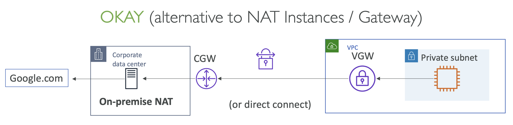

# VPN Transitive Routing scenarios

트래픽이 ENI 또는 EC2 인스턴스에 도달하는 경우 허용되며,
게이트웨이를 통해 라우트 테이블을 사용하는 트래픽은 제한됨.

## VPN Transitive Routing

회사 데이터 센터에 연결된 Customer GW, 그리고 VPC에 연결된 Private VGW가
Site-to-Site VPN을 통해 연결된 상태에서 전이 시나리오 확인.

### Site to Site VPN and Internet Access

#### via IGW: ❌ NOT OKAY

VPC 측에 IGW를 설정했을 때.

트래픽이 회사 데이터 센터에서 Customer GW를 통해 VGW로 흘러 IGW를 통해 인터넷에 도달하려고 하면?
불가능.

VGW는, AWS에서 프로비저닝된 ENI(Elastic Network Interface)와는 달리, 라우팅 규칙을 따르기 때문.

  

#### via NAT Gateway and IGW: ❌ NOT OKAY

NAT 게이트웨이는 관리형 서비스이며 구성 변경을 허용하지 않기 때문에 

트래픽이 NAT 게이트웨이를 통해 인터넷에 도달할 수 없음.

  

#### via NAT Instance and IGW: ✅ OKAY

퍼블릭 서브넷에 자체 관리형 NAT EC2 인스턴스를 사용하는 경우, 

NAT 인스턴스를 통해 인터넷으로 트래픽을 보낼 수 있음.

  

### Site to Site VPN and VPC

#### via VPC Peering: ❌ NOT OKAY

VPC 피어링의 경우, 전이적 라우팅을 지원하지 않음

즉, 트래픽이 기본 VPC에서 도착한 경우, 다른 피어링된 VPC로 직접 흐를 수 없음.

  

### Site to Site VPN and Other AWS Services

#### via VPC gateway endpoint: ❌ NOT OKAY

AWS 서비스(S3 및 DynamoDB)에 도달하기 위해 VPC 게이트웨이 엔드포인트를 사용하는 경우, 
트래픽이 VPC에서 시작하지 않는 이상 라우트 테이블을 따를 수 없음.

  

#### via VPC Interface endpoint: ✅ OKAY

하지만, **PrivateLink**가 적용된 VPC 인터페이스 엔드포인트를 사용하는 경우,
VPC 인터페이스 엔드포인트는 서브넷에 ENI를 생성하여 트래픽이 VPC에 도달하고,
이를 통해 온프레미스에서 AWS의 해당 서비스를 사용할 수 있음.

  

### Site to Site VPN and On-premises Internet Access

트래픽이 AWS에서 시작하여 온프레미스 데이터 센터로 전송되는 경우

#### ✅ OKAY

회사 데이터 센터의 NAT 장치에서 네트워크 구성을 통해 Google 등의 외부 서비스를 사용할 수 있음.

  

## Summary

- **On-premises 에서 Virtual Private Gateway를 경유한 AWS 접근**:
  - ❌ Internet Gateway를 통해 인터넷에 연결할 수 없음
  - ❌ NAT Gateway를 통해 인터넷에 연결할 수 없음
  - ❌ AWS VGW를 통해 피어링된 VPC의 리소스에 접근할 수 없음
  - ❌ VPC gateway endpoint를 통해 S3, DynamoDB에 접근할 수 없음
  - ✅ VPC interface endpoint를 통해 AWS services endpoint(e.g API gateway, SQS) 와 customer endpoint services (powered by Privatelink)에 접근 가능
  - ✅ Public subnet의 NAT EC2 instance를 통해 인터넷에 접근 가능
- **AWS 에서 customer gateway 경유한 On-premises 접근**:
    - 고객 네트워크에서 인터넷이나 CGW에 라우팅 규칙이 적용된 다른 네트워크 엔드포인트에 접근 가능

  