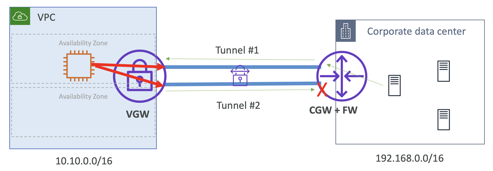
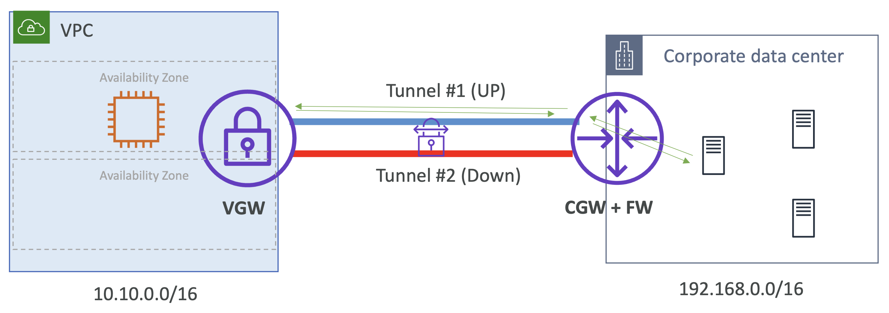
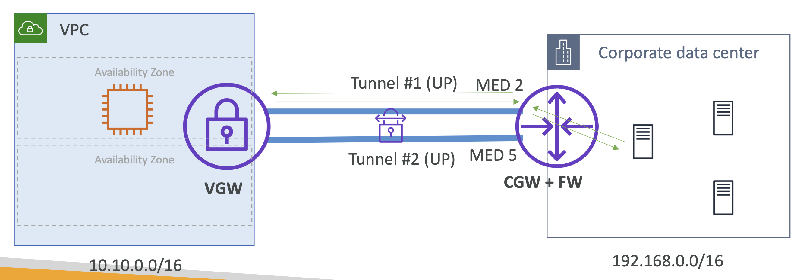

# VPN Tunnels - Active/Passive Mode

AWS 사이트 간 VPN은 고가용성을 위해 두 개의 터널을 프로비저닝함.

이는 두 가지 타입으로 구성할 수 있음.

- Active-Active 모드: 두 터널이 동시에 활성화
- Active-Passive 모드: 임의의 시간에 하나의 터널만 활성화됨

 

## Static Routing - Active/Active Tunnels

정적 라우팅 시나리오에서,
트래픽이 데이터 센터에서 Customer Gateway를 거쳐 `Tunnel #1` 또는 `Tunnel #2`를 통해 AWS로 향하여, EC2 인스턴스에 도달.

  

응답 트래픽이 Virtual Gateway로 돌아올 때, 무작위로 `Tunnel #1` 또는 `Tunnel #2` 를 선택.

이 때, 상태를 가진 방화벽이 있을 경우,
다른 터널을 통해 들어오는 트래픽은 거부될 수 있어 **Asymmetric routing** 문제가 발생할 수 있음.

→ **이를 위해 Customer Gateway에 Asymmetric routing을 활성화해야 함.**

- Active-Active tunnel은 Asymmetric routing을 유발할 수 있고, CGW에서 Asymmetric routing 를 활성화시켜야 함 
- AWS에서 시작하는 트래픽에 대해, 무작위로 하나의 터널이 선택됨

 

## Static Routing - Active/Passive Tunnels

정적 라우팅의 Active-Passive Tunnel 설정은 하나의 터널만 활성화되며, 트래픽은 Active 터널을 통해서만 흐름.

Asymmetric routing 문제 없음.

  

- 하나의 터널만 UP 상태이며 이를 통해서만 트래픽이 전달됨
- Active 터널이 다운되면, CGW 측에서 두 번째 터널을 자동으로 올림

 

## Dynamic Routing - Active/Active Tunnels

동적 라우팅을 사용하면 BGP 우선 순위를 사용하여 터널 선택에 영향을 줄 수 있음.

active-active 터널 구성에서는 더 구체적인 경로, 짧은 ASPATH, 낮은 MED 값 등의 
**BGP 매개변수를 세밀하게 조정하여 VGW가 일관되게 선호하는 터널을 사용하게 할 수 있음**.

터널이 다운된 경우 트래픽은 자동으로 다른 터널을 통해 다시 라우팅되어 높은 가용성을 제공.

  

- Tunnel에 더 구체적인 prefix를 지정(Advertise)
  - 가령, `Tunnel #1`을 `192.168.0.0/16`으로 지정하고 `Tunnel #2`을 `192.168.0.0/24`으로 지정하면, `Tunnel #1`가 더 구체적인 범위를 갖기 때문에 BGP가 이를 선택할 것임  
- prefixes 매칭을 위해 ASPATH를 사용 
- ASPATH 길이가 동일하다면, multi-exit discriminators (MEDs)를 활용
  - 가장 낮은 MED가 우선됨 

## Summary

- **정적 라우팅**:
  - **active-active 모드**: 
    - 무작위 터널 선택 → 비대칭 라우팅(Asymmetric routing) 문제 야기 
    - 비대칭 라우팅 문제를 해결하기 위해 **고객 게이트웨이 방화벽에서 비대칭 라우팅을 활성화**해야 함.
  - **active-passive 모드**
  - 하나의 터널만 활성화, 비대칭 라우팅 없음
    - 터널 장애 시 두 번째 터널 전환의 책임은 고객에게 있음
- **동적 라우팅**:
  - active-active 모드
    - **1️⃣ 구체적인 경로**, **2️⃣ 짧은 ASPATH**, **3️⃣ 낮은 MED** 값을 사용하여 선호하는 터널을 지정.

