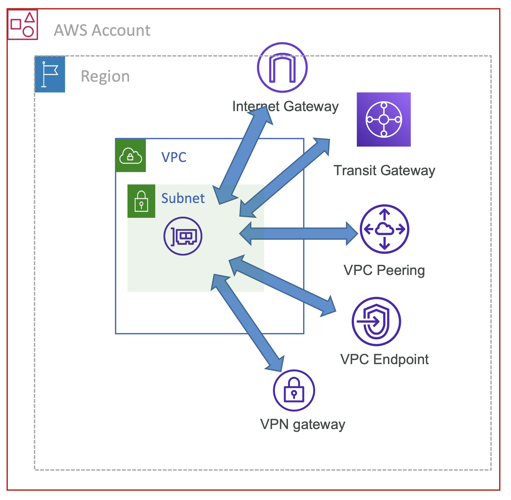
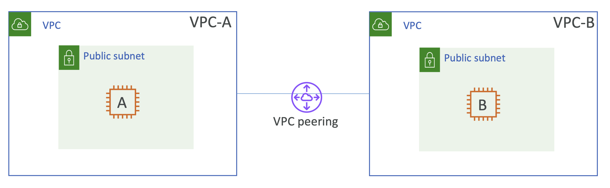

# Network Access Analyzer

VPC Reachability Analyzer 와 동일한 역할을 하지만 목적이 다름

- AWS 리소스에 의도에 맞지 않게 접근하는 네트워크 식별 목적
  - **Isolated network segments**
    - 서로 분리되어야 하는 개발 환경과 운영 환경 VPC의 네트워크 통신 단절
  - **Internet accessibility**
    - 오직 필요한 리소스만 인터넷을 통해 접근
  - **Trusted network paths**
    - 신뢰할 수 있는 네트워크 접근: 경로 내 NAT 게이트웨이 나 방화벽
  - **Trusted network access**
    - 신뢰할 수 있는 네트워크 접근: 오직 특정 리소스, IP range, port, protocol 등만 접근 가능
- 네트워크 접근 범위를 지정하고 당신의 컴플라이언스에 충족하는지 분석 

  

 

## Walkthrough

### 테스트 목록

- 1️⃣ Verify that 2 VPCs are isolated
- 2️⃣ Setup VPC peering and check again

  

가령, VPC-A 가 개발 환경이고, VPC-B 가 운영 환경이며, 둘 사이에 어떤 네트워크 통신도 가능하지 못하게 하고자 함

 

### Exercise 1️⃣.

_Verify that 2 VPCs are isolated_

 

#### ✔️ 1.1 Specify Network Access Scope

AWS Network Manager의 Network Access Analyzer 탭을 확인해보면 Network Access Scope을 생성할 수 있음

생성하기 전, 4개의 Default Network Access Scope 을 확인할 수 있는데,
더 쉬운 트러블슈팅을 위해 AWS 에서 제공

[🔗 AWS Network Access Analyzer](https://docs.aws.amazon.com/vpc/latest/network-access-analyzer/getting-started.html)

- **All-IGW-Ingress (Amazon created)** – Identifies inbound paths from internet gateways to network interfaces.
- **AWS-IGW-Egress (Amazon created)** – Identifies outbound paths from network interfaces to internet gateways.
- **AWS-VPC-Ingress (Amazon created)** – Identifies inbound paths from internet gateways, peering connections, VPC endpoints, VPNs, and transit gateways to VPCs.
- **AWS-VPC-Egress (Amazon created)** – Identifies outbound paths from VPCs to internet gateways, peering connections, VPC endpoints, VPNs, and transit gateways.

Internet Gateway, peering connection, VPC endpoints, VPN, 혹은 Transit Gateway 등에서
VPC로 들어오는 Ingress 경로를 식별함

구성 요소 중 어느 것이든 접근할 수 있는 모든 VPC 리소스는 발견된 대로 표시됨

`AWS-VPC-Ingress` 선택 -> 1분 정도 소요됨

 

#### ✔️ Analysis Result 

분석이 완료되면 Analysis details에 아래 상태를 확인할 수 있음
 
- **Last analysis result**: **ℹ️ Findings detected**

즉, Internet Gateway에서 VPC-A 로 연결이 가능하다는 정보를 얻을 수 있음

 

#### ✔️ Destination Port

또 하나 확인해볼 내용은 Destination Port 컬럼을 통해 22번 포트로만 접근 가능함을 알 수 있음

만약, Security Group에 80을 추가한다면 80번 또한 추가되어 보였을 것임

 

#### ✔️ 1.2. Custom Scope (`VPC-A` → `VPC-B`) 생성

**Empty Template**

- **Name**: no-connectivity-between-dev-prod-vpc
- **Match conditions**
  - **Source** 
    - Resource Type: VPCs
    - Resource IDs: `vpc-0ad...` (VPC-A)
  - **Destination** 
    - Resource Type: VPCs
    - Resource IDs: `vpc-039...` (VPC-B)

Scope을 생성하면 바로 분석 가능

분석이 완료되면 의도된대로 Analysis details에 아래 상태를 확인할 수 있음

- **Last analysis result**: **✅ No findings detected**

 

### Exercise 2️⃣.

_Setup VPC peering and check again_

 

#### ✔️ 2.1. VPC Peering 생성

Peering Connection 

- Name: VPC-A-VPC-B
- VPC ID (Requester): VPC-A
- VPC ID (Acceptor): VPC-B

Peering 을 생성하면 반드시 **Actions > Accept request** 를 처리 해야함

VPC Peering을 설정했지만, **아직 연결이 가능하지 않음**

Route Table 에 `VPC-A` → `VPC-B` 로 향하는 트래픽을 정의하지 않았기 때문

 

#### ✔️ Route Table에 `VPC-A` ↔ `VPC-B` 트래픽 정의

**VPC-A Route Table 에 VPC-B 로 향하는 경로 추가**

| Destination   | Target                            | Status | Propagated |
|---------------|-----------------------------------|--------|------------|
| 172.16.0.0/16 | Peering Connection; `pcx-085f...` | -      | No         |

 

**VPC-B Route Table 에 VPC-A 로 향하는 경로 추가**

| Destination | Target                            | Status | Propagated |
|-------------|-----------------------------------|--------|------------|
| 10.0.0.0/16 | Peering Connection; `pcx-085f...` | -      | No         |

 

#### ✔️ 2.2. Analysis Result 확인

이제 다시 분석하면 Findings detected 확인 가능

분석이 완료되면 의도된대로 Analysis details에 아래 상태를 확인할 수 있음

- **Last analysis result**: **ℹ️ Findings detected**
