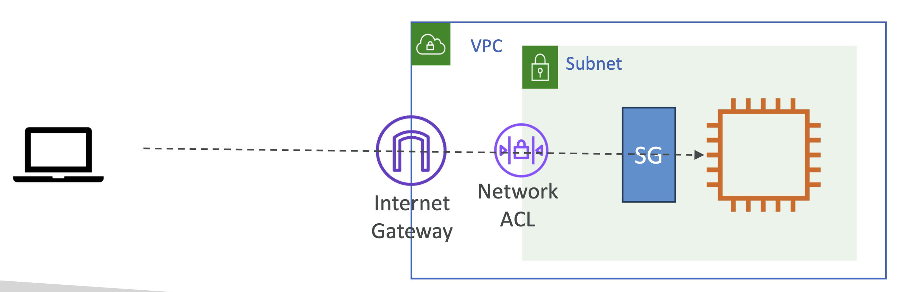

# Exercise

### 환경 세팅

<br><br>

1. **VPC 생성** (`vpc-0e8db6..`)
2. **Internet Gateway 생성**
    - Name: demo 생성 (`igw-03386..`)
    - VPC 연결 (`igw-033860..` - attach - `vpc-0e8db6..`)
3. **Subnet 생성** (`subnet-00fb2a..`)
    - in VPC (`vpc-0e8db6..`); VPC CIDR: `10.0.0.0/16`
    - Name: demo-subnet 생성
    - AZ: `ap-south-1a`
    - Subnet CIDR: `10.0.0.0/24`
4. **Route Table 생성** (`rtb-0ab9c7..`)
    - Name: demo-rt
    - in VPC (`vpc-0e8db6..`)
    - 생성 후, Subnet Associations 에서 생성한 Subnet (`subnet-00fb2a..`) 연결

<br>

### 테스트 목록

- 1️⃣ Launch an EC2 instance in a **Private** subnet and access over SSH (`22`)
- 2️⃣ Modify the subnet route to make the subnet **Public**
- 3️⃣ Remove NACL inbound rule for inbound traffic
- 4️⃣ Add NACL inbound rule and remove Security group inbound rule to allow SSH (`22`) access

<br>

### Exercise 1️⃣.

_Launch an EC2 instance in a **Private** subnet and access over SSH (`22`)_

<br>

#### 1.1. EC2 인스턴스 생성 (`i-0ad0f2..`)

- Key pair 사용
- 생성한 VPC (`vpc-0e8db6..`)와 Subnet (`subnet-00fb2a..`) 설정
- Public IP Enable 설정
- 자체 Security Group 생성 (Name: demo-sg, Open Anywhere)

생성한 EC2 의 Public IP 를 통해 SSH 연결을 시도

→ 의도한대로 연결되지 않음

아무리 Public IP를 Enable 설정했다고 해도, Private Subnet에 위치했기 때문

<br>

#### 1.2. Reachability Analyzer 생성 및 확인

연결이 안되는 것을 확인했으니, Reachability Analyzer로 트러블슈팅하는 과정을 확인.

먼저 Reachability Analyzer을 설정해서 분석 생성

- Source Type: Internet Gateway
- Source: `igw-033860..`
- Destination Type: EC2 Instance
- Destination: `i-0ad0f2..`

생성 후 분석을 위해 10 ~ 15초 정도 분석 시간이 걸림

<br>

#### 1.3. Reachability 실패 확인

이후 Reachability status 에 **Not reachability** 표시가 되는 것을 확인할 수 있음

상세 내용을 확인하면, 의도한대로 Route Table `demo-rt`에 오류가 발생한 것을 확인할 수 있음

```
NO_ROUTE_TO_DESTINATION:
Route table rtb-0ab9c7.. does not have an applicable route to igw-033860..
```


<br>

### Exercise 2️⃣.

_Modify the subnet route to make the subnet **Public**_

<br>

#### 2.1. 오류 복구: Reachability 성공하도록 변경

Route table에 Internet Gateway 로 들어오는 트래픽을 허용

| Destination | Target                            | Status | Propagated |
|-------------|-----------------------------------|--------|------------|
| 0.0.0.0/0   | Internet Gateway; `igw-033860...` | -      | No         |

Route table 에 위의 행 추가

<br>

#### 2.2. Reachability 재검사 후 성공 확인

이후, `Analogize Path` 버튼을 눌러 다시 분석.

Reachability status가 **Reachable** 로 변경된 것을 알 수 있음


<br>

### Exercise 3️⃣.

_Remove NACL inbound rule for inbound traffic_

<br>

#### 3.1. NACL inbound rule 제거

demo-subnet 의 Network ACL에 가서 Inbound rules 확인

| Rule number | Type             | Protocol     | Port range | Source            | Allow/Deny   |
|-------------|------------------|--------------|------------|-------------------|--------------|
| **100**     | **All traffic**  | **All**      | **All**    | **0.0.0.0.0/0**   | **Allow**    |
| *           | All traffic      | All          | All        | 0.0.0.0/0/0       | Deny         |

위 처럼 설정된 Inbound rules에서 가장 첫 번째 줄 삭제:

| Rule number | Type             | Protocol     | Port range | Source            | Allow/Deny   |
|-------------|------------------|--------------|------------|-------------------|--------------|
| *           | All traffic      | All          | All        | 0.0.0.0/0/0       | Deny         |

<br>

#### 3.2. Reachability Analyzer가 NACL 오류를 뱉는지 검증

이후, `Analogize Path` 버튼을 눌러 다시 분석.

Reachability status 에 **Not reachability** 표시가 되는 것을 확인할 수 있음

상세 내용을 확인하면, 의도된 대로 Subnet 에 설정된 NACL에 아래와 같은 오류가 발생한 것을 확인할 수 있음

```
SUBNET_ACL_RESTRICTION:
Network ACL acl-0fd0688.. does not allow inbound traffic fron subnet-00fb2a.. to vpc-0e8db6..
```

<br>

#### 3.3. 오류 복구: Inbound Rule 다시 추가

다음 실습을 위해 동일한 Inbound Rule 다시 추가

이후, `Analogize Path` 버튼을 눌러 다시 분석하면 Reachability status가 **Reachable**로 표시됨


<br>

### Exercise 4️⃣.

_remove Security group inbound rule to allow SSH (`22`) access_

<br>

#### 4.1. Security Group inbound rule 제거

Security Group 에서 Inbound Rule 편집을 통해 기존에 정의된 규칙 제거

**before:**

| Security group rule ID | Type    | Protocol | Port range  | Source             |
|------------------------|---------|----------|-------------|--------------------|
| **dgr-0fd099..**       | **SSH** | **TCP**  | **22**      | **0.0.0.0.0/0**    |


**after:**

| Security group rule ID | Type | Protocol | Port range | Source |
|------------------------|------|----------|------------|--------|
| ( empty )              |      |          |            |        |


이후, `Analogize Path` 버튼을 눌러 다시 분석.

Reachability status 에 **Not reachability** 표시가 되는 것을 확인할 수 있음

상세 내용을 확인하면, 의도된 대로 ENI 부분에 오류가 발생한 것을 확인할 수 있음

```
ENI_SG_RULES_MISMATCH:
None of the ingress rules in the follow security groups apply
```


**마무리**

사용한 Resources 종료
