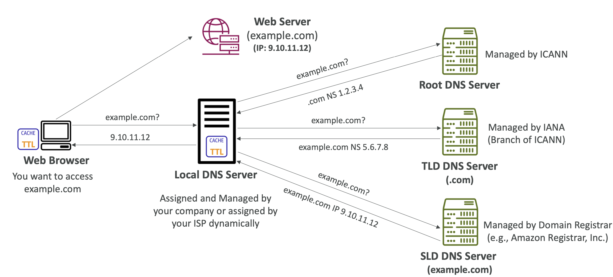

# What is a DNS?

# Route 53 Overview

- 사람이 읽을 수 있는 호스트 이름을 기계가 읽을 수 있는 IP 주소로 변환하는 시스템
- www.google.com => 172.217.18.36
- DNS는 인터넷의 중추
- DNS는 계층적 이름 구조를 사용
- 계층적 도메인 이름
  - `.com`
  - `example.com`
  - `www.example.com`
  - `api.example.com`

<br/>

## DNS Terminologies
http://api.www.example.com.

- **Domain Registrar**: Amazon Route 53, GoDaddy, ...
- **DNS Records**: `A`, `AAAA`, `CNAME`, `NS`, ...
- **Zone File**: contains DNS records
- **Name Server**: resolves DNS queries (Authoritative or Non-Authoritative)
- **Top Level Domain (TLD)**: `.com`, `.us`, `.in`, `.gov`, `.org`, ...
- **Second Level Domain (SLD)**: `amazon.com`, `google.com`, ...


```
                URL
  ——————————————————————————   ↙ (dot) Root
  http://api.www.example.com.
  ————                   ——— TLD
  Protocol       ——————————— SLD
             ——————————————— Sub Domain
         ——————————————————— FQDN (Fully Qualified Domain Name)
```


## How DNS Works

<br/><br/>

#### 1. **Local DNS Server**에 요청

일반적으로 로컬 DNS 서버는 회사에서 관리하거나 인터넷 서비스 제공업체(ISP)에서 동적으로 할당.

로컬 DNS 서버가 이 쿼리를 본 적이 없다면, 먼저 루트 DNS 서버에 요청.

🔈 **Local DNS Server**:

> "`example.com` 알아?" 

🔈 **Root DNS Server**: 

> "들어본 적 없는데 `.com`을 알아. 1.2.3.4 로 요청해봐."

ICANN 조직에서 관리하는 루트 DNS 서버.

`.com`은 **`NS`** 레코드 이름 서버이며 `1.2.3.4`라는 **공용 IP**를 확인

<br/>

#### 2. **TLD DNS Server**에 요청

🔈 **Local DNS Server**:

> "`example.com` 알아?" 

🔈 **TLD DNS Server**: 

> "`example.com`에 대해 알고 있는데, 정확한 답변을 줄 순 없고 `example.com`이라는 서버의 NS 값이 `5.6.7.8` 임을 알고 있어."

<br/>

#### 3. **SLD DNS Server**에 요청

- 최종 서버인 2차 도메인 DNS 서버로 요청 (Ex. Amazon Route 53)
- 서버는 도메인 등록 기관에서 관리

🔈 **Local DNS Server**:

> "`example.com` 알아?" 

🔈 **SLD DNS Server**: 

> "알아. `example.com`의 A 레코드 값은 `9.10.11.12` 이야"

→ 최종 IP 주소 값을 알게 됨
 
- 이후, Local DNS Server는 해당 정보를 즉시 캐시
- 다시 `example.com`을 요청해야 할 때 즉시 답변을 얻기 위함
- 웹 브라우저는 IP 주소를 사용하여 웹 서버에 액세스할 수 있음

<br/>
