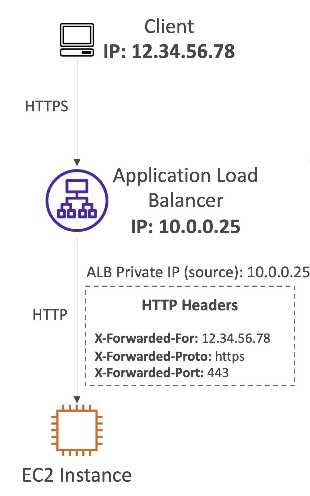

# X-Forwarded Headers (HTTP)

  

EC2 인스턴스에 도달하는 요청은 ELB를 통해 전달되기 때문에, EC2 인스턴스는 ALB의 IP 주소만 알 수 있음.
그렇다면, EC2 인스턴스가 바라볼 요청의 IP 주소가 실제로 어디서 오는지 알 수 있을까?

- 표준이 아닌 HTTP 헤더로 **`X-Forwarded`** 접두사가 붙음
- ELB가 클라이언트 정보를 대상에게 전달하기 위해 사용됨(예: 클라이언트 IP 주소)
- 서버에서 클라이언트 요청을 기록하는 데 사용할 수 있음
- **Classic Load Balancer(HTTP/HTTPS)** 및 **Application Load Balancer**에서 지원됨
- **`X-Forwarded-For`**
    - 클라이언트의 IP 주소를 포함
    - 여러 IP 주소(예: 프록시)의 쉼표로 구분된 목록을 포함할 수 있음(왼쪽 가장 자리는 클라이언트 IP 주소)
- **`X-Forwarded-Proto`** – 클라이언트와 ELB 간에 사용된 프로토콜(HTTP/HTTPS)
- **`X-Forwarded-Port`** – 클라이언트가 ELB에 연결하는 데 사용한 대상 포트

