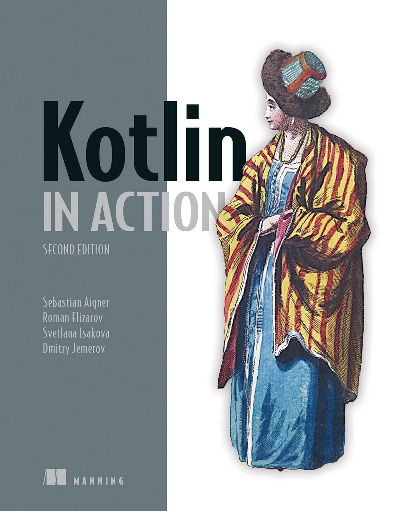

## Kotlin in Action 2/e

**Kotlin in Action, Second Edition**

<small><i>2024-03-10 ~ Present</i></small>

  

 

### Part 1. Introducing Kotlin

<b>CHAPTER 05. Programming with lambdas</b>

 

<a href="./chapter05"> 🔗 link </a>
 

**TL;DR**

- **Lambda**: 다른 함수에 넘길 수 있는 작은 코드 조각
- **코틀린의 람다 문법**
  - 함수 인자로 전달할 경우, 괄호 밖으로 람다 표현 가능 → 코드 간결화
  - 인자가 하나일 경우, `it` 사용 가능 → 짧고 간단한 코드 작성 가능
- **람다와 외부 변수 캡처**
  - 외부 변수 캡처 가능
  - 자바와 달리, 바깥 함수의 변수를 읽거나 수정 가능
- **함수 참조**
  - `::메서드이름`, `::생성자이름`, `::프로퍼티이름` 사용 → 참조 생성 가능
  - 참조를 함수 인자로 전달 가능
- **컬렉션 함수 (`filter`, `map`, `all`, `any`)** 내에서 직접 원소 이터레이션 없이 컬렉션 연산 수행 가능
- SAM 인터페이스 구현 시, SAM 인터페이스 객체 생성 없이 람다를 전달해서 구현 가능
- **수신 객체 지정 람다**: 수신 객체의 메서드 직접 호출 가능
- 기존 코드와 다른 컨텍스트에서 동작 → 코드 구조화할 때 유용
- **표준 라이브러리 함수 활용**
  - **`with`** : 객체 참조 반복 없이 메서드 호출 가능
  - **`apply`** : 빌더 스타일 API로 객체 생성 및 초기화 가능
  - **`also`** : 객체에 대한 추가 작업 수행 가능

 

<b>CHAPTER 06. Working with collections and sequences</b>

 

<a href="./chapter06"> 🔗 link </a>
 

**TL;DR**

- **표준 라이브러리 함수**와 **람다**를 활용해 컬렉션을 효율적으로 처리할 수 있음
  - `filter`: Boolean 값이 결과인 함수로 컬렉션의 원소를 걸러내고 싶을 때 사용
    - `filterIndexed`: `filter`와 인덱스를 함께 필요할 때 사용
  - `map`: 입력 컬렉션의 원소를 입력한 람다 함수로 처리한 값으로 변환
    - `mapIndexed`: `map`와 인덱스를 함께 필요할 때 사용
  - `reduce`: 람다(누적기, accumulator)는 각 원소에 별로 호출되며 새로운 누적 값을 반환
    - `runningReduce`: `reduce` 연산의 모든 중간 누적 값을 포함해서 반환
  - `fold`: 람다에 컬렉션의 각 값과 이전 누적기를 적용하면서 누적기로 점차 결과를 만들어나감
    - `runningFold`: `fold` 연산의 모든 중간 누적 값을 포함해서 반환
  - `all`: 컬렉션의 모든 원소가 특정 조건을 만족하는지 판단
  - `any`: 컬렉션의 원소가 하나라도 있는지 판단 (= `!all`)
  - `none`: 컬렉션의 조건을 만족하는 원소가 전혀 없는지 판단 (= `!any`)
  - `count`: 조건을 만족하는 원소의 개수를 반환
  - `find`: 조건을 만족하는 첫 번째 원소를 반환
  - `partition`: 술어를 만족하는 그룹과 그렇지 않은 그룹으로 나눌 때 사용 (= `filter` + `filterNot`)
  - `groupBy`: 컬렉션의 원소를 어떤 특성에 따라 여러 그룹으로 나눌 때 사용
  - `associate`: **컬렉션으로부터 맵을 만들어내고 싶을 때** 사용
    - `associateWith`: **컬렉션 원소**를 **키**로 사용하고, **맵의 값**을 **생성하는 람다** 입력
    - `associateBy`: **컬렉션 원소**를 **맵의 값**으로 하고, **입력한 람다가 만들어내는 값**을 **맵의 키**로 사용
  - `replaceAll`: `MutableList` 에 적용하면 지정한 람다의 결과로 컬렉션의 모든 원소를 변경
  - `fill`: 가변 리스트의 모든 원소를 똑같은 값으로 바꾸는 특별한 경우에는 함수를 쓸 수 있음
  - `ifEmpty`: **컬렉션이 비어있을 때 기본값을 생성하는 람다를 제공**할 수 있음
    - `ifBlank`: **문자열**에서 **'공백(`" "`)'과 '비어있음(`""`)'일 때, 기본값을 지정**
  - `windowed`: 데이터를 연속적인 시간의 값들로 처리하고 싶을 경우, 슬라이딩 윈도우를 생성
  - `chunked`: 컬렉션을 주어진 크기의 서로 겹치지 않는 (서로소) 부분으로 나누고 싶을 때 사용
  - `zip`: 각 리스트의 값들이 서로의 인덱스에 따라 대응되는 경우, 두 컬렉션에서 같은 인덱스에 있는 원소들의 쌍으로 이뤄진 리스트 생성
  - `flatMap`: 컬렉션의 각 원소를 파라미터로 주어진 함수를 사용해 매핑 한 후, 변환한 결과를 하나의 리스트로 펼침
  - `flatten`: 변환할 것이 없고 단지 컬렉션의 컬렉션을 평평한 컬렉션으로 만들 경우 사용
- **시퀀스**를 활용하면 중간 결과 없이 연산을 지연 계산하여 성능을 최적화할 수 있음.
  - `asSequence()`: 컬렉션에 `asSequence()`를 호출해서 시퀀스로 변경
  - `generateSequence`: 주어진 이전의 원소로, 다음 원소를 계산

 

<b>CHAPTER 07. Working with nullable values</b>

 

<a href="./chapter07">🔗 link</a>
 

**TL;DR**

- 코틀린은 널이 될 수 있는 타입을 지원해 `NullPointerException` 오류를 컴파일 시점에 감지할 수 있음
- **안전한 호출 (`?.`)**: 널이 될 수 있는 객체의 메서드를 호출하거나 프로퍼티에 접근할 수 있음
- **엘비스 연산자 (`?:`)**: 어떤 식이 null 일 때 대신할 값을 지정할 수도 있고, 실행을 반환시키거나 예외를 던질 수도 있음
- **널 아님 단언 (`!!`)**: 컴파일러에게 주어진 값이 null 이 아니라고 약속하는 것
  - null 값에 대한 책임은 개발자에게 있음
- **`let` 함수**: 자신이 호출된 수신 객체를 람다에게 전달
  - 안전한 호출 연산자와 `let`을 함께 사용하면 널이 될 수 있는 타입의 객체를 널이 될 수 없는 타입으로 변환하는 효과가 있음
- **`as?` 연산자**: 값을 다른 타입으로 변환하는 것과 변환이 불가능한 경우를 처리하는 것을 한꺼번에 편리하게 처리할 수 있음

 

<b>CHAPTER 08. Basic types, collections, and arrays</b>

 

<a href="./chapter08">🔗 link</a>
 

**TL;DR**

- 기본적인 수를 표현하는 타입은 일반 클래스같지만 보통 자바의 원시 타입으로 컴파일됨
  - e.g. Kotlin `Int` → Java `int`
  - **코틀린의 부호 없는 수 클래스**
    - JVM 에는 상응하는 타입이 없음
    - 인라인 클래스를 통해 변환되며 원시 타입과 마찬가지 성능을 냄
- 널이 될 수 있는 원시 타입은 자바의 박싱된 원시 타입에 대응
  - e.g. Kotlin `Int` → Java `java.lang.Integer`
- `Any` 타입: 모든 다른 타입의 상위 타입. 자바 `Object` 타입에 대응.
- `Unit` 타입: 자바 `void`에 대응
- `Nothing` 타입은 함수가 정상적으로 끝나지 않는다는 것을 나타내는 타입
- 자바에서 온 타입은 코틀린에서 플랫폼 타입
- 코틀린 컬렉션은 표준 자바 클래스를 사용하지만, '읽기 전용'과 '변경 가능'한 컬렉션을 구분
- 코틀린에서 자바 클래스를 확장하거나 자바 인터페이스를 구현해야 한다면, 파라미터의 널 가능성과 변경 가능성을 주의 깊게 생각해야 함
- 코틀린에서도 배열을 사용할 수 있음. 하지만 컬렉션 권장
- 코틀린 `Array` 는 일반적 제네릭 클래스처럼 보이지만 **자바 배열**로 컴파일 됨
  - e.g. Kotlin `intArrayOf(0, 0, 0, 0, 0)` → Java `int[]`

 

### Part 2. Embracing Kotlin

<b>CHAPTER 09. Operator overloading and other conventions</b>

 

<a href="./chapter09">🔗 link</a>
 

**TL;DR**

- 코틀린은 정해진 컨벤션에 따라 함수를 정의해서 수학 연산을 오버로드할 수 있음
- 비교 연산자 (`=`, `!=`, `>`, `<` 등 ) 를 모든 객체에 사용할 수 있음
  - 비교 연산자는 `equals`와 `compareTo` 메서드 호출로 변환됨
- 자신이 정의한 클래스의 인스턴스에 대해 `[]` 와 `in` 연산을 사용할 수 있음
  - 단, 해당 클래스에 `get`, `set`, `contains` 함수 정의 필수
- 미리 정해진 컨벤션을 따라 범위를 만들거나 컬렉션과 배열의 원소를 이터레이션할 수 있음
  - `rangeTo`, `rangeUntil`
- 구조 분해 선언을 통해 한 객체의 상태를 분해해서 여러 변수에 대입할 수 있음
  - 데이터 클래스에 대해 구조 분해를 사용할 수 있음
  - 혹은, 클래스에 `componentN` 함수를 정의하면 구조 분해를 지원할 수 있음
- **위임 프로퍼티**를 통해 프로퍼티 값을 저장하거나 초기화하거나 읽거나 변경할 때 사용하는 로직을 재활용할 수 있음
- 표준 라이브러리 함수인 `lazy` 를 통해 지연 초기화 프로퍼티를 쉽게 구현할 수 있음
- `Delegates.observable` 함수를 사용하면 프로퍼티 변경을 관찰할 수 있는 옵저버를 쉽게 추가할 수 있음
- 맵을 위임 객체로 사용하는 위임 프로퍼티를 통해 다양한 속성을 제공하는 객체를 유연하게 다룰 수 있음

 

<b>CHAPTER 10. Higher-order functions:Lambdas as parameters and return values</b>

 

<a href="./chapter10">🔗 link</a>
 

**TL;DR**

 

<b>CHAPTER 11. Generics</b>

 

<a href="./chapter11">🔗 link</a>
 

**TL;DR**

- 코틀린 제네릭스는 자바와 아주 비슷해서, 제네릭 함수와 클래스를 자바와 비슷하게 선언할 수 있음
- **타입 소거** Type Erasure: 타입 인자가 실행 시점에 지워짐
  - 제네릭 타입의 타입 인자는 컴파일 시점에만 존재 (자바와 동일)
  - 제네릭 타입을 `is` 연산자로 검사할 수 없음
- 인라인 함수의 타입 파라미터를 `reified`로 표시해서 실체화
  - 실행 시점에 그 타입을 `is`로 검사하거나 `java.lang.Class` 인스턴스를 얻을 수 있음
- 변성은 **베이스 클래스가 같고 타입 파라미터가 다른 두 제네릭 타입 사이**의 상하위 타입 관계를 명시하는 방법
- 제네릭 클래스의 타입 파라미터가 **아웃 위치**에서만 사용되는 경우: 타입 파라미터를 `out` 으로 표시해서 공변성 명시 - 생성자
- 제네릭 클래스의 타입 파라미터가 **인 위치**에서만 사용되는 경우: 타입 파라미터를 `in` 으로 표시해서 반공변성 명시 - 소비자
- 공변성의 반대는 반공변성.
  - 코틀린의 읽기 전용 `List` 인터페이스: **공변적** ← `List<String>`은 `List<Any>`의 하위 타입
  - `Function1<in P, out R>` 함수 인터페이스: **첫 번째 타입 파라미터**에 대해서는 **반공변적**, **두 번째 타입 파라미터**에 대해서는 **공변적**
    - `(Animal) -> Int` 는 `(Cat) -> Number` 의 하위 타입
    - 즉, 함수 타입은 함수 파라미터 타입에 대해서는 반공변적이며 함수 반환 타입에 대해서는 공변적
- 코틀린에서의 제네릭 클래스의 **공변성 정의 지점**:
  - **선언 지점 변성**: 전체적으로 지정
  - **사용 지점 변성**: 구체적인 사용 위치에서 지정
- **스타 프로젝션**: 제네릭 클래스의 타입 인자가 어떤 타입인지 정확히 모르거나 혹은 중요하지 않을 때 사용
- **타입 별명**: 타입에 대해 더 짧은 이름이나 다른 이름을 부여
  - 타입 별명은 컴파일 시점에 원래의 타입으로 치환.

 

<b>CHAPTER 12. Annotations and reflection</b>

 

<a href="./chapter12">🔗 link</a>
 

**TL;DR**

- 코틀린에서는 넓은 범위(파일, 식 등)의 타깃에 대해 어노테이션을 붙일 수 있음
- 어노테이션 인자로 기본 타임 값, 문자열, 이넘, 클래스 참조, 다른 어노테이션 클래스의 인스턴스, 배열을 사용할 수 있음
- 어노테이션의 사용 지점 타깃을 명시 가능 (e.g. `@get:JvmName`)
  - 여러 가지 바이트코드 요소를 만들어내는 경우, 정확히 어떤 부분에 어노테이션을 적용할지 지정할 수 있음
- 어노테이션 클래스 정의: `annotation class` 
  - 모든 파라미터를 `val` 프로퍼티로 표시한 주 생성자가 있어야 하고, 본문은 없어야 함
- 메타어노테이션을 사용해 타깃, 어노테이션 유지 모드 등 여러 어노테이션 특성을 지정할 수 있음
- **리플렉션 API**: 실행 시점에 객체의 메서드와 프로퍼티를 동적으로 열거하고 접근할 수 있음. 
  - 리플렉션 API에는 클래스(`KClass`), 함수(`KFunction`) 등 여러 종류의 선언을 표현하는 인터페이스가 있음
- `::class`로 `KClass` 인스턴스 가져오기
  - 클래스는 `ClassName::class`를 사용
  - 객체는 `objName::class`를 사용
- `Function`과 `KProperty` 인터페이스는 모두 `Kcallable` 을 확장
  - `KCallable`은 제네릭 `call` 메서드 제공
  - `KCallable.callBy` 메서드: 메서드 호출 시, 디폴트 파라미터 값을 사용할 수 있음
- `KFunction0`, `KFunction1` 등의 인터페이스는 모두 파라미터 개수가 다른 함수를 표현하며 `invoke` 메서드를 사용해 함수를 호출할 수 있음
- `KProperty`, `KProperty1` 은 수신 객체의 개수가 다른 프로퍼티들을 표현하며 값을 얻기 위한 `get` 메서드를 지원
- `KMutableProperty0` 과 `KMutableProperty1`은 각각 `KProperty0` 과 `KProperty1` 을 확장하며 `set` 메서드를 통해 프로퍼티 값을 변경할 수 있음
- `KType` 의 실행 시점 표현을 얻기 위해 `typeOf<T>()` 함수 사용

 

<b>CHAPTER 13. DSL construction</b>

 

<a href="./chapter13">🔗 link</a>
 

**TL;DR**

- **코틀린 내부 DSL**: 여러 메서드 호출 구조를 쉽게 표현할 수 있게 해주는 API 설계 패턴
  - 코틀린 내부 DSL을 사용하면 코드를 추상화하고 재활용할 수 있음
- **람다 수신 객체**Lambdas with receivers: 람다 본문 내에서 메소드를 어떻게 실행할지 재정의해서 중첩 구조를 쉽게 구조화함
  - 수신 객체 지정 람다를 파라미터로 받은 경우 그 람다의 타입은 **확장 함수타입**
  - 람다를 파라미터로 받아 사용하는 함수는 **람다를 호출하면서 람다에게 수신 객체를 제공**
- 원시 타입에 대한 확장을 정의하면 상수를 가독성있게 다룰 수 있음 (e.g. 기간)
- **`invoke` 컨벤션**을 사용하면 **임의의 객체를 함수처럼 다룰 수 있음**
- [🔗 Kotest](https://github.com/kotest/kotest), [Exposed](https://github.com/JetBrains/Exposed) 는 각각 단위 테스트, 데이터베이스를 위한 단언문을 지원하는 내부 DSL 제공

 

<b>CHAPTER 14. Coroutines</b>

 

<a href="./chapter14">🔗 link</a>
 

**TL;DR**

- **동시성**: 여러 작업을 동시에 처리하는 것
  - 여러 작업의 여러 부분이 서로 번갈아 실행되는 방식
- **병렬성**: 물리적으로 동시에 실행되면서 현대 멀티코어 시스템을 효과적으로 활용하는 것
- **코루틴**: 스레드 위에서 동시 실행을 위해 동작하는 경량 추상화
- **일시 중단 함수**: 실행을 잠시 멈출 수 있는 함수. 코틀린의 핵심 동시성 기본 요소.
  - 다른 일시 중단 함수나 코루틴 안에서 일시 중단 함수를 호출할 수 있음
  - 일시 중단 함수는 코드의 형태를 유지
    - 코드는 여전히 순차적으로 보임
    - 반응형 스트림, 콜백, 퓨처 같은 다른 접근 방식에 비해 큰 장점
- **코루틴**은 일시 중단 가능한 계산의 인스턴스
- 코루틴은 **스레드를 블로킹하는 문제를 피함**
  - 스레드 블로킹이 문제가 되는 이유는 스레드 생성에 비용이 많이 들고, 시스템 자원이 제한적이기 때문
- 코루틴 빌더: 새로운 코루틴을 생성 → `runBlocking`, `launch`, `async`
- **디스패처**는 코루틴이 실행될 스레드나 스레드 풀을 결정
  - `Dispatchers.Default`: 일반적인 용도
  - `Dispatchers.Main`: UI 스레드에서 작업
  - `Dispatchers.IO`: 블로킹되는 I/O 작업을 호출할 때 사용
  - **다중스레드 디스패처**는 여러 코루틴이 병렬로 같은 데이터를 변경할 때 주의가 필요
    - 다중스레드 디스패처 예시: `Dispatchers.Default` 나 `Dispatchers.IO` 와 같은 대부분의 디스패처
- 코루틴을 생성할 때 **디스패처를 지정**하거나 **`withContext`를 사용해 디스패처를 변경**할 수 있음
- 코루틴 콘텍스트에는 코루틴과 연관된 추가 정보가 들어있음
  - e.g. 코루틴 디스패처
 

<b>CHAPTER 15. Structured concurrency</b>

 

<a href="./chapter15">🔗 link</a>
 

**TL;DR**

- **구조화된 동시성**: 코루틴의 작업을 제어할 수 있게 해주며, 코루틴이 취소되지 않고 계속 실행되는 것을 방지
- **일시 중단 함수 `coroutineScope` vs. `CoroutineScope` 생성자 함수**
  - 둘 다 새로운 코루틴 스코프를 생성할 수 있음
  - `coroutineScope`: 작업을 병렬로 분해하기 위한 함수
    - 여러 코루틴을 시작하고 결과를 계산한 후 그 결과를 반환
  - `CoroutineScope`: 클래스의 생명 주기와 코루틴을 연관시키는 스코프를 생성
    - 일반적으로 `SupervisorJob` 과 함께 사용됨
- `GlobalScope`: 특별한 코루틴 스코프
  - 구조화된 동시성을 깨뜨리기 때문에 애플리케이션 코드에서는 사용하지 말아야 함
- **코루틴 컨텍스트**
  - 개별 코루틴이 어떻게 실행되는지 관리
  - 코루틴 계층을 따라 상속됨
- 코루틴과 코루틴 스코프 간의 부모-자식 계층 구조는 코루틴 컨텍스트에 있는 `Job` 객체를 통해 설정됨
- **일시 중단 지점**: 코루틴이 일시 중단될 수 있고, 다른 코루틴이 작업을 시작할 수 있는 지점
- **취소**
  - 일시 중단 지점에서 `CancellationException` 을 던지는 방식으로 구현됨
  - 취소는 정상적인 상황이므로 코드는 이를 처리할 수 있게 설계해야 함
  - **취소 예외**처리: 절대 무시(잡아내고 처리하지 않음)되면 안됨
    - 예외를 다시 던지든지 아니면 아예 잡아내지 않는 것이 좋음
- `cancel` 이나 `withTimeoutOrNull` 같은 함수를 사용해 직접 취소를 호출할 수 있음
  - 기존의 여러 프레임워크도 코루틴을 자동으로 취소할 수 있음
- 함수에 `suspend` 변경자를 추가하는 것만으로는 취소를 지원할 수 없음
- `ensureActive`, `yield` 함수, `isActive` 속성: 코틀린 코루틴은 취소 가능한 일시 중단 함수를 작성하는 데 필요한 유틸리티 제공
- 프레임워크는 `CoroutineScope` 를 사용해 코루틴을 애플리케이션의 생명 주기와 연결하는 데 도움을 줌
  - e.g. 화면에 `ViewModel` 이 표시되는 동안이나 요청 핸들러가 실행되는 동안

 

<b>CHAPTER 16. Flow</b>

 

<a href="./chapter16">🔗 link</a>
 

**TL;DR**

## Summary

- **코틀린 플로우**: **시간이 지남에 따라 발생하는 값을 처리**할 수 있는 코루틴 기반의 추상화
- 플로우는 두 가지 유형 존재:
1. **핫 플로우**
  - 항상 활성 상태
  - 여러 구독자와 연결됨
  - 핫 플로우의 두 종류: 공유 플로우, 상태 플로우
    - **공유 플로우**: 코루틴 간에 값을 브로드캐스트 방식으로 전달하는 데 활용 가능
      - 공유 플로우의 구독자는 **구독을 시작한 시점부터 배출된 값을 받으며**, 재생된 값도 수신할 수 있음
    - **상태 플로우**: 동시성 시스템에서 상태를 관리할 때 활용 가능
      - 상태 플로우는 동등성 기반 통합을 수행. 
        - 값이 실제로 변경된 경우에만 배출이 발생하고, 같은 값이 여러 번 대입되면 배출이 발생하지 않는다는 뜻
2. **콜드 플로우**
  - 기본적으로 비활성 상태
  - 하나의 수집자와 연결됨
  - `flow` 빌더 함수로 콜드 플로우를 생성, `emit` 함수로 비동기적으로 값을 제공
  - **채널 플로우**는 콜드 플로우의 특수 유형
    - 여러 코루틴에서 `send` 함수를 통해 값 배출

- `shareIn`이나 `stateIn` 함수를 통해 콜드 플로우를 핫 플로우로 전환할 수 있음

 

<b>CHAPTER 17. Flow Operator</b>

 

<a href="./chapter17">🔗 link</a>
 

**TL;DR**

## Summary

- **중간 연산자**
  - 기존 플로우를 **다른 플로우로 변환**
  - **업스트림 플로우에 대해 작동**하며 **다운스트림 플로우를 반환**
  - **콜드 상태** → 최종 연산자가 호출될 때까지 실행되지 않음
- 플로우는 다양한 중간 연산자 제공 
  - `transform`: 변환을 수행
  - `collect`: 플로우가 실행되는 컨텍스트를 관리
  - 특정 단계에서 코드를 실행 → `onStart`, `onCompletion` 등
- 시퀀스에 사용할 수 있는 중간 연산자 상당수를 플로우에도 직접 사용할 수 있음
- 최종 연산자는 플로우의 코드를 실행
  - e.g. `collect` 연산자
  - 핫 플로우의 경우 `collect`는 플로우에 대한 구독을 처리
- **커스텀 연산자**: 플로우 빌더 안에서 플로우를 수집하고 변환된 원소를 배출하는 방식으로 자신만의 중간 연산자를 만들 수 있음

 

<b>CHAPTER 18. Error handling and testing</b>

 

<a href="./chapter18">🔗 link</a>
 

**TL;DR**

## Summary

- 한 코루틴 내부의 예외는 일반 코드처럼 처리 가능함
  - 코루틴 경계를 넘는 예외는 특별한 주의가 필요
- 처리되지 않은 예외 발생 시, 부모와 형제 코루틴이 모두 취소되는 구조적 동시성 적용
- `supervisorScope`와 `SupervisorJob`은 자식 중 하나가 실패해도 **나머지를 취소하지 않음**. 
  - 예외 전파를 막는 역할을 함
- `await`는 `async` 코루틴의 **예외를 다시 던지는 동작**을 함
- 슈퍼바이저는 장기 실행되는 애플리케이션 영역에서 자주 사용됨
  - 프레임워크에 내장된 부품으로 제공되는 경우도 있음
- **처리되지 않은 예외는 슈퍼바이저 또는 최상위 코루틴까지 전파**됨
  - 이후 `CoroutineExceptionHandler`로 전달되는 흐름을 가짐
  - 예외 핸들러가 없으면 시스템의 전역 예외 핸들러로 전달됨
- JVM은 예외를 콘솔에 기록하고, 안드로이드는 앱을 종료시키는 차이점이 있음
- `CoroutineExceptionHandler`는 예외를 잡지는 못하지만, 예외 기록 방식을 커스터마이징하는 마지막 수단임. 
  - 계층의 최상단에 있는 **루트 코루틴의 컨텍스트에 위치**함

 

