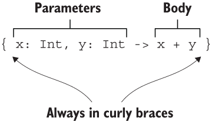
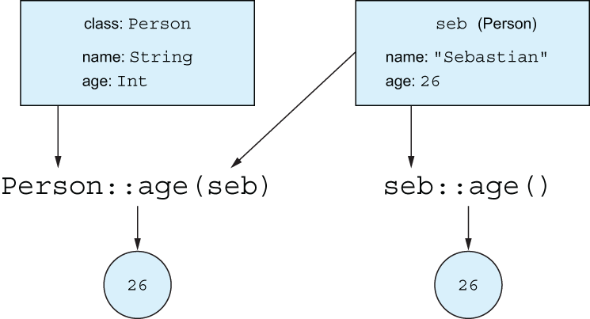
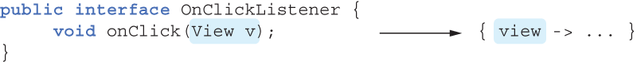

# CHAPTER 5. Programming with lambdas

<small><i>람다를 사용한 프로그래밍</i></small>

**TL;DR**
- **Lambda**: 다른 함수에 넘길 수 있는 작은 코드 조각
- **코틀린의 람다 문법**
  - 함수 인자로 전달할 경우, 괄호 밖으로 람다 표현 가능 → 코드 간결화
  - 인자가 하나일 경우, `it` 사용 가능 → 짧고 간단한 코드 작성 가능
- **람다와 외부 변수 캡처**
   - 외부 변수 캡처 가능
   - 자바와 달리, 바깥 함수의 변수를 읽거나 수정 가능
- **함수 참조**
  - `::메서드이름`, `::생성자이름`, `::프로퍼티이름` 사용 → 참조 생성 가능
  - 참조를 함수 인자로 전달 가능
- **컬렉션 함수 (`filter`, `map`, `all`, `any`)** 내에서 직접 원소 이터레이션 없이 컬렉션 연산 수행 가능
- SAM 인터페이스 구현 시, SAM 인터페이스 객체 생성 없이 람다를 전달해서 구현 가능
- **수신 객체 지정 람다**: 수신 객체의 메서드 직접 호출 가능
- 기존 코드와 다른 컨텍스트에서 동작 → 코드 구조화할 때 유용
- **표준 라이브러리 함수 활용**
  - **`with`** : 객체 참조 반복 없이 메서드 호출 가능
  - **`apply`** : 빌더 스타일 API로 객체 생성 및 초기화 가능
  - **`also`** : 객체에 대한 추가 작업 수행 가능

<br/><br/>

---

<br/>

**람다** (lambda expression): 람다식. 다른 함수에 넘길 수 있는 작은 코드 조각

## 5.1 Lambda expressions and member references

<small><i>람다식과 멤버 참조</i></small>

### 5.1.1 Introduction to lambdas: Blocks of code as values

<small><i>람다 소개: 코드 블록을 값으로 다루기</i></small>

익명 내부 클래스를 사용하면 코드를 함수에 넘기거나 변수에 저장할 수 있기는 하지만 상당히 번거로움

→ 함수를 값처럼 다루기
: 클래스를 선언하고 그 클래스의 인스턴스를 함수에 넘기는 대신, 함수를 직접 다른 함수에 전달할 수 있음

<br/>

> ### 함수형 프로그래밍
> - **First-class functions**: 함수를 값으로 다룰 수 있음. 
>   - 함수를 변수에 저장하거나 파라미터로 전달, 함수를 반환할 수 있음 
>   - 코틀린에서 람다는 함수를 일급 시민으로 다룸
> - **Immutability**: 불변성. 생성된 후에는 내부 상태가 변하지 않음을 보장하는 방법으로 설계 가능 
> - **No side effects**: 함수가 똑같은 입력에 대해 항상 같은 출력을 내놓고 다른 객체나 외부 세계의 상태를 변경하지 않게 구성.
>   - 파라미터 외에는 외부 세계로 부터 영향을 받지 않음
>   - 순수 함수

<br/>

<table>
<tr>
<th>Object 선언</th>
<th>Lambda</th>
</tr>
<tr>
<td>
<pre><code lang="kotlin">button.setOnClickListener(object: OnClickListener {
  override fun onClick(v: View) {
    println("I was clicked!")
  }
})
</code></pre>
</td>
<td>
<pre><code lang="kotlin">button.setOnClickListener {
  println("I was clicked!")
}
</code></pre>
</td>
</tr>
</table>

<br/>

### 5.1.2 Lambdas and collections

<small><i>람다와 컬렉션</i></small>

중복 제거는 중요한 코드 개선 중 하나 

<pre><code>data class Person(val name: String, val age: Int)
</code></pre>


<table>
<tr>
<th>Object 선언</th>
<th>Lambda</th>
</tr>
<tr>
<td>
<pre><code lang="kotlin">
fun findTheOldest(people: List<Person>) {
    var maxAge = 0                        ❶
    var theOldest: Person? = null         ❷
    for (person in people) {
        if (person.age > maxAge) {        ❸
            maxAge = person.age
            theOldest = person
        }
    }
    println(theOldest)
}

fun main() {
    val people = listOf(Person("Alice", 29), Person("Bob", 31))
    findTheOldest(people)
    // Person(name=Bob, age=31)
}
</code></pre>
</td>
<td>
<pre><code lang="kotlin">
fun main() {
    val people = listOf(Person("Alice", 29), Person("Bob", 31))
    println(people.maxByOrNull { it.age })                        ❶
    // Person(name=Bob, age=31)
}
</code></pre>
</td>
</tr>
<tr>
<td>
❶ 가장 큰 나이를 저장<br/>
❷ 가장 나이가 많은 사람을 저장<br/>
❸ 더 나이가 많으면 최댓값 변경
</td>
<td>
❶ age 비교로 가장 큰 원소 찾기
</td>
</tr>
</table>

람다가 단순히 함수나 프로퍼티에 위임할 경우에는 멤버 참조를 사용할 수 있음

<table>
<tr>
    <th>멤버 참조를 사용해 컬렉션 검색</th>
</tr>
<tr>
    <td><pre><code lang="kotlin">people.maxByOrNull(Person::age)</code></pre></td>
</tr>
</table>

<br/>

### 5.1.3 Syntax for lambda expressions

<small><i>람다식의 문법</i></small>

**람다식을 선언하기 위한 문법**

<br/><br/>

코틀린 람다식은 중괄호 `{}` 로 둘러싸여 있고, 화살표 (`->`)로 파라미터와 본문을 구분


**람다식을 변수에 저장**

```kotlin
fun main() {
    val sum = { x: Int, y: Int -> x + y }
    println(sum(1, 2))
    // 3
}
```

**람다식을 직접 호출**

```kotlin
fun main() {
    { println(42) } // 42
}
```

위의 경우, 읽기 어렵고 그다지 쓸모 없음

→ `run` 사용

`run`은 인자로 받은 람다를 실행해 주는 라이브러리 함수


```kotlin
fun main() {
    run { println(42) } // 42
}
```

**식**이 필요한 부분에 **코드 블록**을 실행하고 싶을 때 아주 유용

```kotlin
val myFavoriteNumber = run {
    println("I'm thinking!")
    println("I'm doing some more work...")
    42
}
```

이 때, `run`은 호출에 부가 비용 없이 비슷한 성능을 냄 (10장 2절 참고)

<br/>

<table>
<tr>
<td>1</td>
<td>
정식 람다 표기법:

<pre><code lang="kotlin">people.maxByOrNull<b>({ p: Person -> p.age })</b></code></pre></td>
</tr>
<tr>
<td>2</td>
<td>
코틀린 문법: 함수 호출 시 맨 뒤에 있는 인자가 람다식이면, 그 람다를 괄호 밖으로 빼낼 수 있음

<pre><code lang="kotlin">people.maxByOrNull<b>()</b> { p: Person -> p.age }</code></pre>
</td>
</tr>
<tr>
<td>3</td>
<td>
코틀린 문법: 람다가 어떤 함수의 유일한 인자이고 괄호 밖에 람다를 썼다면, 호출 시 빈 괄호를 없애도 됨

<pre><code lang="kotlin">people.maxByOrNull { p<b>: Person</b> -> p.age }</code></pre>
</td>
</tr>
<tr>
<td>4</td>
<td>
파라미터 타입을 반드시 명시할 필요 없음: 컴파일러는 로컬 변수처럼 람다 파라미터의 타입도 추론할 수 있기 때문

<pre><code lang="kotlin">people.maxByOrNull { <b>p -> p</b>.age }</code></pre>

람다를 **변수에 저장할 때**는 파라미터의 타입을 추론할 문맥이 존재하지 않기 때문에 **파라미터 타입을 명시해야 함**.

<pre><code lang="kotlin">val getAge = { p: Person -> p.age }
people.maxByOrNull(getAge)</code></pre>
</td>
</tr>
<tr>
<td>5</td>
<td>
람다 파라미터 명을 디폴트 이름인 `it`으로 변경

<pre><code lang="kotlin">people.maxByOrNull <b>{ it.age }</b></code></pre>

람다 파라미터 이름을 따로 지정하지 않은 경우에만 it 이라는 이름이 자동으로 만들어짐
</td>
</tr>
<tr>
<td>6</td>
<td>
멤버 참조를 통해 더 짧게 쓸 수 있음

<pre><code lang="kotlin">people.maxByOrNull(Person::age)</code></pre>
</td>
</tr>
</table>


본문이 여러 줄로 이뤄진 경우 본문의 맨 마지막에 있는 식이 람다의 결과 값이 됨

```kotlin
fun main() {
    val sum = { x: Int, y: Int ->
       println("Computing the sum of $x and $y...")
       x + y
    }
    println(sum(1, 2))
    // Computing the sum of 1 and 2...
    // 3
}
```

<br/>

### 5.1.4 Accessing variables in scope

<small><i>현재 영역에 있는 변수 접근</i></small>

함수 내 람다 선언 시, **람다 본문에서 외부 영역인 함수의 파라미터와 로컬 변수를 참조할 수 있음**

<pre><code lang="kotlin">
fun printMessagesWithPrefix(messages: Collection&lt;String&gt;, <b>prefix: String</b>) {
    messages.forEach {
        println("<b>$prefix</b> $it")
    }
}
</code></pre>

`forEach` Lambda 함수 내에서 외부 함수 `printMessagesWithPrefix`의 파라미터인 `prefix` 참조

- 자바 람다는 final 변수만 참조 가능
- 코틀린 람다는 final 변수가 아니어도 참조 가능

<br/>

#### 코틀린에서 변경 가능한 변수를 참조할 수 있는 방법: Capturing a mutable variable

```kotlin
fun main() {
    val counter = 0
    val inc = { counter.value++ }    // 공식적으로는 변경 불가능한 변수를 캡처했지만 그 변수가 가리키는 객체의 필드 값을 바꿀 수 있음
}
```

위 코드는 실제로 아래 코드로 동작함 

```kotlin
class Ref<T>(var value: T)           // 변경 가능한 변수를 캡처하는 방법을 보여주기 위한 클래스
 
fun main() {
    val counter = Ref(0)
    val inc = { counter.value++ }    // 공식적으로는 변경 불가능한 변수를 캡처했지만 그 변수가 가리키는 객체의 필드 값을 바꿀 수 있음
}
```

#### 🚨주의할 함정

람다를 이벤트 핸들러나 비동기적으로 실행되는 코드로 활용하는 경우, **변수 변경은 람다 실행 내에서만 일어남**.

```Kotlin
fun tryToCountButtonClicks(button: Button): Int {
    var clicks = 0
    button.onClick { clicks++ }
    return clicks                   // ← 항상 0 반환
}
```

<br/>

### 5.1.5 Member references

<small><i>멤버 참조</i></small>

**멤버 참조**(member reference): 이미 선언된 함수의 경우, 이중 콜론(`::`)을 사용해 해당 함수를 값으로 바꿔 인자로 직접 넘길 수 있음.

`::` 은 클래스 이름과 참조하려는 멤버 (프로퍼티나 메서드) 이름 사이에 위치

```kotlin
people.maxByOrNull(Person::age)                        // 두 표현식은
people.maxByOrNull { person: Person -> person.age }    //         동일함
```

<br/>

#### 최상위 선언 함수 및 프로퍼티

최상위에 선언된 함수나 프로퍼티도 참조 가능

```Kotlin
fun salute() = println("Salute!")
 
fun main() {
    run(::salute)      // Salute!
}
```

<br/>

#### 인자가 여러 개인 함수의 작업 위임 시

```Kotlin
val action = { person: Person, message: String ->
    sendEmail(person, message)
}
val nextAction = ::sendEmail                    // 람다 대신 멤버 참조 사용 가능
```

<br/>

#### 생성자 참조 (constructor reference) 

클래스 생성 작업을 연기하거나 저장 가능

```kotlin
data class Person(val name: String, val age: Int)
 
fun main() {
    val createPerson = ::Person         // 인스턴스 생성 동작을 값으로 저장
    val p = createPerson("Alice", 29)
}
```

<br/>

#### 확장 함수

확장 함수도 동일한 방법으로 참조 가능

```kotlin
fun Person.isAdult() = age >= 21
val predicate = Person::isAdult
```

<br/>

### 5.1.6 Bound callable references

<small><i>값과 엮인 호출 가능 참조</i></small>
 
- 멤버 참조 구문과 형태 동일
- 특정 객체 인스턴스에 대한 메서드 호출에 대한 참조를 만들 수 있음

```Kotlin
fun main() {
    val seb = Person("Sebastian", 26)
    
    // 멤버 참조
    val personsAgeFunction = Person::age
    println(personsAgeFunction(seb))        // → 26
    
    // 바운딩된 멤버 참조
    val sebsAgeFunction = seb::age
    println(sebsAgeFunction())              // → 26
}
```

생성한 객체의 속한 값이 반환됨

<br/><br/>
<br/>

## 5.2 Using Java functional

<small><i>자바의 함수형 인터페이스 사용: 단일 추상 메서드</i></small>

코틀린 람다는 자바 API와 완전히 호환됨

가령, `setOnClickListener` 에  `OnClickListener`를 넘겨줄 때, 

```java
/* Java */
public class Button {
    public void setOnClickListener(OnClickListener l) { ... }
}

public interface OnClickListener {
    void onClick(View v);
}
```

다음과 같이 구현해서 넘겨줄 수 있음

```Kotlin
 /* Only since Java 8 */
button.setOnClickListener(view -> { /* ... */ });
 
 /* Kotlin */
button.setOnClickListener { view -> /* ... */ }
```

`onClickListener`을 구현하는 람다는 유일한 함수 onClick의 파라미터 타입 View 값을 받아 처리

<br/><br/>

즉, **함수형 인터페이스** 혹은 **단일 추상 메서드 (SAM, Single Abstract Method) 인터페이스**의 경우 해당됨

→ 단일 추상 메서드를 가진 인터페이스

_(자바 API 에는 Runnable, Callable 등의 함수형 인터페이스이 많이 사용중이며 활용하는 메서드도 많음)_

<br/>

### 5.2.1 Passing a lambda as a parameter to a Java method

<small><i>람다를 자바 메서드의 파라미터로 전달</i></small>


<table>
<tr>
<th colspan="2">Java</th>
</tr>
<tr>
<td colspan="2">함수형 인터페이스를 파라미터로 받는 자바 메서드
<pre><code lang="java">/* Java */ 
void postponeComputation(int delay, Runnable computation);</code></pre></td>
</tr>
<tr>
<th colspan="2">Kotlin</th>
</tr>
<tr>
<th>Lambda</th>
<th>Anonymous object</th>
</tr>

<tr>
<td>
<pre><code lang="kotlin">postponeComputation(1000) { println(42) }</code></pre>

전체 프로그램에 `Runnable` 인스턴스가 하나만 생성됨.
</td>
<td><pre><code lang="kotlin">postponeComputation(1000, object : Runnable {
    override fun run() {
        println(42)
    }
})
</code></pre>

`handleComputation` 호출마다 새 `Runnable` 인스턴스가 생성됨.
</td>
</tr>

</table>

<br/>

### 5.2.2 SAM constructors: Explicit conversion of lambdas to functional interfaces

<small><i>SAM 변환: 람다를 함수형 인터페이스로 명시적 변환</i></small>

**SAM 생성자**
- SAM 생성자는 **단일 인자**를 받아 함수형 인터페이스를 구현하는 클래스의 인스턴스를 반환.
  - 단일 인자 = 람다 = 함수형 인터페이스의 단일 추상 메서드 인자
- 컴파일러가 생성한 함수
- 람다를 명시적이게 단일 추상 메서드 인터페이스의 인스턴스로 변환해줌

<br/>

#### 활용 1. 컴파일러가 변환을 자동을 수행하지 못하는 경우 

가령, 함수형 인터페이스의 인스턴스를 반환하는 함수는 람다를 직접 반환할 수 없기 때문에,
람다를 SAM 생성자로 감싸야 함

<pre><code lang="kotlin">
fun createAllDoneRunnable(): Runnable {
    return <b>Runnable {</b> println("All done!") <b>}</b>
}
 
fun main() {
    createAllDoneRunnable().run() // All done!
}
</code></pre>

<br/>

#### 활용 2. 생성한 함수형 인터페이스 인스턴스를 변수에 저장해야 하는 경우

값을 반환할 때 외에 람다로 생성한 함수형 인터페이스 인스턴스를 변수에 저장해야 하는 경우에도 SAM 생성자를 사용할 수 있음

가령, 여러 버튼에 같은 리스너를 적용하고 싶을 때

→ SAM 생성자를 통해 람다를 함수형 인터페이스 인스턴스로 만들어 변수에 저장해 활용할 수 있음

<pre><code lang="kotlin">val listener = <b>OnClickListener {</b> view ->       // 람다를 사용해 SAM 생성자를 호출
    val text = when (view.id) {                // 어떤 버튼이 클릭됐는지 판단
        button1.id -> "First button"
        button2.id -> "Second button"
        else -> "Unknown button"
    }
    toast(text)
<b>}</b>
button1.setOnClickListener(listener)
button2.setOnClickListener(listener)
</code></pre>
<br/>

## 5.3 Defining SAM interfaces in Kotlin: fun interfaces

<small><i>코틀린에서 SAM 인터페이스 정의 : fun interface</i></small>

`fun interface`: 코틀린의 함수형 인터페이스 정의. 정확히 하나의 추상 메서드만 포함하지만 다른 비추상 메서드를 여럿 가질 수 있음

```Kotlin
fun interface IntCondition {
    fun check(i: Int): Boolean                        // 단 하나의 추상 메서드
    fun checkString(s: String) = check(s.toInt())     // 비추상 메서드
    fun checkChar(c: Char) = check(c.digitToInt())    // 비추상 메서드
}
 
fun main() {
    val isOdd = IntCondition { it % 2 != 0 }
    println(isOdd.check(1))                           // true
    println(isOdd.checkString("2"))                   // false
    println(isOdd.checkChar('3'))                     // true
}
```

- '람다 구현' 혹은 '람다에 대한 참조'를 직접 넘길 수 있음 
- 두 경우 모두 동적으로 인터페이스 구현을 인스턴스화해줌

```Kotlin
fun checkCondition(i: Int, condition: IntCondition): Boolean {
    return condition.check(i)
}
 
fun main() {
    checkCondition(1) { it % 2 != 0 }                 // 람다 직접 사용
    val isOdd: (Int) -> Boolean =  { it % 2 != 0 }
    checkCondition(1, isOdd)                          // 시그니처가 일치하는 람다 참조
}
```

<br/>

## 5.4 Lambdas with receivers: `with`, `apply`, and `also`

<small><i>수신 객체 지정 람다 : `with`, `apply`, `also`</i></small>

**수신 객체 지정 람다 (lambda with receiver)**:
- 수신 객체를 명시하지 않고 람다의 본문 안에서 다른 개체의 메서드를 호출할 수 있게 하는 것. 
- 자바 람다에는 없는 코틀린 람다 기능

<br/>

### 5.4.1 Performing multiple operations on the same object: `with`

<small><i>`with` 함수</i></small>

어떤 객체의 이름을 반복하지 않고도 그 객체에 대해 다양한 연산을 수행하는 기능을 제공

→ 코틀린은 `with` 라이브러리를 통해 제공

```Kotlin
fun alphabet(): String {
    val result = StringBuilder()
    for (letter in 'A'..'Z') {
         result.append(letter)
    }
    result.append("\nNow I know the alphabet!")
    return result.toString()
}
```

`result` 반복 사용

```Kotlin
fun alphabet(): String {
    val stringBuilder = StringBuilder()
    return with(stringBuilder) {                    // 수신 객체 지정 → this: StringBuilder
        for (letter in 'A'..'Z') {
            this.append(letter)                     // stringBuilder가 this 됨
        }
        this.append("\nNow I know the alphabet!")    
        this.toString()                             // with 구문의 결과 반환
    }
}
```

- 실제 `with` 문은 파라미터가 2개 있는 함수
- 첫 번째 파라미터는 `stringBuilder`, 두 번째 파라미터는 람다

`this` 를 생략할 수도 있음

```Kotlin
fun alphabet(): String {
    val stringBuilder = StringBuilder()
    return with(stringBuilder) {                 //  ⎤
        for (letter in 'A'..'Z') {               //  ⎟
            append(letter)                       //  ⎬ 이 람다 내에서 this 생략 가능
        }                                        //  ⎟
        append("\nNow I know the alphabet!")     //  ⎟
        toString()                               //  ⎦
    }
}
```

> - 일반 함수 → **확장 함수** 
> - 일반 람다 → **수신 객체 지정 람다**
>   - 확장 함수 안에서의 `this` 는 그 함수가 확장하는 타입의 인스턴스를 가리킴
>   - 람다는 일반 함수와 비슷한 동작을 정의하는 하나의 방법
>   - 수신 객체 지정 람다는 확장 함수와 비슷한 동작을 정의하는 하나의 방법

마지막으로, 불필요한 변수 제거

```Kotlin
fun alphabet() = with(StringBuilder()) {
    for (letter in 'A'..'Z') {
        append(letter)
    }
    append("\nNow I know the alphabet!")
    toString()
}
```

> **메서드 이름 충돌**
> 
> `with` 구문 사용 시, 외부 메소드와 인자로 넘긴 객체가 이름이 같은 메서드 있을 때?
> 
> `this` 앞에 레이블을 붙여 메서드를 명확하게 정할 수 있음
> 
> e.g. `this@OuterClass.toString()`

<br/>

### 5.4.2 Initializing and configuring objects: The apply function

`with`와 거의 동일하며, 유일한 차이는 `apply`는 항상 자신에 전달된 객체(수신 객체)를 반환한다는 점.


```Kotlin
fun alphabet() = StringBuilder().apply {
    for (letter in 'A'..'Z') {
        append(letter)
    }
    append("\nNow I know the alphabet!")
}.toString()
```

인스턴스를 만들면서 즉시 프로퍼티 중 일부를 초기화해야 하는 경우엔 apply가 유용

**참고**: [🔗 buildString 데모 코드](./demo/buildString.kt)

<br/>

### 5.4.3 Performing additional actions with an object: `also`

<small><i>객체에 추가 작업 수행: `also`</i></small>

- `apply`와 마찬가지로 수신 객체를 받이 동작 수행 후 수신 객체를 돌려줌
- `also`는 **람다 안에서 수신 객체를 인자로 참조**
  - 그래서, 람다의 파라미터 이름을 부여하거나 디폴트 이름인 `it` 을 사용해야 함
- 원래의 수신 객체를 인자로 받는 동작을 실행할 때 `also`가 유용

<pre><code lang="Kotlin">fun main() {
    val fruits = listOf("Apple", "Banana", "Cherry")
    val uppercaseFruits = mutableListOf<String>()
    val reversedLongFruits = fruits
        .map { it.uppercase() }
        .<b>also { uppercaseFruits.addAll(it) }</b>
        .filter { it.length > 5 }
        .<b>also { println(it) }</b>                       // [BANANA, CHERRY]
        .reversed()
    println(uppercaseFruits)                        // [APPLE, BANANA, CHERRY]
    println(reversedLongFruits)                     // [CHERRY, BANANA]
}</code></pre>

<br/><br/>
