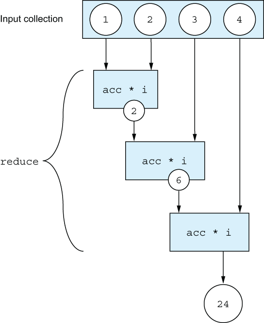
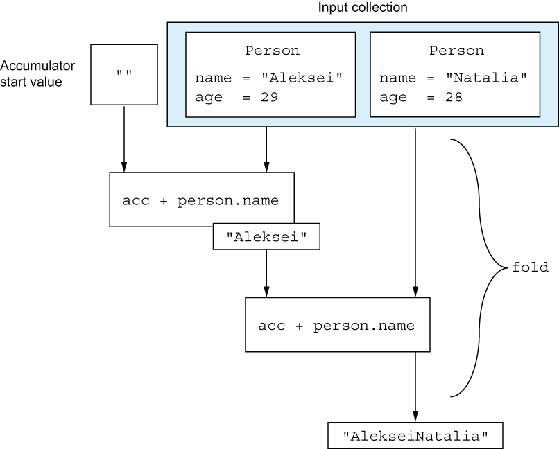

# CHAPTER 6. Working with collections and sequences

<small><i>컬렉션과 시퀀스</i></small>

**TL;DR**

[//]: # (TODO)

<br/><br/>

---

<br/>

## 6.1 Functional APIs for collections

<small><i>컬렉션에 대한 함수형 API</i></small>

코틀린 표준 라이브러리 컬렉션 함수들은 코틀린 설계자들이 개발한 것이 아님

⎯ 이미 C#, 그루비 , 스칼라와 같은 람다를 지원하는 언어에 존재

<br/>

### 6.1.1 Removing and transforming elements: `filter` and `map`

<small><i>원소 제거와 변환 : `filter`와 `map`</i></small>

- `filter` 와 `map` 함수는 컬렉션을 다루는 토대가 됨
- `filter`: Boolean 값이 결과인 함수로 조건을 표현하는 특정 술어<sup>predicate</sup>를 기준으로 컬렉션의 원소를 걸러내고 싶을 때
- `map`: 컬렉션의 각 원소를 다른 형태로 변환하고 싶을 때


#### `filter`

**`filter` 함수**: 컬렉션을 순회하면서 주어진 람다가 true 를 반환하는 원소들만 모음.

<table>
<tr>
<td>아래처럼 30살 이상인 사람들만 걸러내고 싶을 때</td>
</tr>
<tr>
<td>

```kotlin
fun main() {
    val people = listOf(Person("Alice", 29), Person("Bob", 31))
    println(people.filter { it.age > 30 })  // [Person(name=Bob, age=31)]
}
```

</td>
</tr>
</table>

<br/>

#### `map`

입력 컬렉션의 원소를 변환할 수 있게 해줌.

map은 주어진 함수를 컬렉션의 각 원소에 적용하고 그 결과들을 새 컬렉션에 모아줌.

**Example.**

<table>
<tr>
<td>사람의 리스트를 이름 리스트로 출력하고 싶을 때</td>
</tr>
<tr>
<td>

```kotlin
val people = listOf(Person("Alice", 29), Person("Bob", 31))
people.map { it.name }  // [Alice, Bob]
```

</td>
</tr>
<tr>
<td>

참조 연산 사용

```kotlin
val people = listOf(Person("Alice", 29), Person("Bob", 31))
people.map(Person::name)
```

</td>
</tr>
</table>

<br/>

#### `filter` + `map`

리스트에서 가장 나이 많은 사람의 이름을 알고 싶을 때


<table>
<tr><td>나이가 가장 많은 사람을 한 명 찾고, 그 사람과 나이가 같은 모든 사람을 반환</td></tr>
<tr>
<td>

```kotlin
val maxAge = people.maxByOrNull(Person::age)?.age
people.filter { it.age == maxAge }
```

컬렉션을 사용할 때, **동일한 작업을 계속 반복하지 않도록 주의**해야 함

</td>
</tr>
</table>

<br/>

#### `filterIndexed`, `mapIndexed`: 인덱스를 함께 사용

- 컬렉션 원소의 인덱스와 원소 자체를 함께 제공
- 인덱스는 `0`부터 시작

```kotlin
val numbers = listOf(1, 2, 3, 4, 5, 6, 7)

val filtered = numbers.filterIndexed { index, element ->
    index % 2 == 0 && element > 3
} // [5, 7]

val mapped = numbers.mapIndexed { index, element ->
    index + element
} // [1, 3, 5, 7, 9, 11, 13]
```

<br/>

### 6.1.2 Accumulating values for collections: `reduce` and `fold`

<small><i>컬렉션 값 누적: `reduce`와 `fold`</i></small>

#### `reduce`

- 누적기 accumulator 를 통해 점진적으로 만들어짐
- 람다는 각 원소에 별로 호출되며 새로운 누적 값을 반환

<br/><br/>

```kotlin
val list = listOf(1, 2, 3, 4)
val summed = list.reduce { acc, element -> acc + element } // 10
val multiplied = list.reduce { acc, element -> acc * element  }// 24
```

<br/>

#### `fold`

- 람다에 컬렉션의 각 값과 이전 누적기를 적용하면서 누적기로 점차 결과를 만들어나감
- 첫번째 원소를 누적 값으로 시작하는 대신, 임의의 시작 값을 선택할 수 있음

```kotlin
val people = listOf(
    Person("Alex", 29),
    Person("Natalia", 28)
)
val folded = people.fold("") { acc, person -> acc + person.name } // AlexNatalia
```

<br/><br/>

<br/>

#### runningReduce 와 runningFold: 중간 누적 값 포함

반환 값이 최종 결과(리스트의 마지막 원소)와 함께 모든 중간 누적 값이 포함

**`runningReduce`**

```kotlin
val list = listOf(1, 2, 3, 4)
val multiplied = list.runningReduce { acc, element ->
    acc * element
}  // [1, 2, 6, 24]
```

연산 중간 값인 `1`, `2`, `6`,가 함께 반환됨

<br/>

**`runningFold`**

```kotlin
val people = listOf(
    Person("Alex", 29),
    Person("Natalia", 28)
)
people.runningFold("") { acc, person ->
    acc + person.name
} // [, Alex, AlexNatalia] 
```

연산 중간 값인 ` `, `Alex`가 함께 반환됨

<br/>

### 6.1.3 Applying a predicate to a collection: `all`, `any`, `none`, `count`, `find`

<small><i>컬렉션에 술어 적용 : `all`, `any`, `none`, `count`, `find`</i></small>

- `all`: 컬렉션의 모든 원소가 특정 조건을 만족하는지 판단
- `any`: 컬렉션의 원소가 하나라도 있는지 판단
- `none`: 컬렉션의조건을 만족하는 원소가 전혀 없는지 판단
- `count`: 조건을 만족하는 원소의 개수를 반환
- `find`: 조건을 만족하는 첫 번째 원소를 반환


<table>
<tr>
<td></td>
<td>컬렉션 내 값이 있을 때</td>
<td>빈 컬렉션일 때</td>
</tr>
<tr>
<td></td>
<td>
<pre><code lang="kotlin">val canBeInClub27 = { p: Person -> p.age <= 27 }
val people = listOf(Person("Alice", 27), Person("Bob", 31))
</code></pre>
</td>
</tr>
<tr>
<th><code>all</code></th>
<td>
<pre><code lang="kotlin">people.all(canBeInClub27) // false</code></pre>
</td>

<td>
<pre><code lang="kotlin">emptyList<Int>().all { it > 42 }) // true </code></pre>

`all` 은 빈 컬렉션에 대해 항상 `true`를 반환

→ 공허한 참 (vacuous truth)

</td>
</tr>

<tr>
<th><code>any</code></th>
<td>
<pre><code lang="kotlin">people.any(canBeInClub27) // true</code></pre>

`!all`을 수행한 결과와 그 조건의 부정에 대해 `any` 를 수행한 결과가 같음 ⎯ 드 모르간의 법칙

= `!people.all(canBeInClub27)`

`!`를 눈치 채지 못하는 경우가 자주 있기 때문에 `any` 사용 권장

</td>
<td>
<pre><code lang="kotlin">emptyList<Int>().any { it > 42 }) // false </code></pre>
</td>
</tr>

<tr>
<th><code>none</code></th>
<td>
<pre><code lang="kotlin">people.any(canBeInClub27) // true</code></pre>

`!any`을 수행한 결과와 그 조건의 부정에 대해 `none` 를 수행한 결과가 같음

= `!people.any(canBeInClub27)`

</td>
<td>
<pre><code lang="kotlin">emptyList<Int>().none { it > 42 }) // true </code></pre>
</td>
</tr>

<tr>
<th><code>count</code></th>
<td>
<pre><code lang="kotlin">people.count(canBeInClub27) // 1</code></pre>

**vs. `size`**: 조건을 만족하는 모든 원소가 들어가는 중간 컬렉션이 생김

반면, `count`는 조건을 만족하는 원소의 개수만을 추적할 뿐 조건을 만족하는 원소를 따로 저장하지 않음

</td>
<td></td>
</tr>

<tr>
<th><code>count</code></th>
<td>
<pre><code lang="kotlin">people.find(canBeInClub27)) // Person(name=Alice, age=27)
</code></pre>

= `firstOrNull` 과 같음 

</td>
<td>
<pre><code lang="kotlin">`null`</code></pre>
</td>
</tr>

</table>

<br/>

