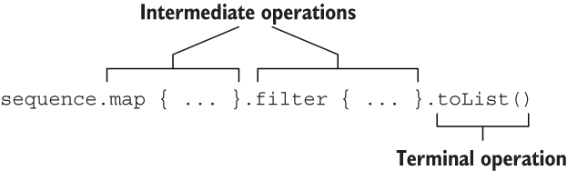
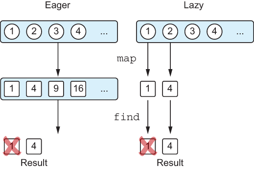

# CHAPTER 6. Working with collections and sequences

<small><i>컬렉션과 시퀀스</i></small>

**TL;DR**

- **표준 라이브러리 함수**와 **람다**를 활용해 컬렉션을 효율적으로 처리할 수 있음
  - `filter`: Boolean 값이 결과인 함수로 컬렉션의 원소를 걸러내고 싶을 때 사용
    - `filterIndexed`: `filter`와 인덱스를 함께 필요할 때 사용
  - `map`: 입력 컬렉션의 원소를 입력한 람다 함수로 처리한 값으로 변환
    - `mapIndexed`: `map`와 인덱스를 함께 필요할 때 사용
  - `reduce`: 람다(누적기, accumulator)는 각 원소에 별로 호출되며 새로운 누적 값을 반환  
    - `runningReduce`: `reduce` 연산의 모든 중간 누적 값을 포함해서 반환
  - `fold`: 람다에 컬렉션의 각 값과 이전 누적기를 적용하면서 누적기로 점차 결과를 만들어나감
    - `runningFold`: `fold` 연산의 모든 중간 누적 값을 포함해서 반환
  - `all`: 컬렉션의 모든 원소가 특정 조건을 만족하는지 판단
  - `any`: 컬렉션의 원소가 하나라도 있는지 판단 (= `!all`)
  - `none`: 컬렉션의 조건을 만족하는 원소가 전혀 없는지 판단 (= `!any`)
  - `count`: 조건을 만족하는 원소의 개수를 반환
  - `find`: 조건을 만족하는 첫 번째 원소를 반환
  - `partition`: 술어를 만족하는 그룹과 그렇지 않은 그룹으로 나눌 때 사용 (= `filter` + `filterNot`)
  - `groupBy`: 컬렉션의 원소를 어떤 특성에 따라 여러 그룹으로 나눌 때 사용
  - `associate`: **컬렉션으로부터 맵을 만들어내고 싶을 때** 사용
    - `associateWith`: **컬렉션 원소**를 **키**로 사용하고, **맵의 값**을 **생성하는 람다** 입력
    - `associateBy`: **컬렉션 원소**를 **맵의 값**으로 하고, **입력한 람다가 만들어내는 값**을 **맵의 키**로 사용
  - `replaceAll`: `MutableList` 에 적용하면 지정한 람다의 결과로 컬렉션의 모든 원소를 변경
  - `fill`: 가변 리스트의 모든 원소를 똑같은 값으로 바꾸는 특별한 경우에는 함수를 쓸 수 있음
  - `ifEmpty`: **컬렉션이 비어있을 때 기본값을 생성하는 람다를 제공**할 수 있음
    - `ifBlank`: **문자열**에서 **'공백(`" "`)'과 '비어있음(`""`)'일 때, 기본값을 지정**
  - `windowed`: 데이터를 연속적인 시간의 값들로 처리하고 싶을 경우, 슬라이딩 윈도우를 생성
  - `chunked`: 컬렉션을 주어진 크기의 서로 겹치지 않는 (서로소) 부분으로 나누고 싶을 때 사용
  - `zip`: 각 리스트의 값들이 서로의 인덱스에 따라 대응되는 경우, 두 컬렉션에서 같은 인덱스에 있는 원소들의 쌍으로 이뤄진 리스트 생성
  - `flatMap`: 컬렉션의 각 원소를 파라미터로 주어진 함수를 사용해 매핑 한 후, 변환한 결과를 하나의 리스트로 펼침
  - `flatten`: 변환할 것이 없고 단지 컬렉션의 컬렉션을 평평한 컬렉션으로 만들 경우 사용
- **시퀀스**를 활용하면 중간 결과 없이 연산을 지연 계산하여 성능을 최적화할 수 있음.
  - `asSequence()`: 컬렉션에 `asSequence()`를 호출해서 시퀀스로 변경
  - `generateSequence`: 주어진 이전의 원소로, 다음 원소를 계산


<br/><br/>

---

<br/>

## 6.1 Functional APIs for collections

<small><i>컬렉션에 대한 함수형 API</i></small>

코틀린 표준 라이브러리 컬렉션 함수들은 코틀린 설계자들이 개발한 것이 아님

⎯ 이미 C#, 그루비 , 스칼라와 같은 람다를 지원하는 언어에 존재

<br/>

### 6.1.1 Removing and transforming elements: `filter` and `map`

<small><i>원소 제거와 변환 : `filter`와 `map`</i></small>

- `filter` 와 `map` 함수는 컬렉션을 다루는 토대가 됨
- `filter`: Boolean 값이 결과인 함수로 조건을 표현하는 특정 술어<sup>predicate</sup>를 기준으로 컬렉션의 원소를 걸러내고 싶을 때
- `map`: 컬렉션의 각 원소를 다른 형태로 변환하고 싶을 때

<br/>

#### 📌 `filter`

- 컬렉션을 순회하면서 주어진 람다가 true 를 반환하는 원소들만 모음.

<table>
<tr>
<td>아래처럼 30살 이상인 사람들만 걸러내고 싶을 때</td>
</tr>
<tr>
<td>

```kotlin
fun main() {
    val people = listOf(Person("Alice", 29), Person("Bob", 31))
    println(people.filter { it.age > 30 })  // [Person(name=Bob, age=31)]
}
```

</td>
</tr>
</table>

<br/>

#### 📌 `map`

- 입력 컬렉션의 원소를 입력한 람다 함수로 처리한 값으로 변환.

map은 주어진 함수를 컬렉션의 각 원소에 적용하고 그 결과들을 새 컬렉션에 모아줌.

**Example.**

<table>
<tr>
<td>사람의 리스트를 이름 리스트로 출력하고 싶을 때</td>
</tr>
<tr>
<td>

```kotlin
val people = listOf(Person("Alice", 29), Person("Bob", 31))
people.map { it.name }  // [Alice, Bob]
```

</td>
</tr>
<tr>
<td>

참조 연산 사용

```kotlin
val people = listOf(Person("Alice", 29), Person("Bob", 31))
people.map(Person::name)
```

</td>
</tr>
</table>

<br/>

#### `filter` + `map`

리스트에서 가장 나이 많은 사람의 이름을 알고 싶을 때

<br/>

<table>
<tr><td>나이가 가장 많은 사람을 한 명 찾고, 그 사람과 나이가 같은 모든 사람을 반환</td></tr>
<tr>
<td>

```kotlin
val maxAge = people.maxByOrNull(Person::age)?.age
people.filter { it.age == maxAge }
```

컬렉션을 사용할 때, **동일한 작업을 계속 반복하지 않도록 주의**해야 함

</td>
</tr>
</table>

<br/>

#### 📌 `filterIndexed`
- `filter`와 인덱스를 함께 필요할 때 사용

<br/>

#### 📌 `mapIndexed`
- `map`와 인덱스를 함께 필요할 때 사용

- 컬렉션 원소의 인덱스와 원소 자체를 함께 제공
- 인덱스는 `0`부터 시작

```kotlin
val numbers = listOf(1, 2, 3, 4, 5, 6, 7)

val filtered = numbers.filterIndexed { index, element ->
    index % 2 == 0 && element > 3
} // [5, 7]

val mapped = numbers.mapIndexed { index, element ->
    index + element
} // [1, 3, 5, 7, 9, 11, 13]
```

<br/>

### 6.1.2 Accumulating values for collections: `reduce` and `fold`

<small><i>컬렉션 값 누적: `reduce`와 `fold`</i></small>

#### 📌 `reduce`

- 람다(누적기, accumulator) 는 각 원소에 별로 호출되며 새로운 누적 값을 반환
- 누적기(accumulator)를 통해 점진적으로 만들어짐

<br/><br/>

```kotlin
val list = listOf(1, 2, 3, 4)
val summed = list.reduce { acc, element -> acc + element } // 10
val multiplied = list.reduce { acc, element -> acc * element  }// 24
```

<br/>

#### 📌 `fold`

- 람다에 컬렉션의 각 값과 이전 누적기를 적용하면서 누적기로 점차 결과를 만들어나감
- 첫번째 원소를 누적 값으로 시작하는 대신, 임의의 시작 값을 선택할 수 있음

```kotlin
val people = listOf(
    Person("Alex", 29),
    Person("Natalia", 28)
)
val folded = people.fold("") { acc, person -> acc + person.name } // AlexNatalia
```

<br/><br/>

<br/>

#### runningReduce 와 runningFold: 중간 누적 값 포함

반환 값이 최종 결과(리스트의 마지막 원소)와 함께 모든 중간 누적 값이 포함

<br/>

#### 📌 `runningReduce`

```kotlin
val list = listOf(1, 2, 3, 4)
val multiplied = list.runningReduce { acc, element ->
    acc * element
}  // [1, 2, 6, 24]
```

연산 중간 값인 `1`, `2`, `6`,가 함께 반환됨

<br/>

#### 📌 `runningFold`

```kotlin
val people = listOf(
    Person("Alex", 29),
    Person("Natalia", 28)
)
people.runningFold("") { acc, person ->
    acc + person.name
} // [, Alex, AlexNatalia] 
```

연산 중간 값인 ` `, `Alex`가 함께 반환됨

<br/>

### 6.1.3 Applying a predicate to a collection: `all`, `any`, `none`, `count`, `find`

<small><i>컬렉션에 술어 적용 : `all`, `any`, `none`, `count`, `find`</i></small>

#### 📌 `all`
- 컬렉션의 모든 원소가 특정 조건을 만족하는지 판단

#### 📌 `any`
- 컬렉션의 원소가 하나라도 있는지 판단

#### 📌 `none`
- 컬렉션의 조건을 만족하는 원소가 전혀 없는지 판단

#### 📌 `count`
- 조건을 만족하는 원소의 개수를 반환

#### 📌 `find`
- 조건을 만족하는 첫 번째 원소를 반환

<br/>

<table>
<tr>
<td></td>
<td>컬렉션 내 값이 있을 때</td>
<td>빈 컬렉션일 때</td>
</tr>
<tr>
<td></td>
<td>
<pre><code lang="kotlin">val canBeInClub27 = { p: Person -> p.age <= 27 }
val people = listOf(Person("Alice", 27), Person("Bob", 31))
</code></pre>
</td>
</tr>
<tr>
<th><code>all</code></th>
<td>
<pre><code lang="kotlin">people.all(canBeInClub27) // false</code></pre>
</td>

<td>
<pre><code lang="kotlin">emptyList<Int>().all { it > 42 }) // true </code></pre>

`all` 은 빈 컬렉션에 대해 항상 `true`를 반환

→ 공허한 참 (vacuous truth)

</td>
</tr>

<tr>
<th><code>any</code></th>
<td>
<pre><code lang="kotlin">people.any(canBeInClub27) // true</code></pre>

`!all`을 수행한 결과와 그 조건의 부정에 대해 `any` 를 수행한 결과가 같음 ⎯ 드 모르간의 법칙

= `!people.all(canBeInClub27)`

`!`를 눈치 채지 못하는 경우가 자주 있기 때문에 `any` 사용 권장

</td>
<td>
<pre><code lang="kotlin">emptyList<Int>().any { it > 42 }) // false </code></pre>
</td>
</tr>

<tr>
<th><code>none</code></th>
<td>
<pre><code lang="kotlin">people.any(canBeInClub27) // true</code></pre>

`!any`을 수행한 결과와 그 조건의 부정에 대해 `none` 를 수행한 결과가 같음

= `!people.any(canBeInClub27)`

</td>
<td>
<pre><code lang="kotlin">emptyList<Int>().none { it > 42 }) // true </code></pre>
</td>
</tr>

<tr>
<th><code>count</code></th>
<td>
<pre><code lang="kotlin">people.count(canBeInClub27) // 1</code></pre>

**vs. `size`**: 조건을 만족하는 모든 원소가 들어가는 중간 컬렉션이 생김

반면, `count`는 조건을 만족하는 원소의 개수만을 추적할 뿐 조건을 만족하는 원소를 따로 저장하지 않음

</td>
<td></td>
</tr>

<tr>
<th><code>count</code></th>
<td>
<pre><code lang="kotlin">people.find(canBeInClub27)) // Person(name=Alice, age=27)
</code></pre>

= `firstOrNull` 과 같음 

</td>
<td>
<pre><code lang="kotlin">`null`</code></pre>
</td>
</tr>

</table>

<br/>

### 6.1.4 Splitting a list into a pair of lists: `partition`

<small><i>리스트를 분할해 리스트의 쌍으로 만들기 : `partition`</i></small>

#### 📌 `partition`
- 술어를 만족하는 그룹과 그렇지 않은 그룹으로 나눌 필요가 있을 때. 
- `filter` + `filterNot` 동일하지만, 전체 컬렉션을 2번 순회하지 않아도 됨

```kotlin
val (comeIn, stayOut) = people.partition(canBeInClub27)
println(comeIn)     // [Person(name=Alice, age=26)]
println(stayOut)    // [Person(name=Bob, age=29), Person(name=Carol, age=31)]
```

<br/>

### 6.1.5 Converting a list to a map of groups: `groupBy`

<small><i>리스트를 여러 그룹으로 이뤄진 맵으로 바꾸기: `groupBy`</i></small>

#### 📌`groupBy`
- 컬렉션의 원소를 어떤 특성에 따라 **여러 그룹**으로 나누고 싶을 때
- `partition`이 반환하는 '참' 과 '거짓' 그룹으로만 분리할 수 없는 경우


**Example. 문자열을 첫 번째 글자에 따라 분류하는 코드**

```kotlin
val list = listOf("apple", "apricot", "banana", "cantaloupe")
println(list.groupBy(String::first))
// {a=[apple, apricot], b=[banana], c=[cantaloupe]}
```

<br/>

### 6.1.6 Transforming collections into maps: `associate`, `associateWith`, and `associateBy`

<small><i>컬렉션을 맵으로 변환: `associate`, `associateWith`, `associateBy`</i></small>

#### 📌 `associate`
- 원소를 그룹화하지 않으면서 컬렉션으로부터 맵을 만들어내고 싶을 때
  - **입력**: 컬렉션의 원소로부터 키/값 쌍을 생성하 람다 입력 

```kotlin
val people = listOf(Person("Joe", 22), Person("Mary", 31))
val nameToAge = people.associate { it.name to it.age }
println(nameToAge) 
println(nameToAge["Joe"]) 
```

**Output**
```
{Joe=22, Mary=31}
22
```

<br/>

#### 📌 `associateWith`
- **컬렉션 원소**를 **키**로 사용하고, **맵의 값을 생성하는 람다** 입력

```kotlin
val people = listOf(Person("Joe", 22), Person("Mary", 31), Person("Jamie", 22))
val personToAge = people.associateWith { it.age }
println(personToAge)
```

**Output**
```
{Person(name=Joe, age=22)=22, Person(name=Mary, age=31)=31, Person(name=Jamie, age=22)=22}
```

<br/>

#### 📌 `associateBy`
- **컬렉션 원소**를 맵의 **값**으로 하고, 입력한 람다가 만들어내는 값을 맵의 키로 사용

```kotlin
val people = listOf(Person("Joe", 22), Person("Mary", 31), Person("Jamie", 22))
val ageToPerson = people.associateBy { it.age }
println(ageToPerson)
```

**Output**
```
{22=Person(name=Jamie, age=22), 31=Person(name=Mary, age=31)}
```

위의 예시에서, `Joe`, `Jamie`의 나이가 `22`로 동일한데, 마지막 원소인 `Jamie`만 남은 것을 알 수 있음
 
<br/>

### 6.1.7 Replacing elements in mutable collections: `replaceAll` and `fill`

<small><i>가변 컬렉션의 원소 변경 : `replaceAll`, `fill`</i></small>

#### 📌 `replaceAll`
- **MutableList** 에 적용하면 지정한 람다의 결과로 컬렉션의 모든 원소를 변경.

<br/>

#### 📌 `fill`
- 가변 리스트의 모든 원소를 똑같은 값으로 바꾸는 특별한 경우에는 함수를 쓸 수 있음. 


**Example**. 대문자로 바꾼 후 모든 이름을 플레이스홀더 텍스트로 변경

```kotlin
val names = mutableListOf("Martin", "Samuel")
println(names)                                  // [Martin, Samuel]
names.replaceAll { it.uppercase() }
println(names)                                 // [MARTIN, SAMUEL]
names.fill("(redacted)")
println(names)                                 // [(redacted), (redacted)]
```

<br/>

### 6.1.8 Handling special cases for collections: `ifEmpty`

<small><i>컬렉션의 특별한 경우 처리 : `ifEmpty`</i></small>

#### 📌 `ifEmpty`
- 컬렉션에 아무 원소도 없을 때 기본값을 생성하는 람다를 제공할 수 있음

```
val empty = emptyList<String>()
val full = listOf("apple", "orange", "banana")
println(empty.ifEmpty { listOf("no", "values", "here") })   // [no, values, here]
println(full.ifEmpty { listOf("no", "values", "here") })    // [apple, orange, banana]
```

#### 📌 `ifBlank`
- 문자열에서 '공백(`" "`)'과 '비어있음(`""`)'일 때, 기본값을 지정
  - `ifEmpty` 는 '비어있음(`""`)'을 체크.

```kotlin
println(" ".ifEmpty { "(unnamed)" })    //
println(" ".ifBlank { "(unnamed)" })    // (unnamed)
println("".ifEmpty { "(unnamed)" })     // (unnamed)
println("".ifBlank { "(unnamed)" })     // (unnamed)
```

<br/>

### 6.1.9 Splitting collections: `chunked` and `windowed`

<small><i>컬렉션 나누기 : `chunked`와 `windowed`</i></small>

#### 📌 `windowed`
- 데이터를 연속적인 시간의 값들로 처리하고 싶을 경우, 슬라이딩 윈도우를 생성
  - **입력**: `windowed` 에 선택적으로 출력을 변환할 수 있는 람다를 전달.

```kotlin
val temperatures = listOf(27.7, 29.8, 22.0, 35.5, 19.1)
println(temperatures.windowed(3))
// [[27.7, 29.8, 22.0], [29.8, 22.0, 35.5], [22.0, 35.5, 19.1]]
println(temperatures.windowed(3) { it.sum() / it.size })
// [26.5, 29.099999999999998, 25.53333333333333]
```

<br/>

#### 📌 `chunked`
- 컬렉션을 주어진 크기의 서로 겹치지 않는 (서로소) 부분으로 나누고 싶을 때 사용

`windowed`는 입력 컬렉션에 대해 슬라이딩 윈도우를 실행하지만 `chunked` 는 나누기만 함

```kotlin
println(temperatures.chunked(2))
// [[27.7, 29.8], [22.0, 35.5], [19.1]]
println(temperatures.chunked(2) { it.sum() })
// [57.5, 57.5, 19.1]
```

<br/>

### 6.1.10 Merging collections: `zip`

<small><i>컬렉션 합치기: `zip`</i></small>

#### 📌 `zip`
- 각 리스트의 값들이 서로의 인덱스에 따라 대응되는 경우, `zip` 함수를 사용해 두 컬렉션에서 같은 인덱스에 있는 원소들의 쌍으로 이뤄진 리스트를 만들 수 있음

```kotlin
val names = listOf("Joe", "Mary", "Jamie")
val ages = listOf(22, 31, 31, 44, 0)
println(names.zip(ages) { name, age -> Person(name, age) })
// [Person(name=Joe, age=22), Person(name=Mary, age=31), Person(name=Jamie, age=31)]
```

<pre>⚠️ 결과 컬렉션의 길이는 두 입력 컬렉션 중 더 짧은 쪽의 길이와 같음
`zip` 은 두 입력 컬렉션 모두에 원소가 들어있는 인덱스에 해당하는 원소들만 처리
</pre>

<br/>

Pair 객체를 생성하는 [`to`](https://kotlinlang.org/api/core/kotlin-stdlib/kotlin/to.html) 함수와 마찬가지로 `zip` 함수도 중위 표기법(infix function) 으로 호출할 수 있음

```kotlin
infix fun <T, R> Array<out T>.zip(other: Array<out R>): List<Pair<T, R>>
```

하지만 중위 표기법을 쓸 때는 람다를 전달할 수 없음

```kotlin
println(names zip ages)         // [(Joe, 22), (Mary, 31), (Jamie, 31)]
```

<br/>

### 6.1.11 Processing elements in nested collections: `flatMap` and `flatten`

<small><i>내포된 컬렉션의 원소 처리: `flatMap` 과 `flatten`</i></small>

```kotlin
class Book(val title: String, val authors: List<String>)
```

#### 📌 `flatMap`
  1. 컬렉션의 각 원소를 파라미터로 주어진 함수를 사용해 매핑 한 후 (map 함수와 동일한 동작),
  2. 변환한 결과를 하나의 리스트로 펼침 (flatten)

<table>
<tr>
<tr>
<th></th>
<th><code>map</code></th>
<th><code>flatMap</code></th>
</tr>
<tr>
<th>A Given Collection</th>
<td colspan="2">

```kotlin
val library = listOf(
    Book("Kotlin in Action", listOf("Isakova", "Elizarov", "Aigner", "Jemerov")),
    Book("Atomic Kotlin", listOf("Eckel", "Isakova")),
    Book("The Three-Body Problem", listOf("Liu"))
)
```
</td>
</tr>
<tr>
<th>Function</th>
<td>

```kotlin
val authors = library.map { it.authors }
println(authors)
```

</td>
<td>

```kotlin
val authors = library.flatMap { it.authors }
println(authors)
println(authors.toSet())
```
</td>
</tr>
<tr>
<th>Output</th>
<td>

```text
[[Isakova, Elizarov, Aigner, Jemerov], [Eckel, Isakova], [Liu]]
```

</td>
<td>

```text
[Isakova, Elizarov, Aigner, Jemerov, Eckel, Isakova, Liu]
[Isakova, Elizarov, Aigner, Jemerov, Eckel, Liu]
```
</td>
</tr>
</table>

<br/>

#### 📌 `flatten`

- 변환할 것이 없고 단지 컬렉션의 컬렉션을 평평한 컬렉션으로 만들 경우 사용

<br/>

[🔗 표준 라이브러리 참조 문서](https://kotlinlang.org/api/core/kotlin-stdlib/)

<br/>

## 6.2 Lazy collection operations: Sequences

<small><i>지연 계산 컬렉션 연산: 시퀀스</i></small>

- **Collection**: 연산된 컬렉션을 즉시(eagerly) 생성
  - → 컬렉션 함수를 연쇄하면 **매 단계마다 계산 중간 결과를 새로운 컬렉션에 임시로 담는다는 의미**
- **Sequences**: 연산된 컬렉션을 개으르게(lazy) 생성
  - → 중간 임시 컬렉션을 사용하지 않고 컬렉션 연산을 연쇄적으로 실행
  - 중간 결과를 저장하는 걸렉션이 생기지 않기 때문에 **원소가 많은 경우 성능이 눈에 띄게 좋아짐**
  - 자바 8의 스트림과 비슷

[Kotlin 공식 문서 - Sequence](https://kotlinlang.org/api/core/kotlin-stdlib/kotlin.sequences/-sequence/)

```kotlin
people
    .asSequence()                   // - 원본 컬렉션을 시퀀스로 변환
    .map(Person::name)              // ⏋시퀀스도 컬렉션과 똑같은 API 제공
    .filter { it.startsWith("A") }  // ⏌
    .toList()                       // - 결과 시퀀스를 다시 리스트로 변환
```

<br/>

[**Sequence interface**](https://github.com/JetBrains/kotlin/blob/rrr/2.1.0/core-docs/libraries/stdlib/src/kotlin/collections/Sequence.kt#L21)

```kotlin
public interface Sequence<out T> {
    /**
     * Returns an [Iterator] that returns the values from the sequence.
     *
     * Throws an exception if the sequence is constrained to be iterated once and `iterator` is invoked the second time.
     */
    public operator fun iterator(): Iterator<T>
}
```

- 단 하나의 `iterator` 메서드를 포함하며, 이를 통해 시퀀스에서 원소 값들을 얻을 수 있음
- `asSequence` 확장 함수를 호출하면 어떤 컬렉션이든 시퀀스로 바꿀 수 있음.
- 시퀀스를 리스트로 만들 때는 `toList`를 사용

<pre><b>컬렉션보다 시퀀스가 훨씬 더 낫다면, 시퀀스를 쓰는 편이 낫지 않을까?</b>
답은 "때때로 그렇다". 
시퀀스의 원소를 차례로 이터레이션해야 한다면 시퀀스를 직접 써도 됨.
하지만 시퀀스 원소를 인덱스를 사용해 접근하는 등, 다른 API 메서드를 호출해야 한다면 시퀀스를 리스트로 변환해야함.

큰 컬렉션에 대해 연산을 연쇄시킬 때는, 시퀀스를 사용하라.
중간 컬렉션을 생성함에도 코틀린에서 즉시 계산 컬렉션에 대한 연산이 더 효율적일 때가 있음.
하지만 컬렉션 크기가 크면, 원소 재배열 비용이 커져서 지연 계산이 더 나음.
</pre>

<br/>

### 6.2.1 Executing sequence operations: Intermediate and terminal operations

<small><i>시퀀스 연산 실행: 중간 연산과 최종 연산</i></small>

시퀀스에 대한 연산 두 가지: 

1. **중간 연산 (intermediate operation)**: 다른 시퀀스를 반환
2. **최종 연산 (terminal operation)**: 최초 컬렉션에 대해 변환을 적용한 시퀀스 결과를 반환,

<br/><br/>

#### 중간 연산
중간 연산은 항상 지연 계산

```kotlin
listOf(1, 2, 3, 4)
    .asSequence()
    .map {
        print("map($it) ")
        it * it
    }.filter {
        print("filter($it) ")
        it % 2 == 0
    }
```

- 아무 내용도 출력되지 않음
- `map` 과 `filter` 변환이 지연돼 **결과를 얻을 필요가 있을 때 (= 최종 연산이 호출 때)** 적용됨

<br/>

#### 최종 연산

최종 연산(`toList`) 호출 시 모든 계산이 수행

```kotlin
listOf(1, 2, 3, 4)
  .asSequence()
  .map {
    print("map($it) ")
    it * it
  }.filter {
    print("filter($it) ")
    it % 2 == 0
  }.toList()
```

<br/>

#### 연산 순서

컬렉션에 대해 수행하는 연산의 순서도 성능에 영향을 끼침

**`map` 다음 `filter`를 하는 경우**와 **`filter` 다음 `map` 을 하는 경우** 수행 횟수가 다름

<br/><br/>

<br/>

### 6.2.2 Creating sequences

<small><i>시퀀스 만들기</i></small>

#### 📌 `asSequence()`
- 컬렉션에 `asSequence()`를 호출해서 시퀀스로 변경

<br/>

#### 📌 `generateSequence`
- 주어진 이전의 원소로, 다음 원소를 계산

**정의:**
```kotlin
fun <T : Any> generateSequence(nextFunction: () -> T?): Sequence<T>
```
[🔗 kotlinlang - generateSequence](https://kotlinlang.org/api/core/kotlin-stdlib/kotlin.sequences/generate-sequence.html)

**예시:**
```kotlin
val naturalNumbers = generateSequence(0) { it + 1 }         // 무한 시퀀스 (An infinite sequence)
val numbersTo100 = naturalNumbers.takeWhile { it <= 100 }   // 유한 시퀀스 (A finite sequence)
println(numbersTo100.sum())                                 // sum() 호출 시 모든 지연 계산이 수행
// 5050
```

<br/>

**UseCase.**
- 동일한 조상 객체들로 이뤄진 시퀀스를 만들어낼 때 
- 조상이 자신과 같은 타입이고, 모든 조상 시퀀스에서 특정 특성을 알고 싶을 때가 있음
  - e.g. 사람, 파일 디렉터리의 계층 구조 (JVM 에서는 보통 File 이 파일과 폴더를 모두 표현).

<br/>

**Example.**

상위 디렉터리를 뒤지면서 숨김 속성을 가진 디렉터리가 있는지 검사함으로써 파일이 감춰진 디렉터리 안에 들어있는지 체크.

```kotlin
import java.io.File

fun File.isInsideHiddenDirectory() =
  generateSequence(this) { it.parentFile }.any { it.isHidden }

fun main() {
  val file = File("/Users/sunny/.HiddenDir/a.txt")
  println(file.isInsideHiddenDirectory())           // true
}
```

<br/>

## Summary

- **표준 라이브러리 함수**와 **람다**를 활용해 컬렉션을 효율적으로 처리할 수 있음.
- `filter`, `map`으로 원소를 걸러내거나 변환할 수 있음.
- `reduce`, `fold`를 사용해 컬렉션에서 값을 종합할 수 있음.
- `associate`, `groupBy`로 리스트를 맵으로 변환해 데이터를 구조화할 수 있음.
- `chunked`, `windowed`, `zip`을 활용해 인덱스 기반으로 그룹을 만들거나 컬렉션을 합칠 수 있음.
- `all`, `any`, `none`을 사용해 특정 조건이 컬렉션에 성립하는지 검사할 수 있음.
- `flatten`, `flatMap`으로 내포된 컬렉션을 펼치고 변환할 수 있음.
- **시퀀스**를 활용하면 중간 결과 없이 연산을 지연 계산하여 성능을 최적화할 수 있음.
  - `asSequence()`: 컬렉션에 `asSequence()`를 호출해서 시퀀스로 변경
  - `generateSequence`: 주어진 이전의 원소로, 다음 원소를 계산


