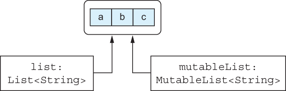
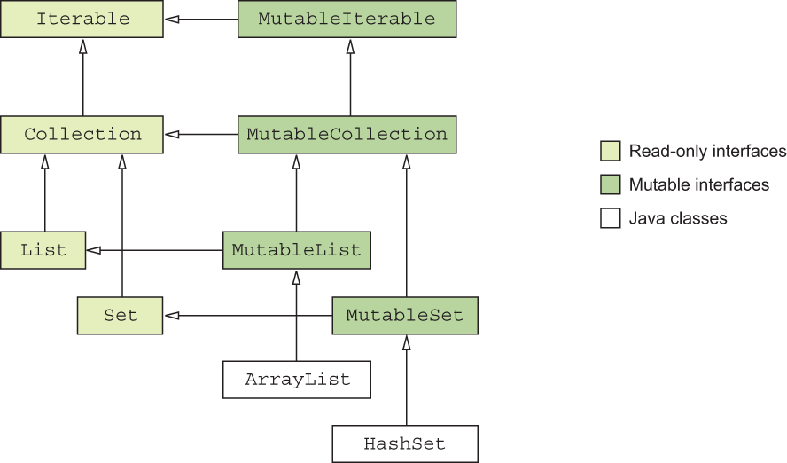

# CHAPTER 8. Basic types, collections, and arrays

<small><i>기본 타입, 컬렉션, 배열</i></small>

## 8.1 Primitive and other basic types

<small><i>원시 타입과 기본 타입</i></small>

자바와 달리 코틀린은 원시 타입과 래퍼 타입을 구분하지 않음

<br/>

### 8.1.1 Representing integers, floating-point numbers, characters, and Booleans with primitive types

<small><i>정수, 부동소수점 수, 문자, 불리언 값을 원시 타입으로 표현</i></small>

**Java**

- 자바는 원시 타입과 참조 타입을 구분
  - **원시 <sup>primitive</sup> 타입** (`int` 등) 의 변수에는 그 값이 직접 들어감
    - 더 효율적으로 저장하고 여기저기 전달
    - 하지만 메서드를 호출하거나 컬렉션에 원시 타입 값을 담을 수는 없음
  - **참조 타입** (`String` 등) 의 변수에는 메모리상의 객체 위치가 들어감
- 참조 타입이 필요한 경우 특별한 래퍼 타입으로 원시 타입 값을 감싸서 사용
  - e.g. 정수의 컬렉션을 정의하려면 `Collection<int>`가 아니라 `Collection<Integer>`를 사용해야 함

**Kotlin**

- 코틀린은 **원시 타입**과 **래퍼 타입**을 **구분하지 않음**

```kotlin
val i: Int = 1
val list: List<Int> = listOf(1, 2, 3)
```

- 래퍼 타임을 따로 구분하지 않아 편리
- 원시 타입의 값에 대해 메서드를 호출할 수 있음

<pre><code lang="kotlin">
fun showProgress(progress: Int) {
    val percent = <b>progress.coerceIn(0, 100)</b>
    println("We're $percent % done!")
}
 
fun main() {
    showProgress(146)   // We're 100 % done!
}
</code></pre>

<br/>

#### 코틀린 컴파일러가 객체를 다루는 방법

- 실행 시점에 숫자 타입은 가능한 한 **가장 효율적인 방식으로 표현**됨
  - 대부분의 경우, 코틀린의 `Int` 타입은 자바 `int` 타입으로 컴파일 됨
  - e.g. 변수, 프로퍼티, 파라미터, 반환 타입 등
- **컴파일이 불가능한 경우, 래퍼 객체로 컴파일 됨** 
  - 컬렉션과 같은 제네릭 클래스를 사용하는 경우 뿐
  - e.g. `Collection<Int>`의 경우, `Int`의 래퍼 타입에 해당하는 `Java.lang.Integer` 객체가 들어감
- **자바 원시 타입에 해당하는 코틀린 타입**:
  - 정수 타입 : `Byte`, `Short`, `Int`, `Long`
  - 부동소수점 숫자 타입: `Float`, `Double`
  - 문자 타입: `Char`
  - 불리언 타입: `Boolean`


### 8.1.2 Using the full bit range to represent positive numbers: Unsigned number types

<small><i>양수를 표현하기 위해 모든 비트 범위 사용: 부호 없는 숫자 타입</i></small>


- 양수를 표현하기 위해 모든 비트 범위를 사용하고 싶은 때, 코틀린은 JVM의 **일반적인 원시 타입을 확장해 부호 없는 타입을 제공**
- 다른 원시 타입과 마찬가지로 코틀린의 부호 없는 수도 필요할 때만 래핑됨

**가령,** 
- 비트와 바이트 수준에서 작업을 수행할 때 
- 비트맵 픽셀을 조작할 때 
- 파일에 담긴 바이트들을 다룰 때
- 다른 2진 데이터를 다를 때

<br/>

#### 부호 없는 타입

| Type     | Size   | Value range      |
|----------|--------|------------------|
| `UByte`  | 8 bit  | `0` - `255`      |
| `UShort` | 16 bit | `0` - `65535`    |
| `UInt`   | 32 bit | `0` - `2^32 - 1` |
| `ULong`  | 64 bit | `0` - `2^64 - 1` |


- 부호 없는 숫자 타입들은 상응하는 부호 있는 타입의 범위를 '시프트' 해서, **같은 크기의 메모리를 사용해 더 큰 양수 범위를 표현할 수 있게 해줌**
  - e.g. **일반 `Int`** → 대략 `-20억`~ `+20억` 값 표현 vs. **`UInt`** → 대략  `0` ~ `+40억` 값 표현

<br/>

> 음수가 아닌 정수를 사용하기 위해 **부호 없는 정수**를 사용? 
> → 코틀린의 부호 없는 정수의 목적이 아님
> 
> **명시적으로 전체 비트 범위가 필요한 경우가 아니라면**,
> 보통의 정수를 사용하고 음수 범위가 함수에 전달됐는지 검사하는 편이 더 나음

<br/>

<pre><b>부호 없는 숫자 타입: 구현 세부 사항</b>
ref. https://docs.oracle.com/javase/specs/jvms/se18/html/jvms-2.html#jvms-2.3.1
ref. https://kotlinlang.org/docs/unsigned-integer-types.html#unsigned-arrays-and-ranges

- JVM 공식 문서에는부호가 없는 수에 대한 원시 타입을 명시·제공하지 않음
- 코틀린은 이를 따라 기존의 부호가 있는 원시 타입 위에 자체적인 추상화를 제공
- 코틀린에서 부호 없는 값을 표현하는 각 클래스는 실제로는 인라인 클래스
- 각 인라인 클래스는 기억 장소로 자신에 상응하는 부호있는 타입을 사용
- 내부에서 <code>UInt</code> 값은 실제로 <code>Int</code> 코틀린 컴파일러가 가능할 때마다 인라인 클래스를 기저의 프로퍼티로 대신하거나 래핑하는 등의 처리를 해주기 때문에,
  <b>부호 없는 숫자 타입이 부호 있는 숫자 타입과 같은 성능으로 작동하다고 예상할 수 있음</b>
</pre>

- 코틀린 타입은 컴파일러가 쉽게 상응하는 JVM 원시 타입으로 변환 가능
  - 둘 다 `null` 이 될 수 없음
- 자바 원시 타입을 코틀린에서 사용할 때(플랫폼 타입 X)도 널이 될 수 없는 타입으로 취급할 수 있음
  - 자바 원시 타입의 값은 결코 `null` 이 될 수 없기 때문 

<br/>

### 8.1.3 Nullable primitive types: `Int?`, `Boolean?`, and more

<small><i>널이 될 수 있는 기본 타입 : `Int?`, `Boolean?` 등</i></small>


- 코틀린의 Nullable 타입은 자바의 래퍼 타입으로 컴파일 됨
  - 자바의 참조 타입의 변수에만 대입할 수 있기 때문 (원시 타입은 `null` 대입 불가)

<br/>

```kotlin
data class Person(val name: String,
                  val age: Int? = null) {

    fun isOlderThan(other: Person): Boolean? {
        if (age == null || other.age == null)
            return null
        return age > other.age
    }
}

fun main() {
    println(Person("Sam", 35).isOlderThan(Person("Amy", 42)))   // false
    println(Person("Sam", 35).isOlderThan(Person("Jane")))      // null
}
```

- 컴파일러는 `null` 검사 후 두 값을 일반 값으로 다룸
  - `java.lang.Integer`로 저장


#### 제네릭 클래스 
- 제네릭 클래스의 경우 래퍼 타입을 사용
- 어떤 클래스의 타입 인자로 원시 타입을 넘기면 코틀린은 그 타입에 대한 박스 타입을 사용
- `val listOfInts = listOf(1, 2, 3)` → `java.util.List<java.lang.Integer> getListOfInts();`

<br/>

### 8.1.4 Kotlin makes number conversions explicit

<small><i>수 변환</i></small>

- 코틀린과 자바의 가장 큰 차이점 중 하나 → 수를 변환하는 방식
- 코틀린은 한 타입의 수를 다른 타입의 수로 자동 변환하지 않음
  - 결과 타입이 허용하는 수의 범위가 원래 타입의 범위보다 넓은 경우도 자동 변환 불가능

- 코틀린은 모든 원시 타입 (`Boolean` 제외) 에 대해 변환 함수를 제공
  - `toByte()`, `toShort()`, `toChar()` 등
 
- 양방향 변환 함수가 모두 제공
  - 더 넓은 범위의 타입으로 변환하는 함수 지원 (e.g.`Int.toLong()`) 
  - 더 좁은 범위의 타입으로 변환하면서 값을 벗어나는 경우에는 일부를 잘라내는 함수 지원 (e.g. `Long.toInt()`)
- 박스 타입 간의 `equals` 메서드는 값이 아니라 박스 타입 객체를 비교
- 따라서 자바에서 `new Integer(42).equals(new Long(42))` → `false` 
- 코틀린에서 암시적 변환을 허용한다면 다음과 같이 쓸 수 있을 것

```kotlin
val x = 1                       // int 타입
val list = listOf(1L, 2L, 3L)   // Long 타입 리스트
x in list                       // ❌ 암시적 타입 변환으로 인해 false
```

위 코드는 컴파일 오류를 발생 시킴

```bash
figure08_03.kt:10:7: error: type inference failed. The value of the type parameter 'T' should be mentioned in input types (argument types, receiver type, or expected type). Try to specify it explicitly.
    x in list
      ^^
```

코틀린에서는 타입을 명시적으로 변환해서 같은 타입의 값으로 만든 후 비교해야 함

```kotlin
println(x.toLong() in listOf(1L, 2L, 3L))
```

예상치 못한 동작을 피하기 위해 각 변수를 명시적으로 변환해야 함

<br/>

#### 원시 타입 리터럴

코틀린은 수 리터럴을 허용

- `L` 접미사가 붙은 `Long` 타입 리터럴: `123L`
- 표준 부동소수점 표기법을 사용한 `Double` 타입 리터럴 : `0.12`, `2.0`, `1.2e10`, `1.2e-10`
- `f`/`F` 접미사가 붙은 `Float` 타입 리터럴 : `123.4f`, `.456F`, `1e3f`
- `0x` 나 `0x` 접두사가 붙은 16 진 리터럴 : `0XCAFEBABE`, `0xbcdL`
- `0b` 나 `0B` 접두사가 붙은 2 진 리터럴 : `0b000000101`
- `U` 접미사가 붙은 부호 없는 정수 리터럴 : `123U`, `123UL`, `0x10cU` 
- **코틀린 문자 리터럴**: 이스케이스 시퀀스를 사용 가능
  - `'1'`
  - `'\t'`(이스케이프 시퀀스로 정의한 탭 문자)
  - `\u009` (유니코드 이스케이프 시퀀스로 정의한 탭 문자)


숫자 리터럴을 타입이 알려진 변수에 대입하거나 함수에 인자로 넘기면 컴파일러가 필요한 변환을 자동으로 넣어줌

추가로 산술 연산자는 적당한 타입의 값을 받아들일 수 있도록 이미 오버로드돼 있음

```kotlin
fun printALong(l: Long) = println(l)
 
fun main() {
    val b: Byte = 1        // 상수 값은 적절한 타입으로 해석됨
    val l = b + 1L         // + 는 Byte 와 Long 을 인자로 받을 수 있음
    printALong(42)         // 컴파일러는 42를 Long 값으로 해석
}
```

- 숫자 연산 시 **오버플로** <sup>overflow</sup> 나 **언더플로** <sup>underflow</sup> 가 발생할 수 있음
- 코틀린은 검사에 추가 비용을 들이지 않음

```kotlin
fun main() {
    println(Int.MAX_VALUE + 1)
    // -2147483648                 // 오버플로로 인해 값이 양수 최댓값에서 음수 최솟값으로 넘어감
    println(Int.MIN_VALUE - 1)
    // 2147483647                  // 언더플로로 인해 값이 음수 최솟값에서 양수 최댓값으로 넘어감
}
```

<br/>

#### 문자열을 수로 변환하기

- 코틀린 표준 라이브러리는 문자열을 수로 변환하는 함수 제공: `toInt`, `toByte`, `toBoolean`, ...
  - `"42".toInt()` ← `42`
- 파싱에 실패하면 `NumberFormatException` 발생
- 각 확장 함수로 변환 실패 시 `null` 을 돌려주는 `toIntOrNull`, `toByteOrNull` 등의 함수가 존재
  - `"seven".toIntOrNull()` ← `null`
- 문자열을 불리언 값으로 변환할 때, 문자열이 `null`이 아니고 단어 `"true"`와 같으면 `true` 반환 (대소 문자 구분 X)
  - `"trUE".toBoolean()` ← `true`
  - `"7".toBoolean()`    ← `false`
  - `null.toBoolean()`   ← `false`

- `toBooleanStrict`: 정확히 `true` `false` 와 일치할 때 변환. 일치하지 않은 경우에는 예외 발생
  - `"true".toBooleanStrict()` ← `true`
  - `"trUE".toBooleanStrict()` ← `Exception in thread "main" java.lang.IllegalArgumentException: The string doesn't represent a boolean value: trUE`

<br/>

### 8.1.5 `Any` and `Any?`: The root of the Kotlin type hierarchy

<small><i>`Any` 와 `Any?`: 코틀린 타입 계층의 뿌리</i></small>

자바에서 Object 가 클래스 계층의 최상위 타입이듯 코틀린에서는 Any 타입이 모든
널이 될 수 없는 타입의 조상 타입

- **자바**: 참조 타입만 `Object`를 조상으로 하는 타입 계층에 포함, 원시 타입은 계층에 들어있지 않음
  - Object 타입 필요 시, 원시 타입을 래퍼 타입으로 감싸야만 함
- **코틀린**: `Any`가 원시 타입을 포함한 모든 타입의 조상 타입
  - 자바와 마찬가지로 코틀린에서도 원시 타입 값을 Any 타입의 변수에 대입하면 자동으로 값을 객체로 감쌈 (박싱 boxing),

```kotlin
val answer: Any = 42  // Any가 참조 타입이기 때문에 42가 박싱됨
```

- 자바 메서드에서 `Object`를 인자로 받거나 반환하면 코틀린에서는 `Any` 로 그 타입을 취급
  - 정확히는, 널이 될 수 있는지 여부를 알 수 없으므로 플랫폼 타입인 `Any!` 로 취급
- 코틀린 함수가 `Any` 를 사용하면 자바 바이트코드의 `Object`로 컴파일됨

<br/>

### 8.1.6 The Unit type: Kotlin’s `void`

<small><i>Unit 타입: 코틀린의 `void`</i></small>

- 코틀린 `Unit` 타입 = 자바 `void` 
- 반환 타입이 없을 때 Unit 을 쓸 수 있음
  - = 반환 타입을 선언하지 않는 것과 동일. 컴파일러가 암시적으로 `return Unit` 을 넣어줌

- `Unit` 타입에 속한 값은 단 하나뿐이며 그 이름도 Unit 임
  - [github: Kotlin Unit](https://github.com/JetBrains/kotlin/blob/2.1.20/libraries/stdlib/src/kotlin/Unit.kt#L11)

```kotlin
/**
 * The type with only one value: the `Unit` object. This type corresponds to the `void` type in Java.
 */
public expect object Unit
```

- **Ref.** [expect & actual](https://kotlinlang.org/docs/multiplatform-expect-actual.html#expected-and-actual-classes)

- 코틀린 `Unit` 타입 vs. 자바 `void`
  - `Unit`은 모든 기능을 갖는 일반적인 타입
  - `void` 와 달리 `Unit`을 **타입 인자**로 사용 가능
  - `Unit` 타입의 함수는 Unit 값을 암시적으로 반환
- 이 두 특성은 제네릭 파라미터를 반환하는 함수를 오버라이드하면서 반환 타입으로 Unit 을 쓸 때 쓸모가 있음

```kotlin
interface Processor<T> {
    fun process(): T
}
 
class NoResultProcessor : Processor<Unit> {
    override fun process() {                  // Unit을 반환하지만 타입을 지정할 필요는 없음
        // do stuff
    }                                         // 명시적으로 return 할 필요가 없음
}
```

<br/>

#### 자바에서 '값 없음'을 표현하는 타입 인자
- 코틀린처럼 깔끔히 해결 불가능 
- **방법1**: 별도의 인터페이스를 사용해 **값을 반환하는 경우**와 **값을 반환하지 않는 경우**를 분리
- **방법2**: 타입 파라미터로 특별히 `java.lang.Void` 타입을 사용

<br/>

### 8.1.7 The `Nothing` type: “This function never returns”

<small><i>`Nothing` 타입: 이 함수는 결코 반환되지 않는다</i></small>

- 반환값이라는 개념 자체가 의미가 없는 함수가 존재


```kotlin
fun fail(message: String): Nothing {
    throw IllegalStateException(message)
}
```

- `Nothing` 타입은 아무 값도 포함하지 않음
- 함수의 '반환 타입' 혹은 '반환 타입으로 쓰일 타입 파라미터'로만 쓸 수 있음

<br/>

**Example. 엘비스 연산자의 오른쪽에 사용해서 전제조건 검사**

```kotlin
val address = company.address ?: fail("No address")
println(address.city)
```

컴파일러는 `Nothing` 이 반환 타입인 함수가 정상 종료되지 않음을 알고 그 함수를 호출하는 코드를 분석할 때 사용

<br/>

## 8.2 Collections and arrays

<small><i>컬렉션과 배열</i></small>

<br/>

### 8.2.1 Collections of nullable values and nullable collections

<small><i>널이 될 수 있는 값의 컬렉션과 널이 될 수 있는 컬렉션</i></small>

변수 타입과 동일하게, **타입 인자**에도 `?` 를 붙이면 `null`을 저장할 수 있음

```kotlin
fun readNumbers(text: String): List<Int?> {
    val result = mutableListOf<Int?>()                // Nullable Int 값으로 이뤄진 가변 리스트
    for (line in text.lineSequence()) {
        val numberOrNull = line.toIntOrNull()
        result.add(numberOrNull)                      // 파싱한 정수 혹은 null 추가
    }
    return result
}
```

- '변수 타입의 널 가능성'과 '타입 파라미터로 쓰이는 타입의 널 가능성' 을 구분해야함
  - e.g. `List<Int?>` vs `List<Int>?`
  - `List<Int?>`: List 자체는 항상 Null 아님. 리스트 원소는 Nullable.
  - `List<Int>?`: List 자체가 Nullable. 리스트 존재 시, 원소는 항상 Null 아님.
- Nullable 값으로 이뤄진 Nullable 리스트: `List<Int?>?`
- `.filterNotNull()`
  - 코틀린 표준 라이브러리에서 제공
  - Nullable 값으로 이뤄진 컬렉션에서 `null` 값을 걸러냄
  - e.g. `List<Int?>` → `List<Int>`

<br/>

### 8.2.2 Read-only and mutable collections

<small><i>읽기 전용과 변경 가능한 컬렉션</i></small>

코틀린 컬렉션은 '**데이터에 접근하는 인터페이스**'와 '**데이터를 변경하는 인터페이스**'를 분리

<small>→ 코틀린 컬렉션과 자바 컬렉션을 나누는 가장 중요한 특성 중 하나</small>

- '**데이터에 접근하는 인터페이스**': `kotlin.collections.Collection` (읽기 전용)
- '**데이터를 변경하는 인터페이스**': `kotlin.collections.MutableCollection`

<br/>

```
  +----------------+        +---------------------+
  |   Collection   |        |  MutalbeCollection  |    
  +----------------+        +---------------------+
  | - size         | <----- | - add()             |       
  | - iterator()   |        | - remove()          |       
  | - contains()   |        | - clear()           |       
  +----------------+        +---------------------+
```

<br/>

- 기본적으로 읽기 전용 인터페이스 사용, 변경이 필요 시에만 `MutableCollection` 사용
  - ≈ `val` vs `var`

<br/>

**Example.**

**방어적 복사** <sup>defensive copy</sup>: 원본의 변경을 막고자 컬렉션을 복사할 떄

```kotlin
fun <T> copyElements(source: Collection<T>,
                     target: MutableCollection<T>) {
    for (item in source) {
        target.add(item)
    }
}
```

- `target: MutableCollection<T>` 인자로 읽기 전용 컬렉션 타입의 값을 넘길 수는 없음

```kotlin
val source: Collection<Int> = arrayListOf(3, 5, 7)
val target: Collection<Int> = arrayListOf(1)
copyElements(source, target)
// Error: Type mismatch: inferred type is Collection<Int>
// but MutableCollection<Int> was expected
```

<br/>

#### 읽기 전용 컬렉션의 값이 중간에 변경될 수 있다?

- 읽기 전용 컬렉션이더라도 꼭 Immutable 컬렉션일 필요는 없다는 점
- 읽기 전용 인터페이스 타입인 변수가, 특정 컬렉션 인스턴스를 가리키는 수많은 참조 중 하나일 수 있음
- `ConcurrentModificationException` 같은 오류 발생 가능

<br>

**같은 컬렉션 객체를 가리키는 다른 타입의 참조**

<br>

**⚠️ 컬렉션 인터페이스를 사용할 때 항상 염두에 둬야 함**

\: 읽기 전용 컬렉션이 항상 **스레드 세이프** 하지는 않음. 다중 스레드 환경에서 데이터를 다루는 경우, 그 데이터를 적절히 동기화하거나 동시 접근을 허용하는 데이터 구조를 활용해야 함.

<br/>

### 8.2.3 Kotlin collections and Java collections are deeply related

<small><i>코틀린 컬렉션과 자바 컬렉션은 밀접히 연관됨</i></small>

- 코틀린은 자바 호환성을 제공하는 동시에, **읽기 전용** 인터페이스와 **변경 가능** 인터페이스를 분리

<br>

- 코틀린의 읽기 전용과 변경 가능 인터페이스의 기본 구조는 `java.util` 패키지에 있는 자바 컬렉션 인터페이스의 구조와 같음
- 컬렉션 인스턴스는 각각 코틀린의 Mutable 컬렉션 인터페이스를 상속한 것처럼 취급
  - e.g. `ArrayList`와 `HashSet`은 마치 `MutableList`, `MutableSet` 인터페이스를 상속한 것처럼 취급

<br/>

#### 컬렉션 생성 함수

여러 유형의 켤렉션을 만들 때 사용하는 함수

| Collection type  | Read-only    | Mutable                                                     |
|------------------|--------------|-------------------------------------------------------------|
| List             | listOf, List | mutableListOf, MutableList, arrayListOf, buildList          |
| Set              | setOf        | mutableSetOf, hashSetOf, linkedSetOf, sortedSetOf, buildSet |
| Map              | mapOf        | mutableMapOf, hashMapOf, linkedMapOf, sortedMapOf, buildMap |


<br/>

#### 자바 메서드와의 호환

- 자바 메서드에 코틀린 컬렉션을 넘길 땐, 추가 작업 없이 컬렉션을 넘기면 됨  
- e.g. `java.util.Collection` 파라미터는 `Collection`이나 `MutableCollection` 둘 다 넘길 수 있음

코틀린에서 읽기 전용 컬렉션으로 선언된 객체라도 자바 코드에서는 그 컬렉션 객체의 내용을 변경할 수 있음

- 자바는 읽기 전용 컬렉션과 변경 가능 컬렉션을 구분하지 않기 때문
- 올바른 파라미터 타입을 사용할 책임은 개발자에게 있음
- 널이 아닌 원소로 이뤄진 컬렉션 타입에서도 동일한 문제 발생
  - 널이 아닌 원소로 이뤄진 컬렉션을 자바 메서드로 넘겼는데, 자바 메서드가 `null` 을 컬렉션에 넣을 수도 있음
- 코틀린에서는 성능을 포기하지 않고는 이를 막거나 감지할 방법이 없음 

<br/>

### 8.2.4 Collections declared in Java are seen as platform types in Kotlin

<small><i>자바에서 선언한 컬렉션은 코틀린에서 플랫폼 타입으로 보임</i></small>

- 자바 쪽에서 선언한 컬렉션 타입의 변수를 코틀린에서는 플랫폼 타입으로 봄
- 즉, 코틀린 코드는 그 타입을 읽기 전용 컬렉션이나 변경 가능한 컬렉션 어느쪽으로든 다룰 수 있음


**코틀린에서 위 Java 인터페이스 구현 시 고려할 점**
- 컬렉션의 `null` 가능성
- 컬렉션 원소의 `null` 가능성
- 메서드 내부에서의 컬렉션 변경 가능성

<table>
<tr>
<th></th>
<th>Java</th>
<th>Kotlin</th>
</tr>
<tr>
<th>Example 1</th>
<td>

```Java
interface FileContentProcessor {
    void processContents(
        File path,
        byte[] binaryContents,
        List<String> textContents
    );
}
```

</td>
<td>

```Kotlin
class FileIndexer : FileContentProcessor {
  override fun processContents(
    path: File,
    binaryContents: ByteArray?,     // - 이진 파일 내용은 텍스트로 표현할 수 없는 경우가 있음 → Nullable
    textContents: List<String>?     // - 파일 라인은 null일 수 없음 → 원소는 null 아님
  ) { /* ... */ }                   //     & 파일의 내용을 바꿀 필요가 없으므로 읽기전용
}
```

</td>
</tr>
<tr>
<th>Example 2</th>
<td>

```Java
interface DataParser<T> {
  void parseData(
          String input,
          List<T> output,
          List<String> errors
  );
}
```

</td>
<td>

```Kotlin
class PersonParser : DataParser<Person> {
    override fun parseData(
        input: String,
        output: MutableList<Person>,
        errors: MutableList<String?>
    ) { /* ... */ }
}
```

</td>
</tr>
</table>

<br/>

### 8.2.4 Creating arrays of objects and primitive types for interoperability and performance reasons

<small><i>성능과 상호운용을 위해 객체의 배열이나 원시 타입의 배열을 만들기</i></small>

- 자바 `main` 함수의 표준 시그니처에는 배열 파라미터가 들어있음

```kotlin
fun main(args: Array<String>) {
    for (i in args.indices) {
         println("Argument $i is: ${args[i]}")
    }
}
```

코틀린에서 배열을 만드는 방법은 다양함
- `arrayOf`: 인자로 받은 원소들을 포함하는 배열 생성
- `arrayOfNulls`: 모든 원소가 `null` 인 정해진 크기의 배열 생성 (물론 원소 타입이 널이 될 수 있는 타입인 경우에만 사용 가능)
- `Array` 생성자: 배열 크기와 람다를 인자로 받아 람다를 호출해서 각 배열 원소를 초기화. 
  - 원소를 하나하나 전달하지 않으면서 원소가 널이 아닌 배열을 만들어야 하는 경우 생성자 사용

<br/>

**Example.**

```kotlin
val letters = Array(26) { i -> ('a' + i).toString() }
println(letters.joinToString(""))
// abcdefghijklmnopqrstuvwxyz
```

- 람다는 배열 원소의 인덱스를 인자로 받아 배열의 해당 위치에 들어갈 원소를 반환
- 인덱스 값 a 문자 값을 더한 결과를 문자열로 변환.

<br/>

#### 컬렉션 → 배열

`toTypedArray` 메서드를 사용하면 쉽게 컬렉션을 배열로 바꿀 수 있음

```kotlin
fun main() {
    val strings = listOf("a", "b", "c")
    println("%s/%s/%s".format(*strings.toTypedArray()))  // vararg 인자를 넘기기 위해 스프레드 연산자(*)를 써야 함
    // a/b/c
}
```

**원시 타입의 배열을 만드는 방법**
- 각 배열 타입의 생성자는 size 인자를 받아 해당 원시 타입의 기본값 (보통 0)으로 초기화된 size 크기의 배열을 반환
- 팩토리 함수 (`IntArray` 를 생성하는 `intArrayOf` 등)는 인수로 받은 여러 가변 인자를 배열로 반환
  - e.g. `val fiveZerosToo = intArrayOf(0, 0, 0, 0, 0)` = `IntArray(5)`
- 크기와 람다를 인자로 받는 다른 생성자를 사용
  - e.g. `val squares = IntArray(5) { i -> (i+1) * (i+1) }`

<br/>

#### 배열 연산

코틀린 표준 라이브러리는 모든 컬렉션 확장 함수를 배열에도 제공 (가령, `filter`, `map`, etc)

```kotlin
fun main(args: Array<String>) {
    args.forEachIndexed { index, element ->
        println("Argument $index is: $element")
    }
}
```


