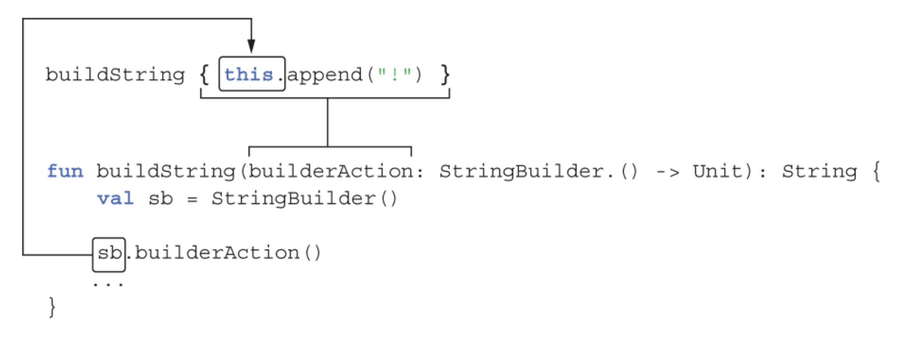

# CHAPTER 13. DSL construction

<small><i>DSL 만들기</i></small>

**DSL**
\: Domain-specific language. 특정 테스크, 도메인, 그리고 그 도메인에 관련된 기능만 사용하고 그 외 기능은 제외하는 언어.

<br>

## 13.1 From APIs to DSLs: Creating expressive custom code structures

<small><i>API 에서 DSL 로: 표현력이 좋은 커스텀 코드 구조 만들기</i></small>

#### 깔끔한 API
- 코드를 읽을 때 코드가 하는 일을 명확하게 이해할 수 있어야 함
  - 이름과 개념을 적절히 잘 선택하는 것이 중요
- 불필요한 구문이나 번잡한 준비 코드를 최소화
  - 깔끔한 API는 언어에 내장된 기능과 거의 구분할 수 없을 정도

<br>
<table>
  <tr>
    <th>Regular syntax</th>
    <th>Clean syntax</th>
    <th>Feature in use</th>
  </tr>
  <tr>
    <td><code>StringUtil.capitalize(s)</code></td>
    <td><code>s.capitalize()</code></td>
    <td>Extension function</td>
  </tr>
  <tr>
    <td><code>1.to("one")</code></td>
    <td><code>1 to "one"</code></td>
    <td>Infix call</td>
  </tr>
  <tr>
    <td><code>set.add(2)</code></td>
    <td><code>set += 2</code></td>
    <td>Operator overloading</td>
  </tr>
  <tr>
    <td><code>map.get("key")</code></td>
    <td><code>map["key"]</code></td>
    <td>Convention for the get method</td>
  </tr>
  <tr>
    <td><code>file.use({ f -> f.read() } )</code></td>
    <td><code>file.use { it.read() }</code></td>
    <td>Lambda outside of parentheses</td>
  </tr>
  <tr>
    <td><pre><code>with (sb) {<br>  append("yes")<br>  append("no")<br>}</code></pre></td>
    <td><pre><code>with (sb) {<br>  append("yes")<br>  append("no")<br>}</code></pre></td>
    <td>Lambda with a receiver</td>
  </tr>
  <tr>
    <td><pre><code>val m = mutableListOf<Int>()<br>m.add(1)<br>m.add(2)<br>return m.toList()</code></pre></td>
    <td><pre><code>val m = mutableListOf<Int>()<br>m.add(1)<br>m.add(2)</code></pre></td>
    <td>Builder functions with lambdas</td>
  </tr>
</table>

<br>

### 13.1.1 Domain-specific languages

<small><i>도메인 특화 언어</i></small>

#### 명령적 언어 vs 선언적 언어

- **명령적<sup>imperative</sup> 언어**: 어떤 연산을 완수하기 위해 필요한 각 단계를 순서대로 정확히 기술
  - e.g. 대부분의 프로그래밍 언어
- **선언적<sup>declarative</sup> 언어**: 원하는 결과를 기술하기만 하고 그 결과를 달성하기 위해 필요한 세부 실행은 언어를 해석하는 엔진에 맡김
  - e.g. DSL 언어 (SQL, 정규식)

<br>

> [!NOTE]
> 실행 엔진이 결과를 얻는 과정을 한번에 최적화하기 때문에 선언적 언어가 더 효율적인 경우가 자주 있음
> 
> 반면 명령형 접근법에서는 각 연산에 대한 구현을 독립적으로 최적화해야 함
> 
> <br>
> 
> **Example. SQL Query**
> 
> `DELETE` 쿼리 시, '실행 엔진'이 인덱스와 조인 등을 감안해 최적의 방법을 만들어냄.
>
> 테이블의 '각 레코드를 순회하면서 개별 필드를 추출해서 어떤 동작을 수행할지 결정하는 코드'를 작성하지는 않음

<br>

#### DSL의 단점
- DSL과 호스트 애플리케이션의 통합이 어려움
  - DSL 자체 문법 차이로 직접 포함 불가
  - 별도 파일/문자열로 저장해서 포함 시킬 수 있겠지만, IDE 지원, 디버깅, 컴파일 시점 검증 등이 제한됨
- DSL 문법 자체를 학습해야 하는 부담

→ 코틀린은 이러한 문제를 해결하기 위해 내부 DSL을 지원

<br>

### 13.1.2 Internal DSLs are seamlessly integrated into the rest of your program

<small><i>내부 DSL은 프로그램의 나머지 부분과 완벽하게 통합됨</i></small>

- **External DSL**: 독립적인 문법 구조를 갖음
- **Internal DSL**: 범용 언어로 작성된 프로그램의 일부로, 동일한 문법을 사용
- 따라서 내부 DSL은 완전히 다른 언어가 아니라 DSL 의 핵심 장점을 유지하면서 주 언어를 별도의 문법으로 사용하는 것

<br>

#### SQL<sub>외부 DSL</sub> vs. Exposed 프레임워크<sub>내부 DSL</sub>

[🔗 Exposed 프레임워크](https://github.com/JetBrains/Exposed): SQL library on top of a JDBC driver for the Kotlin

#### Example. 가장 많은 고객이 사는 나라를 찾는 예제

- Customer와 Country 테이블
- Customer가 Country를 외래키로 참조하는 구조

<table>
<tr>
  <th>SQL</th>
  <th>Exposed</th>
</tr>
<tr>
  <td>
  
  ```sql
SELECT Country.name, COUNT(Customer.id)
      FROM Country
INNER JOIN Customer
        ON Country.id = Customer.country_id
  GROUP BY Country.name
  ORDER BY COUNT(Customer.id) DESC
   LIMIT 1
```

  </td>
  <td>
  
```kotlin
(Country innerJoin Customer)
    .slice(Country.name, Count(Customer.id))
    .selectAll()
    .groupBy(Country.name)
    .orderBy(Count(Customer.id), order = SortOrder.DESC)
    .limit(1)
```

- `selectAll`, `groupBy`, `orderBy` 등 → 일반 코틀린 메서드

  </td>
</tr>

<br>

### 13.1.3 The structure of DSL

<small><i>DSL 구조</i></small>

- DSL과 일반 APT 사이에 잘 정의된 일반적인 경계는 없음
- 다른 API 에는 존재하지 않지만 DSL 에만 존재하는 특징 → 구조 또는 문법

1. **일반적인 API**:
   - 여러 메서드들로 구성
   - 메서드 호출 간에 중첩(nesting)이나 그룹화(grouping)와 같은 고유한 구조가 없음
   - 다음 호출로 넘어갈 때 컨텍스트가 유지되지 않음
   - 이러한 형태를 "command-query API"라고 부름

2. **DSL**:
   - 메서드 호출들이 DSL 문법에 의해 정의된 더 큰 구조 안에 존재
   - 여러 메서드 호출을 조합하여 연산을 만들고 타입 검사기가 올바른 타입인지 검사

<br>

#### Example. Kotlin Gradle DSL

<table>
<tr>
  <th>Command-query API</th>
  <th>Kotlin Gradle DSL</th>
</tr>
<tr>
  <td>
  
```kotlin
project.dependencies.add("testImplementation", kotlin("test"))
project.dependencies.add("implementation", "org.jetbrains.exposed:exposed-core:0.40.1")
project.dependencies.add("implementation", "org.jetbrains.exposed:exposed-dao:0.40.1")
```
  
  </td>
  <td>

```kotlin
dependencies {
    testImplementation(kotlin("test"))
    implementation("org.jetbrains.exposed:exposed-core:0.40.1")
    implementation("org.jetbrains.exposed:exposed-dao:0.40.1")
}
```

- 람다 중첩 (nesting) 표현으로 구조 생성
  
  </td>
</tr>
</table>

<br>

### 13.1.4 Building HTML with an internal DSL

<small><i>내부 DSL 로 HTML 만들기</i></small>

HTML 페이지를 생성하는 DSL → [🔗 kotlinx.html](https://github.com/Kotlin/kotlinx.html)

<table>
<tr>
  <th>HTML</th>
  <th>kotlinx.html</th>
</tr>
<tr>
  <td>
  
```html
<table>
  <tr>
    <td>1</td>
    <td>one</td>
  </tr>
  <tr>
    <td>2</td>
    <td>two</td>
  </tr>
</table>
```  

  </td>
  <td>

```kotlin
import kotlinx.html.stream.createHTML
import kotlinx.html.*
 
fun createTable() = createHTML().table {
    val numbers = mapOf(1 to "one", 2 to "two")
    for ((num, string) in numbers) {
        tr {
            td { +"$num" }
            td { +string }
        }
    }
}
```  
  </td>
</tr>
</table>

<br>

## 13.2 Building structured APIs: Lambdas with receivers in DSLs

<small><i>구조화된 API 구축: DSL 에서 수신 객체 지정 람다 사용</i></small>

### 13.2.1 Lambdas with receivers and extension function types

<small><i>수신 객체 지정 람다와 확장 함수 타입</i></small>


> [!NOTE]
> ### 수신 객체 지정 람다 <sup>lambda with receiver</sup>
> 
> 람다 본문 안에서 수신 객체를 명시적으로 참조하는 람다
> 수신 객체 지정 람다는 일반 람다와 똑같아 보임
>
> 객체 외부의 람다 코드 블록을 마치 해당 객체 내부에서 사용하는 것처럼 작성할 수 있게 해주는 장치
> 
> ```kotlin
> block : T.() -> R
> ```
> ➡️ 객체 `T`를 receiver로 이용하여 객체 `R`을 반환하는 람다
>
> `T`를 receiver 라 부르고, receiver를 사용하는 람다를 **lambda with receiver**라고 함
>
> <br>
>
> #### 📌 Lambda with receiver vs. Lambda with parameter
>
> ✅ **Lambda with parameter**
> 
> ```kotlin
> public inline fun <T> T.also(block: (T) -> Unit): T {
>     block(this)
>     return this
> }
> ```
>
> ✅ **Lambda with receiver**
> 
> ```kotlin
> public inline fun <T> T.apply(block: T.() -> Unit): T {
>     block()
>     return this
> }
> ```
>
> <br>
>
> #### 📌 **Comparison**
> 
> ```kotlin
> class person(var name: String)
> ```
> 
> ✅ **Lambda with parameter**
> 
> ```kotlin
> person.also {
>     println("my name is ${it.name}")
> }
> ```
>
> ➡️ 해당 객체를 **객체 외부에서 접근**하는 것처럼 보임 → 해당 객체를 통해 어떠한 행위를 수행하는 코드에 적합
> 
> ✅ **Lambda with receiver**
> 
> ```kotlin
> person.apply {
>     println("my name is $name")
> }
> ```
>
> ➡️ 해당 객체를 **객체 내부에서 접근**하는 것처럼 보임 → 객체를 초기화 하는 코드 혹은 객체의 상태를 변경하는 코드에 적합
> 

<br>

#### STEP 1. 람다를 인자로 받는 `buildString()` 정의

```kotlin
fun buildString(
    builderAction: (StringBuilder) -> Unit   // 함수 타입을 받음
): String {
    val sb = StringBuilder()
    builderAction(sb)                        // 람다 호출 시 sb 인스턴스 넘김
    return sb.toString()
}
```

**Usage.**

```kotlin
val s = buildString {
    it.append("Hello, ")        // it = StringBuilder 인스턴스
    it.append("World!")
}
println(s)                      // Hello, World!
```

- 람다 본문에서 매번 `it`을 사용해 `StringBuilder` 인스턴스를 참조해야 함
  - 혹은 매번 it 대신 원하는 파라미터 이름을 정의해야 함
- 더 간단하게 호출하기를 원함 → 수신 객체 지정 람다로 변경 필요

<br>

#### STEP 2. 수신 객체 지정 람다를 파라미터로 받는 `buildString()`

```diff
fun buildString(
-    builderAction: (StringBuilder) -> Unit
+    builderAction: StringBuilder.() -> Unit   // 수신 객체가 지정된 함수 타입의 파라미터
): String {
    val sb = StringBuilder()
-   sb.builderAction()
+   sb.builderAction()                        // StringBuilder 인스턴스를 람다의 수신 객체로 사용
    return sb.toString()
}
```

**Usage.**

```kotlin
val s = buildString {
    this.append("Hello, ")    // it → this (StringBuilder 인스턴스)
    append("World!")          // this 생략
}
println(s)                    // Hello, World!
```

<br>

#### 개선점

- 람다 안에서 `it` 을 사용하지 않아도 됨
  - `buildstring`에 **수신 객체 지정 람다**를 인자로 넘기기 때문
  - `this.` 는 모호성을 해결해야 할 때만 사용

- 일반 함수 타입 대신 확장 함수 타입을 사용하여 파라미터 타입을 선언
  - STEP 1: `(StringBuilder) -> Unit` → STEP 2: `StringBuilder.() -> Unit`
  
> [!NOTE]
> **확장 함수 타입 선언**
> 
> 이때 앞으로 빼낸 타입을 "수신 객체 타입(receiver type)"이라고 하며, 람다에 전달되는 이 타입의 값이 수신 객체가 됨
> 
> ```
>           파라미터 타입
>           —————————
>    String.(Int, Int): Unit
>    ——————             ————
>  수신 객체 타입        파라미터 타입
> ```

<br>

buildString 함수의 인자와 파라미터 사이의 **대응관계**

<br/><br/>

- **`buildString` 함수**(수신 객체 지정 람다)의 인자는 **확장 함수 타입의 파라미터** (`builderAction`)와 대응
- 호출된 람다 본문 안에서는 **수신 객체 (`sb`)** 가 **암시적 수신 객체 (`this`)** 가 됨

<br>

#### 2-1. 수신 객체 지정 람다를 변수에 저장

확장 함수 타입의 값을 반환하는 `appendExcl` 함수 정의

```kotlin
val appendExcl: StringBuilder.() -> Unit = { this.append("!") }
```

**Usage.**
 
```kotlin
val stringBuilder = StringBuilder("Hi")

// 1. appendExcl 함수를 확장 함수처럼 호출
stringBuilder.appendExcl()                 
println(stringBuilder)                // "Hi!"

// 2. appendExcl 함수를 인자로 넘길 수도 있음
println(buildString(appendExcl))      // "!"
```

➡️ 수신 객체 지정 람다는 일반 람다와 똑같아 보임

<br>

#### STEP 3. 수신 객체 지정 람다를 인자로 받는 함수 정의

```kotlin
fun buildString(builderAction: StringBuilder.() -> Unit): String =
        StringBuilder().apply(builderAction).toString()
```

<br>

#### 📌 `apply` 함수 & `with` 함수

<table>
<tr>
  <th>apply</th>
  <th>with</th>
</tr>
<tr>
  <td>
  
```kotlin
inline fun <T> T.apply(block: T.() -> Unit): T {
    block()
    return this
}
```

  </td>
  <td>

```kotlin
inline fun <T, R> with(receiver: T, block: T.() -> R): R =
    receiver.block()
```
  
  </td>
</tr>
<tr>
  <td>
  
- `apply` 함수는 수신 객체를 람다나 **함수의 암시적 수신 객체**로 사용
- **수신 객체를 다시 반환**
  
  </td>
  <td>
  
- `with` 함수는 **첫 번째 파라미터**로 받은 **수신 객체**를 **두 번째 파라미터**로 받은 **람다나 함수**의 **암시적 수신 객체**로 사용
- 람다를 호출해 얻은 **결과를 반환**

  </td>
</tr>
</table>

<br>

- 기본적으로 `apply` 와 `with` 는 모두 자신이 제공받은 수신 객체를 갖고 확장 함수 타입의 람다를 호출
- 결과를 받아서 쓸 필요가 없다면 두 함수를 서로 바꿔 쓸 수 있음

<br>

### 13.2.2 Building HTML with an internal DSL

<small><i>내부 DSL 로 HTML 만들기</i></small>

HTML 빌더를 위한 태그 클래스 정의

```kotlin
open class Tag
 
class TABLE : Tag {
    fun tr(init: TR.() -> Unit)   // tr 함수는 TR 타입을 수신 객체로 받는 람다를 인자로 받음
}
 
class TR : Tag {
    fun td(init: TD.() -> Unit)   // tㅇ 함수는 TD 타입을 수신 객체로 받는 람다를 인자로 받음
}
 
class TD : Tag
```

HTML 빌더 호출의 수신 객체를 명시한 코드

```kotlin
fun createSimpleTable() = createHTML().table {
    this@table.tr {           // this@table 타입 = TABLE
        this@tr.td {          // this@tr 타입 = TR
            +"cell"           // 암시적 수신 객체로 this@td 을 사용할 수 있고 그 타입은 TD
        }
    }
}
```

- 현재, 수신 객체 지정 람다가 중첩된 상태이며, 안쪽 람다에서 외부 람다에 정의된 수신 객체를 사용할 수 있음
  - `td` 함수의 인자인 람다 안에서는 3 가지 수신 객체 (`this@table`, `this@tr`, `this@td`) 를 사용할 수 있음
- 영역 안에 여러 수신 객체가 있으면 혼동이 올 수 있음

이를 `@DslMarker` 어노테이션을 사용해 막을 수 있음

<br>

#### `@DslMarker`

- 메타어노테이션
- 내포된 람다에서 외부 람다의 수신 객체에 접근하지 못하게 제한할 수 있음
- 즉, `@DslMarker` 어노테이션이 붙은 영역 안에서는 암시적 수신 객체가 결코 2개가 될 수 없음

이후 코드는 [🔗 demo 코드](./demo/src/main/kotlin/com/gngsn/html/Tag.kt) 참고

<br>


### 13.2.3 Kotlin builders: Enabling abstraction and reuse

<small><i>Kotlin 빌더: 추상화와 재사용 가능성 활성화</i></small>

- 반복되는 내부 DSL 코드 조각을 새 함수로 묶어 재사용
- 중복을 피하고 코드를 더 깔끔한 코드로 만들 수 있음

**Example. ToC 목록 생성 코드**

<table>
<tr>
  <th>Before Reuse</th>
  <th>After Reuse</th>
</tr>
<tr>
  <td>

```kotlin
fun buildBookList() = createHTML().body {
    ul {
        li { a("#1") { +"The Three-Body Problem" } }
        li { a("#2") { +"The Dark Forest" } }
        li { a("#3") { +"Death’s End" } }
    }
 
    h2 { id = "1"; +"The Three-Body Problem" }
    p { +"The first book tackles..." }
 
    h2 { id = "2"; +"The Dark Forest" }
    p { +"The second book starts with..." }
 
    h2 { id = "3"; +"Death’s End" }
    p { +"The third book contains..." }
}
```

  </td>
  <td>
  
```kotlin
fun buildBookList() = createHTML().body {
    listWithToc {
        item("The Three-Body Problem", "The first book tackles...")
        item("The Dark Forest", "The second book starts with...")
        item("Death’s End", "The third book contains...")
    }
}
```

</td>
</tr>
</table>

<br>

#### 빌더 클래스 정의

```kotlin
@HtmlTagMarker
class LISTWITHTOC {
    val entries = mutableListOf<Pair<String, String>>()
    fun item(headline: String, body: String) {
        entries += headline to body
    }
}

fun BODY.listWithToc(block: LISTWITHTOC.() -> Unit) {
    val listWithToc = LISTWITHTOC()
    listWithToc.block()
    ul {
        for ((index, entry) in listWithToc.entries.withIndex()) {
            li { a("#$index") { +entry.first } }
        }
    }
    for ((index, entry) in listWithToc.entries.withIndex()) {
        h2 { id = "$index"; +entry.first }
        p { +entry.second }
    }
}
```

<br>

## 13.3 More flexible block nesting with the invoke convention

<small><i>invoke 관례를 사용해 더 유연하게 블록 내포시키기</i></small>

invoke 컨벤션을 사용하면 어떤 커스텀 타입의 객체를 함수처럼 호출할 수 있음

<br>

### 13.3.1 The invoke convention: Objects callable as functions

<small><i>invoke 관례를 사용해 더 유연하게 블록 내포시키기</i></small>

- `invoke` 메서드의 특정 요구사항은 없기 때문에, 원하는 파라미터 지정 가능
  - e.g. 파라미터 개수, 타입, `invoke` 오버로딩

<br>

- 람다는 함수형 인터페이스(`Function1` 등)를 구현하는 클래스로 컴파일됨 (인라인하는 람다를 제외)
- 실제로, 함수형 인터페이스는 이름이 나타내는 수 만큼의 파라미터를 받는 `invoke` 메서드가 들어있음

```kotlin
interface Function2<in P1, in P2, out R> {  // 두 개의 파라미터를 받는 함수형 인터페이스
    operator fun invoke(p1: P1, p2: P2): R
}
```

<br>

### 13.3.2 The invoke convention in DSLs: Declaring dependencies in Gradle

<small><i>DSL의 `invoke` 관례: 그레이들 의존관계 선언</i></small>

<br>

아래 두 방식을 모두 지원하는 경우를 가정

<table>
  <tr>
    <td>
      <pre><code>dependencies.implementation("org.jetbrains.exposed:exposed-core:0.40.1")</code></pre>
      설정할 항목이 많으면 내포된 블록 구조를 사용
    </td>
    <td>
      <pre><code>dependencies {
    implementation("org.jetbrains.exposed:exposed-core:0.40.1")
}</code></pre>
설정할 항목이 하나뿐이면 간단히 함수 호출 구조를 사용
</td></tr>
</table>

**구현 방법**

- 좌측은 `dependencies` 변수에 대해 `implementation` 메서드를 호출
- 우측은 `dependencies` 안에 람다를 받는 `invoke` 메서드를 정의할 수 있음

<br>

```kotlin
class DependencyHandler {
    fun implementation(coordinate: String) {
        println("Added dependency on $coordinate")
    }
 
    operator fun invoke(
        body: DependencyHandler.() -> Unit) {        // invoke를 정의해 DSL 스타일 API 제공
        body()                                       // = this.body()
    }
}
 
fun main() {
    val dependencies = DependencyHandler()
    dependencies.implementation("org.jetbrains.kotlinx:kotlinx-coroutines-core:1.8.0")
    
    dependencies {
        implementation("org.jetbrains.kotlinx:kotlinx-datetime:0.5.0")
    }
}
```

두 번째 호출은 아래와 같음

```kotlin
dependencies.invoke({
    this.implementation("org.jetbrains.kotlinx:kotlinx-datetime:0.5.0")
})
```

람다의 타입은 **확장 함수 타입**(수신 객체를 지정한 함수 타입)이며, 수신 객체 타입은 `DependencyHandler` 임

재정의한 `invoke` 메서드로 인해 DSL API 의 유연성이 훨씬 커짐

<br>

## 13.4 Kotlin DSLs in practice

<small><i>실전 코틀린 DSL</i></small>

### 13.4.1 Chaining infix calls: The `should` function in test frameworks

<small><i>중위 호출 연쇄시키기: 테스트 프레임워크의 `should` 함수</i></small>

DSL을 깔끔하게 만들려면 코드에 쓰이는 기호의 수를 줄여야 함

<br>

#### Example.

[🔗 Kotest](https://github.com/kotest/kotest) DSL에서 중위 호출 활용법


<pre><code lang="kotlin">@Test
fun testKPrefix() {
    val s = "kotlin".uppercase()
    s <b>should startWith("K")</b>
}
</code></pre>

#### `should` 함수

<pre><code lang="kotlin"><b>infix</b> fun &lt;T&gt; T.should(matcher: Matcher&lt;T&gt;) = matcher.test(this)
</code></pre>

`Should` 함수는 `Matcher` 의 인스턴스를 인자로 받음

<br>

#### `Matcher`

```kotlin
interface Matcher<T> {
    fun test(value: T)
}
```
`Matcher`는 값에 대한 단언문을 표현하는 제네릭 인터페이스

<br>

#### `startWith` 구현 코드

```kotlin
fun startWith(prefix: String): Matcher<String> {
    return object : Matcher<String> {
        override fun test(value: String) {
            if(!value.startsWith(prefix)) {
                throw AssertionError("$value does not start with $prefix")
            }
        }
    }
}
```

- `Matcher` 를 구현
- 어떤 문자열이 주어진 문자열로 시작하는지 검사

<br>

### 13.4.2 Defining extensions on primitive types: Handling dates

<small><i>원시 타입에 대해 확장 함수 정의하기: 날짜 처리</i></small>

[🔗 `kotlinx.datetime` 라이브러리](https://github.com/Kotlin/kotlinx-datetime)에서는 **날짜와 시간을 다루기 위한 DSL 제공**

<table>
<tr>
  <th>사용 예시</th>
  <th>구현 코드</th>
</tr>
<tr><td>
<pre><code lang="kotlin">val now = Clock.System.now()
val yesterday = now - <b>1.days</b>
val later = now + <b>5.hours</b>
</code></pre>

</td><td>

```kotlin
import kotlin.time.DurationUnit
 
val Int.days: Duration
    get() = this.toDuration(DurationUnit.DAYS)    // this = 정수
 
val Int.hours: Duration
    get() = this.toDuration(DurationUnit.HOURS)   // 내장 함수 toDuration 로 위임
```

</td></tr></table>

<br>

### 13.4.3 Member extension functions: Internal DSL for SQL

<small><i>멤버 확장 함수: SQL 을 위한 내부 DSL</i></small>

**Example.**

[🔗 `exposed` 프레임워크](https://github.com/JetBrains/Exposed)에서 제공하는 SOL 내부 DSL


#### `Country` 테이블 선언

```kotlin
object Country : Table() {
    val id = integer("id").autoIncrement()
    val name = varchar("name", 50)
    override val primaryKey = PrimaryKey(id)
}
```

- 데이터베이스 테이블과 대응
- 이 테이블을 만들려면 트랜잭션과 함께 `Schemautils.create(Country)` 메서드 호출

<table>
<tr>
  <th>Kotlin exposed 사용 코드</th>
  <th>SQL 변환 코드</th>
</tr>
<tr><td>
<pre><code lang="kotlin">fun main() {
    val db = Database.connect("jdbc:h2:mem:test", driver = "org.h2.Driver")
    transaction(db) {
        SchemaUtils.create(Country)
    }
}</code></pre>

</td><td>

```kotlin
CREATE TABLE IF NOT EXISTS Country (
    id INT AUTO_INCREMENT NOT NULL,
    name VARCHAR(50) NOT NULL,
    CONSTRAINT pk_Country PRIMARY KEY (id)
)
```

</td></tr></table>

칼럼의 속성을 지정하는 방법

<table>
<tr>
  <th>Kotlin exposed 사용 코드</th>
  <th>SQL 변환 코드</th>
</tr>
<tr><td>

```kotlin
val id = integer("id").autoIncrement()
```

</td><td>

```kotlin
class Table {
    fun Column<Int>.autoIncrement(): Column<Int>    // 숫자 타입 컬럼에 한해 적용 가능
    // ...
}
```

</td></tr></table>

칼럼의 속성을 지정하는 방법

<table>
<tr>
  <th>`exposed`에서 테이블 조인</th>
  <th>SQL 변환 코드</th>
</tr>
<tr><td>

<pre><code lang="kotlin">val result = (Country <b>innerJoin</b> Customer)
    .select { Country.name <b>eq</b> "USA" }          // → WHERE Country.name = "USA"
result.forEach { println(it[Customer.name]) }</code></pre>


</td><td>

실제 `select` 와 `eq` 함수를 단순화한 코드

```kotlin
fun Table.select(where: SqlExpressionBuilder.() -> Op<Boolean>) : Query
 
object SqlExpressionBuilder {
    infix fun<T> Column<T>.eq(t: T) : Op<Boolean>
    // ...
}
```

</td></tr></table>

<br>

## Summary

- 코틀린 내부 DSL: 여러 메서드 호출 구조를 쉽게 표현할 수 있게 해주는 API 설계 패턴
  - 코틀린 내부 DSL을 사용하면 코드를 추상화하고 재활용할 수 있음
- 람다 수신 객체<sup>Lambdas with receivers</sup>: 람다 본문 내에서 메소드를 어떻게 실행할지 재정의해서 중첩 구조를 쉽게 구조화함
  - 수신 객체 지정 람다를 파라미터로 받은 경우 그 람다의 타입은 확장 함수타입
  - 람다를 파라미터로 받아 사용하는 함수는 람다를 호출하면서 람다에게 수신 객체를 제공
- 원시 타입에 대한 확장을 정의하면 상수를 가독성있게 다룰 수 있음 (e.g. 기간)
- `invoke` 컨벤션을 사용하면 임의의 객체를 함수처럼 다룰 수 있음
- [🔗 Kotest](https://github.com/kotest/kotest), [Exposed](https://github.com/JetBrains/Exposed) 는 각각 단위 테스트, 데이터베이스를 위한 단언문을 지원하는 내부 DSL 제공


