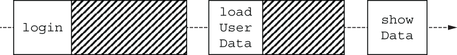
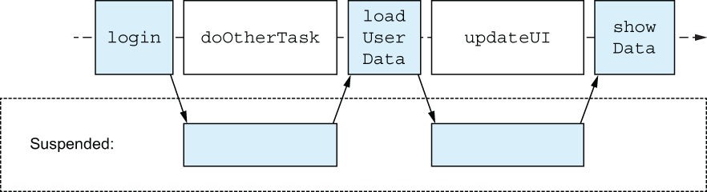

# 14. Coroutines 

<small><i>코루틴</i></small>

**코루틴**: 다른 여러 연산을 스레드를 사용할 때처럼 블록<sub>Block</sub>시키지 않고, 독립적으로 실행하면서 여러 동시 작업을 동기화하고 조화시킬 수 있는 도구

<br/>

## 14.1 Concurrency vs. parallelism

<small><i>동시성과 병렬성</i></small>

**동시성과 병렬성 개념 사이의 관계**
- **동시성**<sup>concurrency</sup>: 코드가 동시에 실행될 수 있는 여러 부분으로 나뉘는 일반적인 능력을 의미
- **병렬성**<sup>parallelism</sup>: 여러 CPU 코어에서 실제로 여러 작업을 동시에 실행하는 것을 의미

<br>

#### 📌 동시성 <sup>Concurrent</sup>

- 동시성이라고 해서 모든 작업을 반드시 '물리적'으로 함께 실행한다는 의미는 아님
- 여러 동시성 태스크를 계속 전환해가면서 동시성을 달성 ← 이 경우도 **동시성 시스템**
  - 즉, CPU 코어가 하나뿐인 시스템에서 실행되는 애플리케이션까지도 동시성을 사용할 수 있다는 뜻

```
---[UI]--[Calc]--[UI]--[Calc]-->

실행을 번갈아 실행
→ 애플리케이션이 싱글 코어여도, 한 번에 하나 이상의 작업을 수행
```

<br>

병렬 계산은 현대적 멀티코어 하드웨어를 효과적으로 사용할 수 있고, 그 효율을 더 높이는 경우도 있음

<br>

#### 📌 병렬성 <sup>Parallelism</sup>

여러 CPU 코어에서 여러 작업을 물리적으로 동시에 실행하는 것

```
---[UI]--[UI]--[UI]--[UI]-->
---[Calc]--[Calc]--[Calc]-->

오래 걸리는 계산을 백그라운드에서 진행하면서 UI를 렌더링
```

<br/>

## 14.2 Concurrency the Kotlin way: Suspending functions and coroutines

<small><i>코틀린의 동시성 처리 방법: 일시중단 함수와 코루틴</i></small>

- 비동기 + 넌블로킹 동시성 코드를 우아하게 작성할 수 있게 해줌
- 경량: 전통적 스레드와 비교하면 훨씬 가볍게 작동
- 구조화된 동시성: 동시성 작업과 그 생명주기를 관리할 수 있는 기능 제공

<br>

## 14.3 Comparing threads and coroutines

<small><i>스레드와 코루틴 비교</i></small>

코틀린 스레드는 자바와 100% 호환

<br>

#### 📌 스레드

: JVM에서 생성하는 각 스레드는 운영체제가 관리하는 시스템 스레드

- 애플리케이션의 반응성을 높임
- 멀티코어 CPU의 여러 코어에 작업을 분산시켜 시스템 효율을 향상시킴

**한계**
- **생성 · 관리 비용이 큼**: 메모리 할당과 전환 비용이 누적되어 **성능 저하** 유발
  - **메모리 할당**: 각 스레드는 몇 메가바이트의 메모리를 할당받아야 함
  - **전환 비용**: 스레드 간 전환이 운영체제 커널 수준에서 실행되어 오버헤드가 큼
- 응답 대기 중에 **시스템 자원을 점유한 채 대기**함
  - 작업 완료를 기다리는 동안 블록되어, **자원을 비효율적으로 사용**함 (e.g. 네트워크 요청 등)

<br>

**Example. 코틀린 스레드 시작**

```kotlin
import kotlin.concurrent.thread
 
fun main() {
    println("I'm on ${Thread.currentThread().name}")            // I'm on main
    thread {
        println("And I'm on ${Thread.currentThread().name}")    // And I'm on Thread-0
    }
}
```

<br>

✅ 스레드 생성은 신중하게 결정해야 하며, **짧은 시간 동안 잠깐 사용하는 것은 피하는 것이 좋음**

→ 코틀린은 스레드에 대한 대안으로 코루틴이라는 추상화를 도입

<br>

#### 📌 코루틴

- 코루틴은 스레드보다 **훨씬 가볍고**, **생성 및 관리 비용이 저렴**해 수만 개도 쉽게 실행 가능
- 시스템 자원을 블록하지 않고 일시 중단 및 재개가 가능해 비동기 작업에 효율적
- **구조화된 동시성**<sup>Structured Concurrency</sup>으로 계층적 관리와 취소, 오류 처리가 용이함
- 짧은 시간 동안 실행되는 세밀한 작업에도 적합함
- 동시 작업 구성이 단순해지고, 오류 발생 시 관련 코루틴을 함께 취소할 수 있음

<br><br><br>

<br>

#### 📌 코루틴과 프로젝트 룸

**코루틴**
- 코틀린 코루틴은 매우 가볍고 효율적으로 설계되어, 자주 생성·소멸되는 고도의 동시성 코드에 적합

**프로젝트 룸** - [🔗 Project Loom](https://wiki.openjdk.org/display/loom)
- 주요 목표는 기존의 I/O 중심 레거시 코드를 가상 스레드로 포팅할 수 있게 하는 것
- 룸은 기존의 자바 스레드와 I/O API에 맞춰 재구성됨
  - 빠른 로컬 계산과 네트워크로부터 예측할 수 없는 시간 동안 정보를 기다려야 하는 함수(코틀린 코루틴의 일시 중단 함수) 사이에 언어 수준에서의 구분이 없음 
  - 지역적 작업(UI, 캐시, 상태 갱신)이 원격 데이터 접근과 혼합된 대규모 코드베이스에서 코드를 이해하는 것이 더 어려워짐


<br>

| 구분               | 자바 레거시 스레드 API                                    | 프로젝트 룸 (Project Loom)                                | 코틀린 코루틴 API                                                         |
| ------------------ | --------------------------------------------------------- | --------------------------------------------------------- | ------------------------------------------------------------------------- |
| 사용 환경          | 스레드 생성 비용이 크고, 자주 생성하지 않는 상황에 최적화 | JVM에 가상 스레드 도입, 기존 스레드/코드와 호환성 중시    | 경량 동시성 처리가 필요한 코드에 최적화, 코루틴을 자주 생성해도 부담 없음 |
| 생성/관리 비용     | 높음 (메모리, 전환 비용 등)                               | 낮음 (가상 스레드로 경량 동시성 제공)                     | 매우 낮음 (작은 작업에도 부담 없이 생성 가능)                             |
| 동시성 작업        | 수천 개 수준이 한계                                       | 수십만 개의 가상 스레드 생성 가능                         | 수십만 ~ 수백만 개의 코루틴 생성 가능                                     |
| 메모리/자원 효율   | 비효율적 (스레드가 자원 점유)                             | 효율적 (필요할 때만 자원 사용, 최소화)                    | 효율적 (필요할 때만 자원 사용, 최소화)                                    |
| 코드 구조화        | 구조화된 동시성 지원 미흡                                 | 구조화된 동시성 실험적 지원(향후 발전 예정)               | 구조화된 동시성 지원, 자원 누수 방지                                      |
| 일시중단 함수 구분 | 없음                                                      | 없음 (일반 함수와 일시중단 함수 구분 없음)                | `suspend` 키워드로 명확히 구분                                            |
| 플랫폼 독립성      | JVM 한정                                                  | JVM 한정                                                  | JVM 외에도 다양한 플랫폼에서 사용 가능                                    |
| 사용 예시          | 신중하게 스레드 생성, 짧은 작업에는 부적합                | 기존 자바 코드와 I/O 중심 코드의 경량화, 가상 스레드 활용 | 사소한 작업(예: 카운터 증가)에도 코루틴 생성 가능                         |


<br>

## 14.4 Functions that can pause: Suspending functions

<small><i>잠시 멈출 수 있는 함수: 일시 중단 함수</i></small>

<br>

코틀린 **코루틴**:
- 다른 동시성 접근 방식과 달리 대부분 코드를 크게 바꿀 필요가 없음 
  - e.g. 다른 동시성 접근 방식: 스레드, 반응형 스트림, 콜백 등
- 코드는 여전히 순차적인 흐름으로 보임

<br>

### 14.4.1 Code written with suspending functions looks sequential

<small><i>일시 중단 함수를 사용한 코드는 순차적으로 보인다</i></small>

<br>

#### Example. 동시성 ❌

```kotlin
fun login(credentials: Credentials): UserID
fun loadUserData(userID: UserID): UserData
fun showData(data: UserData)
 
// `login`과 `loadUserData` 함수는 네트워크 요청을 보내고, 네트워크 응답이 오면 값을 반환
fun showUserInfo(credentials: Credentials) {
    val userID = login(credentials)
    val userData = loadUserData(userID)
    showData(userData)
}
```

`login`과 `loadUserData` 함수 모두 **블로킹(blocking)** 함수

<br>

- 코드의 대부분의 시간은 네트워크 작업 결과를 기다리는 데 소비
- `showUserInfo` 함수가 실행 중인 스레드는 블로킹됨
- 블로킹된 스레드는 자원을 낭비하게 됨
  - 한 번에 처리 가능한 시스템 스레드 수는 오직 수천 개
- 애플리케이션에 사용자 인터페이스가 있다면, 동시성을 사용하지 않고 이 함수를 호출할 경우 작업이 완료될 때까지 전체 UI가 멈춰버릴 수 있음

<br>

#### Example. 동시성 ✅

**코루틴을 사용한 논블로킹 방식**: `suspend` 변경자 추가

<pre><code lang="kotlin"><b>suspend</b> fun login(credentials: Credentials): UserID
<b>suspend</b> fun loadUserData(userID: UserID): UserData
fun showData(data: UserData)
 
<b>suspend</b> fun showUserInfo(credentials: Credentials) {
    val userID = login(credentials)
    val userData = loadUserData(userID)
    showData(userData)
}
</code></pre>

<br>

- ✔️ **`suspend` 변경자 사용**
  - 해당 함수가 실행을 **잠시 멈출 수 있다**는 의미
  - 네트워크 응답을 기다리는 경우, 함수 실행을 일시 중단할 수 있음
- ✔️ **코드 구조는 변경되지 않음**

<br><br><br>

- **일시 중단 함수**: 기다리는 함수가 실행을 블로킹하지 않음<sub>Suspension doesn’t block the underlying thread</sub>
- 일시 중단은 **기저 스레드를 블로킹하지 않고, 다른 코드가 같은 스레드에서 실행될 수 있음**
- 해당 함수가 일시 중단되고, 이 함수가 다시 실행될 수 있을 때까지 **다른 코드에게 실행을 양보**

<br><br>

> [!WARNING]
> 
> 코루틴 사용 시 **사용하는 라이브러리의 구현도 코틀린 코루틴을 고려해 작성되어야 함**
> 
> 실제로 코틀린 생태계의 많은 라이브러리들이 코루틴과 함께 작동하는 API를 제공
> 
> e.g. 네트워크 요청 → **Ktor HTTP 클라이언트**, **Retrofit**, **OkHttp**

<br>

## 14.5 Comparing coroutines to other approaches

<small><i>코루틴을 다른 접근 방식과 비교하기</i></small>

**동시성 코드 사용 방식 비교**: **콜백(callback), 반응형 스트림(RxJava), 퓨처(Future)** 

<br>

### 📌 콜백<sup>callback</sup>

`login`과 `loadUserDataAsync` 함수의 시그니처를 수정해 콜백 파라미터를 추가할 수 있음

<br>

<pre><code lang="kotlin">fun loginAsync(credentials: Credentials, <b>callback: (UserID) -> Unit</b>)
fun loadUserDataAsync(userID: UserID, <b>callback: (UserData) -> Unit</b>)
fun showData(data: UserData)
 
fun showUserInfo(credentials: Credentials) {
    loginAsync(credentials) { userID ->
        loadUserDataAsync(userID) { userData ->
            showData(userData)
        }
    }
}
</code></pre>

<br>

- 콜백 안에 또 다른 콜백이 중첩되는 구조가 되기 쉬움 → **콜백 지옥**(callback hell)
  - 로직 규모 ↑ → 여러 중첩 콜백 ↑↑ → 코드 복잡성 ↑↑↑ + 가독성 ↓↓↓

<br>

### 📌 퓨처<sup>Future</sup>

`CompletableFuture` 사용

<pre><code lang="kotlin">fun loginAsync(credentials: Credentials): <b>CompletableFuture</b><UserID>
fun loadUserDataAsync(userID: UserID): <b>CompletableFuture</b><UserData>
fun showData(data: UserData)
 
fun showUserInfo(credentials: Credentials) {
    loginAsync(credentials)
        <b>.thenCompose</b> { loadUserDataAsync(it) }
        <b>.thenAccept</b> { showData(it) }
}
</code></pre>

- **장점**
  - **콜백 지옥 해결**
- **단점**
  - **인지적 부가비용 필요**: 새로운 연산자를 익혀야 함 (e.g. `thenCompose`, `thenAccept`)
  - **함수 시그니처 변경 필요**: 반환 타입을 `CompletableFuture`로 감싸야 함
    - 기존 코드와 호환성이 떨어질 수 있음

<br>

### 📌 반응형 스트림<sup>ex. RxJava</sup>

<pre><code lang="kotlin">fun login(credentials: Credentials): <b>Single&lt;UserID&gt;</b>
fun loadUserData(userID: UserID): <b>Single&lt;UserData&gt;</b>
fun showData(data: UserData)
 
fun showUserInfo(credentials: Credentials) {
    login(credentials)
        .<b>flatMap</b> { loadUserData(it) }
        .<b>doOnSuccess</b> { showData(it) }
        .<b>subscribe()</b>
}
</code></pre>

**장점**
- **콜백 지옥 해결**

**단점**
- **인지적 부가비용 필요**: 새로운 연산자를 익혀야 함 (e.g. `flatMap`, `doOnSuccess`, `subscribe` 연산자 등)
- **함수 시그니처 변경 필요**: 반환 타입을 `Single`로 감싸야 함
  - 기존 코드와 호환성이 떨어질 수 있음

<br>

### ✍🏻 동시성 접근 방식 비교

| 항목           | 콜백 (Callback)               | 퓨처 (Future / CompletableFuture) | 반응형 스트림 (RxJava)                        | 코루틴 (Kotlin Coroutines)              |
| ------------ | --------------------------- | ------------------------------- | --------------------------------------- | ------------------------------------ |
| **코드 구조**    | 중첩이 많고 가독성이 떨어짐 (콜백 지옥 발생)  | 연산자 체이닝으로 비교적 깔끔함               | 함수형 체이닝 구조, 직관적이지 않을 수 있음               | 순차적 구조 유지, 가장 읽기 쉬움                  |
| **함수 시그니처**  | 콜백 파라미터를 추가해야 함             | 반환 타입을 `Future`로 감싸야 함          | 반환 타입을 `Single`, `Observable` 등으로 감싸야 함 | `suspend` 키워드만 추가, 함수 구조 변화 최소화      |
| **러닝 커브**    | 낮음 (개념이 단순)                 | 중간 (체이닝 연산자 익숙해져야 함)            | 높음 (연산자, backpressure 등 학습 필요)          | 낮음\~중간 (기본 개념은 쉽고, 고급 개념은 선택적)       |
| **오류 처리**    | try-catch 사용 어려움, 분산된 에러 처리 | `handle`, `exceptionally` 필요    | `onErrorResumeNext` 등 별도 연산자 사용 필요      | 일반적인 try-catch 사용 가능                 |
| **중단/취소**    | 명시적으로 관리해야 하며 어려움           | `cancel()` 지원, 하지만 다루기 복잡       | `dispose()` 필요, 누수 위험 존재                | `Job.cancel()`, 구조적 동시성으로 안전하게 관리 가능 |
| **에코시스템/지원** | 거의 모든 언어에서 지원               | Java 표준 기능                      | RxJava, Reactor 등 다양한 라이브러리 존재          | 코틀린 생태계에서 광범위하게 지원됨                  |
| **추론 가능성**   | 흐름 추적이 어려움                  | thenCompose 등이 익숙하지 않으면 추적 어려움  | 복잡한 체이닝 시 디버깅 어려움                       | 순차적 코드 덕분에 흐름 추적이 쉬움                 |

<br>

✅ 반응형 스트림이나 퓨처에도 적절한 활용 사례는 분명 존재

<br>

**코틀린에는 자체 제공 동시성** 
- `Deferred` 타입 → 코틀린 자체 정의 퓨처 스타일
  - [🔗 kotlinlang: Deferred](https://kotlinlang.org/api/kotlinx.coroutines/kotlinx-coroutines-core/kotlinx.coroutines/-deferred/)
- `Flow` 타입 → 코루틴용 반응형 스트림 추상화 (16장, 17장 참고)
  - [🔗 kotlinlang: Flow](https://kotlinlang.org/api/kotlinx.coroutines/kotlinx-coroutines-core/kotlinx.coroutines.flow/-flow/)

<br>

### 14.5.1 Calling a suspending function

<small><i>일시 중단 함수 호출하기</i></small>

일시 중단 함수는 **일시 중단 가능한 코드 블록 안에서만 호출할 수 있음**

`suspend` 함수는 실행을 일시 중단할 수 있기 때문에, 일반 코드 어디서나 호출할 수 없음

<br>

> "어떤 함수가 실행을 일시 중단할 수 있다면, 그 함수를 호출하는 쪽도 잠재적으로 일시 중단될 수 있다."
> 
> "일시 중단이 전파된다"
> 
> 위와 같은 직관과 잘 맞음

<br>

일반 함수나 블로킹 코드에서 일시 중단 함수를 호출하려고 하면 **컴파일 오류 발생**

```kotlin
suspend fun mySuspendingFunction() {}
 
fun main() {
    mySuspendingFunction()     // Error: Suspend function mySuspendingFunction should be called only from a coroutine or another suspend function.
}
```

→ **코루틴 빌더**를 사용

- **코루틴 빌더**: **새로운 코루틴을 생성**하는 역할을 하며, `suspend` 함수를 호출할 수 있는 **일반적인 진입점**으로 사용됨

<br>

## 14.6 Entering the world of coroutines: Coroutine builders

<small><i>코루틴의 세계로 들어가기: 코루틴빌더</i></small>

- runBlocking은 블로킹 코드와 일시 중단 함수의 세계를 연결할 때 쓰인다.
- launch는 블로킹하지 않는 새로운 코루틴을 시작할 때 쓰인다.
- async는 비동기적으로 값을 계산할 때 쓰인다.

<br>

### 14.6.1 From regular code into the realm of coroutines: The runBlocking function

<small><i>일반코드에서 코루틴의 세계로: runBlocking 함수</i></small>

일반 블로킹 코드를 일시 중단 함수의 세계로 연결하려면 runBlocking 코루틴 빌더 함수에게 코루틴 본문을 구성하는 코드 블록을 전달할 수 있다.

새 코루틴을 생성하고 실행하며, 해당 코루틴이 완료될 때까지 현재 스레드를 블록시킨다. 
전달된 코드 블록 내에서는 일시 중단 함수를 호출할 수 있다. 
다음 예제는 내장된 delay 함수를 사용해 코루틴을 500 밀리초 동안 일시 중단한 후 텍스트를

// code

코루틴 안에서는 추가적인 자식 코루틴을 얼마든지 시작할 수 있고, 이 자식 코루틴들은 다른 스레드를 더 이상 블록시키지 않는다.
대신, 일시 중단될 때마다 하나의 스레드가 해방돼 다른 코루틴이 코드를 실행할 수 있게 된다. 이런 추가 자식 코루틴을 시작할 때 launch 코루틴 빌더를 사용할 수 있다.

<br>

### 14.6.2 Creating start-and-forget coroutines: The launch function

<small><i>발사 후 망각 코루틴 생성: launch 함수</i></small>

launch 함수는 새로운 자식 코루틴을 시작하는데 쓰인다. 
이는 일반적으로 '발사 후 망각' 시나리오에 사용되며, 
어떤 코드를 실행하되 그 결과 값을 기다리지 않는 경우에 적합. 

runBlocking이 오직 하나의 스레드만 블록한다는 주장을 테스트해보자.
코드가 언제 어디서 실행되는지 더 명확히 알기 위해 print 대신에 간단한 로그 함수를 사용해보자.
이 함수는 호출되는 스레드와 타임스탬프를 추가한 더 많은 정보를 제공한다.

이 예시에서 모든 코루틴은 한 스레드, 즉 main 스레드에서 실행됨

그림 14.8 첫번째 (부모) 코루틴 (coroutine#1)은 2가지 코루틴을 더 시작해 launch.
coroutine#2는 일시 중단 지점에 이를 때까지 실행.
그리고 메인 스레드를 블록시키지 않고 일시 중단되면서, 메인 스레드를 coroutine#3의 작업에 사용하게 놓아준다.
나중에 coroutine#2는 다시 실행을 재개한다.
이 코드는 3개의 코루틴이 시작된다.  
첫 번째는 runBlocking에 의해 시작된 부모 코루틴(로그에는 coroutine#1로 표시)이고,  
두 번째와 세 번째는 두 번의 launch 호출에 의해 시작된 자식 코루틴이다(각각 coroutine#2, coroutine#3으로 표시).  
coroutine#2가 delay 함수를 호출하면 코루틴이 일시 중단된다. 이를 일시 중단 지점(suspension point)이라고 한다.  
이때 coroutine#2는 지정된 시간 동안 일시 중단되고, 메인 스레드는 다른 코루틴이 실행될 수 있도록 해방된다.  
그 결과 coroutine#3이 작업을 시작할 수 있다. coroutine#3은 로그 호출 하나만 포함하고 있기 때문에 빠르게 끝난다.  
지정된 10밀리초 후 coroutine#2가 작업을 재개하고, 프로그램 전체가 완료된다.

#### 일시 중단된 코루틴은 어디로 가는가?

코루틴이 제대로 동작할 수 있도록 하는 주요 작업은 컴파일러가 수행한다.  
컴파일러는 코루틴을 일시 중단하고 재개하며, 스케줄링에 필요한 지원 코드를 생성한다.  
일시 중단 함수의 코드는 컴파일 시점에 변환되고, 실행 시점에 코루틴이 일시 중단될 때 해당 시점의 상태 정보가 메모리에 저장된다.  
이 정보를 바탕으로 나중에 실행을 복구하고 재개할 수 있다.

병렬성 없이 교차 실행되는 경우임을 알 수 있다.

코루틴을 여러 스레드에서 병렬로 실행하고 싶다면 코드를 거의 변경하지 않고도 다중 스레드 디스패처를 사용할 수 있다.

launch를 사용해 새로운 기본 코루틴을 시작할 수 있다. 하지만 launch는 동시 계산을 수행할 수는 있지만, 코루틴 내부에서 값을 반환하는 것이 간단하지 않다.  
launch는 값을 반환하기보다는 파일이나 데이터베이스에 쓰는 작업처럼 부수 효과를 일으키는 '시작 후 신경 쓰지 않아도 되는' 작업에 더 적합하다.  
launch 함수는 Job 타입의 객체를 반환하는데, 이를 시작된 코루틴에 대한 핸들로 생각할 수 있다.  
Job 객체를 사용하면 코루틴 실행을 제어할 수 있다. 예를 들어, 취소를 촉발시킬 수 있다(코루틴 취소는 15장에서 더 자세히 다룬다).  
계산 결과를 반환해야 하는 경우에는 다른 프로그래밍 언어에서 이미 익숙한 이름을 가진 코루틴 빌더 함수를 쓴다. 바로 async이다.

