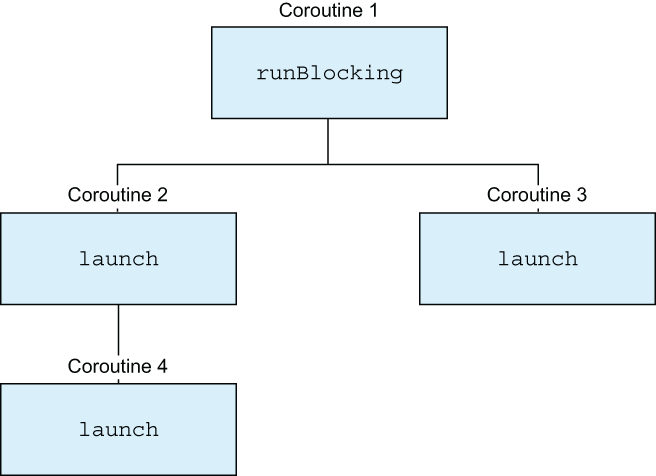
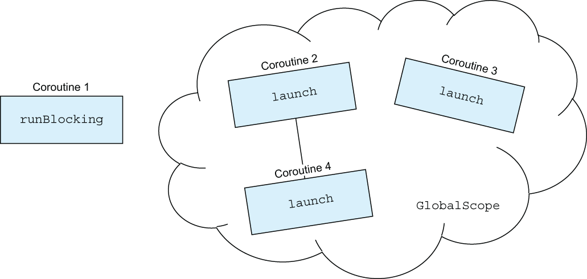
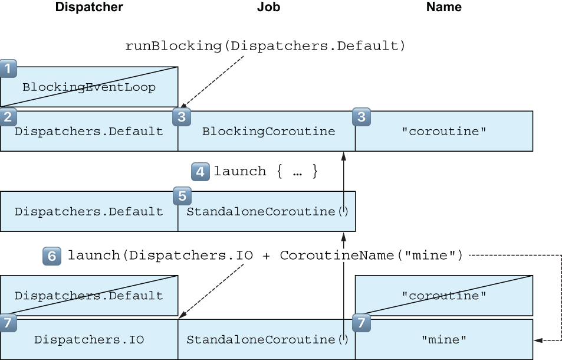
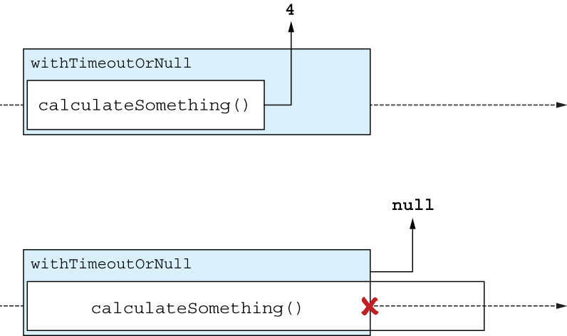

# 15. Structured concurrency

<small><i>구조화된 동시성</i></small>

여러 동시 작업을 처리할때 어려운 점:
- 실행중인 개별 작업을 추적
- 더이상 필요하지 않을때 이를 취소
- 오류를 제대로 처리

<br>

애플리케이션에서는 보통 많은 코루틴을 처리하는데,
이 때 코루틴을 추적하지 않으면, 리소스 누수 혹은 불필요한 작업을 하게 될 수 있음

#### ➡️ **구조화된 동시성(Structured Concurrency)**

: 애플리케이션 안에서 코루틴과 그 생애 주기의 계층을 관리하고 추적할 수 있는 기능이
- 코틀린 코루틴의 핵심에 내장돼 있음
- 수동으로 시작된 각 코루틴을 일일이 추적하지 않아도 기본적으로 작동

<br>

## 15.1 Coroutine scopes establish structure between coroutines With

<small><i>15.1 코루틴 스코프가 코루틴 간의 구조를 확립한다</i></small>

구조화된 동시성을 통해 각 코루틴은 <b>코루틴 스코프<sup>coroutine scope</sup></b>에 속함

코루틴 스코프는 코루틴 간의 부모-자식 관계를 확립하는데 도움

- `launch`와 `async` 코루틴 빌더 함수들은 사실 `CoroutineScope` 인터페이스의 확장 함수
  - 즉, 다른 코루틴 빌더의 본문에서 `launch`나 `async`를 사용해 새로운 코루틴을 만들면 이 새로운 코루틴은 자동으로 해당 코루틴의 자식이 됨

<br>

**Example. 완료 시간이 다른 여러 코루틴**

출력을 보면 `runBlocking` 함수 본문이 즉시 실행을 마쳤음에도 (Parent done으로 알 수 있음) 모든 자식 코루틴이 완료될 때까지 프로그램이 종료되지 않는 것을 알 수 있음

```kotlin
fun main() {
    runBlocking { // this: CoroutineScope     // 암시적 수신 객체
        launch { // this: CoroutineScope      // launch가 시작한 코루틴은 runBlocking의 자식
            delay(1.seconds)
            launch {
                delay(250.milliseconds)
                log("Grandchild done")
            }
            log("Child 1 done!")
        }
        launch {
            delay(500.milliseconds)
            log("Child 2 done!")
        }
        log("Parent done!")
    }
}
```

- 코루틴 간에는 부모-자식관계가 존재 (정확히 말하면 Job 객체들 간의 관계)
- 따라서, `runBlocking`은 자식 코루틴의 작업 상태를 알고, 모든 작업이 완료될 때까지 기다림
- 부모 코루틴이 취소되면 자식 코루틴도 자동으로 취소되는 기능이 있음
  - 실행한 코루틴이나 자손을 수동 추적할 필요가 없음
  - 수동으로 `await`를 호출할 필요도 없음


<br><br>

구조화된 동시성 덕분에 코루틴은 계층 구조 안에 존재. 

명시적으로 지정하지 않았음에도 각 코루틴은 자식이나 부모를 알고 있음.

가령, `runBlocking`은 종료되기 전에 모든 자식이 완료되기를 기다릴 수 있음

<br><br>

## 15.1.2 Associating coroutine scopes with components: `CoroutineScope`

<small><i>구성요소와 코루틴 스코프 연결: `CoroutineScope`</i></small>

**`CoroutineScope` 생성자 함수**
-  사용해 새로운 독자적 인코루틴 스코프를 생성
- **구체적 생명주기를 정의**하거나 **동시처리나 코루틴의 시작과 종료를 관리**하는 클래스 필요 시 사용
- `coroutineScope`와는 달리 이 함수는 실행을 일시중단하지 않음
- 단순히 새로운 코루틴을 시작을 위한 새로운 코루틴 스코프를 생성

<br>

```kotlin
public interface CoroutineScope {
    /**
     * The context of this scope.
     * Context is encapsulated by the scope and used for implementation of coroutine builders that are extensions on the scope.
     * Accessing this property in general code is not recommended for any purposes except accessing the [Job] instance for advanced usages.
     *
     * By convention, should contain an instance of a [job][Job] to enforce structured concurrency.
     */
    public val coroutineContext: CoroutineContext
}
```

[🔗 CoroutineScope Interface](https://github.com/Kotlin/kotlinx.coroutines/blob/master/kotlinx-coroutines-core/common/src/CoroutineScope.kt#L76)


- `CoroutineScope`는 코루틴 콘텍스트 하나의 파라미터를 받음
- 해당 범위에서 시작된 코루틴이 사용할 디스패처를 지정할 수 있음

<br>

```kotlin
public fun CoroutineScope(context: CoroutineContext): CoroutineScope =
    ContextScope(if (context[Job] != null) context else context + Job())
```

[🔗 CoroutineScope Function](https://github.com/Kotlin/kotlinx.coroutines/blob/master/kotlinx-coroutines-core/common/src/CoroutineScope.kt#L298)


기본적으로 `CoroutineScope`를 디스패처만으로 호출하면 새로운 `Job`이 자동으로 생성됨

대부분의 실무에서는 `CoroutineScope`와 함께 `SupervisorJob`을 사용하는 것이 좋음

<br>

**✔️ `SupervisorJob`**
: 동일한 영역과 관련된 다른 코루틴을 취소하지 않고, 처리되지 않은 예외를 전파하지 않게 해주는 특수한 Job

<br>

```kotlin
class ComponentWithScope(dispatcher: CoroutineDispatcher = Dispatchers.Default) {

    private val scope = CoroutineScope(dispatcher + SupervisorJob())
 
    fun start() {
        log("Starting!")
        scope.launch {
            while(true) {
                delay(500.milliseconds)
                log("Component working!")
            }
        }
        scope.launch {
            log("Doing a one-off task...")
            delay(500.milliseconds)
            log("Task done!")
        }
    }
 
    fun stop() {
        log("Stopping!")
        scope.cancel()
    }
}
```

자체 생명주기를 따르며 코루틴을 시작하고 관리할 수 있는 클래스를 만듦 

이 클래스는 생성자인자로 코루틴 디스패처를 받고, `CoroutineScope` 함수를 사용해 클래스와 연관된 새로운 코루틴 스코프를 생성

- `start` 함수: 계속 실행되는 코루틴 하나와 작업을 수행하는 코루틴 하나를 시작
- `stop` 함수: 클래스와 연관된 범위를 취소하며, 이로 인해 이전에 시작된 코루틴들도 함께 취소됨

이 `Component` 클래스의 인스턴스를 생성하고 `start`를 호출하면 컴포넌트 내부에서 코루틴이 시작
그 후 `stop`을 호출하면 컴포넌트의 생명주기가 종료됨

```kotlin
fun main() {
    val c = ComponentWithScope()
    c.start()
    Thread.sleep(2000)
    c.stop()
}
```

**Output:**

```bash
0 [main] Starting!
27 [DefaultDispatcher-worker-2] Doing a one-off task...
535 [DefaultDispatcher-worker-1] Task done!
535 [DefaultDispatcher-worker-2] Component working!
1038 [DefaultDispatcher-worker-1] Component working!
1544 [DefaultDispatcher-worker-1] Component working!
2031 [main] Stopping!
```

생명주기를 관리해야 하는 컴포넌트를 다루는 프레임워크에서는 내부적으로 `CoroutineScope` 함수를 많이 사용

<br>

#### `coroutineScope`와 `CoroutineScope` 생성자 함수

비슷해 보이지만 목적이 서로 다름

- **`coroutineScope`**: 작업을 동시성으로 실행하기 위해 분해할 때 사용
  - 여러 코루틴을 시작하고, 그들이 모두 완료될 때까지 기다리며, 결과를 계산할 수도 있음
  - `coroutineScope`는 자식들이 모두 완료될 때까지 기다리기 때문에 일시중단 함수임

- **`CoroutineScope`**: 코루틴을 클래스의 생명주기와 연관시키는 영역을 생성할 때 쓰임
  - 이 함수는 영역을 생성하지만 추가 작업을 기다리지 않고 즉시 반환됨
  - 반환된 코루틴 스코프를 나중에 취소<sup>Cancellation</sup> 할 수 있음


실무에서는 일시중단 함수인 `coroutineScope`가 더 많이 사용됨

- `coroutineScope` → 일시중단 함수의 본문에서 자주 호출되며, 
- `CoroutineScope` 생성자 → 클래스 프로퍼티로 코루틴 스코프를 저장할 때 주로 사용됨

<br>

## 15.1.3 The danger of `GlobalScope`

<small><i>`GlobalScope`의 위험성</i></small>

<br>

**`GlobalScope`**: 특수한 코루틴 스코프 인스턴스

- 전역 수준에 존재하는 코루틴 스코프
- 🚨 `GlobalScope`를 사용하면 구조화된 동시성이 제공하는 모든 이점을 포기해야함

**단점**
- 전역범위에서 시작된 코루틴은 자동으로 취소되지 않음
- 생명주기에 대한 개념 없음
- 리소스 누수가 발생하거나 불필요한 작업을 계속 수행하면서 계산 자원을 낭비하게 될 가능성이 큼

<br>

**Example.** `GlobalScope`는 구조화된 동시성 계층을 깨뜨림

```kotlin
fun main() {
    runBlocking {
        GlobalScope.launch {           // 일반 애플리케이션에서 사용하지 말 것
            delay(1000.milliseconds)
            launch {
                delay(250.milliseconds)
                log("Grandchild done")
            }
            log("Child 1 done!")
        }
        GlobalScope.launch {
            delay(500.milliseconds)
            log("Child 2 done!")
        }
        log("Parent done!")
    }
}
```

**Output:**

```bash
// 28 [main @coroutine#1] Parent done!
```

`GlobalScope`를 사용함으로써 구조화된 동시성에서 자동으로 설정되는 계층구조가 깨져서 즉시 종료

<br><br>

- `coroutine#2` 부터 `coroutine#4`는 `runBlocking`과 연관된 `coroutine#1`과의 부모관계에서 벗어나있음
- 따라서 부모 코루틴이 없으므로 프로그램은 자식들이 완료되기 전에 종료
- 이 이유로, `GlobalScope`는 특수한 주석(`DelicateCoroutinesApi`)과 함께 선언됨

→ 대신 코루틴 빌더나 `coroutineScope` 함수를 사용 권장


<br>

## 15.1.4 Coroutine contexts and structured concurrency

<small><i>코루틴 콘텍스트와 구조화된 동시성</i></small>


코루틴 콘텍스트는 구조화된 동시성 개념과 밀접한 관련이 있으며, 이는 코루틴 간의 부모-자식 관계 계층을 따라 상속됨

<br>

**새로운 코루틴을 시작할 때 코루틴 콘텍스트**
1. 자식 코루틴은 부모의 콘텍스트를 상속받음
2. 이후, 새로운 코루틴은 부모-자식 관계를 설정하는 역할을 하는 새 `Job` 객체를 생성
  - 이 `Job` 객체는 부모 코루틴의 Job 객체의 자식이 됨
3. 마지막으로 코루틴 콘텍스트에 전달된 인자가 적용됨
  - 이 인자들은 상속받은 값을 덮어쓸 수 있음

<br>

```kotlin
fun main() {
    runBlocking(Dispatchers.Default) {
        log(coroutineContext)
        launch {
            log(coroutineContext)
            launch(Dispatchers.IO + CoroutineName("mine")) {
                log(coroutineContext)
            }
        }
    }
}
```

**Output:**

```bash
// 0 [DefaultDispatcher-worker-1 @coroutine#1] [CoroutineId(1),
    "coroutine#1":BlockingCoroutine{Active}@68308697, Dispatchers.Default]
// 1 [DefaultDispatcher-worker-2 @coroutine#2] [CoroutineId(2),
    "coroutine#2":StandaloneCoroutine{Active}@2b3ce773, Dispatchers.Default]
// 2 [DefaultDispatcher-worker-3 @mine#3] [CoroutineName(mine),
    CoroutineId(3), "mine#3":StandaloneCoroutine{Active}@7c42841a,
    Dispatchers.IO]
```

<br>

디스패처를 지정하지 않고 새로운 코루틴을 시작하면 어떤 디스패처에서 실행될까?

- ❌ `Dispatchers.Default`
- ✅ **부모 코루틴의 디스패처**

<br>
<br><br>

- 1️⃣ `runBlocking`은 특수한 디스패처인 `BlockingEventLoop`로 시작되며, 
- 2️⃣ 인자로 받은 값에 의해 `Dispatchers.Default`로 덮어 씌워짐. 
- 3️⃣ 코루틴은 `BlockingCoroutine`이라는 `Job` 객체를 생성하고, 기본값인 "coroutine"으로 코루틴 이름을 초기화
- 4️⃣ `launch`는 기본 디스패처를 상속받고 자신의 Job 객체로 `StandaloneCoroutine`을 생성하며 
- 5️⃣ 부모 Job과의 관계를 설정 (코루틴 이름은 변경되지 않음). 
- 6️⃣ 두번째 `launch` 호출도 디스패처를 상속받고 새로운 자식 Job을 생성하며, 코루틴 이름인 `"coroutine"`이 함께 설정됨
- 7️⃣ `launch`에 전달된 파라미터는 디스패처를 `Dispatchers.IO`로 변경하고 코루틴 이름을 "mine"으로 지정함

<br><br>

**코루틴간의 부모-자식관계 확인** 

코루틴과 연관된 Job간의 관계를 코드 상에서 확인할 수 있음

각 코루틴의 코루틴 콘텍스트에서 `coroutineContext`, `coroutineContext.parent`, `job.children` 속성을 확인하면 이를 볼 수 있음

```kotlin
import kotlinx.coroutines.job
 
fun main() = runBlocking(CoroutineName("A")) {
    log("A's job: ${coroutineContext.job}")
    launch(CoroutineName("B")) {
       log("B's job: ${coroutineContext.job}")
       log("B's parent: ${coroutineContext.job.parent}")
    }
    log("A's children: ${coroutineContext.job.children.toList()}")
}
```

**Output:**

```bash
0 [main] A's job: BlockingCoroutine{Active}@65ae6ba4
22 [main] A's children: [StandaloneCoroutine{Active}@6842775d]
24 [main] B's job: StandaloneCoroutine{Active}@6842775d
24 [main] B's parent: BlockingCoroutine{Completing}@65ae6ba4
```

- `coroutineScope` 함수도 자체 Job 객체를 갖고 부모-자식 계층 구조
- `coroutineScope`의 `coroutineContext.job` 속성을 통해 확인 가능
 
<br>

```kotlin
fun main() = runBlocking<Unit> { // coroutine#1
    log("A's job: ${coroutineContext.job}")
    coroutineScope {
        log("B's parent: ${coroutineContext.job.parent}") // A
        log("B's job: ${coroutineContext.job}") // C
        launch { //coroutine#2
            log("C's parent: ${coroutineContext.job.parent}") // B
        }
    }
}
```

**Output:**

```bash
// 0 [main @coroutine#1] A's job: "coroutine#1":BlockingCoroutine{Active}@41
// 2 [main @coroutine#1] B's parent:
    "coroutine#1":BlockingCoroutine{Active}@41
// 2 [main @coroutine#1] B's job: "coroutine#1":ScopeCoroutine{Active}@56
// 4 [main @coroutine#2] C's parent:
    "coroutine#1":ScopeCoroutine{Completing}@56
```

<br>

## 15.2 Cancellation

<small><i>취소</i></small>

취소는 코드가 완료되기 전에 실행을 중단하는 것

- 불필요한 작업을 막아줌
- 메모리나 리소스 누수를 방지에 도움을 줌
- 불필요한 작업을 피하는 특별한 경우 등 오류 처리에서도 중요한 역할

<br>

### 15.2.1 Triggering cancellation

<small><i>취소 촉발</i></small>

- 여러 코루틴 빌더 함수의 반환값을 취소를 촉발하는 핸들로 사용할 수 있음
- `launch` 코루틴 빌더는 `Job`을 반환하고 `async` 코루틴 빌더는 `Deferred`을 반환함
- `Job.cancel`을 호출해 해당 코루틴의 취소를 촉발할 수 있음

```kotlin
fun main() {
    runBlocking {
        val launchedJob = launch {      ❶
            log("I'm launched!")
            delay(1000.milliseconds)
            log("I'm done!")
        }
        val asyncDeferred = async {     ❷
            log("I'm async")
            delay(1000.milliseconds)
            log("I'm done!")
        }
        delay(200.milliseconds)
        launchedJob.cancel()            ❸
        asyncDeferred.cancel()          ❸
    }
}
```

**Output:**

```bash
0 [main @coroutine#2] I'm launched!
7 [main @coroutine#3] I'm async
```

각 **코루틴 스코프의 코루틴 컨텍스트에도 `Job`이 포함**돼있으며, 이를 사용해 영역을 취소할 수 있음 

<br>

### 15.2.2 Invoking cancellation automatically after a time limit has been exceeded

<small><i>시간 제한이 초과된 후 자동으로 취소 호출</i></small>

코루틴을 수동으로 취소하는 것 외에도 라이브러리가 특정 조건에서 자동으로 코루틴을 취소하게 할 수 있음

코루틴 라이브러리는 코루틴의 취소를 자동으로 촉발할 수 있는 몇 가지 함수를 제공

`withTimeout` 과 `withTimeoutOrNull` 함수

특정 시간 제한이 초과된 후 자동으로 코루틴을 취소할 수 있음

`withTimeout` 함수는 타임아웃이 되면 예외(`TimeoutCancellationException`)를 발생시킴

타임아웃을 처리하려면 `withTimeout` 호출을 `try` 블록으로 감싸고, 발생한 `TimeoutCancellationException`을 잡아내야 함
비슷하게 `withTimeoutOrNull` 함수는 타임아웃이 발생하면 `null`을 반환


> [!NOTE]
> `withTimeout`이 발생시키는 `TimeoutCancellationException`을 잊지 말고 잡아라. 15.2.4절에서 보겠지만 이 예외의 상위 타입인 `CancellationException`은 코루틴을 취소하기 위한 특별한 표식으로 사용된다. 즉, `TimeoutCancellationException`을 잡지 않으면 호출한 코루틴이 의도와 다르게 취소될 수 있다. 이 문제를 완전히 피하려면 `withTimeoutOrNull` 함수를 사용하는 편이 좋다.


**Example.**

500밀리초로 타임아웃을 짧게 설정해 호출하면 타임아웃이 발생.

이후 `calculateSomething` 함수는 취소되고 `null`이 반환

두번째 호출에서는 함수가 완료되기에 충분한 시간을 제공해 실제로 계산된 값을 반환 받을 수 있다.

```kotlin
```

<br><br>

`withTimeoutOrNull`을 사용하면 일시중단 함수의 실행 시간을 제한할 수 있음
함수가 주어진 시간 내에 값을 반환하면 그 즉시 값을 반환하고, 시간이 초과되면 함수는 취소되고 `null`을 반환

<br>
