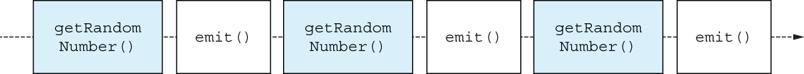

# 16. Flow

<small><i>플로우는 연속적인 값의 스트림을 모델링한다</i></small>

<br>

## 16.1 Flows model sequential streams of values

<small><i>플로우는 연속적인 값의 스트림을 모델링한다</i></small>

- 일시 중단 함수는 한 번 또는 여러 번 실행을 중단할 수 있음
- 단, 일시 중단 함수는 원시 타입, 객체, 객체의 컬렉션과 같은 단일 값만 반환할 수 있음


**플로우**
- 시간이 지남에 따라 나타나는 값과 작업할 수 있게 해주는 코루틴 기반의 추상화

<br><br>

> [!NOTE] 
> 
> 반응형 스트림<sup>reactive stream</sup>에서 영감을 받음
> - **반응형 스트림 구현체**: [RxJava](https://reactivex.io), [Project Reactor](https://projectreactor.io)
> - **범용적인 추상화 설계**: 점진적인 로딩, 이벤트 스트림 작업, 구독 스타일 API 모델링

<br><br>

### 16.1.1 플로우를 사용하면 배출되자마자 원소를 처리할 수있다

<small><i>플로우를 사용하면 배출되자마자 원소를 처리할 수있다</i></small>

<br>

- **플로우 X**: 여러 값을 계산하는 로직 → 모든 로직 실행 후 결과 값 모두 반환
- **플로우 O**: 여러 값을 계산하는 로직 → 비동기적으로 값을 반환하고 싶을 때 사용

<br>

**플로우 사용법**
- `flow` 빌더 함수를 사용
- 플로우에 원소를 추가하려면 `emit`을 호출
- 빌더 함수 호출 후에는 `collect` 함수를 사용해 플로우의 원소를 순회

**Example.**

<table>
<tr>
<th>플로우 X</th>
<th>플로우 O</th>
</tr>
<tr>
<td>

```kotlin
buildList {      // 모든 데이터 출력 시간: 약 3초
    add(1)              // 3099 [main @coroutine#1] 1
    delay(1.seconds)
    add(2)              // 3107 [main @coroutine#1] 2
    delay(1.seconds)
    add(3)              // 3107 [main @coroutine#1] 3
    delay(1.seconds)
}.forEach { log(it) }
```

</td>
<td>

```kotlin
flow {          // 각 데이터는 생성된 즉시 출력됨
    emit(1)            // 29 [main @coroutine#1] 1
    delay(1000.milliseconds)
    emit(2)            // 1100 [main @coroutine#1] 2
    delay(1000.milliseconds)
    emit(3)            // 2156 [main @coroutine#1] 3
    delay(1000.milliseconds)
}.collect { log(it) }
...

```

**`emit()`**에서 배출된 원소는 즉시 `collect` (수집자)에 의해 처리됨

</td>
</tr>
</table>


<br>

### 16.1.2 코틀린 플로우의 여러 유형

<small><i>플로우를 사용하면 배출되자마자 원소를 처리할 수있다</i></small>

- **콜드 플로우**: 비동기 데이터 스트림으로, 값이 실제로 소비되기 시작할 때만 값을 배출
- **핫 플로우**: 값이 실제로 소비되고 있는지와 상관없이 값을 독립적으로 배출하며, 브로드캐스트 방식으로 동작

<br>

## 16.2 cold flow

<small><i>콜드 플로우</i></small>

<br>

### 16.2.1 Creating a cold flow with the flow builder function

<small><i>flow 빌더 함수를 사용해 콜드 플로우 생성</i></small>

새로운 콜드 플로우를 생성하는 것은 간단
- `flow`: 컬렉션과 마찬가지로 새로운 플로우를 생성할 수 있는 빌더 함수
- **`emit` 함수**: 플로우의 수집자에게 값을 제공 ← 빌더 함수의 블록 내부
  - 비동기 return과 비슷하게 생각할 수 있음
- **수집자**: 해당 값을 처리할 때까지 빌더 함수의 실행을 중단

<br>

**Flow 생성**

```kotlin
val letters = flow {
    log("Emitting A!")
    emit("A")
    delay(200.milliseconds)
    log("Emitting B!")
    emit("B")
}
```

- 이 코드를 실행하면 실제로 아무런 출력도 나타나지 않음
- 빌더 함수가 `Flow` 타입 객체를 반환하기 때문


플로우는 처음에 비활성 상태 → **최종 연산자**<sup>terminal operator</sup>가 호출돼야만 빌더에서 정의된 계산이 시작

→ **플로우가 콜드라고 불리는 이유**: 기본적으로 수집되기 시작할 때까지 비활성 상태이기 때문

**`flow` 빌더 함수**

- `flow` 빌더 함수는 호출만으로는 작업이 시작되지 않음
- 일시 중단 함수가 아닌 일반 함수에서도 플로우를 반환할 수 있음
- `flow` 빌더 내부에서는 일시 중단 함수 호출이 가능함
- 실무에서는 여러 값을 비동기적으로 반환하는 콜드 플로우를 자주 사용함

- `flow` 빌더 블록은 `suspend`로 정의되어 있어, 내부에서 `delay` 등 일시 중단 함수를 자유롭게 호출할 수 있음


```kotlin
fun getElementsFromNetwork(): Flow<String> {
    return flow {
        // suspending network call here
    }
}
```

빌더 함수 안의 코드는 플로우가 수집될 때만 실행됨

때문에 시퀀스와 마찬가지로 무한 플로우를 정의하고 반환해도 됨

**Example.** 실제로 플로우가 수집될 때만 루프 실행

```kotlin
val counterFlow = flow {
    var x = 0
    while (true) {
        emit(x++)
        delay(200.milliseconds)
    }
}
```

<br>

### 16.2.2 Cold flows don’t do any work until collected

<small><i>flow 빌더 함수를 사용해 콜드 플로우 생성</i></small>

- `Flow`에 `collect` 함수를 호출하면 플로우의 로직이 실행됨
- 플로우를 수집하는 코드를 **수집자**<sup>collector</sup>라고 부름
- `collect` 호출 시, 플로우에서 배출된 각 원소에 대해 실행할 람다를 전달할 수 있음

<br>

#### `collect`는 일시 중단 함수

- `collect`는 일시 중단 함수이기 때문에, 플로우가 끝날 때까지 일시 중단됨
- 수집자 람다도 일시 중단 함수이므로, 내부에서 다른 일시 중단 함수 호출 가능

**Example. 문자 플로우 수집**

수신한 값을 데이터베이스에 저장하거나 HTTP 요청 수행 가능

**Flow 생성**

```kotlin
val letters = flow {
    log("Emitting A!")
    emit("A")
    delay(200.milliseconds)
    log("Emitting B!")
    emit("B")
}
```

**Flow 수집자**

```kotlin
runBlocking {
    letters.collect {
        log("Collecting $it")
        delay(500.milliseconds)
    }
}
```

**Output:**

```
27 [main @coroutine#1] Emitting A!
38 [main @coroutine#1] Collecting A
757 [main @coroutine#1] Emitting B!
757 [main @coroutine#1] Collecting B
```

수집자가 `collect`를 호출할 때 플로우 시작

A와 B 사이의 지연은 다음 순서로 발생:
- 수집자가 플로우 실행을 시작하고 첫 값을 배출
- 수집자가 값을 받아 500ms 동안 처리
- 이후 플로우가 200ms 지연 후 다음 값을 배출하고, 수집자가 다시 처리


<br><br><br><br>


- 콜드 플로우에서 `collect`를 여러 번 호출하면 그 코드가 여러 번 실행됨
  - 네트워크 요청과 같은 부수 효과가 있을 때 주의
- `collect` 함수는 플로우의 모든 원소가 처리될 때까지 일시 중단됨
- 플로우에 무한한 원소가 있을 수 있으므로 `collect` 함수도 무기한 일시 중단될 수 있음
- 모든 원소가 처리되기 전에 플로우 수집을 중지하고 싶으면 플로우를 취소할 수 있음

<br>

### 16.2.3 Cancelling the collection of a flow

<small><i>플로우 수집 취소</i></small>

- 코루틴을 취소하는 메커니즘이 플로우 수집자에게도 적용됨
- 수집자의 코루틴을 취소하면 다음 취소 지점에서 플로우 수집이 중단됨

<br><br>

> [!NOTE] 
> 
> 다른 내장된 일시 중단 함수와 마찬가지로 `emit`도 코드에서 취소와 일시 중단 지점으로 작동

<br><br>

FYI. 플로우 실행을 취소할 수 있는 다른 방법: `take` 연산자 (17장 참고)

<br>

### 16.2.4 Cold flows under the hood

<small><i>콜드 플로우의 내부 구현</i></small>

코틀린의 콜드 플로우는 **일시 중단 함수**와 **수신 객체 지정 람다**를 **결합**

콜드 플로우의 정의는 `Flow`와 `FlowCollector`라는 2가지 인터페이스만 필요

- **Flow**: 플로우를 정의하는 인터페이스 - `collect` 단일 함수를 정의
- **FlowCollector**: 플로우의 원소를 수집하는 인터페이스 - `emit` 단일 함수 정의

<table><tr><td>

```kotlin
interface Flow<out T> {
    suspend fun collect(collector: FlowCollector<T>)
}
```

</td><td>

```kotlin
interface FlowCollector<in T> {
    suspend fun emit(value: T)
}
```

</tr></table>

1. `collect`를 호출하면 플로우 빌더 함수의 본문이 실행됨
2. 이 코드가 `emit`을 호출하면 `emit`에 전달된 파라미터로 `collect`에 전달된 람다가 호출됨
3. 람다 표현식이 실행을 완료하면 함수는 빌더 함수의 본문으로 돌아가 계속 실행됨

<br><br><br><br>

일반적인 콜드 플로우에는 움직이는 부분이 그리 많지 않지만 콜드 플로우는 값 스트림을 처리하는 가벼우면서 아주 쓸모있고 확장성 있는 추상화를 제공 

<br>

### 16.2.5 Concurrent flows with channel flows

<small><i>채널 플로우를 사용한 동시성 플로우</i></small>

- 지금까지 `flow` 빌더 함수를 사용해 만든 **콜드 플로우는 모두 순차적으로 실행됨**
- 코드 블록은 일시 중단 함수의 본문처럼 하나의 코루틴으로 실행됨
- 따라서 `emit` 호출도 순차적으로 실행됨
- 순차적 특성은 병목이 될 수 있음

<br>

**Example.**


<table>
<tr>
<th>Cold Flow</th>
<th>Output</th>
</tr>
<tr>
<td>

`randomNumbers` 플로우: 0.5초 딜레이를 준 `getRandomNumber` 함수 호출

```kotlin
suspend fun getRandomNumber(): Int {
    delay(500.milliseconds)
    return Random.nextInt()
}
 
val randomNumbers = flow {
    // 총 5초 (500ms * 10) 소요
    repeat(10) {
        emit(getRandomNumber())
    }
}
```

</td>
<td>

```
fun main() = runBlocking {
    randomNumbers.collect {
        log(it)
    }
}

// 583 [main @coroutine#1] 1514439879
// 1120 [main @coroutine#1] 1785211458
// 1693 [main @coroutine#1] -996479986
// ...
// 5463 [main @coroutine#1] -2047597449
```

</td>
</tr>
</table>

<br>

- 플로우는 순차적으로 실행
- 모든 계산은 동일한 코루틴에서 실행

수행 작업이 동시성으로 수행하기 적합하고 병렬로 수행 가능하다면 

→ `async` 같이 동시성 적용해서 실행을 빨라지게 할 수 있음

<br>

**❓ 플로우 빌더에서 백그라운드 코루틴을 실행하고 그 코루틴에서 직접 값을 배출하면?**

`Flow invariant is violated: Emission from another coroutine is detected. FlowCollector is not thread-safe and concurrent emissions are prohibited.` 오류 발생

→ 플로우 수집자가 스레드 안전하지 않다는 것을 나타내는 코드를 사용하면 안된다는 뜻

```kotlin
val randomNumbers = flow {
    coroutineScope {
        repeat(10) {
            launch { emit(getRandomNumber()) }   // Error: emit can’t be called from a different coroutine
        }
    }
}
```

→ 기본적인 콜드플로우 추상화가 같은 코루틴 안에서만 `emit` 함수를 호출할 수 있게 허용하기 때문


#### Channel Flow

- **`ChannelFlow` 빌더 함수**: **여러 코루틴에서 배출을 허용하는 동시성 플로우**를 생성
- 콜드 플로우의 특별한 유형
  - **일반 콜드 플로우**: `emit` 함수로 값 제공
  - **채널 플로우**: `send` 함수로 값 제공

수집자는 동일하게 `collect` 람다로 값을 순차적으로 수신

```kotlin
val randomNumbers = channelFlow {     // 새 채널 플로우 생성
    repeat(10) {
        launch {
            send(getRandomNumber())   // 여러 코루틴에서 send 호출 가능
        }
    }
}
```

`coroutineScope` 함수처럼 `ChannelFlow`의 람다는 새로운 백그라운드 코루틴을 시작할 수 있는 코루틴 스코프를 제공

<br><br><br><br>

#### 채널 플로우 vs. 일반 콜드 플로우

결론: **플로우 안에서 새로운 코루틴을 시작해야 하는 경우에만 채널 플로우를 선택**

<br>

**✔️ 채널 플로우:**

- 동시 작업이라는 구체적 용례를 위해 설계됨
- 일반 플로우가 할 수 있는 모든 일을 할 수 있으면서 더 많은 기능을 제공
- 코루틴 간 통신을 위한 비교적 저수준의 추상화이며, `send` 함수는 채널이 노출하는 복잡한 인터페이스의 일부
- 내부적으로 또 다른 동시성 기본 요소인 채널을 관리해야 하기 때문에 생성하는 데 약간 비용이 듦

<br>

**✔️ 일반 플로우:**
- 가장 간단하고 성능이 좋은 추상화
- 콜드 플로우는 엄격하게 순차적으로 실행되며 새로운 코루틴을 시작할 수 없지만 아주 쉽게 생성할 수 있고, 인터페이스가 한 가지 함수(emit)로 구성되며, 관리해야 할 추가적인 원소나 오버헤드가 없음

<br><br>

**정리하자면,**
콜드 플로우는 시간이 지남에 따라 계산된 값을 처리하는 데 유용한 추상화
콜드 플로우는 항상 수집자와 직접적으로 연관돼 있고,각 수집자는 플로우에 지정된 코드를 독립적으로 실행

<br>

## 16.3 Hot flows

<small><i>핫 플로우</i></small>

핫 플로우는 콜드 플로우와 배출<sup>Emission</sup>과 수집<sup>Collection</sup> 구조는 동일하지만 다른 특성을 가짐

**핫 플로우**

- 여러 구독자<sup>Subscriber</sup>라고 불리는 수집자들이 배출된 항목을 공유
- 시스템에서 이벤트나 상태 변경이 발생해서 수집자가 존재하는지 여부에 상관없이 값을 배출해야 하는 경우에 적합

핫 플로우는 항상 활성 상태이기 때문에 구독자의 유무에 관계없이 배출이 발생할 수 있음

<br>

**코틀린 코루틴에는 기본적으로 2가지 핫 플로우 구현 제공**

- **Shared Flow**: 공유 플로우. 값을 브로드캐스트하기 위해 사용
- **State Flow**: 상태 플로우. 상태를 전달하는 특별한 경우에 사용

<br>

상태 플로우를 공유 플로우보다 더 자주 사용하게 될 것

공유 플로우를 사용하는 코드를 상태플로우로 변환할 수 있음

<br>
