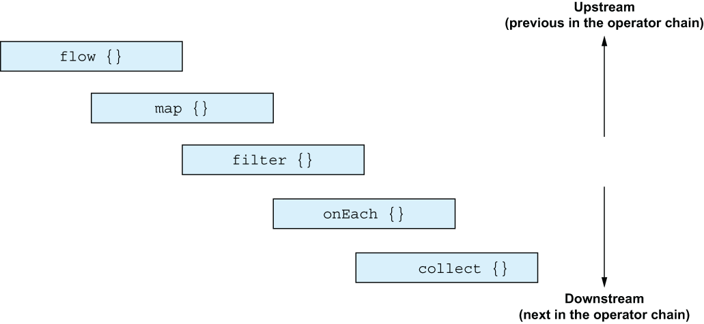
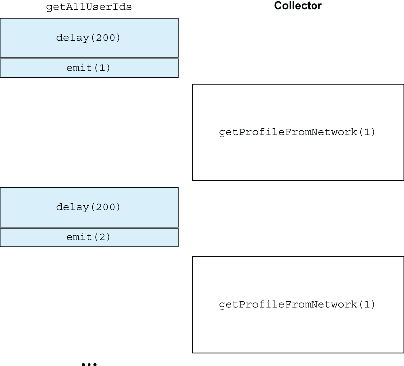
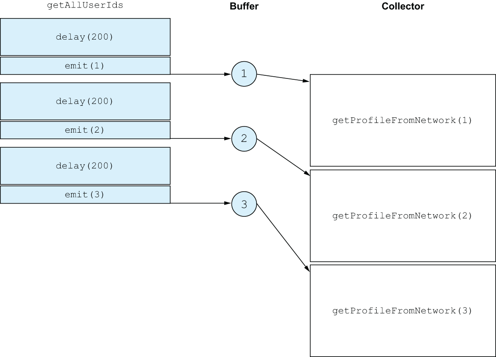

# 17. Flow operators

<small><i>플로우 연산자</i></small>

<br>

## 17.1 Manipulating flows with flow operators

<small><i>플로우 연산자로 플로우 조작</i></small>


시퀀스와 마찬가지로 플로우도 중간연산자와 최종연산자를 구분

중간연산자는 코드를 실행하지 않고 변경된 플로우를 반환하며, 최종연산자는 컬렉션, 개별 원소, 계산된 값을 반환하거나 아무 값도 반환하지 않으면서 플로우를 수집하고 실제 코드를 실행


<br><br>

<br>

## 17.2 Intermediate operators are applied to an upstream flow and return a downstream flow

<small><i> 중간연산자는 업스트림 플로우에 적용되고 다운스트림 플로우를 반환한다 </i></small>

중간 연산자는 플로우에 적용돼 새로운 플로우를 반환

플로우를 업스트림 upstream(상류)과 다운스트림 downstream(하류) 플로우로 구분해 설명할 수 있음

연산자가 적용되는 플로우를 업스트림 플로우라고 하고, 
중간 연산자가 반환하는 플로우를 다운스트림 플로우라 부름

이 다운스트림 플로우는 또 다른 연산자의 업스트림 플로우로 작용할 수 있음
시퀀스와 마찬가지로 중간 연산자가 호출되더라도 플로우 코드가 실제로 실행되지는 않음
반환된 플로우는 콜드 상태임


<br><br>

<br>

> [!NOTE]
> 
> 핫플로우에 연산자를 적용해도 collect와 같은 최종 연산자가 호출돼 핫플로우가 구독될 때까지 연산자가 정의한 동작이 실행되지 않음

<br><br>

코틀린 플로우는 시퀀스처럼 **여러 중간 연산자를 플로우에 사용**
- 시퀀스에서 사용하는 대표적인 함수들을 플로우에서도 제공
 - e.g. `map`, `filter`, `onEach`
 - 시퀀스 실행 방식과 비슷해서 개발자의 예상 방식과 유사
- 단, 플로우의 원소에 대해 작용한다는 점만 다를 뿐

하지만, 예상 범위를 벗어나는 특별한 동작과 기능을 제공하는 연산자도 있음

<br>

## 17.2.1 Emitting arbitrary values for each upstream element: The `transform` function

<small><i>업스트림 원소 별로 임의의 값을 배출: `transform` 함수</i></small>

`map` 함수는 업스트림 플로우의 원소를 변환해 다운스트림 플로우에 배출

이 때, 하나 이상의 원소를 배출하고 싶을 때가 있음

Example.

이름을 대문자와 소문자로 함께 변형하고 싶다면 `transform` 함수를 사용할 수 있음

```kotlin
import kotlinx.coroutines.flow.*

val names = flow {
    emit("Jo")
    emit("May")
    emit("Sue")
}
val upperAndLowercasedNames = names.transform {
    emit(it.uppercase())
    emit(it.lowercase())
}
runBlocking {
    upperAndLowercasedNames.collect { print("$it ")}   // JO jo MAY may SUE sue
}
```

<br>

#### `flowOf()`

`flowOf()`를 사용해서 플로우를 만들면 더 간략해짐

```kotlin
val names= flowOf("10", "May", "Sue")
```

<br>

## 17.2.2 The `take` operator family can cancel a flow

<small><i>`take` 나 관련 연산자는 플로우를 취소할 수 있다</i></small>

시퀀스에서 배운 `takeWhile` 같은 함수들을 플로우에서도 똑같이 쓸 수 있음

지정한 조건이 더 이상 유효하지 않을 때 업스트림 플로우가 취소되며, 더 이상 원소가 배출되지 않음

```kotlin
getTemperatures()
    .take(5)       // 5개 원소만 취함
    .collect {
        log(it)
    }
```
 
**Output:**

```kotlin
// 37 [main @coroutine#1] 7
// 568 [main @coroutine#1] 9
// 1123 [main @coroutine#1] 2
// 1640 [main @coroutine#1] -6
// 2148 [main @coroutine#1] 7
```

플로우 수집을 제어된 방식으로 취소하는 방법으로 볼 수 있음

<br>

## 17.2.3 Hooking into flow phases with `onStart`, `onEach`, `onCompletion`, and `onEmpty`

<small><i>플로우의 각 단계 후킹: `onStart`, `onEach`, `onCompletion`, `onEmpty`</i></small>


- `onCompletion` 연산자: 플로우가 정상 종료되거나, 취소되거나, 예외로 종료된 후, 호출할 람다를 지정할 수 있음
- `onStart`: 플로우의 수집이 시작될 때 첫번째 배출이 일어나기 전에 실행
- `onEach`: 업스트림 플로우에서 배출된 각 원소에 대해 작업을 수행한 후 이를 다운스트림 플로우에 전달
  - 원소를 배출하지 않고 종료되는 플로우의 경우 `onEmpty`로 로직을 추가로 수행하거나 기본값을 제공할 수 있음

<br>

**Example.**

다음 리스트는 플로우 시작, 각 원소 처리, 완료에 대한 동작을 지정하는 process 함수


```kotlin
fun process(flow: Flow<Int>) = runBlocking {
    flow
        .onEmpty {
            println("Nothing - emitting default value!")
            emit(0)
        }
        .onStart {
            println("Starting!")
        }
        .onEach {
            println("On $it!")
        }
        .onCompletion {
            println("Done!")
        }
        .collect()
}
```

<table>
    <tr>
        <th></th>
        <th>원소 있을 때</th>
        <th>원소 없을 때</th>
    </tr>
    <tr>
        <th>Code</th>
        <td>

```kotlin
runBlocking {
    process(flowOf(1, 2, 3))
}
```

</td>
<td>

```kotlin
runBlocking {
    process(flowOf())
}
```

</td>
    </tr>
    <tr>
    <th>Output</th>
        <td>

```kotlin
Starting!        // onStart
On 1!            // onEach
On 2!            // onEach
On 3!            // onEach
Done!            // onCompletion
```
</td>
        <td>

```kotlin
Starting!                           // onStart
Nothing - emitting default value!   // onEmpty
On 0!                               // onEmpty
Done!                               // onCompletion
```

</td>
</table>

<br>

## 17.2.4 Buffering elements for downstream operators and collectors: The `buffer` operator

<small><i>다운 스트림 연산자와 수집자를 위한 원소 버퍼링: `buffer` 연산자</i></small>

기본적으로 콜드 플로우처럼 값 생산자는 수집자가 이 전 원소를 처리 할때까지 작업을 중단

```kotlin
fun getAllUserIds(): Flow<Int> {
    return flow {
        repeat(3) {
            delay(200.milliseconds) // Database latency
            log("Emitting!")
            emit(it)
        }
    }
}
 
suspend fun getProfileFromNetwork(id: Int): String {
    delay(2.seconds) // Network latency
    return "Profile[$id]"
}
```

**Call:**

```kotlin
val ids = getAllUserIds()
runBlocking {
    ids
        .map { getProfileFromNetwork(it) }
        .collect { log("Got $it") }
}
```

기본적으로는 값 생산자는 수집자가 이 전 원소를 처리할 때까지 작업을 중단

**Output:**

```
310 [main @coroutine#1] Emitting!
2402 [main @coroutine#1] Got Profile[0]
2661 [main @coroutine#1] Emitting!
4732 [main @coroutine#1] Got Profile[1]
5007 [main @coroutine#1] Emitting!
7048 [main @coroutine#1] Got Profile[2]
```

각 원소를 처리하는 데 약 1.2 초 소요

<br>

<br><br>


- `buffer` 연산자는 **연산자 사슬 연결을 분리**하는 이점을 줌
- 버퍼 추가로 다운스트림 플로우가 배출 원소를 처리하는 동안, 업스트림 플로우가 원소를 배출함
- → 수집자가 원소를 처리할 때까지 생산자가 기다리지 않고, 원소를 생성할 수 있으면, 플로우 실행 속도를 더 빠르게 할 수 있음

3개의 원소를 저장할 수 있는 버퍼를 추가하면 생산자는 새 사용자 식별자를 계속 생성해 버퍼에 넣을 수 있고, 수집자는 네트워크 요청을 계속 처리

<br>

**Example.** Buffer를 추가한 후의 코드

**Call:**

```kotlin
fun main() {
    val ids = getAllUserIds()
    runBlocking {
        ids
            .buffer(3)
            .map { getProfileFromNetwork(it) }
            .collect { log("Got $it") }
    }
}
```


**Output:**

``` 
304 [main @coroutine#2] Emitting!
525 [main @coroutine#2] Emitting!
796 [main @coroutine#2] Emitting!
2373 [main @coroutine#1] Got Profile[0]
4388 [main @coroutine#1] Got Profile[1]
6461 [main @coroutine#1] Got Profile[2]
```

버퍼 추가 후 실행 시간이 줄어듦

`getAllUserIds`에서 반환된 플로우는 수집자가 작업하는 동안 원소를 버퍼에 배출할 수 있기 때문

이처럼, 크기와 복잡도가 다른 입력 데이터를 읽고 처리할 때 버퍼를 도입하면 시스템 처리량을 늘리는 데 도움을 줄 수 있음

<br><br>

<br>

#### `buffer` 연산자는 설정의 유연성을 줌

`onBufferOverflow` 파라미터를 통해 버퍼 용량이 초과 시 처리 방식을 지정할 수 있음 
- **`SUSPEND`**: 생산자 대기
- **`DROP_OLDEST`**: 버퍼에서 가장 오래된 값을 버림
- **`DROP_LATEST`**: 추가 중인 마지막 값을 버림


<br>

## 17.2.5 Throwing away intermediate values: The conflate operator

<small><i>중간값을 버리는 연산자: `conflate` 연산자</i></small>

값 생산자가 방해없이 작업을 계속하는 또 다른 방법은 수집자가 바쁠 때 배출 항목을 버리는 것

→ **`conflate` 연산**

```kotlin
// 16장의 getTemperatures() 함수

runBlocking {
    val temps = getTemperatures()
    temps
        .onEach {
            log("Read $it from sensor")
        }
        .conflate()
        .collect {
            log("Collected $it")
            delay(1.seconds)
        }
}
```

**Output:**

``` 
43 [main @coroutine#2] Read 20 from sensor
51 [main @coroutine#1] Collected 20
558 [main @coroutine#2] Read -10 from sensor
1078 [main @coroutine#2] Read 3 from sensor
1294 [main @coroutine#1] Collected 3
1579 [main @coroutine#2] Read 13 from sensor
2153 [main @coroutine#2] Read 26 from sensor
2556 [main @coroutine#1] Collected 26
```

`conflate` 보다 앞의 업스트림 플로우는 `getTemperatures`에 의해 배출된 모든 원소를 포함하지만, 다운스트림의 수집자에서는 중간 원소가 버려짐

buffer 와 마찬가지로 **업스트림 플로우의 실행을 다운스트림 연산자의 실행과 분리할 수 있음**

<br>

## 17.2.6 Filtering out values on a timeout: The `debounce` operator

<small><i>일정 시간 동안 값을 필터링하는 연산자: `debounce` 연산자</i></small>

플로우의 값을 처리하기 전에 잠시 기다리는 것이 유용할 수 있음

<br>

**Example.** 즉시 검색 기능

사용자가 키를 누를 때마다 플로우는 점점 더 긴 문자열을 배출

```kotlin
val searchQuery = flow {
    emit("K")
    delay(100.milliseconds)
    emit("Ko")
    delay(200.milliseconds)
    emit("Kotl")
    delay(500.milliseconds)
    emit("Kotlin")
}
```

연산자는 업스트림에서 원소가 배출되지 않은 상태로 정해진 타임아웃 시간이 지나야만 항목을 다운스트림 플로우로 배출

`debounce` 를 250밀리초로 설정하고 `searchQuery` 플로우를 수집하면 1/4초동안 정지된다음

```kotlin
fun main() = runBlocking {
    searchQuery
        .debounce(250.milliseconds)
        .collect {
            log("Searching for $it")
        }
}
```

**Output:**

```
644 [main @coroutine#1] Searching for Kotl
876 [main @coroutine#1] Searching for Kotlin
```

<br>

## 17.2.7 Switching the coroutine context on which a flow is executed: The `flowOn` operator

<small><i>플로우가 실행되는 코루틴 컨텍스트를 바꾸기: `flowOn` 연산자</i></small>

- 복잡한 데이터 처리 파이프라인에서 일부 연산을 다른 디스패처나 콘텍스트에서 실행하고 싶을 때가 있음
  - e.g. 블로킹 I/O나 UI 스레드 작업 시 코루틴 콘텍스트 고려 필요
  - 데이터 처리 효율성과 UI 반응성을 높이기 위해 적절한 콘텍스트 분리가 중요함
- `flowOn` 연산자를 사용하면 플로우의 실행 콘텍스트를 변경할 수 있음
- `flowOn`은 `withContext` (14장 참고) 와 유사하게 동작하며, 특정 연산 구간의 콘텍스트를 지정함

<br>

```kotlin
runBlocking {
    flowOf(1)
        .onEach { log("A") }
        .flowOn(Dispatchers.Default)
        .onEach { log("B") }
        .flowOn(Dispatchers.IO)
        .onEach { log("C") }
        .collect()
}
```

**Output:**

```
36 [DefaultDispatcher-worker-3 @coroutine#3] A
44 [DefaultDispatcher-worker-1 @coroutine#2] B
44 [main @coroutine#1] C
```

<br>

- ⭐️ `flowOn` 연산자는 **업스트림 플로우의 디스패처에만** 영향을 미침
  - 즉, `flowOn` 호출보다 더 앞에 있는 플로우(그리고 모든 중간 연산자)가 영향을 받음
- 다운스트림 플로우는 영향을 받지 않으므로 이 연산자를 '콘텍스트 보존' 연산자라고도 부름
- `Dispatchers.Default`로의 전환은 "A"에만 영향을 미치며, `Dispatchers.IO`로의 전환은 "B"에만 영향을 미침 "C"는 `flowOn`의 이전 호출에 의해 전혀 영향을 받지 않음

<br>

## 17.3 Creating custom intermediate operators

<small><i>커스텀 중간 연산자 만들기</i></small>

중간 연산자는 수집자와 생산자의 역할을 동시에 수행

- 업스트림 플로우에서 원소를 수집 → 이를 변환 혹은 부수 효과 수행 → 다운스트림 플로우에 새 원소 배출
  - 업스트림 플로우에서 원소를 수집 - `collect`
  - `flow` 빌더 함수로 새로운 다운스트림 플로우를 생성

플로우 빌더 안에서만 업스트림 플로우에 대해 `collect`를 호출할 수 있으므로 연산자는 여전히 고립 상태로 유지

<br>

**Example.** 마지막 n개 원소의 평균을 계산하는 연산자

```kotlin
fun Flow<Double>.averageOfLast(n: Int): Flow<Double> =
    flow {
        val numbers = mutableListOf<Double>()
        collect {
            if (numbers.size >= n) {
                numbers.removeFirst()
            }
            numbers.add(it)
            emit(numbers.average())
        }
    }   
```

**Usage:**

```kotlin
runBlocking {
    flowOf(1.0, 2.0, 30.0, 121.0)
        .averageOfLast(3)
        .collect {
            print("$it ")            // 1.0 1.5 11.0 51.0
        }
}
```

<br>

## 17.4 Terminal operators execute the upstream flow and may compute a value

<small><i>최종 연산자는 업스트림 플로우를 실행하고 값을 계산한다</i></small>

- 중간 연산자는 실제로 코드를 실행하지 않으며, 실행은 **최종 연산자**가 담당 (예: `collect`)
- 최종 연산자는 단일 값이나 값의 컬렉션을 계산하거나, 플로우의 실행을 촉발시켜 지정된 연산과 부수 효과를 수행
- `collect`는 플로우의 각 원소에 대해 실행할 람다를 지정할 수 있음
- **중간 연산자** = `onEach`를 호출한 다음 파라미터 없는 `collect`를 호출

```kotlin
fun main() = runBlocking {
    getTemperatures()
        .onEach {
            log(it)
        }
        .collect()
}
```

최종 연산자는 업스트림 플로우의 실행을 담당하기 때문에 항상 일시 중단 함수

`collect`를 호출하면 플로우 전체가 수집될 때까지(또는 `collect`를 호출한 코루틴 스코프가 취소될 때까지) 일시 중단됨 

`first`나 `firstOrNull` 같은 다른 최종 연산자는 원소를 받은 다음에 업스트림 플로우를 취소할 수 있음


```kotlin
fun main() = runBlocking {
    getTemperatures()
        .first()        // 온도 센서에서 값을 하나만 얻고 싶을 때
}
```

<br>

## 17.4.1 Frameworks provide custom operators

<small><i>프레임워크는 커스텀 연산자를 제공한다</i></small>

코틀린 생태계의 어떤 프레임워크들은 플로우와 직접적인 통합을 제공하며, 커스텀 연산자와 변환 함수도 노출


<br>

## Summary

- **중간 연산자**
  - 기존 플로우를 **다른 플로우로 변환**
  - **업스트림 플로우에 대해 작동**하며 **다운스트림 플로우를 반환**
  - **콜드 상태** → 최종 연산자가 호출될 때까지 실행되지 않음
- 플로우는 다양한 중간 연산자 제공 
  - `transform`: 변환을 수행
  - `collect`: 플로우가 실행되는 컨텍스트를 관리
  - 특정 단계에서 코드를 실행 → `onStart`, `onCompletion` 등
- 시퀀스에 사용할 수 있는 중간 연산자 상당수를 플로우에도 직접 사용할 수 있음
- 최종 연산자는 플로우의 코드를 실행
  - e.g. `collect` 연산자
  - 핫 플로우의 경우 `collect`는 플로우에 대한 구독을 처리
- **커스텀 연산자**: 플로우 빌더 안에서 플로우를 수집하고 변환된 원소를 배출하는 방식으로 자신만의 중간 연산자를 만들 수 있음

