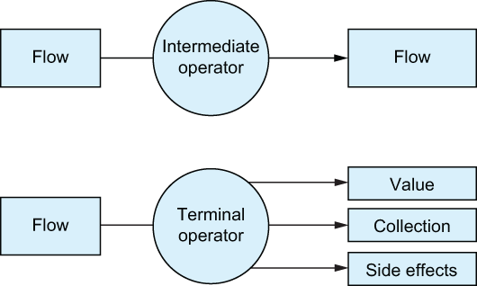

# 17. Flow operators

<small><i>플로우 연산자</i></small>

<br>

## 17.1 Manipulating flows with flow operators

<small><i>플로우 연산자로 플로우 조작</i></small>


시퀀스와 마찬가지로 플로우도 중간연산자와 최종연산자를 구분

중간연산자는 코드를 실행하지 않고 변경된 플로우를 반환하며, 최종연산자는 컬렉션, 개별 원소, 계산된 값을 반환하거나 아무 값도 반환하지 않으면서 플로우를 수집하고 실제 코드를 실행


<br><br>

<br>

## 17.2 Intermediate operators are applied to an upstream flow and return a downstream flow

<small><i> 중간연산자는 업스트림 플로우에 적용되고 다운스트림 플로우를 반환한다 </i></small>

중간 연산자는 플로우에 적용돼 새로운 플로우를 반환

플로우를 업스트림 upstream(상류)과 다운스트림 downstream(하류) 플로우로 구분해 설명할 수 있음

연산자가 적용되는 플로우를 업스트림 플로우라고 하고, 
중간 연산자가 반환하는 플로우를 다운스트림 플로우라 부름

이 다운스트림 플로우는 또 다른 연산자의 업스트림 플로우로 작용할 수 있음
시퀀스와 마찬가지로 중간 연산자가 호출되더라도 플로우 코드가 실제로 실행되지는 않음
반환된 플로우는 콜드 상태임


<br><br>

<br>

> [!NOTE]
> 
> 핫플로우에 연산자를 적용해도 collect와 같은 최종 연산자가 호출돼 핫플로우가 구독될 때까지 연산자가 정의한 동작이 실행되지 않음

<br><br>

코틀린 플로우는 시퀀스처럼 **여러 중간 연산자를 플로우에 사용**
- 시퀀스에서 사용하는 대표적인 함수들을 플로우에서도 제공
 - e.g. `map`, `filter`, `onEach`
 - 시퀀스 실행 방식과 비슷해서 개발자의 예상 방식과 유사
- 단, 플로우의 원소에 대해 작용한다는 점만 다를 뿐

하지만, 예상 범위를 벗어나는 특별한 동작과 기능을 제공하는 연산자도 있음

<br>

## 17.2.1 Emitting arbitrary values for each upstream element: The `transform` function

<small><i>업스트림 원소 별로 임의의 값을 배출: `transform` 함수</i></small>

`map` 함수는 업스트림 플로우의 원소를 변환해 다운스트림 플로우에 배출

이 때, 하나 이상의 원소를 배출하고 싶을 때가 있음

Example.

이름을 대문자와 소문자로 함께 변형하고 싶다면 `transform` 함수를 사용할 수 있음

```kotlin
import kotlinx.coroutines.flow.*

val names = flow {
    emit("Jo")
    emit("May")
    emit("Sue")
}
val upperAndLowercasedNames = names.transform {
    emit(it.uppercase())
    emit(it.lowercase())
}
runBlocking {
    upperAndLowercasedNames.collect { print("$it ")}   // JO jo MAY may SUE sue
}
```

<br>

#### `flowOf()`

`flowOf()`를 사용해서 플로우를 만들면 더 간략해짐

```kotlin
val names= flowOf("10", "May", "Sue")
```

<br>

## 17.2.2 The `take` operator family can cancel a flow

<small><i>`take` 나 관련 연산자는 플로우를 취소할 수 있다</i></small>

시퀀스에서 배운 `takeWhile` 같은 함수들을 플로우에서도 똑같이 쓸 수 있음

지정한 조건이 더 이상 유효하지 않을 때 업스트림 플로우가 취소되며, 더 이상 원소가 배출되지 않음

```kotlin
getTemperatures()
    .take(5)       // 5개 원소만 취함
    .collect {
        log(it)
    }
```
 
**Output:**

```kotlin
// 37 [main @coroutine#1] 7
// 568 [main @coroutine#1] 9
// 1123 [main @coroutine#1] 2
// 1640 [main @coroutine#1] -6
// 2148 [main @coroutine#1] 7
```

플로우 수집을 제어된 방식으로 취소하는 방법으로 볼 수 있음

<br>

## 17.2.3 Hooking into flow phases with `onStart`, `onEach`, `onCompletion`, and `onEmpty`

<small><i>플로우의 각 단계 후킹: `onStart`, `onEach`, `onCompletion`, `onEmpty`</i></small>


- `onCompletion` 연산자: 플로우가 정상 종료되거나, 취소되거나, 예외로 종료된 후, 호출할 람다를 지정할 수 있음
- `onStart`: 플로우의 수집이 시작될 때 첫번째 배출이 일어나기 전에 실행
- `onEach`: 업스트림 플로우에서 배출된 각 원소에 대해 작업을 수행한 후 이를 다운스트림 플로우에 전달
  - 원소를 배출하지 않고 종료되는 플로우의 경우 `onEmpty`로 로직을 추가로 수행하거나 기본값을 제공할 수 있음

<br>

**Example.**

다음 리스트는 플로우 시작, 각 원소 처리, 완료에 대한 동작을 지정하는 process 함수


```kotlin
fun process(flow: Flow<Int>) = runBlocking {
    flow
        .onEmpty {
            println("Nothing - emitting default value!")
            emit(0)
        }
        .onStart {
            println("Starting!")
        }
        .onEach {
            println("On $it!")
        }
        .onCompletion {
            println("Done!")
        }
        .collect()
}
```

<table>
    <tr>
        <th></th>
        <th>Call - 1</th>
        <th>Call - 2</th>
    </tr>
    <tr>
        <th>Code</th>
        <td>

```kotlin
runBlocking {
    process(flowOf(1, 2, 3))
}
```

</td>
<td>

```kotlin
runBlocking {
    process(flowOf())
}
```

</td>
    </tr>
    <tr>
    <th>Output</th>
        <td>

```kotlin
// Starting!
// On 1!
// On 2!
// On 3!
// Done!
```
</td>
        <td>
```kotlin
// Starting!
// Nothing - emitting default value!
// On 0!
// Done!
```
</td>
</table>

<br>

## 17.2.4 Buffering elements for downstream operators and collectors: The `buffer` operator

<small><i>17.2.4 다운 스트림 연산자와 수집자를 위한 원소 버퍼링: `buffer` 연산자</i></small>
