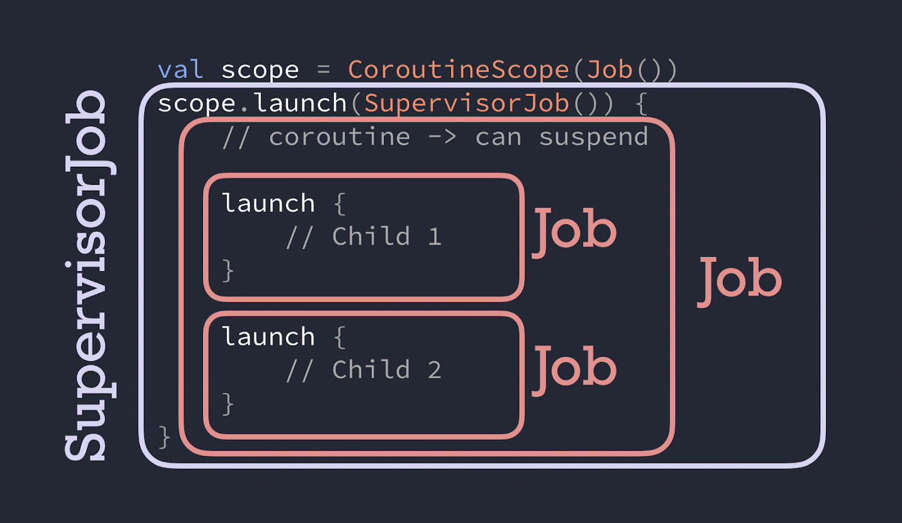

# 18. Flow operators

<small><i>오류 처리와 테스트</i></small>

<br>

## 18.1 Handling errors thrown inside coroutines

<small><i>코루틴 내부에서 던져진 오류 처리</i></small>


다른 코틀린 코드와 마찬가지로 일시중단 함수나 코루틴 빌더 안에 작성한 코드도 예외를 발생시킬 수 있음 

- `launch` 나 `async`는 코루틴 빌더 함수
- 코루틴 빌더 함수를 `try-catch`로 감싸도 내부에서 발생한 예외를 잡지 못함
- 코루틴 빌더는 실행할 새로운 코루틴을 생성하기 때문
- 새로 생성된 스레드에서 발생한 예외가 스레드를 만든 코드에서 잡히지 않는 것과 같음


**Example.**


<table>
<tr>
    <th>잘못된 예외 처리</th>
    <th>올바른 예외 처리</th>
</tr>
<tr><td>

```kotlin
import kotlinx.coroutines.*
 
fun main(): Unit = runBlocking {
    try {
        launch {
            throw UnsupportedOperationException("Ouch!")
        }
    } catch (u: UnsupportedOperationException) {
        println("Handled $u")                     // 실행 안됨
    }
}
// Exception in thread "main" java.lang.UnsupportedOperationException: Ouch!
//  at MyExampleKt$main$1$1.invokeSuspend(MyExample.kt:6)
//       ...
```

</td>
<td>

올바른 예외 처리 → `launch`에 전달되는 람다 블록 안에 `try-catch` 블록을 넣어야 함

```kotlin
import kotlinx.coroutines.*
 
fun main(): Unit = runBlocking {
    launch {
        try {
            throw UnsupportedOperationException("Ouch!")
        } catch (u: UnsupportedOperationException) {
            println("Handled $u")
        }
    }
}
// Handled java.lang.UnsupportedOperationException: Ouch!
```

</td>
</table>

- `async`로 생성된 코루틴이 예외를 던지면, 예외가 `await` 으로 호출한 쪽으로 전파됨.
- 값을 계산하는 `async` 코루틴 안쪽에서 예외가 발생하기 때문에 `await()`가 그 예외를 다시 던짐
- 때문에, `await()`를 `try-catch`로 감싸야 함

```kotlin
runBlocking {
    val myDeferredInt: Deferred<Int> = async {
        throw UnsupportedOperationException("Ouch!")
    }
    try {
        val i: Int = myDeferredInt.await()
        println(i)
    } catch (u: UnsupportedOperationException) {
        println("Handled: $u")
    }
}
```

**Output:**

```
Handled: java.lang.UnsupportedOperationException: Ouch!
Exception in thread "main" java.lang.UnsupportedOperationException: Ouch!
    at MyExampleKt$main$1$myDeferred$1.invokeSuspend(MyExample.kt:6)
     ...
```

- 오류 콘솔에도 예외가 출력
- `async`는 예외를 부모 코루틴인 `runBlocking`에 전파하고, 프로그램은 종료

<br>

**자식 코루틴은 잡히지 않은 예외를 항상 부모 코루틴에 전파**

→ 부모 코루틴이 이 예외를 처리해야 할 책임을 가짐

<br>

## 18.2 Error propagation in Kotlin coroutines

<small><i>코틀린 코루틴에서의 오류 전파</i></small>
- 구조적 동시성의 주요 책임은 취소 처리뿐만 아니라 오류 처리에도 있음
- 자식에게 작업을 분배하는 방식에 따라 자식의 오류 처리 방식이 달라짐
- 자식 중 하나의 실패가 부모의 실패로 이어질지 여부에 따라 두 가지 방식으로 나뉨:
    1. **자식의 실패가 부모의 실패로 이어지는 경우 - `Job`**
        - 코루틴이 작업을 동시적으로 분해해 처리할 때, 자식 중 하나가 실패하면 더 이상 최종 결과를 얻을 수 없음
        - 부모 코루틴도 예외로 완료되고, 다른 자식 코루틴들은 더 이상 필요 없는 결과 생성을 막기 위해 취소됨
    2. **자식의 실패가 부모의 실패로 이어지지 않는 경우 - `SupervisorJob`**
        - 하나의 자식이 실패해도 전체 작업이 실패로 이어지지 않음
        - 부모가 자식의 실패를 직접 처리해야 하며, 시스템 전체가 멈추지 않음
        - 예: 서버 프로세스가 여러 자식 작업을 시작하고, 최상위에서 감독 역할을 함
        - 예: UI 구성 요소가 최신 데이터 가져오기에 실패해도 계속 동작해야 하는 경우


코틀린 코루틴에서 자식 코루틴의 실패를 부모가 어떻게 처리할지는 
부모 코루틴의 컨텍스트에 포함된 `Job`(자식의 실패가 부모의 실패로 이어짐)과 `SupervisorJob`(부모가 자식을 감독함) 중 무엇이 사용되는지에 따라 달라짐

<br>

### 18.2.1 Coroutines cancel all their children when one child fails

<small><i>자식이 실패하면 모든 자식을 취소하는 코루틴</i></small>

코루틴 콘텍스트를 설명할 때 코루틴 간의 부모-자식 계층이 `Job` 객체를 통해 구축된다
코루틴이 `SupervisorJob` 없이 생성된 경우 자식 코루틴에서 발생한 잡히지 않은 예외는 부모 코루틴을 예외로 완료시키는 방식으로 처리된다

실패한 자식 코루틴은 자신의 실패를 부모에게 전파한다. 
그러면 부모는 다음을 수행한다.

- 불필요한 작업을 막기 위해 다른 모든 자식을 취소한다. 
- 같은 예외를 발생시키면서 자신의 실행을 완료시킨다.
- 자신의 상위 계층으로 예외를 전파한다.

<br>

- 자식 코루틴이 잡히지 않는 예외로 실패하면 부모에게 통지
- 다시 부모는 형제 코루틴들을 모두 취소하고 예외를 코루틴 계층의 상위로 전달

<br>

> [!NOTE]
>
> 모든 '형제' 작업을 취소하는 기능은 코틀린 코루틴의 큰 장점임
> 
> 보통 언어 레벨에서 제공되지 않고, 프로그래머가 직접 구현해야 함 

<br>

같은 스코프 안에서 동시성 계산을 함께 수행하고 공통의 결과를 반환하는 코루틴 그룹에게 아주 유용
- 스코프 내의 하나의 코루틴이 잡을 수 없는 예외로 인해 실패한다는 건, 공통의 결과를 계산할 방법이 더 이상 없음
- 다른 형제 코루틴이 불필요해진 작업을 계속 수행하거나 자원을 계속 잡고 있는 것을 막기 위해 이들을 취소함

- 불필요한 작업을 피하고 자원을 해제하게 됨


**Example.**

```kotlin
import kotlinx.coroutines.*
import kotlin.time.Duration.Companion.milliseconds
import kotlin.time.Duration.Companion.seconds
 
fun main(): Unit = runBlocking {
    // 첫번째 코루틴: Heartbeat 역할의 코루틴. 단순히 루프 돌면서 메시지 출력
    launch {
        try {
            while (true) {
                println("Heartbeat!")
                delay(500.milliseconds)
            }
        } catch (e: Exception) {
            println("Heartbeat terminated: $e")
            throw e
        }
    }
    // 두번째 코루틴: 1초 후 예외를 던짐. 이때, 예외를 잡아내지는 않음
    launch {
        delay(1.seconds)
        throw UnsupportedOperationException("Ow!")
    }
}
```

**Output:**

```
Heartbeat!
Heartbeat!
Heartbeat terminated: kotlinx.coroutines.JobCancellationException: Parent job is Cancelling; job=BlockingCoroutine{Cancelling}@1517365b
Exception in thread "main" java.lang.UnsupportedOperationException: Ow!
```

<br>

- 기본적으로, 모든 코루틴 빌더 <sub>예제의 `runBlocking`</sub>는 일반적인, 비감독<sup>nonsupervisor</sup> 코루틴을 생성
  - 때문에 하나의 코루틴이 잡히지 않은 예외로 종료되면, 다른 자식 코루틴들도 취소됨
- 오류 전파 동작은 모든 코루틴에게도 적용 
  - 예를 들어, launch로 시작된 코루틴 뿐만 아니라 `async`로 시작된 코루틴도 동일하게 동작

<br>

### 18.2.2 Structured concurrency only affects exceptions thrown across coroutine boundaries

<small><i>구조적 동시성은 코루틴 경계를 넘어 던져진 예외에만 영향을 미침</i></small>

- 형제 코루틴 취소와 예외 전파는 코루틴 스코프를 넘는 예외에만 적용됨
- 스코프를 넘는 예외를 던지지 않으면 형제 코루틴이 취소되지 않음
- 코루틴 내부의 `try-catch` 블록은 정상적으로 예외를 처리함
- 처리되지 않은 예외가 코루틴 계층 위로 전파되면 형제 코루틴도 취소됨
  - → 구조적 동시성 패러다임을 강제하는 데 도움
- 단, 처리되지 않은 예외 하나로 전체 애플리케이션이 종료되면 안 됨

<br>

### 18.2.3 Supervisors prevent parents and siblings from being cancelled

<small><i>슈퍼바이저는 부모와 형제의 취소를 방지함</i></small>


**슈퍼바이저 특징**

- 일반적인 `Job`과 달리, 자식의 실패를 부모에게 전파하지 않음
- 자식 코루틴이 실패해도 부모와 다른 자식 코루틴이 계속 실행됨
- 슈퍼바이저는 코루틴 계층의 최상위에서 자주 사용됨

<br>


**`SupervisorJob`**

- 슈퍼바이저를 사용하려면 코루틴에 `SupervisorJob`을 연결해야 함
- `SupervisorJob`은 예외를 부모에게 전파하지 않고, 다른 자식 작업의 실패에도 영향을 받지 않음.
- 슈퍼바이저도 구조적 동시성에 참여하며, 취소될 수 있고 취소 예외는 정상적으로 전파됨.
- 슈퍼바이저의 동작을 확인하려면 `SupervisorScope` 함수를 사용해 스코프를 만들 수 있음.
- `SupervisorScope`는 자식 코루틴 중 하나가 실패해도 형제 코루틴이 종료되지 않음.
  - 부모와 형제 코루틴은 계속 작동하며, 예외는 더 이상 전파되지 않음.


하트 비트 코루틴이 계속 실행되도록 하려면 `launch` 호출을 `SupervisorScope`로 감싸면 됨.


**Example.**

```kotlin
import kotlinx.coroutines.*
import kotlin.time.Duration.Companion.milliseconds
import kotlin.time.Duration.Companion.seconds
 
fun main(): Unit = runBlocking {
    // 첫번째 코루틴: Heartbeat 역할의 코루틴. 단순히 루프 돌면서 메시지 출력
    launch {
        try {
            while (true) {
                println("Heartbeat!")
                delay(500.milliseconds)
            }
        } catch (e: Exception) {
            println("Heartbeat terminated: $e")
            throw e
        }
    }
    // 두번째 코루틴: 1초 후 예외를 던짐. 이때, 예외를 잡아내지는 않음
    launch {
        delay(1.seconds)
        throw UnsupportedOperationException("Ow!")
    }
}
```

**Output:**

```
Heartbeat!
Heartbeat!
Heartbeat terminated: kotlinx.coroutines.JobCancellationException: Parent job is Cancelling; job=BlockingCoroutine{Cancelling}@1517365b
Exception in thread "main" java.lang.UnsupportedOperationException: Ow!
```

<br>

