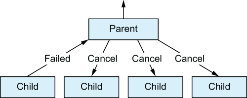

# 18. Error handling and testing

<small><i>오류 처리와 테스트</i></small>

<br>

## 18.1 Handling errors thrown inside coroutines

<small><i>코루틴 내부에서 던져진 오류 처리</i></small>


다른 코틀린 코드와 마찬가지로 일시중단 함수나 코루틴 빌더 안에 작성한 코드도 예외를 발생시킬 수 있음 

- `launch` 나 `async`는 코루틴 빌더 함수
- 코루틴 빌더 함수를 `try-catch`로 감싸도 내부에서 발생한 예외를 잡지 못함
- 코루틴 빌더는 실행할 새로운 코루틴을 생성하기 때문
- 새로 생성된 스레드에서 발생한 예외가 스레드를 만든 코드에서 잡히지 않는 것과 같음


**Example.**


<table>
<tr>
    <th>잘못된 예외 처리</th>
    <th>올바른 예외 처리</th>
</tr>
<tr><td>

```kotlin
fun main(): Unit = runBlocking {
    try {
        launch {
            throw UnsupportedOperationException("Ouch!")
        }
    } catch (u: UnsupportedOperationException) {
        println("Handled $u")                     // 실행 안됨
    }
}
// Exception in thread "main" java.lang.UnsupportedOperationException: Ouch!
//    at com.gngsn.example1.MainKt$main$1$1.invokeSuspend(Main.kt:9)
// ...
```

[🔗 section01 - example1](https://github.com/gngsn/deepdive/blob/main/books/kotlin-in-action/chapter18/demo/src/main/kotlin/com/gngsn/section01/example1/Main.kt)


</td>
<td>

올바른 예외 처리 → `launch`에 전달되는 람다 블록 안에 `try-catch` 블록을 넣어야 함

```kotlin
fun main(): Unit = runBlocking {
    launch {
        try {
            throw UnsupportedOperationException("Ouch!")
        } catch (u: UnsupportedOperationException) {
            println("Handled $u")
        }
    }
}
// Handled java.lang.UnsupportedOperationException: Ouch!
```

[🔗 section01 - example2](https://github.com/gngsn/deepdive/blob/main/books/kotlin-in-action/chapter18/demo/src/main/kotlin/com/gngsn/section01/example2/Main.kt)

</td>
</table>

- `async`로 생성된 코루틴이 예외를 던지면, 예외가 `await` 으로 호출한 쪽으로 전파됨
- 값을 계산하는 `async` 코루틴 안쪽에서 예외가 발생하기 때문에 `await()`가 그 예외를 다시 던짐
- 때문에, `await()`를 `try-catch`로 감싸야 함

```kotlin
runBlocking {
    val myDeferredInt: Deferred<Int> = async {
        throw UnsupportedOperationException("Ouch!")
    }
    try {
        val i: Int = myDeferredInt.await()
        println(i)
    } catch (u: UnsupportedOperationException) {
        println("Handled: $u")
    }
}
```

[🔗 section01 - example3](https://github.com/gngsn/deepdive/blob/main/books/kotlin-in-action/chapter18/demo/src/main/kotlin/com/gngsn/section01/example3/Main.kt)

**Output:**

```
Handled: java.lang.UnsupportedOperationException: Ouch!
Exception in thread "main" java.lang.UnsupportedOperationException: Ouch!
	at com.gngsn.section01.example3.MainKt$main$1$myDeferredInt$1.invokeSuspend(Main.kt:9)
     ...
```

- 오류 콘솔에도 예외가 출력
- `async`는 예외를 부모 코루틴인 `runBlocking`에 전파하고, 프로그램은 종료

<br>

**자식 코루틴은 잡히지 않은 예외를 항상 부모 코루틴에 전파**

→ 부모 코루틴이 이 예외를 처리해야 할 책임을 가짐

<br>

## 18.2 Error propagation in Kotlin coroutines

<small><i>코틀린 코루틴에서의 오류 전파</i></small>
- 구조적 동시성의 주요 책임은 취소 처리뿐만 아니라 오류 처리에도 있음
- 자식에게 작업을 분배하는 방식에 따라 자식의 오류 처리 방식이 달라짐
- 자식 중 하나의 실패가 부모의 실패로 이어질지 여부에 따라 두 가지 방식으로 나뉨:
    1. **자식의 실패가 부모의 실패로 이어지는 경우 - `Job`**
        - 코루틴이 작업을 동시적으로 분해해 처리할 때, 자식 중 하나가 실패하면 더 이상 최종 결과를 얻을 수 없음
        - 부모 코루틴도 예외로 완료되고, 다른 자식 코루틴들은 더 이상 필요 없는 결과 생성을 막기 위해 취소됨
    2. **자식의 실패가 부모의 실패로 이어지지 않는 경우 - `SupervisorJob`**
        - 하나의 자식이 실패해도 전체 작업이 실패로 이어지지 않음
        - 부모가 자식의 실패를 직접 처리해야 하며, 시스템 전체가 멈추지 않음
        - 예: 서버 프로세스가 여러 자식 작업을 시작하고, 최상위에서 감독 역할을 함
        - 예: UI 구성 요소가 최신 데이터 가져오기에 실패해도 계속 동작해야 하는 경우


코틀린 코루틴에서 자식 코루틴의 실패를 부모가 어떻게 처리할지는 
부모 코루틴의 컨텍스트에 포함된 `Job`(자식의 실패가 부모의 실패로 이어짐)과 `SupervisorJob`(부모가 자식을 감독함) 중 무엇이 사용되는지에 따라 달라짐

<br>

### 18.2.1 Coroutines cancel all their children when one child fails

<small><i>자식이 실패하면 모든 자식을 취소하는 코루틴</i></small>

코루틴 콘텍스트를 설명할 때 코루틴 간의 부모-자식 계층이 `Job` 객체를 통해 구축됨
코루틴이 `SupervisorJob` 없이 생성된 경우, 자식 코루틴에서 발생한 잡히지 않은 예외는 부모 코루틴을 예외로 완료시키는 방식으로 처리됨

실패한 자식 코루틴은 자신의 실패를 부모에게 전파 → 부모는 다음을 수행

- 불필요한 작업을 막기 위해 다른 모든 자식을 취소
- 같은 예외를 발생시키면서 자신의 실행을 완료시킴
- 자신의 상위 계층으로 예외를 전파

<br>

- 자식 코루틴이 잡히지 않는 예외로 실패하면 부모에게 통지
- 다시 부모는 형제 코루틴들을 모두 취소하고 예외를 코루틴 계층의 상위로 전달

<br>

> [!NOTE]
>
> 모든 '형제' 작업을 취소하는 기능은 코틀린 코루틴의 큰 장점임
> 
> 보통 언어 레벨에서 제공되지 않고, 프로그래머가 직접 구현해야 함 

<br>

같은 스코프 안에서 동시성 계산을 함께 수행하고 공통의 결과를 반환하는 코루틴 그룹에게 아주 유용
- 스코프 내의 하나의 코루틴이 잡을 수 없는 예외로 인해 실패한다는 건, 공통의 결과를 계산할 방법이 더 이상 없음
- 다른 형제 코루틴이 불필요해진 작업을 계속 수행하거나 자원을 계속 잡고 있는 것을 막기 위해 이들을 취소함

- 불필요한 작업을 피하고 자원을 해제하게 됨


**Example.**

```kotlin
runBlocking {
    // 첫번째 코루틴: Heartbeat 역할의 코루틴. 단순히 루프 돌면서 메시지 출력
    launch {
        try {
            while (true) {
                println("Heartbeat!")
                delay(500.milliseconds)
            }
        } catch (e: Exception) {
            println("Heartbeat terminated: $e")
            throw e
        }
    }
    // 두번째 코루틴: 1초 후 예외를 던짐. 이때, 예외를 잡아내지는 않음
    launch {
        delay(1.seconds)
        throw UnsupportedOperationException("Ow!")
    }
}
```

[🔗 section02 - example1](https://github.com/gngsn/deepdive/blob/main/books/kotlin-in-action/chapter18/demo/src/main/kotlin/com/gngsn/section02/example1/Main.kt)


**Output:**

```
Heartbeat!
Heartbeat!
Heartbeat!
Heartbeat terminated: kotlinx.coroutines.JobCancellationException: Parent job is Cancelling; job=BlockingCoroutine{Cancelling}@b065c63
Exception in thread "main" java.lang.UnsupportedOperationException: Ow!
	at com.gngsn.section02.example1.MainKt$main$1$2.invokeSuspend(Main.kt:25)
    ...
```

<br>

- 기본적으로, 모든 코루틴 빌더 <sub>예제의 `runBlocking`</sub>는 일반적인, 비감독<sup>nonsupervisor</sup> 코루틴을 생성
  - 때문에 하나의 코루틴이 잡히지 않은 예외로 종료되면, 다른 자식 코루틴들도 취소됨
- 오류 전파 동작은 모든 코루틴에게도 적용 
  - 예를 들어, launch로 시작된 코루틴 뿐만 아니라 `async`로 시작된 코루틴도 동일하게 동작


**Example.**

```kotlin
runBlocking {
    launch {
        try {
            while (true) {
                println("Heartbeat!")
                delay(500.milliseconds)
            }
        } catch (e: Exception) {
            println("Heartbeat terminated: $e")
            throw e
        }
    }
    launch {
        try {
            delay(1.seconds)
            throw UnsupportedOperationException("Ow!")
        } catch (u: UnsupportedOperationException) {
            println("Caught $u")
        }
    }
}
```

[🔗 section02 - example2](https://github.com/gngsn/deepdive/blob/main/books/kotlin-in-action/chapter18/demo/src/main/kotlin/com/gngsn/section02/example2/Main.kt)


**Output:**

```
Heartbeat!
Heartbeat!
Caught java.lang.UnsupportedOperationException: Ow!
Heartbeat!
Heartbeat!
    ...
```


<br>

### 18.2.2 Structured concurrency only affects exceptions thrown across coroutine boundaries

<small><i>구조적 동시성은 코루틴 경계를 넘어 던져진 예외에만 영향을 미침</i></small>

- 형제 코루틴 취소와 예외 전파는 코루틴 스코프를 넘는 예외에만 적용됨
- 스코프를 넘는 예외를 던지지 않으면 형제 코루틴이 취소되지 않음
- 코루틴 내부의 `try-catch` 블록은 정상적으로 예외를 처리함
- 처리되지 않은 예외가 코루틴 계층 위로 전파되면 형제 코루틴도 취소됨
  - → 구조적 동시성 패러다임을 강제하는 데 도움
- 단, 처리되지 않은 예외 하나로 전체 애플리케이션이 종료되면 안 됨

<br>

### 18.2.3 Supervisors prevent parents and siblings from being cancelled

<small><i>슈퍼바이저는 부모와 형제의 취소를 방지함</i></small>


**슈퍼바이저 특징**

- 일반적인 `Job`과 달리, 자식의 실패를 부모에게 전파하지 않음
- 자식 코루틴이 실패해도 부모와 다른 자식 코루틴이 계속 실행됨
- 슈퍼바이저는 코루틴 계층의 최상위에서 자주 사용됨

<br>


**`SupervisorJob`**

- 슈퍼바이저를 사용하려면 코루틴에 `SupervisorJob`을 연결해야 함
- `SupervisorJob`은 예외를 부모에게 전파하지 않고, 다른 자식 작업의 실패에도 영향을 받지 않음.
- 슈퍼바이저도 구조적 동시성에 참여하며, 취소될 수 있고 취소 예외는 정상적으로 전파됨.
- 슈퍼바이저의 동작을 확인하려면 `SupervisorScope` 함수를 사용해 스코프를 만들 수 있음.
- `SupervisorScope`는 자식 코루틴 중 하나가 실패해도 형제 코루틴이 종료되지 않음.
  - 부모와 형제 코루틴은 계속 작동하며, 예외는 더 이상 전파되지 않음.


하트 비트 코루틴이 계속 실행되도록 하려면 `launch` 호출을 `SupervisorScope`로 감싸면 됨.


**Example.**

```kotlin
import kotlinx.coroutines.*
import kotlin.time.Duration.Companion.milliseconds
import kotlin.time.Duration.Companion.seconds
 
fun main(): Unit = runBlocking {
    // 첫번째 코루틴: Heartbeat 역할의 코루틴. 단순히 루프 돌면서 메시지 출력
    launch {
        try {
            while (true) {
                println("Heartbeat!")
                delay(500.milliseconds)
            }
        } catch (e: Exception) {
            println("Heartbeat terminated: $e")
            throw e
        }
    }
    // 두번째 코루틴: 1초 후 예외를 던짐. 이때, 예외를 잡아내지는 않음
    launch {
        delay(1.seconds)
        throw UnsupportedOperationException("Ow!")
    }
}
```

**Output:**

```
Heartbeat!
Heartbeat!
Heartbeat terminated: kotlinx.coroutines.JobCancellationException: Parent job is Cancelling; job=BlockingCoroutine{Cancelling}@1517365b
Exception in thread "main" java.lang.UnsupportedOperationException: Ow!
```

<br>


- 예외 이후에도 계속 실행되는 이유: `SupervisorJob`이 자식 코루틴에서 발생한 예외를 전체에 전파하지 않기 때문
- 코루틴 프레임워크는 종종 슈퍼바이저 역할의 코루틴 스코프를 기본 제공
- 케이토의 Application 스코프는 개별 요청보다 오래 실행되는 코루틴을 시작할 때 사용할 수 있음
  - 이 코루틴은 애플리케이션이 실행되는 동안 계속 살아있을 수 있음
- Application 스코프는 슈퍼바이저 역할을 하며, 한 코루틴에서 예외가 발생해도 전체 애플리케이션이 중단되지 않음
- 케이토의 `PipelineContext`는 요청 핸들러와 같은 수명의 코루틴을 관리함
- `PipelineContext` 내 여러 코루틴이 함께 요청에 대한 응답을 계산함
- 한 코루틴이 예외로 실패하면 관련된 다른 코루틴도 함께 취소됨
- 슈퍼바이저는 주로 애플리케이션 전체 수명이나 UI 표시 시간 등 오랫동안 실행되는 부분에 사용됨
- 세부 작업 함수에서는 슈퍼바이저를 잘 사용하지 않으며, 이는 오류 전파 시 불필요한 작업 취소가 바람직하기 때문

<br>

## 18.3 `CoroutineExceptionHandler`: The last resort for processing exceptions

<small><i>`CoroutineExceptionHandler`: 예외 처리를 위한 마지막 수단</i></small>


- 자식 코루틴에서 처리되지 않은 예외는 부모 코루틴으로 전파됨
- 이때, 예외가 슈퍼바이저나 계층의 최상위 루트 코루틴에 도달하면 더 이상 전파되지 않음
  - 이 시점에서 예외는 `CoroutineExceptionHandler`에 전달됨
  - `CoroutineExceptionHandler`는 코루틴 콘텍스트의 일부
- 콘텍스트에 예외 핸들러가 없으면 예외는 시스템 전역 예외 핸들러로 이동

- 순수 JVM과 안드로이드 프로젝트의 시스템 전역 예외 핸들러는 다름
  - JVM에서는 예외 스택트레이스를 콘솔에 출력하고, 안드로이드에서는 앱을 종료시킴
- `CoroutineExceptionHandler`를 코루틴 콘텍스트에 추가하면 예외 처리 동작을 커스텀할 수 있음
- 코틀린 프레임워크는 자체적으로 코루틴 예외 핸들러를 제공할 수 있음


**Example.**

```kotlin
val exceptionHandler = CoroutineExceptionHandler { context, exception ->
    println("[ERROR] $exception")
}
```

`CoroutineExceptionHandler`를 코루틴 콘텍스트의 원소로 추가할 수 있음


**Example:**

```kotlin
class ComponentWithScope(dispatcher: CoroutineDispatcher = Dispatchers.Default) {
    private val exceptionHandler = CoroutineExceptionHandler { _, e ->
       println("[ERROR] ${e.message}")
    }
 
    private val scope = CoroutineScope(
        // SupervisorJob(): 자식의 실패가 부모의 실패로 이어지지 않도록 함
        // exceptionHandler: 사용자 정의 예외 핸들러를 코루틴 콘텍스트의 요소로 지정
        SupervisorJob() + dispatcher + exceptionHandler
    )
 
    fun action() = scope.launch {
        // 예외를 던지는 코루틴
        throw UnsupportedOperationException("Ouch!")
    }
}
```
 
**Usage:**
 
```kotlin
fun main() = runBlocking {
    val supervisor = ComponentWithScope()
    supervisor.action()
    delay(1.seconds)            
}

// [ERROR] Ouch!     ← 예외가 커스텀 예외 핸들러에 의해 처리
```

- 슈퍼바이저의 직접적인 자식 코루틴은 커스텀 예외 핸들러나 디폴트 핸들러에 예외를 직접 전달해 처리
- 코루틴 예외 핸들러는 계층의 최상위 코루틴이 `launch` 빌더로 시작된 경우에만 호출됨
- 코루틴은 처리되지 않은 예외를 부모에게 위임하며, 이 위임은 계층의 최상위까지 계속됨
- 루트 코루틴이 아닌 코루틴의 콘텍스트에 설치된 핸들러는 사용되지 않음
  - 즉, 중간에 있는 `CoroutineExceptionHandler` 같은 건 존재하지 않음
- `GlobalScope.launch`로 루트 코루틴을 생성하고 커스텀 예외 핸들러를 콘텍스트에 제공할 수 있음
- 중간 예외 핸들러를 `launch` 코루틴에 제공해도, 계층 최상위의 핸들러만 실행되고 중간 핸들러는 사용되지 않음

<br>

```kotlin
private val topLevelHandler = CoroutineExceptionHandler { _, e ->
    println("[TOP] ${e.message}")
}
 
private val intermediateHandler = CoroutineExceptionHandler { _, e ->
    println("[INTERMEDIATE] ${e.message}")
}
 
@OptIn(DelicateCoroutinesApi::class)    // 미묘한 API를 명시적으로 사용하게 한다
fun main() {
    GlobalScope.launch(topLevelHandler) {
        launch(intermediateHandler) {
            throw UnsupportedOperationException("Ouch!")
        }
    }
    Thread.sleep(1000)
}
// [TOP] Ouch!
```

- 예외가 여전히 부모 코루틴에게 전파될 수 있기 때문

<br><br>

- 중간의 `launch` 호출에 코루틴 예외 핸들러가 있음에도 루트 코루틴이 아니기 때문에 예외가 계속해서 코루틴 계층을 따라 전파됨
- 그 결과 최상위 코루틴인 `GlobalScope.launch`의 예외 핸들러만 호출됨

<br>

### 18.3.1 Differences when using `CoroutineExceptionHandler` with `launch` or `async`

<small><i>`CoroutineExceptionHandler`를 `launch`와 `async`에 적용할 때의 차이점</i></small>


`coroutineExceptionHandler`(기본 핸들러든 커스텀 핸들러든)를 살펴볼 때 예외 핸들러는 계층의 최상위 코루틴이 `launch`로 생성된 경우에만 호출된다는 점에 유의해야 함
최상위 코루틴이 `async`로 생성된 경우에는 `CoroutineExceptionHandler`가 호출되지 않는다는 뜻


```kotlin
import kotlinx.coroutines.*
import kotlin.time.Duration.Companion.seconds
 
class ComponentWithScope(dispatcher: CoroutineDispatcher = 
  Dispatchers.Default) {
    private val exceptionHandler = CoroutineExceptionHandler { _, e ->
        println("[ERROR] ${e.message}")
    }
 
    private val scope = CoroutineScope(SupervisorJob() + dispatcher + 
    ➥ exceptionHandler)
 
    fun action() = scope.launch {
        async {
            throw UnsupportedOperationException("Ouch!")
        }
    }
}
 
fun main() = runBlocking {
    val supervisor = ComponentWithScope()
    supervisor.action()
    delay(1.seconds)
}
 
// [ERROR] Ouch!
```


바깥의 코루틴 (최상위 코루틴)을 `async`로 시작하도록 구현을 변경하면 코루틴 예외 핸들러가 호출되지 않는 것 을 확인할 수 있음

```kotlin
import kotlinx.coroutines.*
import kotlin.time.Duration.Companion.seconds
 
class ComponentWithScope(dispatcher: CoroutineDispatcher = 
  Dispatchers.Default) {
    private val exceptionHandler = CoroutineExceptionHandler { _, e ->
        println("[ERROR] ${e.message}")
    }
 
 
    private val scope = CoroutineScope(SupervisorJob() + dispatcher + 
      exceptionHandler)
 
 
    fun action() = scope.async {     ❶
        launch {
            throw UnsupportedOperationException("Ouch!")
        }
    }
}

fun main() = runBlocking {
    val supervisor = ComponentWithScope()
    supervisor.action()
    delay(1.seconds)
}
// No output is printed
```

- 최상위 `async` 코루틴의 예외는 `await()`를 호출하는 소비자가 처리
- 코루틴 예외 핸들러는 이 예외를 무시할 수 있음
- 소비자는 await를 `try-catch`로 감싸 예외를 처리할 수 있음
- `try-catch`는 코루틴 취소에는 영향을 주지 않음
- `Scope`에 `SupervisorJob`이 없으면, 처리되지 않은 예외가 다른 자식 코루틴도 모두 취소시킴

<br>

## 18.4 Handling errors in flows

<small><i>플로우에서 예외 처리</i></small>

플로우도 예외를 던질 수 있음

<br>

**Example.**

```kotlin
import kotlinx.coroutines.*
import kotlinx.coroutines.flow.*
 
class UnhappyFlowException: Exception()
 
// 플로우를 수집하면 5개의 원소 (0부터 4)가 배출된 다음에 UnhappyFlowException 예외가 발생
val exceptionalFlow = flow {
    repeat(5) { number ->
        emit(number)
    }
    throw UnhappyFlowException()
}
```

- 일반적으로 플로우의 일부분에 예외가 발생하면 `collect`에서 예외가 던져짐
  - e.g. 플로우가 생성되거나 변환되거나 수집되는 중간에 예외 발생 시
- 즉, `collect` 호출을 `try-catch` 블록으로 감싸면 예상대로 동작한다는 의미

```kotlin
fun main() = runBlocking {
    val transformedFlow = exceptionalFlow.map {
        it * 2
    }
    try {
        transformedFlow.collect {
            print("$it ")
        }
    } catch (u: UnhappyFlowException) {
        println("\nHandled: $u")
    }
}
```

**Output:**

```
0 2 4 6 8
Handled: UnhappyFlowException
```

<br>

### 18.4.1 Processing upstream exceptions with the catch operator

<small><i>`catch` 연산자로 업스트림 예외 처리</i></small>

복잡하고 긴 플로우 파이프라인을 구축할 때는 catch 연산자를 사용하는 쪽이 더 편리

**`catch` 연산자?**
- `catch`는 플로우에서 발생한 예외를 처리할 수 있는 중간 연산자
- 이 함수에 연결된 람다 안에서 플로우에 발생한 예외에 접근할 수 있음
- **예외**는 **람다의 파라미터로 전달**
  - 암시적 기본 이름 = `it`


**⚠️ Things to Watch Out For**
- `catch` 연산자는 취소 예외를 자동으로 인식하기 때문에, 취소가 발생한 경우에는 `catch` 블록이 호출되지 않음
- `catch`는 스스로 값을 방출할 수도 있기 때문에, 예외를 오류 값으로 변환해 다운스트림 플로우에서 소비할 수도 있음

**Example.** `catch` 연산자를 써서 예외 발생 시 기본 값 방출

```
runBlocking {
    exceptionalFlow
        .catch { cause ->
            println("\nHandled: $cause")
            emit(-1)
        }
        .collect {
            print("$it ")
        }
}
```

**Output:**

```
0 1 2 3 4
Handled: UnhappyFlowException
-1
```

- `catch` 연산자는 오직 업스트림에 대해서만 동작
  - ⚠️ 플로우 처리 예외는 파이프라인의 앞쪽 예외들만 잡음
- 

```kotlin
runBlocking {
    exceptionalFlow
        .map {
            it + 1
        }
        .catch { cause ->
            println("\nHandled $cause")
        }
        .onEach {       // `catch` 호출 다음에 위치한 `onEach` 람다에서 발생한 예외는 잡히지 않음
            throw UnhappyFlowException()
        }
        .collect()
}
```

**Output:**

```
Exception in thread "main" UnhappyFlowException
```

<br><br><br>

> [!NOTE]
> - `collect` 람다 안에서 발생한 예외를 처리하려면 `collect` 호출을 `try-catch` 블록으로 감싸면 됨
> - 그 대신 `onEach`, `catch`, `collect` 사슬을 모두 사용하지 않고 로직을 재작성할 수도 있음
> - 여기서 중요한 점은, 예외가 발생할 수 있는 지점 다음에 `catch` 연산자가 위치해야 한다는 것
> - `catch` 연산자는 업스트림에서 발생한 예외만 처리하므로, 예외를 `catch` 블록에서 다시 던져서 다운스트림에 있는 다른 `catch` 연산자에서 처리하게 하는 것도 완전히 올바른 코드

<br><br>

### 18.4.2 Retry the collection of a flow if predicate is true: The `retry` operator

<small><i>술어가 참일 때 플로우의 수집 재시도: `retry` 연산자</i></small>

- 플로우 처리 중 예외가 발생했을 때 작업을 재시도할 수 있음
- 예외를 처리하고 `Boolean` 값을 반환하는 람다를 사용할 수 있음
  1. 람다에서 `true`를 반환 시
  2. 지정한 최대 재시도 횟수만큼 재시도가 시작
  3. (재시도) 업스트림의 플로우가 처음부터 다시 수집되면서 모든 중간 연산이 재실행
- 재시도할 때는 업스트림 연산자가 **모두 다시 실행**된다는 점 명심
  - 작업이 멱등성을 갖는지 확인 필요


<br />

**Example.** 불안정한 플로우 수집을 재시도하기

```kotlin
import kotlinx.coroutines.flow.*
import kotlinx.coroutines.*
import kotlin.random.Random
 
class CommunicationException : Exception("Communication failed!")
 
val unreliableFlow = flow {
    println("Starting the flow!")
    repeat(10) { number ->
        if (Random.nextDouble() < 0.1) throw CommunicationException()
        emit(number)
    }
}
 
fun main() = runBlocking {
    unreliableFlow
        .retry(5) { cause ->
            println("\nHandled: $cause")
            cause is CommunicationException
        }
        .collect { number ->
            print("$number ")
        }
}
```

<br>

### 18.5 Testing coroutines and flows

<small><i>코루틴과 플로우 테스트</i></small>

코틀린 코루틴을 사용하는 코드를 위한 테스트도 일반적인 테스트와 마찬가지로 작동

테스트 메서드에서 코루틴을 사용하려면 `runTest` 코루틴 빌더를 사용

`runBlocking` 빌더 함수는 일반 코틀린 코드와 동시성 코틀린 코드 사이에 다리를 놓는 역할을 하기 때문에, 일시 중단 함수나 코루틴, 플로우를 사용하는 코드를 테스트할 때도 이를 쓸 수 있음.

그렇지만 이 접근 방식에는 단점이 있음
`runBlocking`을 사용하면 테스트가 실시간으로 실행됨.

이는 코드에 delay가 지정된 경우, 결과가 계산되기 전에 시간 지연이 전부 실행된다는 뜻.

예시:

500ms마다 한 번씩 센서를 질의하는 장치

사용자 입력 후 몇 백 ms 이후 검색하는 시스템

각각의 요청을 시뮬레이션할 때마다 몇 백 밀리초가 걸림.

<br>

### 18.5.1 Making tests using coroutines fast: Virtual time and the test dispatcher

<small><i>코루틴을 사용하는 테스트를 빠르게 만들기: 가상 시간과 테스트 디스패처</i></small>

코틀린 코루틴은 가상 시간을 사용해 테스트 실행을 빠르게 진행할 수 있음

```kotlin
class PlaygroundTest {
    @Test
    fun testDelay() = runTest {
        val startTime = System.currentTimeMillis()
        delay(20.seconds)       // 20초 delay를 선언해도, 테스트는 즉시 실행됨. 몇 밀리초 만에 완료
        println(System.currentTimeMillis() - startTime)
   // 11
    }
}
```

<br><br>

> [!NOTE]
> 
> 인위적인 지연 시간이 자동 진행되기 때문에 `runTest`는 기본적으로 타임아웃을 60초로 지정함 (실제 시간).
> 
> 혹은, `runTest`를 호출할 때, `timeout` 파라미터를 지정해서 할 수 있음.

<br><br>

- `runBlocking`과 마찬가지로 `runTest`의 디스패처는 단일 스레드

- 기본적으로 모든 자식 코루틴은 동시에 실행되며 테스트 코드와 병렬로 실행되지 않음

- 단일 스레드 디스패처를 공유하는 경우 다른 코루틴이 코드를 실행하려면 코드가 일시 중단 지점을 제공해야 함 → `runTest`도 동일

- `runTest` 본문에 일시 중단 지점이 없기 때문에 다음 테스트의 단언문은 실패

- `launch`로 시작한 코루틴이 단언문이 실행되기 전에 실행되게 할 수 있는 방법이 없기 때문


```kotlin
@Test
fun testDelay() = runTest {
    var x = 0
    launch {
        x++
    }
    launch {
        x++
    }
    assertEquals(2, x)
}
```

<br><br>

가상 디스패처의 현재 시간이 궁금하면 `currentTime` 속성을 사용할 수 있음

```kotlin
@OptIn(ExperimentalCoroutinesApi::class)
@Test
fun testDelay() = runTest {
    var x = 0
    launch {
        delay(500.milliseconds)
        x++
    }
    launch {
        delay(1.second)
        x++
    }
    println(currentTime) // 0
 
    delay(600.milliseconds)
    assertEquals(1, x)
    println(currentTime) // 600
 
    delay(500.milliseconds)
    assertEquals(2, x)
    println(currentTime) // 1100
}
```

- `runTest` 빌더함수의 블록 안에서는 `TestScope`라는 특수한 스코프에 접근할 수 있으며, 이 스코프는 `TestCoroutineScheduler` 기능을 사용할 수 있게 해줌
  - **`runCurrent`**: 현재 실행하게 예약된 코루틴을 실행
    - 즉시 실행할 새 코루틴이 예약되면 직접 실행됨
  - **`advanceUntilIdle`**: 예약된 모든 코루틴을 실행
    - 미래의 어느 시점에 실행하도록 예약된 코루틴까지 실행하려면 `advanceUntilIdle` 함수 사용


```kotlin
@OptIn(ExperimentalCoroutinesApi::class)
@Test
fun testDelay() = runTest {
    var x = 0
    launch {
        x++
        launch {
            x++
        }
    }
    launch {
        delay(200.milliseconds)
        x++
    }
    runCurrent()
    assertEquals(2, x)
    advanceUntilIdle()
    assertEquals(3, x)
}
```


> [!NOTE]
>  `Dispatchers.Default` 같은 다른 디스패처는 `TestCoroutineScheduler`에 대해 아무런 정보를 갖고 있지 않기 때문에 가상 시간 메커니즘의 영향을 받지 않음. 
> 
> 명시적으로 테스트 디스패처가 아닌 일반 디스패처에서 시작된 코루틴은 항상 지연을 전부 기다려야 함
> 
> 따라서 테스트를 더 빠르게 만들려면 디스패처를 변경할 수 있게 코드를 설계하는 것이 바람직
> 
> e.g. 디스패처를 파라미터로 받음


<br>

### 18.5.2 Testing flows with Turbine

<small><i>터빈으로 플로우 테스트</i></small>

`toList`를 호출해서 유한한 플로우의 모든 원소를 먼저 컬렉션에 수집한 다음, 기대한 모든 원소가 실제로 결과 컬렉션에 있는지 확인할 수 있음


```kotlin
val myFlow = flow {
    emit(1)
    emit(2)
    emit(3)
}
 
@Test
fun doTest() = runTest {
    val results = myFlow.toList()
    assertEquals(3, results.size)
}
```

더 복잡하며 무한한 플로우나 더 까다로운 불변성을 다뤄야할 수도 있음

→ 터빈<sup>Turbine</sup> 라이브러리를 통해 이런 경우를 지원할 수 있음

**터빈<sup>Turbine</sup>**
- 서드 파티라이브러리
- 하지만, 보통 플로우 기반 API 테스트에 필수 라이브러리로 간주
- [🔗 참고 - CashApp Turbine](https://github.com/cashapp/turbine)
- 핵심 기능은 플로우의 `test` 확장 함수
- `test` 함수는 새 코루틴을 실행하며 내부적으로 플로우를 수집
- `test`의 람다에서 `awaitItem`, `awaitComplete`, `awaitError` 함수를 테스트 프레임워크의 일반 단언문과 함께 사용해서 플로우에 대한 불변조건을 지정하고 검증할 수 있음
- 플로우가 방출한 모든 원소가 테스트에 의해 소비되도록 보장


```kotlin
@Test
fun doTest() = runTest {
    val results = myFlow.test {
        assertEquals(1, awaitItem())
        assertEquals(2, awaitItem())
        assertEquals(3, awaitItem())
        awaitComplete()
    }
}
```

- 여러 플로우를 결합해 테스트하는 기능 제공
- 테스트를 위해 시스템 일부를 대체할 수 있는 독립적인 Turbine 객체를 만드는 기능도 제공

<br/>

## Summary

- 한 코루틴 내부의 예외는 일반 코드처럼 처리 가능함
  - 코루틴 경계를 넘는 예외는 특별한 주의가 필요
- 처리되지 않은 예외 발생 시, 부모와 형제 코루틴이 모두 취소되는 구조적 동시성 적용
- `supervisorScope`와 `SupervisorJob`은 자식 중 하나가 실패해도 **나머지를 취소하지 않음**. 
  - 예외 전파를 막는 역할을 함
- `await`는 `async` 코루틴의 **예외를 다시 던지는 동작**을 함
- 슈퍼바이저는 장기 실행되는 애플리케이션 영역에서 자주 사용됨
  - 프레임워크에 내장된 부품으로 제공되는 경우도 있음
- **처리되지 않은 예외는 슈퍼바이저 또는 최상위 코루틴까지 전파**됨
  - 이후 `CoroutineExceptionHandler`로 전달되는 흐름을 가짐
  - 예외 핸들러가 없으면 시스템의 전역 예외 핸들러로 전달됨
- JVM은 예외를 콘솔에 기록하고, 안드로이드는 앱을 종료시키는 차이점이 있음
- `CoroutineExceptionHandler`는 예외를 잡지는 못하지만, 예외 기록 방식을 커스터마이징하는 마지막 수단임. 
  - 계층의 최상단에 있는 **루트 코루틴의 컨텍스트에 위치**함


