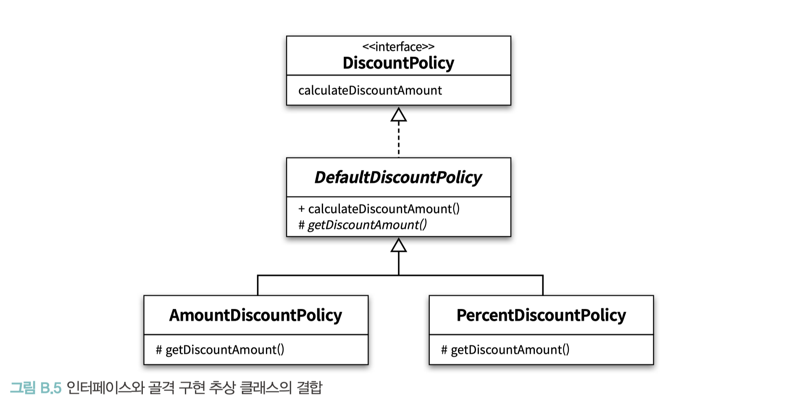

# APPENDIX B. 타입 계층의 구현

<br/>

**TL;DR**

- 타입 계층을 구현하는 동시에 다형성을 구현하는 방법임
- 타입 계층을 구현한다고 해서, 서브타이핑 관계가 보장되는 것은 아님
  - 올바른 타입 계층: 리스코프 치환 원칙을 준수 (리스코프 치환 원칙을 준수하는 책임은 본인에게 있음, _13장_.)
- 객체지향 언어에서 클래스를 **사용자 정의 타입 (user-defined data type)** 이라고 부름
  - 타입은 객체의 퍼블릭 인터페이스 - 결과적으로 클래스는 **객체의 타입과 구현을 동시에 정의하는 것**
- **인터페이스 상속**의 장점 (↔ 클래스 상속)
  1. _다중 상속의 딜레마에 빠지지 않을 수 있음_ 
  2. _단일 상속 계층으로 인한 결합도 문제도 피할 수 있음_
- **골격 구현 추상 클래스( skeletal implementation abstract class )**
  - 인터페이스를 이용해 타입을 정의하면 **다중 상속 문제를 해결**할 수 있지만 **중복 코드를 제거하기 어려움**
  - **추상 클래스**: **타입을 정의**하면서 **코드 중복을 방지**하도록 정의
**인터페이스와 추싱클래스를 결합하여 타입을 정의할 때의 장점**
  - 다양한 구현 방법이 필요할 경우 새로운 추상 클래스를 추가해서 쉽게 해결 가능.
  - 부모 클래스가 이미 있어도, 인터페이스를 통해 새로운 타입으로 쉽게 확장 가능.
- 설계가 복잡할 경우 (상속 계층에 얽매이지 않는 타입 계층을 요구한다면):
 - 인터페이스로 타입을 정의하고, 추상 클래스로 기본 구현을 제공해서 중복 코드를 제거하라
   - 복잡하지 않다면: 인터페이스나 추상 클래스 둘 중 하나만 사용
- **덕 타이핑**
  - 어떤 대상의 **행동**이 오리와 같다면 그것을 오리라는 타입으로 취급해도 무방하다는 것
- **디폴트 메서드( default method )**
  - **자바에서 믹스인을 구현할 수 있는 기능**
  - 인터페이스에 메서드의 기본 구현을 추가하는 것을 허용
  - '추상 클래스가 제공하는 코드 재사용성 + 특정한 상속 계층에 얽매이지 않는 인터페이스'의 장점 유지
- **디폴트 메서드가 가지는 한계**
  - 디폴트 메서드에서 호출하는 메서드들이 인터페이스에 정의되어 있음 → 클래스 안에서 **퍼블릭 메서드**로 구현해야 함

<br/>

---

<br/>

- 많은 사람들이 갖고 있는 흔한 오해는 타입과 클래스가 동일한 개념이라는 것
  - 타입: 개념의 분류
  - 클래스: 타입을 구현하는 한 가지 방법

- 이번 장을 읽을 때 염두할 두 가지 사항
  1. 해당 장의 모든 방법은 **타입 계층을 구현하는 방법인 동시에 다형성을 구현하는 방법**
     - 타입 계층은 동일한 메시지에 대한 행동 호환성을 전제로 하기 때문 
     - 공통적으로 슈퍼타입에 대해 전송한 메시지를 서브타입별로 다르게 처리할 수 있는 방법을 제공하는데, 이 방법들은 12장에서 설명한 동적 메서드 탐색과 유사한 방식을 이용해 적절한 메서드를 검색할 것임.
  2. 해당 장의 방법을 이용해 타입 계층을 구현한다고 해서, 서브타이핑 관계가 보장되는 것은 아님 
     - 올바른 타입 계층이 되기 위해서는 서브타입이 슈퍼타입을 대체할 수 있도록 **리스코프 치환 원칙을 준수**해야 함 (13장 참고) 
     - 타입 사이에 리스코프 치환 원칙을 준수하도록 만드는 책임은 본인에게 있음.

<br/>

### 클래스를 이용한 타입 계층 구현

✔️타입은 **객체의 퍼블릭 인터페이스**를 가리키기 때문에 결과적으로 클래스는 객체의 타입과 구현을 동시에 정의하는 것과 같음 

- `com.gngsn.phone.Phone`과 `com.gngsn.phone.NightlyDiscountPhone` 코드 상속관계 예시

→ 객체지향 언어에서 클래스를 <b>사용자 정의 타입 (user-defined data type)</b>이라고 부르는 이유

<br/>

- 퍼블릭 인터페이스는 유지하면서 새로운 구현을 가진 객체를 추가할 수 있는 가장 간단한 방법 → **상속**
- **클래스**는 타입을 구현할 수 있는 다양한 방법 중 하나일 뿐

<br/>

### 인터페이스를 이용한 타입 계층 구현

Example. 간단한 게임을 개발하고 있름

<br/><br/>

- Sound 타입: Effect 타입의 서브타입 → Effect 클래스를 상속받음
- Explosion 타입: Effect 타입인 동시에 Displyable 타입 → Effect 클래스와 Displayable 클래스를 동시에 상속
  - 다중 상속 → 대부분의 언어들이 다중 상속을 지원하지 않음

<br/><br/>

- '상속으로 인한 결합도 문제 + 다중 상속이라는 구현 제약'을 해결할 수 있는 방법 → **인터페이스를 사용**

<br/>

#### GameObject _interface_

```java
public interface GameObject {
    String getName();
}
```

<br/>

#### Displayable _interface_

- `GameObject` 타입: 게임의 많은 요소들은 화면에 표시될 필요가 있음
- 이 객체들은 화면 표시라는 동일한 행동을 제공하기 때문에 별도 의 타입으로 분류돼야 함 → `Displyable` 타입

```java
/**
 *  Displayable 타입을 GameObject 타입의 서브타입으로 정의
 */
public interface Displayable extends GameObject { 
    Point getPosition();
    void update(Graphics graphics);
}
```

<br/>

#### Collidable _interface_

- 다른 요소들과의 **충돌로 인해 이동에 제약**을 받거나 **피해**를 입는 등의 처리가 필요한 객체를 위한 Collidable 타입 정의
- 충돌 체크를 위한 collideWith 오퍼레이션을 추가
 
```java
public interface Collidable extends Displayable {
    boolean collideWith(Collidable other);
}
```

<br/>

#### Effect

- 화면에 표시되지 않더라도 게임에 다양한 효과를 부여할 수 있는 부가적인 요소를 위한 `Effect` 타입 정의
- 
```java
public interface Effect extends GameObject {
    void activate();
}
```

- `Player`는 화면에 표시돼야 할뿐만 아니라 화면 상에 표현된 다른 객체들과의 충돌을 체크해야 함
- `Collidable`  타입이 정의한 행동을 제공


-> **인터페이스**와 **클래스**를 함께 조합하면 _① 다중 상속의 딜레마에 빠지지 않을 수 있고_ _② 단일 상속 계층으로 인한 결합도 문제도 피할 수 있음_

<br/>

#### 타입 구현을 통한 장점

<br/><br/>

#### 1. 여러 클래스가 동일한 타입을 구현할 수 있음

- `Player` 와 `Monster` 클래스는 서로 다른 클래스지만, 이 두 클래스의 인스턴스들은 `Collidable` 인터페이스를 구현하고 있기 때문에 동일한 메시지에 응답할 수 있음.
- 서로 다른 클래스를 이용해서 구현됐지만 타입은 동일

#### 2. 하나의 클래스가 여러 타입을 구현할 수 있다

- `Explosion` 의 인스턴스는 Displayable 인터페이스와 동시에 Effect 인터페이스도 구현 함 
- `Explosion` 의 인스턴스는 Displayable 타입인 동시에 Effect 타입이기도 함

<br/>

📌 인터페이스를 이용해 타입을 정의하고 클래스를 이용해 객체를 구현하면 클래스 상속을 사용하지 않고도 타입 계층을 구현할 수 있음

<br/>

### 인터페이스를 이용한 타입 계층 구현

#### 구체 클래스의 타입 상속 vs 추상 클래스 타입 상속
1. 첫 번째, 의존하는 대상의 추상화 정도
   - 구체 클래스 상속: 구체적인 내부 구현에 강하게 결합 (부모 클래스가 변경되면 자식 클래스도 변경될 가능성이 큼)
   - 추상 클래스 상속: 내부 구현이 아닌 추상 메서드의 시그니처에만 의존
   - **⭐️ 모든 구체 클래스의 부모 ㅖ클래스를 항상 추상 클래스로 만들기 위해 노력하라.**
2. 두 번째, 상속을 사용하는 의도
   - `Phone` 클래스의 경우 자식 클래스인 `NightlyDiscountPhone` 의 `calculateFee` 메서드가 부모 클래스인 Phone의 `calculateFee` 메서드의 구체적인 내부 구현에 강하게 결합
   - `Phone` 클래스가 변경될 경우 자식 클래스인 `NightlyDiscountPhone` 도 함께 변경될 가능성이 높음


<br/>

### 추상 클래스와 인터페이스 결합하기

**골격 구현 추상 클래스(skeletal implementation abstract class)**
: 인터페이스를 이용해 타입을 정의하면 **다중 상속 문제를 해결**할 수 있지만 **중복 코드를 제거하기 어렵**기 때문에, **타입을 정의하면서 코드 중복을 방지하도록 정의한 추상 클래스**.


#### 인터페이스와 추상 클래스 결합의 강점

DiscountPolicy 타입은 추상 클래스를 이용해서 구현했기 때문에 DiscountPolicy 타입에 속하는 모든 객체들은 하나의 상속 계층 안에 묶여야 하는 제약을 가짐




<table>
<tr><th>Interface</th><th>Abstract Class</th><th>class</th></tr>
<tr><td>

```java
public interface DiscountPolicy {
    Money calculateDiscountAmount(Screening screening);
}
```

</td><td>

```java
public abstract class DefaultDiscountPolicy implements DiscountPolicy {
    private List<DiscountCondition> conditions = new ArrayList<>();
   
    public DefaultDiscountPolicy(DiscountCondition... conditions) {
        this.conditions = Arrays.asList(conditions);
    }
    
    @Override
    public Money calculateDiscountAmount(Screening screening) {
        for(DiscountCondition each : conditions) {
            if (each.isSatisfiedBy(screening)) {
                return getDiscountedFee(screening);
            }
        }
        return screening.getMovieFee();
        
    }
    
    abstract protected Money getDiscountAmount(Screening screening);
}
```

</td><td>

```java
public class AmountDiscountPolicy extends DefaultDiscountPolicy { ... }

public class PercentDiscountPolicy extends DefaultDiscountPolicy { ... }
```

</td></tr>
</table>

<br/><br/>


**인터페이스와 추싱클래스를 결합하여 타입을 정의할 때의 장점**

- 다양한 구현 방법이 필요할 경우 새로운 추상 클래스를 추가해서 쉽게 해결 가능.
- 부모 클래스가 이미 있어도, 인터페이스를 통해 새로운 타입으로 쉽게 확장 가능.

<br/>


> 설계가 복잡할 경우 (상속 계층에 얽매이지 않는 타입 계층을 요구한다면): 
> - 인터페이스로 타입을 정의하고, 추상 클래스로 기본 구현을 제공해서 중복 코드를 제거하라
> 
> 복잡하지 않다면:
> - 인터페이스나 추상 클래스 둘 중 하나만 사용 

<br/>

### 덕 타이핑 사용하기


**덕 테스트(duck test)**

:: 어떤 대상의 **행동**이 오리와 같다면 그것을 오리라는 타입으로 취급해도 무방하다는 것

> 어떤 새가 오리처럼 걷고, 오리처럼 헤엄치며, 오리처럼 꽥꽥 소리를 낸다면 나는 이 새를 오리라고 부를 것이다.
> 
> _- 제임스 윗콤 릴리(James Whitcom Riley)_

<br/>

**자바 같은 대부분의 정적 타입 언어는 덕 타이핑을 지원하지 않음**

- 동일한 타입으로 취급하기 위해서는 **코드 상의 타입이 동일하게 선언**돼 있어야만 함
- 아래 `SalariedEmployee` 클래스와 `HourlyEmployee` 클래스: `Employee` 인터페이스에 정의된 `calculatePay` 오퍼레이션과 동일한 시그니처를 가진 퍼블릭 메서드를 포함
- 즉, 단순히 동일한 시그니처의 메서드를 포함한다고 해서 같은 타입으로 판단하지 않음

<br/>

**Java**

<table>
<tr><th>Interface</th><th>Abstract Class</th><th>class</th></tr>
<tr><td>

<pre><code lang="java">
public interface Employee {
    <b>Money calculatePay(double taxRate);</b>
}
</code></pre>

</td><td>

<pre><code lang="java">
public class SalariedEmployee {
    private String name;
    private Money basePay;

    public SalariedEmployee(String name, Money basePay) {
        this.name = name;
        this.basePay = basePay;
    }

    <b>public Money calculatePay(double taxRate) {
        return basePay.minus(basePay.times(taxRate));
    }</b>
}
</code></pre>

</td><td>

<pre><code lang="java">
public class HourlyEmployee {
    private String name;
    private Money basePay;
    private int timeCard;

    public HourlyEmployee(String name, Money basePay, int timeCard) {
        this.name = name;
        this.basePay = basePay;
        this.timeCard = timeCard;
    }

    <b>public Money calculatePay(double taxRate) {
        return basePay.times(timeCard).minus(basePay.times(timeCard).times(taxRate));
    }</b>
}
</code></pre>

</td></tr>
</table>
<br/>

**Ruby**

루비 같은 동적 타입 언어에서는 시그니처가 동일한 메서드를 가진 클래스는 같은 타입으로 취급할 수 있음

<table>
<tr><th>Interface</th><th>Abstract Class</th><th>class</th></tr>
<tr><td>

<pre><code lang="ruby">
class SalariedEmployee
    def initialize(name, basePay)
        @name = name
        @basePay = basePay
    end
    
    <b>def calculatePay(taxRate)
        @basePay - (@basePay * taxRate)
    end</b>
end
</code></pre>

</td><td>

<pre><code lang="ruby">
class HourlyEmployee < Employee
    def initialize(name, basePay, timeCard)
        @name = name
        @basePay = basePay
        @timeCard = timeCard
    end
    
    <b>def calculatePay(taxRate)
        (@basePay * @timeCard) - (@basePay * @timeCard) * taxRate
    end</b>
end
</code></pre>

</td></tr>
</table>
<br/>


✔️ **덕 타이핑**: `calculatePay(taxRate)` 라는 행동을 수행할 수 있으면 이 객체를 Employee 이라고 부를 수 있는 것. (마치 꽥꽥거리는 모든 것을 오리라고 부르는 것처럼)

- 덕 타이핑은 클래스나 인터페이스에 대한 의존성을 메시지에 대한 의존성으로 대체
 
<br/>

> 객체지향 설계의 목표는 코드의 수정 비용을 줄이는 것.
> 
> 애플리케이션 설계의 핵심은 메시지이며, 엄격히 정의된 퍼블릭 인터페이스를 구축하는 과정이 중요하다.
> 
> 이 둘을 통합한 설계 기술이 **덕 타이핑**이다.
> ...
> 덕 타입은 특정 클래스에 종속되지 않은 퍼블릭 인터페이스. 
> 여러 클래스를 가로지르며 클래스에 대한 값비싼 의존을 메시지에 대한 부드러운 의존으로 대치시키며, 애플리케이션을 굉장히 유연하게 만들어줌
> 
> _- Metz_

- 덕 타이핑은 동적 타입 언어에서 널리 사용되는 기법이지만, 정적 타입 언어 중에서도 덕 타이핑을 지원하는 언어들이 있음: 
  - C#
  - C++의 템플릿(template)
    - 제네릭 프로그래밍을 구현
    - 타입 안전성 + 덕 타이핑
    - 컴파일타임 체크를 통해 타입 안전성을 보장

<br/>

### 믹스인과 타입 계층


믹스인( mixin ): 객체를 생성할 때 코드 일부를 섞어 넣을 수 있도록 만들어진 일종의 추상 서브클래스
- 목적: 다양한 객체 구현 안에서 동일한 ‘행동’을 중복 코드 없이 재사용할 수 있게 만드는 것

<br/>


**디폴트 메서드( default method )**
- 인터페이스에 메서드의 기본 구현을 추가하는 것을 허용
- '추상 클래스가 제공하는 코드 재사용성 + 특정한 상속 계층에 얽매이지 않는 인터페이스'의 장점 유지
- **자바에서 믹스인을 구현할 수 있는 기능**

<pre><code lang="java">
public interface DiscountPolicy {

    /**
    * default 키워드로 calculateDiscountAmount 오퍼레이션 기본 구현 제공
    **/
    <b>default</b> Money calculateDiscountAmount(Screening screening) {
        for (DiscountCondition each : getConditions()) {
            if (each.isSatisfiedBy(screening)) {
                return getDiscountAmount(screening);
            }
            return screening.getMovieFee();
        }

    }

    List<DiscountCondition> getConditions();

    Money getDiscountAmount(Screening screening);
}
</code></pre>


**디폴트 메서드가 가지는 한계**
- `getConditions` 오퍼레이션과 `getDiscountAmount` 오퍼레이션이 인터페이스에 추가
- 이 메서드들이 인터페이스에 정의돼 있기 때문에 클래스 안에서 퍼블릭 메서드로 구현해야 함


```java
public class AmountDiscountPolicy implements DiscountPolicy {

    private Money discountAmount;
    
    private List<DiscountCondition> conditions = new ArrayList<>();
    
    public AmountDiscountPolicy(Money discountAmount, DiscountCondition... conditions) {
        this.discountAmount = discountAmount;
        this.conditions = Arrays.asList(conditions);
    }
    
    @Override
    public List<DiscountCondition> getConditions() {
        return conditions;
    }
    
    @Override
    public Money getDiscountAmount(Screening screening) {
        return discountAmount;
    }
}
```

+ 문제점: AmountDiscountPolicy 와 PercentDiscountPolicy 클래스 사이의 코드 중복을 완벽하게 제거해 주지 못함

- 디폴트 메서드가 인터페이스로 추상 클래스의 역할을 대체하려는 것이 아니기 때문
- 타입을 정의하기 위해 디폴트 메서드를 사용할 생각이라면 그 한계를 명확하게 알아두어야 함

