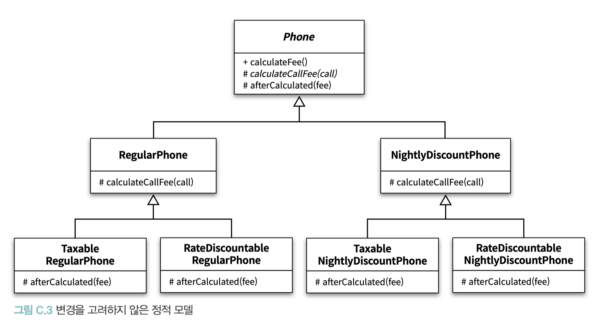
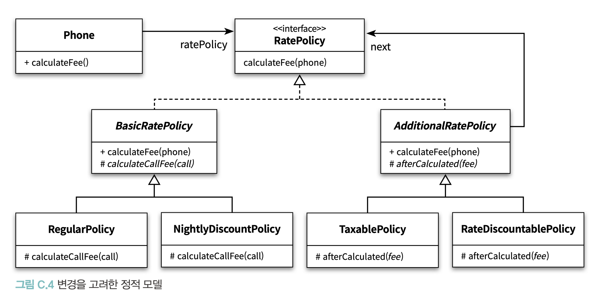
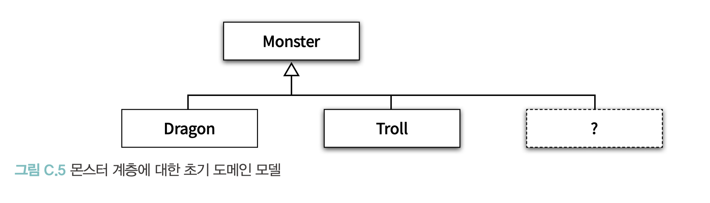

# APPENDIX C. 동적인 협력, 정적인 코드

<br/>

**TL;DR**

- **객체지향 프로그램을 작성하기 위한 두 가지 모델:**
  - **동적 모델(dynamic model)**
    - 프로그램 실행 구조를 표현하는 움직이는 모델
    - **객체**와 **협력**으로 구성
  - **정적 모델 (static model)**
    - 코드의 구조를 담는 고정된 모델
    -  **타입**과 **관계**로 구성
- **도메인 모델 (domain model)**: 사용자가 프로그램을 사용하는 대상 영역에 대한 지식을 선택적으로 단순화하고 의식적으로 구조화한 형태
  - 소프트웨어 제작에 필요한 **개념의 이름과 의미, 그리고 관계에 대한 힌트를 제공하는 역할**로 끝나야 함, 목적이 되면 안됨
- **객체지향 분석 설계**: 소프트웨어의 도메인에 대해 고민하고 **도메인 모델**을 기반으로 소프트웨어를 구축하라
  - 개념과 소프트웨어 사이의 표현적 차이를 줄일 수 있음
  - 이해하고 수정하기 쉬운 소프트웨어를 만들 수 있음
- **수정이 용이한 코드**: 응집도가 높고, 결합도가 낮으며, 단순해서 쉽게 이해할 수 있는 코드 (4장, 5장 참고)
- **유연한 코드**: 동일한 코드를 이용해 다양한 컨텍스트에서 동작 가능한 협력을 만들 수 있는 코드 (객체 사이의 다양한 조합을 지원해야 함, 8장 참고)
- **TYPE OBJECT 패턴**: 어떤 인스턴스가 다른 인스턴스의 타입을 표현하는 방법
- **도메인 모델**
  - 도메인 안에 존재하는 **개념과 관계를 표현**해야 하지만, **최종 모습**은 객체의 **행동과 변경**에 기반해야 하며 **코드의 구조를 반영**해야 함.
  - 중요한 건, 도메인의 개념뿐만 아니라 **코드도 함께 이해될 수 있는 구조**를 찾는 것
- 객체지향 패러다임에 대한 흔한 오해와는 다르게 분석 모델과 설계 모델, 구현 모델 사이에 어떤 차이점도 존재하지 않으며, 모두 **행동과 변경이라는 요소에 영향을 받으며 전체 개발 주기 동안 동일한 모양을 지녀야 함**


<br/>

---

<br/>

협력을 구성하기 위해서는 살아 움직이는 객체가 필요

> 객체는 태어나고, 협력하고, 책임을 다하고 나면 소멸한다. 
> 객체의 상태는 지속적으로 변하고, 외부의 자극에 따라 다양한 방식으로 행동한다.
> 간단히 말해 객체는 동적이다. 살아 움직이는 존재인 것이다.


- 객체는 동적 / 프로그램은 정적

**객체지향 프로그램을 작성하기 위한 두 가지 모델:**
- **동적 모델(dynamic model)**
  - 프로그램 실행 구조를 표현하는 움직이는 모델 
  - **객체**와 **협력**으로 구성
- **정적 모델 (static model)**
  - 코드의 구조를 담는 고정된 모델
  -  **타입**과 **관계**로 구성


**변경을 수용할 수 있는 코드**

- **수정이 용이한 코드**: 응집도가 높고, 결합도가 낮으며, 단순해서 쉽게 이해할 수 있는 코드 (4장, 5장 참고)
- **유연한 코드**: 동일한 코드를 이용해 다양한 컨텍스트에서 동작 가능한 협력을 만들 수 있는 코드 (객체 사이의 다양한 조합을 지원해야 함, 8장 참고)
- 수정이 용이한 코드와 유연한 코드를 위해서는 **중복 코드를 줄여야 함** 
  - 하나의 개념을 변경하기 위해 여러 곳의 코드를 한꺼번에 수정해야 하기 때문 
  - 10장 (중복 코드의 문제점과 해결 방법인 상속) + 11장 (합성과 믹스인이라는 새로운 추상화 방법) 참고

<br/><br/>

## 01. 동적 모델과 정적 모델

### 행동이 코드를 결정한다

협력에 참여하는 객체의 행동이 객체의 정적 모델을 결정해야 함 

→ 행동이 코드의 구조에 영향을 미치는 대표적인 예: 상속 계층 구성

<br/>

### 변경을 고려하라

<table>
<tr><th>변경을 고려하지 않은 정적 모델</th><th>변경을 고려한 정적 모델</th></tr>
<tr>
<td></td>
<td></td>
</tr>
</table>

- '**변경을 고려한 정적 모델**'이 동일한 행동을 제공하면서도 코드 변경에 더 유연하게 대응
- 동일한 행동을 제공하는 정적 모델이 있다면 항상 현재의 설계에서 요구되는 변경을 부드럽게 수용할 수 있는 설계를 선택하라.

<br/>

## 02. 도메인 모델과 구현 

### 도메인 모델에 관하여

- **도메인(domain)**: 사용자가 프로그램을 사용하는 대상 영역
- **모델(model)**: 지식을 선택적으로 단순화하고 의식적으로 구조화한 형태 _- Evans_
- **도메인 모델 (domain model)**: 사용자가 프로그램을 사용하는 대상 영역에 대한 지식을 선택적으로 단순화하고 의식적으로 구조화한 형태


- **객체지향 분석 설계**
  - 추천 지침: 소프트웨어의 도메인에 대해 고민하고 **도메인 모델**을 기반으로 소프트웨어를 구축하는 것 
    - 개념과 소프트웨어 사이의 표현적 차이를 줄일 수 있음
    - 이해하고 수정하기 쉬운 소프트웨어를 만들 수 있음 _- Larman_

- 도메인 모델은 소프트웨어를 만드는 데 필요한 **개념의 이름과 의미, 그리고 관계에 대한 힌트를 제공하는 역할**로 끝나야 함
  - 도메인 모델을 작성하는 것이 목표가 아니라 출발점


❌ "도메인 안의 개념이 제공하는 틀에 맞춰서 소프트웨어를 구축해야 한다"고 생각할 때부터 불행 시작

⭕️ 코드의 구조를 주도하는 것은 구조가 아니라 행동

<br/>

### 몬스터 설계하기 

**개발 조건**
- 주인공 캐릭터를 공격하는 다양한 종류의 몬스터가 등장하는 게임을 설계
- 현재는 용과 트롤만이 존재
- 몬스터의 종류를 확장할 수 있어야함



- 원하는 협력을 지원할 수 있기 때문에 훌륭한 출발점이라고 판단

<br/>

**💻 _v1 코드 작성_** 

- 단점: 설계 변경 어려움 - 새로운 몬스터가 필요할 때마다 새로운 클래스를 추가해야 함
- 장점: **개방-폐쇄 원칙을 준수**하는 좋은 설계 - 기존 코드를 수정하지 않고도 새로운 몬스터를 추가 가능  

👉🏻 더 좋은 방법, 새로운 클래스를 추가하지 않고도 새로운 몬스터를 추가할 수 있는 방법

<br/>

**v1: 새로운 몬스터의 종류를 추가하는 것은 새로운 클래스를 추가**

```java
Monster dragon_v1 = new Dragon();
Monster troll_v1 = new Troll();
```

**v2: 새로운 Breed 인스턴스를 생성하고 Monster 인스턴스에 연결**

```java
Monster dragon = new Monster(new Breed("용", 230, "용은 불을 내뿜는다"));
Monster troll = new Monster(new Breed("트롤", 48, "트롤은 곤봉으로 때린다"));
```

<br/>

👉🏻 **사실 v2는 타입을 구현할 수 있는 또 다른 방법**

- **타입 구현 방법** 중 부록 B 에서 살펴보지 않았던 것
- 이 경우 타입은 인터페이스나 클래스로 구현되지 않음 
- 타입을 **표현**하는 **클래스의 인스턴스**로 구현됨
  - 다시 말해 어떤 객체의 타입을 표현하는 별도의 객체를 이용해 타입을 구현

- **TYPE OBJECT 패턴**: 어떤 인스턴스가 다른 인스턴스의 타입을 표현하는 방법 *- [Johnson , Nystrom]* 
- v2 코드가 바로 Monster 의 타입을 구현하는 TYPE OBJECT에 해당

<br/>

### 행동과 변경을 고려한 도메인 모델

- 초기의 도메인 모델은 그저 작업을 시작하기 위한 거친 아이디어 덩어리일 뿐

✔️ 아래와 같이 JSON 형식으로 서술하면, 도메인 모델뿐만 아니라 도메인 전체에 대해 이해하기가 더 쉬워질 것

```json
{ "breeds" :
  [
    { "name" : "용" , "health" : 230, "attack" : "용은 불을 내뿜는다" },
    { "name" : "트롤", "health" : 48, "attack" : "트롤은 곤봉으로 때린다" }
  ]
}
```

**도메인 모델**: 도메인 모델은 단순히 클래스 다이어그램이 아니라, **도메인의 핵심을 간략하게 단순화해서 표현할 수 있는 모든 것**

**도메인 모델은 코드를 위한 것**
- 도메인 모델이 단순히 정적 모델의 형태를 띨 필요가 없음 
- 도메인 모델의 구조가 코드와 다를 필요가 없음


- **도메인 모델은 도메인 안에 존재하는 개념과 관계를 표현해야 하지만, 최종 모습은 객체의 행동과 변경에 기반해야 하며 코드의 구조를 반영해야 함.** 
- 중요한 것은 도메인 모델을 봤을 때 도메인의 개념뿐만 아니라 코드도 함께 이해될 수 있는 구조를 찾는 것

<br/>

### 분석 모델, 설계 모델, 그리고 구현 모델 

**✔️ 분석 모델**

- 해결 방법에 대한 언급 없이 문제 도메인을 설명하는 모델
- 순수하게 문제 도메인에 초점을 맞춰야 하며, 기술적인 해결 방법을 언급해서는 안됨

**✔️ 설계 모델**

- 분석 모델이 완성되면 이를 바탕으로 기술적인 관점에서 솔루션을 서술하는 **설계 모델**이 만들어짐

**✔️ 구현 모델**

프로그래머가 이렇게 만들어진 청사진(설계 모델)을 기반으로 **구현 모델**을 만들며, 프로그래밍 언어를 사용해 컴퓨터가 이해할 수 있는 명령어로 변환


> 필자의 개인적인 견해로는 **분석 모델**이 **사용할 구현 기술을 지향하는 것은 매우 합리적**이며,
그 결과 모델은 **작업해야 할 문제를 이해하는 데 더 유용**해진다는 것이다.
> 
>  **분석과 설계의 근본적인 차이** 
> - **분석이란 도메인을 이해하는 것**인 반면, 
> - **설계는 도메인을 지원하는 소프트웨어를 이해하는 것**이라는 점이다. 
>
> 명확하게 이 두 가지는 밀접하게 연결돼 있으며 둘 사이의 경계가 매우 모호해질 때가 많다. 
>
> 그러나 경계가 뚜렷할 필요는 없다. 유용성보다 순수성을 강조해서는 안된다.
> 이론적으로는 분석인 동시에 설계의 특성을 가지는 하이브리드 모델이 절대로 좋은 것이 아니지만,
> 이런 하이브리드한 특징이 가장 좋은 모델을 만든다고 믿는다
>
> _- Fowler_


- 객체지향 패러다임에 대한 흔한 오해와는 다르게 분석 모델과 설계 모델, 구현 모델 사이에 어떤 차이점도 존재하지 않음
- 모두 행동과 변경 이라는 요소에 영향을 받으며 전체 개발 주기 동안 동일한 모양을 지녀야 함

